<a id='hyperlink'></a>
## <center>Başlık Tablosu</center>
Öncelikle bu notebookta kullanılan  e-ticaret sitesi veri setindeki veriler üzerinde değişiklik yapılmıştır.Veriler gerçek değerleri yansıtmamaktadır.Aşağıda gördüğünüz başlıklar bu notebookta ayrıntılı ele alınacaktır.Eğer direk konuya atlamak isterseniz konu üzerine tıklamanız yeterli :)

-[E-TİCARET SİTESİNE AİT GOOGLE ANALYTICS VERİLERİNİN PYTHON İLE ÇEKİLMESİ](#hyperlink14)

-[KÜTÜPHANE YÜKLEME VE CSV OKUMA](#hyperlink0)

-[TARİHİ İNTEGER TİPİNDEN DATETİME TİPİNE ÇEVİRME](#hyperlink1)

-[GEREKSİZ SÜTUNU SİLME](#hyperlink2)

-[SON 5 AYDA EN ÇOK GÖRÜNTÜLENEN ÜRÜNLER NELERDİR?](#hyperlink3)

-[2019 YILINDAKİ EN POPÜLER 50 ÜRÜN NEDİR?](#hyperlink4)

-[2019 YILI AY BAZINDA GÖRÜNTÜLENEN ÜRÜN SİPARİŞ MİKTARI NEDİR?](#hyperlink5)

-[2019 YILI AY BAZINDA VERİLEN ÜRÜN SİPARİŞ MİKTARI NEDİR?](#hyperlink6)

-[2019 YILINDA AY BAZINDA SEPETE ATILAN ÜRÜN MİKTARI NEDİR?](#hyperlink7)

-[2019 YILI ÜRÜN SİPARİŞ MİKTARI AÇISINDAN TOP 20 ÜLKE NELERDİR?](#hyperlink8)

-[EN ÇOK SATILAN ÜRÜNÜN SUUDİ ARABİSTAN'DA SON SATILDIĞI ZAMANDAN 1,2,3 GÜN ÖNCESİNDEKİ GÖRÜNTÜLENME SAYILARI NELERDİR?](#hyperlink9)

-[EN ÇOK SATILAN 50 ÜRÜNÜN SUUDİ ARABİSTAN'DA SON SATILDIĞI TARİHTEN 1 VE 2 GÜN ÖNCEKİ GÖRÜNTÜLENME,SATIŞ VE ADET SAYISI ANALİZİ](#hyperlink10)

-[YAPILAN ANALİZE LINEER REGRESYON UYGULAMA](#hyperlink11)

-[YAPILAN ANALİZE DECISION TREE REGRESYONU UYGULAMA](#hyperlink12)

-[YAPILAN ANALİZE RANDOM FOREST REGRESYONU UYGULAMA](#hyperlink13)

-[KATEGORİ BAZINDA SATILAN ÜRÜN SAYISINI TAHMİN EDEN REGRESYON MODELLERİ UYGULAMA](#hyperlink15)

-[ÜRÜNLERİN SATILDIĞI SAATLERİN DAĞILIMI](#hyperlink16)

-[ÜRÜNLERİN SATILDIĞI GÜNLERİN DAĞILIMI](#hyperlink17)

-[EN ÇOK SİPARİŞ VERİLEN KATEGORİ İÇİN GÜNLÜK BAZDAKİ SİPARİŞ MİKTARI](#hyperlink18)

-[EN ÇOK SİPARİŞ VERİLEN KATEGORİ İÇİN GÜNLÜK BAZDAKİ ÜRÜN GÖRÜNTÜLEME SAYISININ SİPARİŞ MİKTARINA ETKİSİ](#hyperlink19)

-[SUPER STORE TİME SERİSİ ANALİZİ](#hyperlink20)

<a id='hyperlink14'></a>
**E-TİCARET SİTESİNE AİT GOOGLE ANALYTICS VERİLERİNİN PYTHON İLE ÇEKİLMESİ**

Adım adım bahsedecek olursak öncelikle **google console developers** sitesine girip yeni bir proje oluşturacaz.Aramaya Google Analytics Reporting API yazıp çıkan sonuçta report accessing için enable seçeneğine basacaz.Credentials->Configure Consent Screen->OAuth consent screen->save->create credentials(ok kısmından)->OAuth client ID->other->create buradaki client id ve client secret'i sonradan kod içinde kullanacağımız için bir yere not alıyoruz.Aramaya 'Analytics API' yazıp gelen ekrana enable diyoruz.


Masaüstüne 'google analytics' adlı klasör oluşturduk.Anaconda Navigator'den spider IDE'sini açtık,çıkan ekranda dosyayı kaydet deyip masaüstündeki oluşturduğumuz dosyanın içine python dosya tipi olarak kaydettik.Aşağıdaki kodları import ettik:


```python
from oauth2client.client import OAuth2WebServerFlow
from oauth2client.tools import run_flow
from oauth2client.file import Storage
import json
import os
import re
import httplib2 
from oauth2client import GOOGLE_REVOKE_URI, GOOGLE_TOKEN_URI, client
import requests
import pandas as pd
```


```python
'''function check whether file exist in the path or not'''

def where_json(file_name):return os.path.exists(file_name)
```


```python
''' function return the refresh token '''

def get_refresh_token(client_id,client_secret):
    CLIENT_ID = client_id
    CLIENT_SECRET = client_secret
    SCOPE = 'https://www.googleapis.com/auth/analytics.readonly'
    REDIRECT_URI = 'http:localhost:8080'
  
    flow = OAuth2WebServerFlow(client_id=CLIENT_ID,client_secret=CLIENT_SECRET,scope=SCOPE,redirect_uri=REDIRECT_URI)
    if where_json('credential.json')==False:
       storage = Storage('credential.json') 
       credentials = run_flow(flow, storage)
       refresh_token=credentials.refresh_token
       
    elif where_json('credential.json')==True:
       with open('credential.json') as json_file:  
           refresh_token=json.load(json_file)['refresh_token']
  
    return(refresh_token)

```

client_id = '380xxxxxxx-m4f7idq2gavgall51ngicda9tg95o7f9.apps.googleusercontent.com'
client_secret = 'MRX42xxxxxxxx_0jU7b'
refresh_token=get_refresh_token(client_id,client_secret)

client_id ve client_secret girdikten sonra refresh_token kodunu çalıştırdığımızda google hesabımıza yönlendiriliriz ve orada bizden erişim izni ister,izin veririz.Ayrıca google analytics dashboard'a girip ayarlardan görünüm ayarlarına gelip view id bilgisini bir yere kopyalayıp aşağıdaki kodun view id kısmına yapıştırırız.

''' function return the google analytics data for given dimension, metrics, start data, end data access token, type,goal number, condition'''

def google_analytics_reporting_api_data_extraction(viewID,dim,met,start_date,end_date,refresh_token,transaction_type,goal_number,condition):
    
    viewID=viewID;dim=dim;met=met;start_date=start_date;end_date=end_date;refresh_token=refresh_token;transaction_type=transaction_type;condition=condition
    goal_number=goal_number
    viewID="".join(['ga%3A',viewID])
    
    if transaction_type=="Goal":
        met1="%2C".join([re.sub(":","%3A",i) for i in met]).replace("XX",str(goal_number))
    elif transaction_type=="Transaction":
        met1="%2C".join([re.sub(":","%3A",i) for i in met])
        
    dim1="%2C".join([re.sub(":","%3A",i) for i in dim])
    
    if where_json('credential.json')==True:
       with open('credential.json') as json_file:  
           storage_data = json.load(json_file)
       
       client_id=storage_data['client_id']
       client_secret=storage_data['client_secret']
       credentials = client.OAuth2Credentials(
                access_token=None, client_id=client_id, client_secret=client_secret, refresh_token=refresh_token,
                token_expiry=3600,token_uri=GOOGLE_TOKEN_URI,user_agent='my-user-agent/1.0',revoke_uri=GOOGLE_REVOKE_URI)

       credentials.refresh(httplib2.Http())
       rt=(json.loads(credentials.to_json()))['access_token']
  
       api_url="https://www.googleapis.com/analytics/v3/data/ga?ids="
    
       url="".join([api_url,viewID,'&start-date=',start_date,'&end-date=',end_date,'&metrics=',met1,'&dimensions=',dim1,'&max-results=1000000',condition,'&access_token=',rt])
    
       data=pd.DataFrame()
    
       try:
         r = requests.get(url)
                
         try:
            data=pd.DataFrame(list((r.json())['rows']),columns=[re.sub("ga:","",i) for i in dim+met])
            data['date']=start_date
            print("data extraction is successfully completed")
           
            return data
         except:
            print((r.json()))
       except:
         print((r.json()))
         print("error occured in the google analytics reporting api data extraction")

viewID='162xxxxxx'
dim=['ga:browser','ga:sourceMedium']
met=['ga:users','ga:revenuePerTransaction']
start_date='2019-01-01'
end_date='2019-01-10'
transaction_type='Transaction'
goal_number=''
refresh_token=refresh_tokenm
condition=''

data=google_analytics_reporting_api_data_extraction(viewID,dim,met,start_date,end_date,refresh_token,transaction_type,goal_number,condition)

Dim(dimensions) ve met(metrik) değerlerini girerek istediğimiz veriyi çekebiliyor oluruz :)

<a id='hyperlink0'></a>
**KÜTÜPHANE YÜKLEME VE CSV OKUMA**


```python
import numpy as np 
import pandas as pd 
import seaborn as sns
from collections import Counter
%matplotlib inline

import operator
import time
import matplotlib.pyplot as plt
sns.set(style="ticks", color_codes=True)
import datetime
import warnings
warnings.filterwarnings('ignore')
```


```python
data=pd.read_csv('/Users/infoletsbecoolcom/Downloads/moodVip.csv')
```


```python
data.head()
```


<div>
<style scoped>
    .dataframe tbody tr th:only-of-type {
        vertical-align: middle;
    }

    .dataframe tbody tr th {
        vertical-align: top;
    }

    .dataframe thead th {
        text-align: right;
    }
</style>
<table border="1" class="dataframe">
  <thead>
    <tr style="text-align: right;">
      <th></th>
      <th>Unnamed: 0</th>
      <th>date</th>
      <th>userType</th>
      <th>productName</th>
      <th>country</th>
      <th>city</th>
      <th>adDestinationUrl</th>
      <th>pageViews</th>
      <th>quantityAddedToCart</th>
      <th>productAddsToCart</th>
      <th>productDetailViews</th>
      <th>productCheckouts</th>
      <th>quantityCheckedOut</th>
      <th>itemQuantity</th>
      <th>itemRevenue</th>
    </tr>
  </thead>
  <tbody>
    <tr>
      <th>0</th>
      <td>1</td>
      <td>20190128</td>
      <td>New Visitor</td>
      <td>101A02008 Black Pullover</td>
      <td>Turkey</td>
      <td>Bursa</td>
      <td>(not set)</td>
      <td>0</td>
      <td>0</td>
      <td>0</td>
      <td>0</td>
      <td>0</td>
      <td>0</td>
      <td>0</td>
      <td>0.0</td>
    </tr>
    <tr>
      <th>1</th>
      <td>2</td>
      <td>20190128</td>
      <td>New Visitor</td>
      <td>101A02008 Black Pullover</td>
      <td>United States</td>
      <td>New York</td>
      <td>(not set)</td>
      <td>0</td>
      <td>0</td>
      <td>0</td>
      <td>0</td>
      <td>0</td>
      <td>0</td>
      <td>0</td>
      <td>0.0</td>
    </tr>
    <tr>
      <th>2</th>
      <td>3</td>
      <td>20190128</td>
      <td>New Visitor</td>
      <td>101A02008 Brown Pullover</td>
      <td>Turkey</td>
      <td>Bursa</td>
      <td>(not set)</td>
      <td>0</td>
      <td>0</td>
      <td>0</td>
      <td>0</td>
      <td>0</td>
      <td>0</td>
      <td>0</td>
      <td>0.0</td>
    </tr>
    <tr>
      <th>3</th>
      <td>4</td>
      <td>20190128</td>
      <td>New Visitor</td>
      <td>101A02008 Brown Pullover</td>
      <td>United States</td>
      <td>New York</td>
      <td>(not set)</td>
      <td>0</td>
      <td>0</td>
      <td>0</td>
      <td>0</td>
      <td>0</td>
      <td>0</td>
      <td>0</td>
      <td>0.0</td>
    </tr>
    <tr>
      <th>4</th>
      <td>5</td>
      <td>20190128</td>
      <td>New Visitor</td>
      <td>101A02008 Ecru Pullover</td>
      <td>Turkey</td>
      <td>Bursa</td>
      <td>(not set)</td>
      <td>0</td>
      <td>0</td>
      <td>0</td>
      <td>0</td>
      <td>0</td>
      <td>0</td>
      <td>0</td>
      <td>0.0</td>
    </tr>
  </tbody>
</table>
</div>


<a id='hyperlink1'></a>
**TARİHİ İNTEGER TİPİNDEN DATETİME TİPİNE ÇEVİRME**


```python
data.date.apply(str)
```


    0        20190128
    1        20190128
    2        20190128
    3        20190128
    4        20190128
    5        20190128
    6        20190128
    7        20190128
    8        20190128
    9        20190128
    10       20190128
    11       20190128
    12       20190128
    13       20190128
    14       20190128
    15       20190128
    16       20190128
    17       20190128
    18       20190128
    19       20190128
    20       20190128
    21       20190128
    22       20190128
    23       20190128
    24       20190128
    25       20190128
    26       20190128
    27       20190128
    28       20190128
    29       20190128
               ...   
    96650    20190408
    96651    20190414
    96652    20190427
    96653    20190521
    96654    20190629
    96655    20190803
    96656    20190831
    96657    20190831
    96658    20190831
    96659    20190831
    96660    20190831
    96661    20190831
    96662    20190831
    96663    20190831
    96664    20190831
    96665    20190831
    96666    20190831
    96667    20190831
    96668    20190831
    96669    20190831
    96670    20190831
    96671    20190831
    96672    20190831
    96673    20190831
    96674    20190831
    96675    20190831
    96676    20190831
    96677    20190831
    96678    20190831
    96679    20190831
    Name: date, Length: 96680, dtype: object


```python
data['date'] = data['date'].apply(lambda x: pd.to_datetime(str(x), format='%Y%m%d'))
```


```python
data.head()
```


<div>
<style scoped>
    .dataframe tbody tr th:only-of-type {
        vertical-align: middle;
    }

    .dataframe tbody tr th {
        vertical-align: top;
    }

    .dataframe thead th {
        text-align: right;
    }
</style>
<table border="1" class="dataframe">
  <thead>
    <tr style="text-align: right;">
      <th></th>
      <th>Unnamed: 0</th>
      <th>date</th>
      <th>userType</th>
      <th>productName</th>
      <th>country</th>
      <th>city</th>
      <th>adDestinationUrl</th>
      <th>pageViews</th>
      <th>quantityAddedToCart</th>
      <th>productAddsToCart</th>
      <th>productDetailViews</th>
      <th>productCheckouts</th>
      <th>quantityCheckedOut</th>
      <th>itemQuantity</th>
      <th>itemRevenue</th>
    </tr>
  </thead>
  <tbody>
    <tr>
      <th>0</th>
      <td>1</td>
      <td>2019-01-28</td>
      <td>New Visitor</td>
      <td>101A02008 Black Pullover</td>
      <td>Turkey</td>
      <td>Bursa</td>
      <td>(not set)</td>
      <td>0</td>
      <td>0</td>
      <td>0</td>
      <td>0</td>
      <td>0</td>
      <td>0</td>
      <td>0</td>
      <td>0.0</td>
    </tr>
    <tr>
      <th>1</th>
      <td>2</td>
      <td>2019-01-28</td>
      <td>New Visitor</td>
      <td>101A02008 Black Pullover</td>
      <td>United States</td>
      <td>New York</td>
      <td>(not set)</td>
      <td>0</td>
      <td>0</td>
      <td>0</td>
      <td>0</td>
      <td>0</td>
      <td>0</td>
      <td>0</td>
      <td>0.0</td>
    </tr>
    <tr>
      <th>2</th>
      <td>3</td>
      <td>2019-01-28</td>
      <td>New Visitor</td>
      <td>101A02008 Brown Pullover</td>
      <td>Turkey</td>
      <td>Bursa</td>
      <td>(not set)</td>
      <td>0</td>
      <td>0</td>
      <td>0</td>
      <td>0</td>
      <td>0</td>
      <td>0</td>
      <td>0</td>
      <td>0.0</td>
    </tr>
    <tr>
      <th>3</th>
      <td>4</td>
      <td>2019-01-28</td>
      <td>New Visitor</td>
      <td>101A02008 Brown Pullover</td>
      <td>United States</td>
      <td>New York</td>
      <td>(not set)</td>
      <td>0</td>
      <td>0</td>
      <td>0</td>
      <td>0</td>
      <td>0</td>
      <td>0</td>
      <td>0</td>
      <td>0.0</td>
    </tr>
    <tr>
      <th>4</th>
      <td>5</td>
      <td>2019-01-28</td>
      <td>New Visitor</td>
      <td>101A02008 Ecru Pullover</td>
      <td>Turkey</td>
      <td>Bursa</td>
      <td>(not set)</td>
      <td>0</td>
      <td>0</td>
      <td>0</td>
      <td>0</td>
      <td>0</td>
      <td>0</td>
      <td>0</td>
      <td>0.0</td>
    </tr>
  </tbody>
</table>
</div>


```python
data.info()
```

    <class 'pandas.core.frame.DataFrame'>
    RangeIndex: 96680 entries, 0 to 96679
    Data columns (total 15 columns):
    Unnamed: 0             96680 non-null int64
    date                   96680 non-null datetime64[ns]
    userType               96680 non-null object
    productName            96680 non-null object
    country                96680 non-null object
    city                   96680 non-null object
    adDestinationUrl       96680 non-null object
    pageViews              96680 non-null int64
    quantityAddedToCart    96680 non-null int64
    productAddsToCart      96680 non-null int64
    productDetailViews     96680 non-null int64
    productCheckouts       96680 non-null int64
    quantityCheckedOut     96680 non-null int64
    itemQuantity           96680 non-null int64
    itemRevenue            96680 non-null float64
    dtypes: datetime64[ns](1), float64(1), int64(8), object(5)
    memory usage: 11.1+ MB


<a id='hyperlink2'></a>
**GEREKSİZ SÜTUNU SİLME** 


```python
data.drop(columns='adDestinationUrl',inplace=True)
```

<a id='hyperlink3'></a>
**SON 5 AYDA EN ÇOK GÖRÜNTÜLENEN ÜRÜNLER NELERDİR?**


```python
view=data[['productName','date','productDetailViews']]
view.head()
```


<div>
<style scoped>
    .dataframe tbody tr th:only-of-type {
        vertical-align: middle;
    }

    .dataframe tbody tr th {
        vertical-align: top;
    }

    .dataframe thead th {
        text-align: right;
    }
</style>
<table border="1" class="dataframe">
  <thead>
    <tr style="text-align: right;">
      <th></th>
      <th>productName</th>
      <th>date</th>
      <th>productDetailViews</th>
    </tr>
  </thead>
  <tbody>
    <tr>
      <th>0</th>
      <td>101A02008 Black Pullover</td>
      <td>2019-01-28</td>
      <td>0</td>
    </tr>
    <tr>
      <th>1</th>
      <td>101A02008 Black Pullover</td>
      <td>2019-01-28</td>
      <td>0</td>
    </tr>
    <tr>
      <th>2</th>
      <td>101A02008 Brown Pullover</td>
      <td>2019-01-28</td>
      <td>0</td>
    </tr>
    <tr>
      <th>3</th>
      <td>101A02008 Brown Pullover</td>
      <td>2019-01-28</td>
      <td>0</td>
    </tr>
    <tr>
      <th>4</th>
      <td>101A02008 Ecru Pullover</td>
      <td>2019-01-28</td>
      <td>0</td>
    </tr>
  </tbody>
</table>
</div>


```python
sorted_view=view.sort_values(by='productDetailViews',ascending=False)
```


```python
sorted_view.head()
```


<div>
<style scoped>
    .dataframe tbody tr th:only-of-type {
        vertical-align: middle;
    }

    .dataframe tbody tr th {
        vertical-align: top;
    }

    .dataframe thead th {
        text-align: right;
    }
</style>
<table border="1" class="dataframe">
  <thead>
    <tr style="text-align: right;">
      <th></th>
      <th>productName</th>
      <th>date</th>
      <th>productDetailViews</th>
    </tr>
  </thead>
  <tbody>
    <tr>
      <th>90565</th>
      <td>RCHSET101 عقيق سبحة &amp; عقيق خاتم طقم</td>
      <td>2019-03-22</td>
      <td>540</td>
    </tr>
    <tr>
      <th>70259</th>
      <td>RCHSET101 عقيق سبحة &amp; عقيق خاتم طقم</td>
      <td>2019-03-11</td>
      <td>350</td>
    </tr>
    <tr>
      <th>88972</th>
      <td>RCHSET101 عقيق سبحة &amp; عقيق خاتم طقم</td>
      <td>2019-03-21</td>
      <td>315</td>
    </tr>
    <tr>
      <th>90289</th>
      <td>MR1002  925 فضة استرليني عقيق أبيض حجر خاتم</td>
      <td>2019-03-22</td>
      <td>295</td>
    </tr>
    <tr>
      <th>72044</th>
      <td>RCHSET101 عقيق سبحة &amp; عقيق خاتم طقم</td>
      <td>2019-03-12</td>
      <td>274</td>
    </tr>
  </tbody>
</table>
</div>


```python
sorted_view.productDetailViews.describe()
```


    count    96680.000000
    mean         1.177358
    std          5.421951
    min          0.000000
    25%          0.000000
    50%          0.000000
    75%          1.000000
    max        540.000000
    Name: productDetailViews, dtype: float64


```python

view1=view[(view['date'] > '2019-3-30 ') & (view['date'] <= '2019-8-31 ')]
```


```python
final_view=view1[view['productDetailViews']>0].sort_values(by='productDetailViews',ascending=False)
```


```python
final_view
```


<div>
<style scoped>
    .dataframe tbody tr th:only-of-type {
        vertical-align: middle;
    }

    .dataframe tbody tr th {
        vertical-align: top;
    }

    .dataframe thead th {
        text-align: right;
    }
</style>
<table border="1" class="dataframe">
  <thead>
    <tr style="text-align: right;">
      <th></th>
      <th>productName</th>
      <th>date</th>
      <th>productDetailViews</th>
    </tr>
  </thead>
  <tbody>
    <tr>
      <th>96643</th>
      <td>RCHSET101 عقيق سبحة &amp; عقيق خاتم طقم</td>
      <td>2019-04-01</td>
      <td>2</td>
    </tr>
    <tr>
      <th>96641</th>
      <td>RCH2159 خاتم فضة استرليني عيار 925</td>
      <td>2019-03-31</td>
      <td>1</td>
    </tr>
    <tr>
      <th>96644</th>
      <td>RCHSET118 زبرجد سبحة &amp; عقيق خاتم طقم</td>
      <td>2019-04-01</td>
      <td>1</td>
    </tr>
    <tr>
      <th>96645</th>
      <td>RCHSET118 زبرجد سبحة &amp; عقيق خاتم طقم</td>
      <td>2019-04-02</td>
      <td>1</td>
    </tr>
    <tr>
      <th>96646</th>
      <td>RCHSET101 عقيق سبحة &amp; عقيق خاتم طقم</td>
      <td>2019-04-03</td>
      <td>1</td>
    </tr>
    <tr>
      <th>96647</th>
      <td>RCH2074 925 فضة استرليني عقيق حجر خاتم</td>
      <td>2019-04-05</td>
      <td>1</td>
    </tr>
    <tr>
      <th>96648</th>
      <td>RBLK1096 اسوراة حجر الاونيكس الطبيعي</td>
      <td>2019-04-06</td>
      <td>1</td>
    </tr>
    <tr>
      <th>96649</th>
      <td>RCH2074 925 فضة استرليني عقيق حجر خاتم</td>
      <td>2019-04-07</td>
      <td>1</td>
    </tr>
    <tr>
      <th>96650</th>
      <td>RCH2074 925 فضة استرليني عقيق حجر خاتم</td>
      <td>2019-04-08</td>
      <td>1</td>
    </tr>
    <tr>
      <th>96651</th>
      <td>MR1002  925 فضة استرليني عقيق أبيض حجر خاتم</td>
      <td>2019-04-14</td>
      <td>1</td>
    </tr>
    <tr>
      <th>96652</th>
      <td>RCHSET106 أكريليك سبحة &amp; خاتم عقيق</td>
      <td>2019-04-27</td>
      <td>1</td>
    </tr>
    <tr>
      <th>96653</th>
      <td>RCHSET107 أكريليك سبحة &amp; خاتم عقيق</td>
      <td>2019-05-21</td>
      <td>1</td>
    </tr>
    <tr>
      <th>96654</th>
      <td>MR1002  925 فضة استرليني عقيق أبيض حجر خاتم</td>
      <td>2019-06-29</td>
      <td>1</td>
    </tr>
    <tr>
      <th>96655</th>
      <td>RCH2224 خاتم فضة استرليني 925 بحجر الفيروز</td>
      <td>2019-08-03</td>
      <td>1</td>
    </tr>
  </tbody>
</table>
</div>


```python
final_view=final_view.groupby('productName')['productDetailViews'].value_counts()
```


```python
sorted_final_view=final_view.sort_values(ascending=False)
```


```python
plt.figure(figsize=(15,10))
sns.barplot(x=sorted_final_view.index, y=sorted_final_view.values)
plt.xticks(rotation= 270)
plt.yticks(fontsize=13)
plt.xlabel('Product Name',fontsize=15)
plt.ylabel('Product Detail Views',fontsize=15)
plt.title('Most viewed products in 5 Month',fontsize=15)
```


    Text(0.5, 1.0, 'Most viewed products in 5 Month')


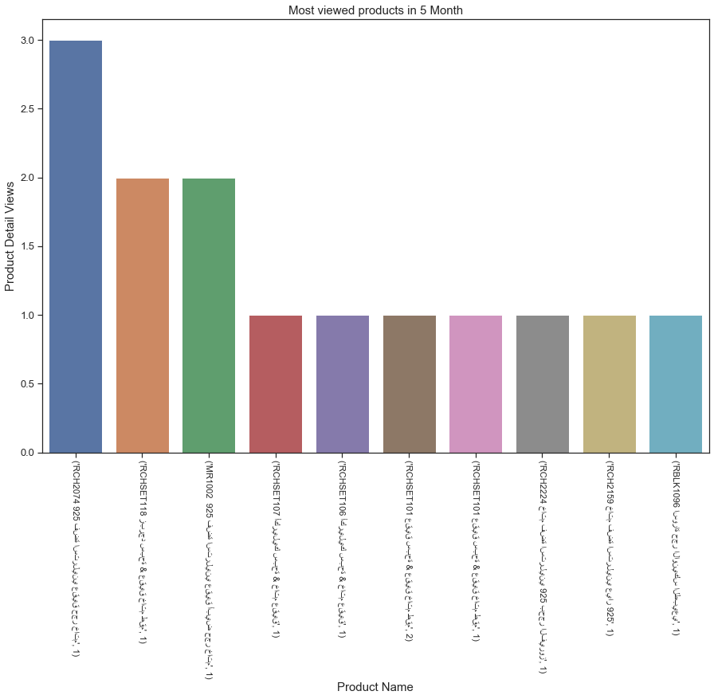


<a id='hyperlink4'></a>
**2019 YILINDAKİ EN POPÜLER 50 ÜRÜN NEDİR?**


```python
pco=data[['productName','date','productCheckouts']]
```


```python
pco=pco[(pco['productCheckouts']>0)&(pco['date'] > '2019-1-1 ') & (pco['date'] <= '2019-8-31 ')]

```


```python
pco=pco.groupby('productName')['productCheckouts'].value_counts().sort_values(ascending=False)
pco.head()
```


    productName                                  productCheckouts
    خاتم فضة استرليني 925 بحجر الزيركون MR1032   1                   54
    RCHSET104 اونيكس سبحة & عقيق خاتم طقم        1                   51
    MR1002  925 فضة استرليني عقيق أبيض حجر خاتم  1                   48
    RCH2074 925 فضة استرليني عقيق حجر خاتم       1                   42
    RCH2159 خاتم فضة استرليني عيار 925           1                   38
    Name: productCheckouts, dtype: int64


```python
plt.figure(figsize=(15,10))
sns.barplot(x=pco.index[0:50], y=pco.values[0:50])
plt.xticks(rotation= 270,fontsize=13)
plt.yticks(fontsize=13)
plt.xlabel('Product Name',fontsize=15)
plt.ylabel('Check out times',fontsize=15)
plt.title(' Top 50 Popular Products in 2019',fontsize=15)

```


    Text(0.5, 1.0, ' Top 50 Popular Products in 2019')


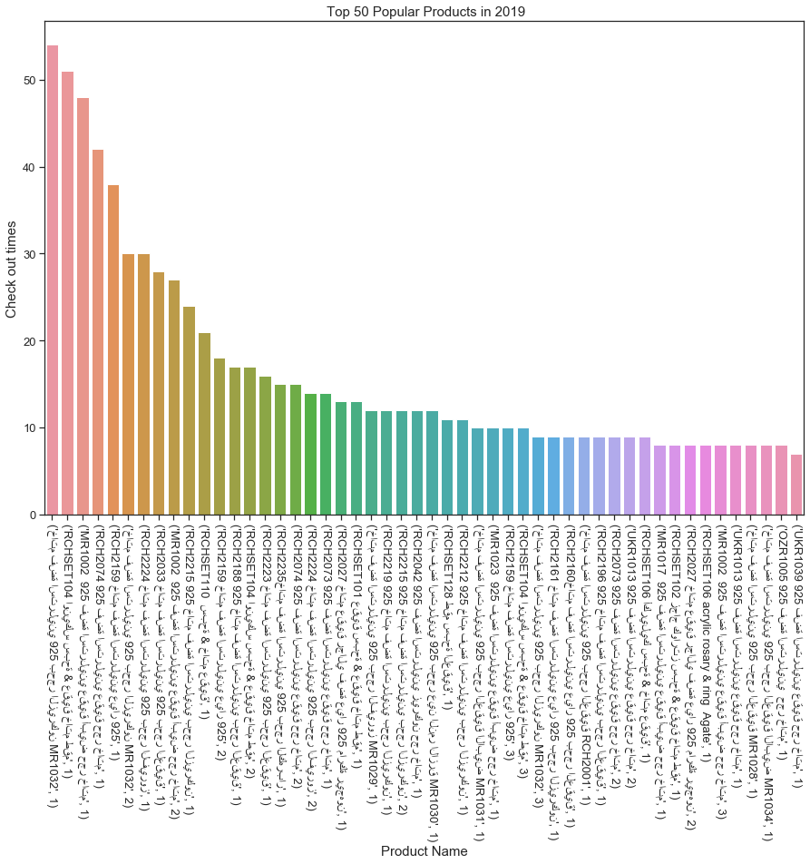


<a id='hyperlink5'></a>
**2019 YILI AY BAZINDA GÖRÜNTÜLENEN ÜRÜN SİPARİŞ MİKTARI NEDİR?**

[diger link](#hyperlink10)


```python
view2=view[(view['date'] > '2019-1-1 ') & (view['date'] <= '2019-8-31 ')]
```


```python
view2.info()
```

    <class 'pandas.core.frame.DataFrame'>
    Int64Index: 96680 entries, 0 to 96679
    Data columns (total 3 columns):
    productName           96680 non-null object
    date                  96680 non-null datetime64[ns]
    productDetailViews    96680 non-null int64
    dtypes: datetime64[ns](1), int64(1), object(1)
    memory usage: 3.0+ MB


```python
view2['month']=view2.date.dt.month
```


```python
view_month=view2.loc[view2.productDetailViews>0][['month','productDetailViews']]
view_month
```


<div>
<style scoped>
    .dataframe tbody tr th:only-of-type {
        vertical-align: middle;
    }

    .dataframe tbody tr th {
        vertical-align: top;
    }

    .dataframe thead th {
        text-align: right;
    }
</style>
<table border="1" class="dataframe">
  <thead>
    <tr style="text-align: right;">
      <th></th>
      <th>month</th>
      <th>productDetailViews</th>
    </tr>
  </thead>
  <tbody>
    <tr>
      <th>48</th>
      <td>1</td>
      <td>1</td>
    </tr>
    <tr>
      <th>49</th>
      <td>1</td>
      <td>2</td>
    </tr>
    <tr>
      <th>50</th>
      <td>1</td>
      <td>1</td>
    </tr>
    <tr>
      <th>51</th>
      <td>1</td>
      <td>3</td>
    </tr>
    <tr>
      <th>52</th>
      <td>1</td>
      <td>3</td>
    </tr>
    <tr>
      <th>53</th>
      <td>1</td>
      <td>2</td>
    </tr>
    <tr>
      <th>54</th>
      <td>1</td>
      <td>3</td>
    </tr>
    <tr>
      <th>55</th>
      <td>1</td>
      <td>1</td>
    </tr>
    <tr>
      <th>56</th>
      <td>1</td>
      <td>2</td>
    </tr>
    <tr>
      <th>57</th>
      <td>1</td>
      <td>1</td>
    </tr>
    <tr>
      <th>58</th>
      <td>1</td>
      <td>2</td>
    </tr>
    <tr>
      <th>59</th>
      <td>1</td>
      <td>1</td>
    </tr>
    <tr>
      <th>60</th>
      <td>1</td>
      <td>2</td>
    </tr>
    <tr>
      <th>61</th>
      <td>1</td>
      <td>2</td>
    </tr>
    <tr>
      <th>62</th>
      <td>1</td>
      <td>2</td>
    </tr>
    <tr>
      <th>63</th>
      <td>1</td>
      <td>1</td>
    </tr>
    <tr>
      <th>64</th>
      <td>1</td>
      <td>1</td>
    </tr>
    <tr>
      <th>65</th>
      <td>1</td>
      <td>1</td>
    </tr>
    <tr>
      <th>66</th>
      <td>1</td>
      <td>1</td>
    </tr>
    <tr>
      <th>67</th>
      <td>1</td>
      <td>1</td>
    </tr>
    <tr>
      <th>68</th>
      <td>1</td>
      <td>4</td>
    </tr>
    <tr>
      <th>128</th>
      <td>1</td>
      <td>1</td>
    </tr>
    <tr>
      <th>316</th>
      <td>1</td>
      <td>1</td>
    </tr>
    <tr>
      <th>323</th>
      <td>1</td>
      <td>1</td>
    </tr>
    <tr>
      <th>324</th>
      <td>1</td>
      <td>1</td>
    </tr>
    <tr>
      <th>325</th>
      <td>1</td>
      <td>1</td>
    </tr>
    <tr>
      <th>326</th>
      <td>1</td>
      <td>1</td>
    </tr>
    <tr>
      <th>375</th>
      <td>1</td>
      <td>1</td>
    </tr>
    <tr>
      <th>376</th>
      <td>1</td>
      <td>1</td>
    </tr>
    <tr>
      <th>377</th>
      <td>1</td>
      <td>1</td>
    </tr>
    <tr>
      <th>...</th>
      <td>...</td>
      <td>...</td>
    </tr>
    <tr>
      <th>96534</th>
      <td>3</td>
      <td>9</td>
    </tr>
    <tr>
      <th>96536</th>
      <td>3</td>
      <td>1</td>
    </tr>
    <tr>
      <th>96537</th>
      <td>3</td>
      <td>1</td>
    </tr>
    <tr>
      <th>96540</th>
      <td>3</td>
      <td>3</td>
    </tr>
    <tr>
      <th>96541</th>
      <td>3</td>
      <td>2</td>
    </tr>
    <tr>
      <th>96542</th>
      <td>3</td>
      <td>3</td>
    </tr>
    <tr>
      <th>96561</th>
      <td>3</td>
      <td>2</td>
    </tr>
    <tr>
      <th>96564</th>
      <td>3</td>
      <td>3</td>
    </tr>
    <tr>
      <th>96587</th>
      <td>3</td>
      <td>1</td>
    </tr>
    <tr>
      <th>96588</th>
      <td>3</td>
      <td>1</td>
    </tr>
    <tr>
      <th>96589</th>
      <td>3</td>
      <td>2</td>
    </tr>
    <tr>
      <th>96592</th>
      <td>3</td>
      <td>1</td>
    </tr>
    <tr>
      <th>96595</th>
      <td>3</td>
      <td>1</td>
    </tr>
    <tr>
      <th>96617</th>
      <td>3</td>
      <td>1</td>
    </tr>
    <tr>
      <th>96618</th>
      <td>3</td>
      <td>1</td>
    </tr>
    <tr>
      <th>96640</th>
      <td>3</td>
      <td>2</td>
    </tr>
    <tr>
      <th>96641</th>
      <td>3</td>
      <td>1</td>
    </tr>
    <tr>
      <th>96643</th>
      <td>4</td>
      <td>2</td>
    </tr>
    <tr>
      <th>96644</th>
      <td>4</td>
      <td>1</td>
    </tr>
    <tr>
      <th>96645</th>
      <td>4</td>
      <td>1</td>
    </tr>
    <tr>
      <th>96646</th>
      <td>4</td>
      <td>1</td>
    </tr>
    <tr>
      <th>96647</th>
      <td>4</td>
      <td>1</td>
    </tr>
    <tr>
      <th>96648</th>
      <td>4</td>
      <td>1</td>
    </tr>
    <tr>
      <th>96649</th>
      <td>4</td>
      <td>1</td>
    </tr>
    <tr>
      <th>96650</th>
      <td>4</td>
      <td>1</td>
    </tr>
    <tr>
      <th>96651</th>
      <td>4</td>
      <td>1</td>
    </tr>
    <tr>
      <th>96652</th>
      <td>4</td>
      <td>1</td>
    </tr>
    <tr>
      <th>96653</th>
      <td>5</td>
      <td>1</td>
    </tr>
    <tr>
      <th>96654</th>
      <td>6</td>
      <td>1</td>
    </tr>
    <tr>
      <th>96655</th>
      <td>8</td>
      <td>1</td>
    </tr>
  </tbody>
</table>
<p>41308 rows × 2 columns</p>
</div>


```python
final_view_month=view_month.groupby('month')['productDetailViews'].sum()
final_view_month
```


    month
    1     1219
    2    52862
    3    59732
    4       11
    5        1
    6        1
    8        1
    Name: productDetailViews, dtype: int64


```python
plt.figure(figsize=(15,10))
sns.barplot(x=final_view_month.index, y=final_view_month.values)
plt.xticks(rotation= 0,fontsize=13)
plt.yticks(rotation= 0,fontsize=13)
plt.xlabel('Months',fontsize=15)
plt.ylabel('Product View Number',fontsize=15)
plt.title(' Product View Number per months in 2019',fontsize=15)          
```


    Text(0.5, 1.0, ' Product View Number per months in 2019')


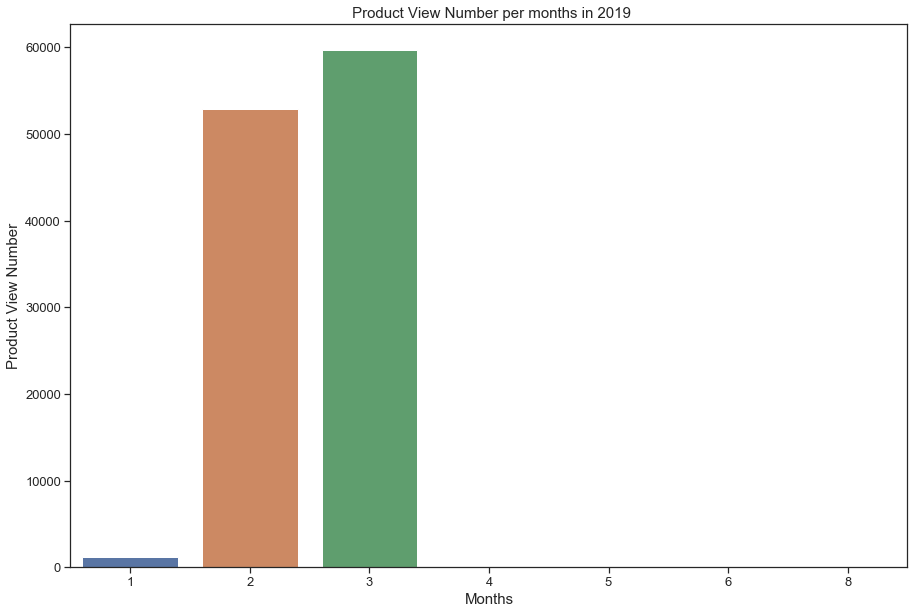


```python
view_month.groupby('month')['productDetailViews'].sum().dropna(inplace=True)
labels = view_month.groupby('month')['productDetailViews'].sum().index
colors = ['grey','blue','red','yellow','green','brown','orange']
explode = [0,0,0,0,0,0,0]
sizes = view_month.groupby('month')['productDetailViews'].sum().values

# visual
plt.figure(figsize = (7,7))
plt.pie(sizes, explode=explode, labels=labels, colors=colors, autopct='%1.1f%%')
plt.title('Product View Number per months in 2019',color = 'blue',fontsize = 15)
```


    Text(0.5, 1.0, 'Product View Number per months in 2019')


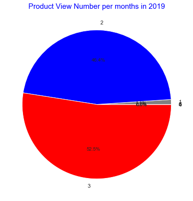


<a id='hyperlink6'></a>
**2019 YILI AY BAZINDA VERİLEN ÜRÜN SİPARİŞ MİKTARI NEDİR?**


```python
data.head()
```


<div>
<style scoped>
    .dataframe tbody tr th:only-of-type {
        vertical-align: middle;
    }

    .dataframe tbody tr th {
        vertical-align: top;
    }

    .dataframe thead th {
        text-align: right;
    }
</style>
<table border="1" class="dataframe">
  <thead>
    <tr style="text-align: right;">
      <th></th>
      <th>Unnamed: 0</th>
      <th>date</th>
      <th>userType</th>
      <th>productName</th>
      <th>country</th>
      <th>city</th>
      <th>pageViews</th>
      <th>quantityAddedToCart</th>
      <th>productAddsToCart</th>
      <th>productDetailViews</th>
      <th>productCheckouts</th>
      <th>quantityCheckedOut</th>
      <th>itemQuantity</th>
      <th>itemRevenue</th>
    </tr>
  </thead>
  <tbody>
    <tr>
      <th>0</th>
      <td>1</td>
      <td>2019-01-28</td>
      <td>New Visitor</td>
      <td>101A02008 Black Pullover</td>
      <td>Turkey</td>
      <td>Bursa</td>
      <td>0</td>
      <td>0</td>
      <td>0</td>
      <td>0</td>
      <td>0</td>
      <td>0</td>
      <td>0</td>
      <td>0.0</td>
    </tr>
    <tr>
      <th>1</th>
      <td>2</td>
      <td>2019-01-28</td>
      <td>New Visitor</td>
      <td>101A02008 Black Pullover</td>
      <td>United States</td>
      <td>New York</td>
      <td>0</td>
      <td>0</td>
      <td>0</td>
      <td>0</td>
      <td>0</td>
      <td>0</td>
      <td>0</td>
      <td>0.0</td>
    </tr>
    <tr>
      <th>2</th>
      <td>3</td>
      <td>2019-01-28</td>
      <td>New Visitor</td>
      <td>101A02008 Brown Pullover</td>
      <td>Turkey</td>
      <td>Bursa</td>
      <td>0</td>
      <td>0</td>
      <td>0</td>
      <td>0</td>
      <td>0</td>
      <td>0</td>
      <td>0</td>
      <td>0.0</td>
    </tr>
    <tr>
      <th>3</th>
      <td>4</td>
      <td>2019-01-28</td>
      <td>New Visitor</td>
      <td>101A02008 Brown Pullover</td>
      <td>United States</td>
      <td>New York</td>
      <td>0</td>
      <td>0</td>
      <td>0</td>
      <td>0</td>
      <td>0</td>
      <td>0</td>
      <td>0</td>
      <td>0.0</td>
    </tr>
    <tr>
      <th>4</th>
      <td>5</td>
      <td>2019-01-28</td>
      <td>New Visitor</td>
      <td>101A02008 Ecru Pullover</td>
      <td>Turkey</td>
      <td>Bursa</td>
      <td>0</td>
      <td>0</td>
      <td>0</td>
      <td>0</td>
      <td>0</td>
      <td>0</td>
      <td>0</td>
      <td>0.0</td>
    </tr>
  </tbody>
</table>
</div>


```python
mco=data[['date','productCheckouts']]
mco.info()
```

    <class 'pandas.core.frame.DataFrame'>
    RangeIndex: 96680 entries, 0 to 96679
    Data columns (total 2 columns):
    date                96680 non-null datetime64[ns]
    productCheckouts    96680 non-null int64
    dtypes: datetime64[ns](1), int64(1)
    memory usage: 1.5 MB


```python
mco['month']=mco[(mco['date'] > '2019-1-1 ') & (mco['date'] <= '2019-8-31 ')].date.dt.month
```


```python
mco = mco[['date','month','productCheckouts']]
mco.head()
```


<div>
<style scoped>
    .dataframe tbody tr th:only-of-type {
        vertical-align: middle;
    }

    .dataframe tbody tr th {
        vertical-align: top;
    }

    .dataframe thead th {
        text-align: right;
    }
</style>
<table border="1" class="dataframe">
  <thead>
    <tr style="text-align: right;">
      <th></th>
      <th>date</th>
      <th>month</th>
      <th>productCheckouts</th>
    </tr>
  </thead>
  <tbody>
    <tr>
      <th>0</th>
      <td>2019-01-28</td>
      <td>1</td>
      <td>0</td>
    </tr>
    <tr>
      <th>1</th>
      <td>2019-01-28</td>
      <td>1</td>
      <td>0</td>
    </tr>
    <tr>
      <th>2</th>
      <td>2019-01-28</td>
      <td>1</td>
      <td>0</td>
    </tr>
    <tr>
      <th>3</th>
      <td>2019-01-28</td>
      <td>1</td>
      <td>0</td>
    </tr>
    <tr>
      <th>4</th>
      <td>2019-01-28</td>
      <td>1</td>
      <td>0</td>
    </tr>
  </tbody>
</table>
</div>


```python
final_co_month=mco.groupby('month')['productCheckouts'].sum()
final_co_month.head()
```


    month
    1      51
    2    2142
    3     592
    4       0
    5       0
    Name: productCheckouts, dtype: int64


```python
plt.figure(figsize=(15,10))
sns.barplot(x=final_co_month.index, y=final_co_month.values)
plt.xticks(rotation= 0,fontsize=13)
plt.yticks(rotation= 0,fontsize=13)
plt.xlabel('Months',fontsize=15)
plt.ylabel('Product Check Out Number',fontsize=15)
plt.title(' Product Check Out Number per months in 2019',fontsize=15)          
```


    Text(0.5, 1.0, ' Product Check Out Number per months in 2019')


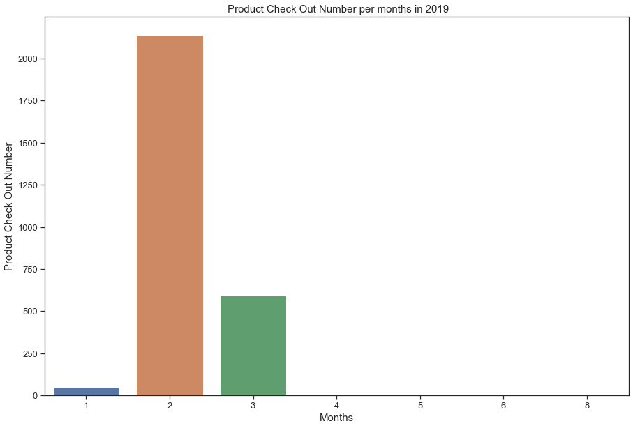


<a id='hyperlink7'></a>
**2019 YILINDA AY BAZINDA SEPETE ATILAN ÜRÜN MİKTARI NEDİR?**


```python
mac=data[['date','productAddsToCart']]
mac['month']=mco[(mco['date'] > '2019-1-1 ') & (mco['date'] <= '2019-8-31 ')].date.dt.month
mac = mac[['date','month','productAddsToCart']]
mac.head()
```


<div>
<style scoped>
    .dataframe tbody tr th:only-of-type {
        vertical-align: middle;
    }

    .dataframe tbody tr th {
        vertical-align: top;
    }

    .dataframe thead th {
        text-align: right;
    }
</style>
<table border="1" class="dataframe">
  <thead>
    <tr style="text-align: right;">
      <th></th>
      <th>date</th>
      <th>month</th>
      <th>productAddsToCart</th>
    </tr>
  </thead>
  <tbody>
    <tr>
      <th>0</th>
      <td>2019-01-28</td>
      <td>1</td>
      <td>0</td>
    </tr>
    <tr>
      <th>1</th>
      <td>2019-01-28</td>
      <td>1</td>
      <td>0</td>
    </tr>
    <tr>
      <th>2</th>
      <td>2019-01-28</td>
      <td>1</td>
      <td>0</td>
    </tr>
    <tr>
      <th>3</th>
      <td>2019-01-28</td>
      <td>1</td>
      <td>0</td>
    </tr>
    <tr>
      <th>4</th>
      <td>2019-01-28</td>
      <td>1</td>
      <td>0</td>
    </tr>
  </tbody>
</table>
</div>


```python
final_ac_month=mac.groupby('month')['productAddsToCart'].sum()
final_ac_month.head()
```


    month
    1      62
    2    2993
    3    2455
    4       0
    5       0
    Name: productAddsToCart, dtype: int64


```python
plt.figure(figsize=(15,10))
sns.barplot(x=final_ac_month.index, y=final_ac_month.values)
plt.xticks(rotation= 0,fontsize=13)
plt.yticks(rotation= 0,fontsize=13)
plt.xlabel('Months',fontsize=15)
plt.ylabel('Number of Product Added to Card',fontsize=15)
plt.title('Number of Product Added to Card per months in 2019',fontsize=15)
```


    Text(0.5, 1.0, 'Number of Product Added to Card per months in 2019')


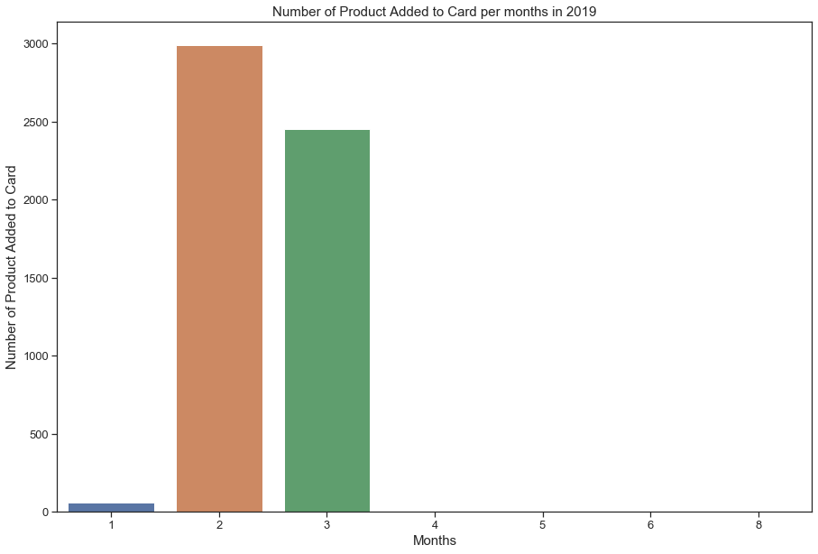


<a id='hyperlink8'></a>
**2019 YILI ÜRÜN SİPARİŞ MİKTARI AÇISINDAN TOP 20 ÜLKE NELERDİR?**


```python
mco=pd.merge(mco,data[['date','country']],on='date')
```


```python
mco['month']=mco[(mco['date'] > '2019-1-1 ') & (mco['date'] <= '2019-8-31 ')].date.dt.month
mco=mco[['date','month','country','productCheckouts']]
mco.drop(columns='month',inplace=True)

```


```python
filtered_mco=mco[mco['productCheckouts']>0]
```


```python
final_country_checkout=filtered_mco.groupby('country')['productCheckouts'].sum().sort_values(ascending=False)
```


```python
plt.figure(figsize=(15,10))
sns.barplot(x=final_country_checkout.index[0:10], y=final_country_checkout.values[0:10])
plt.xticks(rotation= 270,fontsize=15)
plt.yticks(rotation= 0,fontsize=15)
plt.xlabel('Top 10 Countries',fontsize=15)
plt.ylabel('Number of Product Check Out',fontsize=15)
plt.title(' Product Check Out Number for Top 10 Countries in 2019',fontsize=15)
```


    Text(0.5, 1.0, ' Product Check Out Number for Top 10 Countries in 2019')


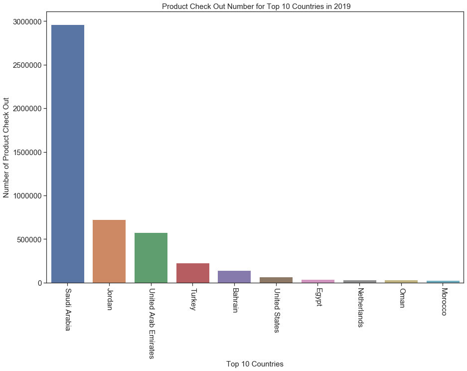


<a id='hyperlink9'></a>
**EN ÇOK SATILAN ÜRÜNÜN SUUDİ ARABİSTAN'DA SON SATILDIĞI ZAMANDAN 1,2,3 GÜN ÖNCESİNDEKİ GÖRÜNTÜLENME SAYILARI NELERDİR?**


```python
filter_val = [val for val in data['productName'] if val.startswith('RCHSET104 اونيكس سبحة & عقيق خاتم طقم')]

```


```python
prod1_v1=data[data['productName']=='RCHSET104 اونيكس سبحة & عقيق خاتم طقم']
```


```python
prod1_v2=prod1_v1[['date','country','productDetailViews','productCheckouts','quantityCheckedOut']]
```


```python
prod1_v3=prod1_v2.loc[prod1_v2.country=='Saudi Arabia']
```


```python
prod1_1dayview=prod1_v3.loc[prod1_v3.date=='2019-03-24'].groupby('country')['productDetailViews'].sum()
```


```python
prod1_2dayview=prod1_v3.loc[prod1_v3.date=='2019-03-23'].groupby('country')['productDetailViews'].sum()
```


```python
prod1_3dayview=prod1_v3.loc[prod1_v3.date=='2019-03-22'].groupby('country')['productDetailViews'].sum()
```


```python
prod1_1dayview
```


    country
    Saudi Arabia    87
    Name: productDetailViews, dtype: int64


```python
prod1_2dayview
```


    country
    Saudi Arabia    168
    Name: productDetailViews, dtype: int64


```python
prod1_3dayview
```


    country
    Saudi Arabia    136
    Name: productDetailViews, dtype: int64


<a id='hyperlink10'></a>
**EN ÇOK SATILAN 50 ÜRÜNÜN SUUDİ ARABİSTAN'DA SON SATILDIĞI TARİHTEN 1 VE 2 GÜN ÖNCEKİ GÖRÜNTÜLENME,SATIŞ VE ADET SAYISI ANALİZİ**


```python
prod1_co1=prod1_v3.loc[prod1_v3.date=='2019-03-10'].groupby('country')['productCheckouts'].sum()
```


```python
prod1_cq1=prod1_v3.loc[prod1_v3.date=='2019-03-10'].groupby('country')['quantityCheckedOut'].sum()
```


```python
prod1_v3.loc[prod1_v3.productCheckouts>0]
```


<div>
<style scoped>
    .dataframe tbody tr th:only-of-type {
        vertical-align: middle;
    }

    .dataframe tbody tr th {
        vertical-align: top;
    }

    .dataframe thead th {
        text-align: right;
    }
</style>
<table border="1" class="dataframe">
  <thead>
    <tr style="text-align: right;">
      <th></th>
      <th>date</th>
      <th>country</th>
      <th>productDetailViews</th>
      <th>productCheckouts</th>
      <th>quantityCheckedOut</th>
    </tr>
  </thead>
  <tbody>
    <tr>
      <th>8023</th>
      <td>2019-02-04</td>
      <td>Saudi Arabia</td>
      <td>7</td>
      <td>1</td>
      <td>1</td>
    </tr>
    <tr>
      <th>8024</th>
      <td>2019-02-04</td>
      <td>Saudi Arabia</td>
      <td>3</td>
      <td>1</td>
      <td>1</td>
    </tr>
    <tr>
      <th>10858</th>
      <td>2019-02-06</td>
      <td>Saudi Arabia</td>
      <td>6</td>
      <td>1</td>
      <td>1</td>
    </tr>
    <tr>
      <th>14666</th>
      <td>2019-02-09</td>
      <td>Saudi Arabia</td>
      <td>11</td>
      <td>2</td>
      <td>2</td>
    </tr>
    <tr>
      <th>18623</th>
      <td>2019-02-11</td>
      <td>Saudi Arabia</td>
      <td>12</td>
      <td>1</td>
      <td>1</td>
    </tr>
    <tr>
      <th>18625</th>
      <td>2019-02-11</td>
      <td>Saudi Arabia</td>
      <td>19</td>
      <td>1</td>
      <td>1</td>
    </tr>
    <tr>
      <th>20564</th>
      <td>2019-02-12</td>
      <td>Saudi Arabia</td>
      <td>12</td>
      <td>2</td>
      <td>2</td>
    </tr>
    <tr>
      <th>20565</th>
      <td>2019-02-12</td>
      <td>Saudi Arabia</td>
      <td>8</td>
      <td>1</td>
      <td>1</td>
    </tr>
    <tr>
      <th>21334</th>
      <td>2019-02-12</td>
      <td>Saudi Arabia</td>
      <td>7</td>
      <td>1</td>
      <td>1</td>
    </tr>
    <tr>
      <th>22376</th>
      <td>2019-02-13</td>
      <td>Saudi Arabia</td>
      <td>6</td>
      <td>2</td>
      <td>2</td>
    </tr>
    <tr>
      <th>24120</th>
      <td>2019-02-14</td>
      <td>Saudi Arabia</td>
      <td>7</td>
      <td>1</td>
      <td>1</td>
    </tr>
    <tr>
      <th>24818</th>
      <td>2019-02-14</td>
      <td>Saudi Arabia</td>
      <td>3</td>
      <td>1</td>
      <td>1</td>
    </tr>
    <tr>
      <th>27937</th>
      <td>2019-02-16</td>
      <td>Saudi Arabia</td>
      <td>13</td>
      <td>1</td>
      <td>1</td>
    </tr>
    <tr>
      <th>27938</th>
      <td>2019-02-16</td>
      <td>Saudi Arabia</td>
      <td>14</td>
      <td>1</td>
      <td>1</td>
    </tr>
    <tr>
      <th>29935</th>
      <td>2019-02-17</td>
      <td>Saudi Arabia</td>
      <td>6</td>
      <td>2</td>
      <td>2</td>
    </tr>
    <tr>
      <th>32326</th>
      <td>2019-02-18</td>
      <td>Saudi Arabia</td>
      <td>9</td>
      <td>1</td>
      <td>1</td>
    </tr>
    <tr>
      <th>36423</th>
      <td>2019-02-20</td>
      <td>Saudi Arabia</td>
      <td>5</td>
      <td>1</td>
      <td>1</td>
    </tr>
    <tr>
      <th>36424</th>
      <td>2019-02-20</td>
      <td>Saudi Arabia</td>
      <td>11</td>
      <td>4</td>
      <td>4</td>
    </tr>
    <tr>
      <th>36425</th>
      <td>2019-02-20</td>
      <td>Saudi Arabia</td>
      <td>11</td>
      <td>3</td>
      <td>3</td>
    </tr>
    <tr>
      <th>38846</th>
      <td>2019-02-21</td>
      <td>Saudi Arabia</td>
      <td>2</td>
      <td>1</td>
      <td>1</td>
    </tr>
    <tr>
      <th>40858</th>
      <td>2019-02-22</td>
      <td>Saudi Arabia</td>
      <td>10</td>
      <td>1</td>
      <td>1</td>
    </tr>
    <tr>
      <th>44617</th>
      <td>2019-02-25</td>
      <td>Saudi Arabia</td>
      <td>31</td>
      <td>1</td>
      <td>1</td>
    </tr>
    <tr>
      <th>44620</th>
      <td>2019-02-25</td>
      <td>Saudi Arabia</td>
      <td>48</td>
      <td>2</td>
      <td>2</td>
    </tr>
    <tr>
      <th>45302</th>
      <td>2019-02-25</td>
      <td>Saudi Arabia</td>
      <td>22</td>
      <td>1</td>
      <td>1</td>
    </tr>
    <tr>
      <th>46390</th>
      <td>2019-02-26</td>
      <td>Saudi Arabia</td>
      <td>68</td>
      <td>3</td>
      <td>4</td>
    </tr>
    <tr>
      <th>46393</th>
      <td>2019-02-26</td>
      <td>Saudi Arabia</td>
      <td>34</td>
      <td>3</td>
      <td>3</td>
    </tr>
    <tr>
      <th>47183</th>
      <td>2019-02-26</td>
      <td>Saudi Arabia</td>
      <td>3</td>
      <td>1</td>
      <td>1</td>
    </tr>
    <tr>
      <th>47185</th>
      <td>2019-02-26</td>
      <td>Saudi Arabia</td>
      <td>7</td>
      <td>1</td>
      <td>1</td>
    </tr>
    <tr>
      <th>47187</th>
      <td>2019-02-26</td>
      <td>Saudi Arabia</td>
      <td>7</td>
      <td>1</td>
      <td>1</td>
    </tr>
    <tr>
      <th>48322</th>
      <td>2019-02-27</td>
      <td>Saudi Arabia</td>
      <td>24</td>
      <td>3</td>
      <td>3</td>
    </tr>
    <tr>
      <th>50215</th>
      <td>2019-02-28</td>
      <td>Saudi Arabia</td>
      <td>44</td>
      <td>2</td>
      <td>2</td>
    </tr>
    <tr>
      <th>50218</th>
      <td>2019-02-28</td>
      <td>Saudi Arabia</td>
      <td>28</td>
      <td>2</td>
      <td>2</td>
    </tr>
    <tr>
      <th>52226</th>
      <td>2019-03-01</td>
      <td>Saudi Arabia</td>
      <td>45</td>
      <td>3</td>
      <td>3</td>
    </tr>
    <tr>
      <th>54291</th>
      <td>2019-03-02</td>
      <td>Saudi Arabia</td>
      <td>2</td>
      <td>1</td>
      <td>1</td>
    </tr>
    <tr>
      <th>54295</th>
      <td>2019-03-02</td>
      <td>Saudi Arabia</td>
      <td>49</td>
      <td>1</td>
      <td>1</td>
    </tr>
    <tr>
      <th>56337</th>
      <td>2019-03-03</td>
      <td>Saudi Arabia</td>
      <td>47</td>
      <td>2</td>
      <td>2</td>
    </tr>
    <tr>
      <th>56339</th>
      <td>2019-03-03</td>
      <td>Saudi Arabia</td>
      <td>27</td>
      <td>1</td>
      <td>2</td>
    </tr>
    <tr>
      <th>57223</th>
      <td>2019-03-03</td>
      <td>Saudi Arabia</td>
      <td>8</td>
      <td>1</td>
      <td>1</td>
    </tr>
    <tr>
      <th>58240</th>
      <td>2019-03-04</td>
      <td>Saudi Arabia</td>
      <td>77</td>
      <td>4</td>
      <td>4</td>
    </tr>
    <tr>
      <th>58243</th>
      <td>2019-03-04</td>
      <td>Saudi Arabia</td>
      <td>35</td>
      <td>3</td>
      <td>3</td>
    </tr>
    <tr>
      <th>59054</th>
      <td>2019-03-04</td>
      <td>Saudi Arabia</td>
      <td>14</td>
      <td>1</td>
      <td>1</td>
    </tr>
    <tr>
      <th>60067</th>
      <td>2019-03-05</td>
      <td>Saudi Arabia</td>
      <td>2</td>
      <td>1</td>
      <td>1</td>
    </tr>
    <tr>
      <th>60069</th>
      <td>2019-03-05</td>
      <td>Saudi Arabia</td>
      <td>59</td>
      <td>3</td>
      <td>3</td>
    </tr>
    <tr>
      <th>60070</th>
      <td>2019-03-05</td>
      <td>Saudi Arabia</td>
      <td>26</td>
      <td>1</td>
      <td>1</td>
    </tr>
    <tr>
      <th>60876</th>
      <td>2019-03-05</td>
      <td>Saudi Arabia</td>
      <td>8</td>
      <td>1</td>
      <td>1</td>
    </tr>
    <tr>
      <th>60877</th>
      <td>2019-03-05</td>
      <td>Saudi Arabia</td>
      <td>18</td>
      <td>2</td>
      <td>2</td>
    </tr>
    <tr>
      <th>61700</th>
      <td>2019-03-06</td>
      <td>Saudi Arabia</td>
      <td>5</td>
      <td>2</td>
      <td>2</td>
    </tr>
    <tr>
      <th>61702</th>
      <td>2019-03-06</td>
      <td>Saudi Arabia</td>
      <td>63</td>
      <td>3</td>
      <td>3</td>
    </tr>
    <tr>
      <th>61704</th>
      <td>2019-03-06</td>
      <td>Saudi Arabia</td>
      <td>40</td>
      <td>2</td>
      <td>2</td>
    </tr>
    <tr>
      <th>62415</th>
      <td>2019-03-06</td>
      <td>Saudi Arabia</td>
      <td>16</td>
      <td>2</td>
      <td>2</td>
    </tr>
    <tr>
      <th>63232</th>
      <td>2019-03-07</td>
      <td>Saudi Arabia</td>
      <td>46</td>
      <td>3</td>
      <td>3</td>
    </tr>
    <tr>
      <th>64138</th>
      <td>2019-03-07</td>
      <td>Saudi Arabia</td>
      <td>7</td>
      <td>1</td>
      <td>1</td>
    </tr>
    <tr>
      <th>69203</th>
      <td>2019-03-10</td>
      <td>Saudi Arabia</td>
      <td>6</td>
      <td>1</td>
      <td>1</td>
    </tr>
    <tr>
      <th>72883</th>
      <td>2019-03-12</td>
      <td>Saudi Arabia</td>
      <td>9</td>
      <td>1</td>
      <td>1</td>
    </tr>
  </tbody>
</table>
</div>


```python
prod1_2dayview=prod1_v3.loc[prod1_v3.date=='2019-03-07'].groupby('country')['productDetailViews'].sum()
prod1_co2=prod1_v3.loc[prod1_v3.date=='2019-03-07'].groupby('country')['productCheckouts'].sum()
prod1_cq2=prod1_v3.loc[prod1_v3.date=='2019-03-07'].groupby('country')['quantityCheckedOut'].sum()
```


```python
[val for val in data['productName'] if val.startswith('RCHSET188')]


```


```python
prod2_v1=data[data['productName']== 'MR1002  925 فضة استرليني عقيق أبيض حجر خاتم']
prod2_v2=prod2_v1[['date','country','productDetailViews','productCheckouts','quantityCheckedOut']]
prod2_v3=prod2_v2.loc[prod2_v2.country=='Saudi Arabia']
```


```python
prod2_v3.loc[prod2_v3.productCheckouts>0]
```


```python
prod2_1dayview=prod2_v3.loc[prod2_v3.date=='2019-03-06'].groupby('country')['productDetailViews'].sum()
prod2_co1=prod2_v3.loc[prod2_v3.date=='2019-03-06'].groupby('country')['productCheckouts'].sum()
prod2_cq1=prod2_v3.loc[prod2_v3.date=='2019-03-06'].groupby('country')['quantityCheckedOut'].sum()
```


```python
prod2_2dayview=prod2_v3.loc[prod2_v3.date=='2019-03-05'].groupby('country')['productDetailViews'].sum()
prod2_co2=prod2_v3.loc[prod2_v3.date=='2019-03-05'].groupby('country')['productCheckouts'].sum()
prod2_cq2=prod2_v3.loc[prod2_v3.date=='2019-03-05'].groupby('country')['quantityCheckedOut'].sum()
```


```python
prod3_v1=data[data['productName']== 'RCH2074 925 فضة استرليني عقيق حجر خاتم']
prod3_v2=prod3_v1[['date','country','productDetailViews','productCheckouts','quantityCheckedOut']]
prod3_v3=prod3_v2.loc[prod3_v2.country=='Saudi Arabia']
```


```python
prod3_v3.loc[prod3_v3.productCheckouts>0]
```


```python
prod3_1dayview=prod3_v3.loc[prod3_v3.date=='2019-03-06'].groupby('country')['productDetailViews'].sum()
prod3_co1=prod3_v3.loc[prod3_v3.date=='2019-03-06'].groupby('country')['productCheckouts'].sum()
prod3_cq1=prod3_v3.loc[prod3_v3.date=='2019-03-06'].groupby('country')['quantityCheckedOut'].sum()
```


```python
prod3_2dayview=prod3_v3.loc[prod3_v3.date=='2019-03-05'].groupby('country')['productDetailViews'].sum()
prod3_co2=prod3_v3.loc[prod3_v3.date=='2019-03-05'].groupby('country')['productCheckouts'].sum()
prod3_cq2=prod3_v3.loc[prod3_v3.date=='2019-03-05'].groupby('country')['quantityCheckedOut'].sum()
```


```python
prod3_cq2
```


```python
prod4_v1=data[data['productName']== 'RCH2159 خاتم فضة استرليني عيار 925']
prod4_v2=prod4_v1[['date','country','productDetailViews','productCheckouts','quantityCheckedOut']]
prod4_v3=prod4_v2.loc[prod4_v2.country=='Saudi Arabia']
```


```python
prod4_v3.loc[prod4_v3.productCheckouts>0]
```


```python
prod4_1dayview=prod4_v3.loc[prod4_v3.date=='2019-03-06'].groupby('country')['productDetailViews'].sum()
prod4_co1=prod4_v3.loc[prod4_v3.date=='2019-03-06'].groupby('country')['productCheckouts'].sum()
prod4_cq1=prod4_v3.loc[prod4_v3.date=='2019-03-06'].groupby('country')['quantityCheckedOut'].sum()
```


```python
prod4_2dayview=prod4_v3.loc[prod4_v3.date=='2019-03-05'].groupby('country')['productDetailViews'].sum()
prod4_co2=prod4_v3.loc[prod4_v3.date=='2019-03-05'].groupby('country')['productCheckouts'].sum()
prod4_cq2=prod4_v3.loc[prod4_v3.date=='2019-03-05'].groupby('country')['quantityCheckedOut'].sum()
```


```python
prod4_cq2
```


```python
prod5_v1=data[data['productName']== 'RCH2224 خاتم فضة استرليني 925 بحجر الفيروز']
prod5_v2=prod5_v1[['date','country','productDetailViews','productCheckouts','quantityCheckedOut']]
prod5_v3=prod5_v2.loc[prod5_v2.country=='Saudi Arabia']
```


```python
prod5_v3.loc[prod5_v3.productCheckouts>0]
```


```python
prod5_1dayview=prod5_v3.loc[prod5_v3.date=='2019-03-06'].groupby('country')['productDetailViews'].sum()
prod5_co1=prod5_v3.loc[prod5_v3.date=='2019-03-06'].groupby('country')['productCheckouts'].sum()
prod5_cq1=prod5_v3.loc[prod5_v3.date=='2019-03-06'].groupby('country')['quantityCheckedOut'].sum()
```


```python
prod5_2dayview=prod5_v3.loc[prod5_v3.date=='2019-03-05'].groupby('country')['productDetailViews'].sum()
prod5_co2=prod5_v3.loc[prod5_v3.date=='2019-03-05'].groupby('country')['productCheckouts'].sum()
prod5_cq2=prod5_v3.loc[prod5_v3.date=='2019-03-05'].groupby('country')['quantityCheckedOut'].sum()
```


```python
prod5_cq2
```


```python
prod6_v1=data[data['productName']==  'RCH2033 خاتم فضة استرليني 925 بحجر العقيق']
prod6_v2=prod6_v1[['date','country','productDetailViews','productCheckouts','quantityCheckedOut']]
prod6_v3=prod6_v2.loc[prod6_v2.country=='Saudi Arabia']
```


```python
prod6_v3.loc[prod6_v3.productCheckouts>0]
```


```python
prod6_1dayview=prod6_v3.loc[prod6_v3.date=='2019-03-06'].groupby('country')['productDetailViews'].sum()
prod6_co1=prod6_v3.loc[prod6_v3.date=='2019-03-06'].groupby('country')['productCheckouts'].sum()
prod6_cq1=prod6_v3.loc[prod6_v3.date=='2019-03-06'].groupby('country')['quantityCheckedOut'].sum()
```


```python
prod6_2dayview=prod6_v3.loc[prod6_v3.date=='2019-03-05'].groupby('country')['productDetailViews'].sum()
prod6_co2=prod6_v3.loc[prod6_v3.date=='2019-03-05'].groupby('country')['productCheckouts'].sum()
prod6_cq2=prod6_v3.loc[prod6_v3.date=='2019-03-05'].groupby('country')['quantityCheckedOut'].sum()
```


```python
prod6_cq2
```


```python
prod7_v1=data[data['productName']==  'RCH2215 925 خاتم فضة استرليني بحجر الزيركون']
prod7_v2=prod7_v1[['date','country','productDetailViews','productCheckouts','quantityCheckedOut']]
prod7_v3=prod7_v2.loc[prod7_v2.country=='Saudi Arabia']
```


```python
prod7_v3.loc[prod7_v3.productCheckouts>0]
```


```python
prod7_1dayview=prod7_v3.loc[prod7_v3.date=='2019-03-04'].groupby('country')['productDetailViews'].sum()
prod7_co1=prod7_v3.loc[prod7_v3.date=='2019-03-04'].groupby('country')['productCheckouts'].sum()
prod7_cq1=prod7_v3.loc[prod7_v3.date=='2019-03-04'].groupby('country')['quantityCheckedOut'].sum()
```


```python
prod7_2dayview=prod7_v3.loc[prod7_v3.date=='2019-03-03'].groupby('country')['productDetailViews'].sum()
prod7_co2=prod7_v3.loc[prod7_v3.date=='2019-03-03'].groupby('country')['productCheckouts'].sum()
prod7_cq2=prod7_v3.loc[prod7_v3.date=='2019-03-03'].groupby('country')['quantityCheckedOut'].sum()
```


```python
prod7_cq2
```


```python
prod8_v1=data[data['productName']== 'RCHSET110  سبحة & خاتم عقيق']
prod8_v2=prod8_v1[['date','country','productDetailViews','productCheckouts','quantityCheckedOut']]
prod8_v3=prod8_v2.loc[prod8_v2.country=='Saudi Arabia']
```


```python
prod8_v3.loc[prod8_v3.productCheckouts>0]
```


```python
prod8_1dayview=prod8_v3.loc[prod8_v3.date=='2019-03-01'].groupby('country')['productDetailViews'].sum()
prod8_co1=prod8_v3.loc[prod8_v3.date=='2019-03-01'].groupby('country')['productCheckouts'].sum()
prod8_cq1=prod8_v3.loc[prod8_v3.date=='2019-03-01'].groupby('country')['quantityCheckedOut'].sum()
```


```python
prod8_2dayview=prod8_v3.loc[prod8_v3.date=='2019-02-28'].groupby('country')['productDetailViews'].sum()
prod8_co2=prod8_v3.loc[prod8_v3.date=='2019-02-28'].groupby('country')['productCheckouts'].sum()
prod8_cq2=prod8_v3.loc[prod8_v3.date=='2019-02-28'].groupby('country')['quantityCheckedOut'].sum()
```


```python
prod8_cq2
```


```python
prod9_v1=data[data['productName']== 'RCH2188 925 خاتم فضة استرليني بحجر العقيق']
prod9_v2=prod9_v1[['date','country','productDetailViews','productCheckouts','quantityCheckedOut']]
prod9_v3=prod9_v2.loc[prod9_v2.country=='Saudi Arabia']
```


```python
prod9_v3.loc[prod9_v3.productCheckouts>0]
```


```python
prod9_1dayview=prod9_v3.loc[prod9_v3.date=='2019-03-06'].groupby('country')['productDetailViews'].sum()
prod9_co1=prod9_v3.loc[prod9_v3.date=='2019-03-06'].groupby('country')['productCheckouts'].sum()
prod9_cq1=prod9_v3.loc[prod9_v3.date=='2019-03-06'].groupby('country')['quantityCheckedOut'].sum()
```


```python
prod9_2dayview=prod9_v3.loc[prod9_v3.date=='2019-03-06'].groupby('country')['productDetailViews'].sum()
prod9_co2=prod9_v3.loc[prod9_v3.date=='2019-03-06'].groupby('country')['productCheckouts'].sum()
prod9_cq2=prod9_v3.loc[prod9_v3.date=='2019-03-06'].groupby('country')['quantityCheckedOut'].sum()
```


```python
prod9_cq2
```


```python
prod10_v1=data[data['productName']==  'RCHSET104 اونيكس سبحة & عقيق خاتم طقم']
prod10_v2=prod10_v1[['date','country','productDetailViews','productCheckouts','quantityCheckedOut']]
prod10_v3=prod10_v2.loc[prod10_v2.country=='Saudi Arabia']
```


```python
prod10_v3.loc[prod10_v3.productCheckouts>0]
```


```python
prod10_1dayview=prod10_v3.loc[prod10_v3.date=='2019-03-10'].groupby('country')['productDetailViews'].sum()
prod10_co1=prod10_v3.loc[prod10_v3.date=='2019-03-10'].groupby('country')['productCheckouts'].sum()
prod10_cq1=prod10_v3.loc[prod10_v3.date=='2019-03-10'].groupby('country')['quantityCheckedOut'].sum()
```


```python
prod10_2dayview=prod10_v3.loc[prod10_v3.date=='2019-03-07'].groupby('country')['productDetailViews'].sum()
prod10_co2=prod10_v3.loc[prod10_v3.date=='2019-03-07'].groupby('country')['productCheckouts'].sum()
prod10_cq2=prod10_v3.loc[prod10_v3.date=='2019-03-07'].groupby('country')['quantityCheckedOut'].sum()
```


```python
prod10_cq2
```


```python
prod11_v1=data[data['productName']==  'RCH2223 خاتم فضة استرليني 925 بحجر العقيق']
prod11_v2=prod11_v1[['date','country','productDetailViews','productCheckouts','quantityCheckedOut']]
prod11_v3=prod11_v2.loc[prod11_v2.country=='Saudi Arabia']
```


```python
prod11_v3.loc[prod11_v3.productCheckouts>0]
```


```python
prod11_1dayview=prod11_v3.loc[prod11_v3.date=='2019-03-04'].groupby('country')['productDetailViews'].sum()
prod11_co1=prod11_v3.loc[prod11_v3.date=='2019-03-04'].groupby('country')['productCheckouts'].sum()
prod11_cq1=prod11_v3.loc[prod11_v3.date=='2019-03-04'].groupby('country')['quantityCheckedOut'].sum()
```


```python
prod11_2dayview=prod11_v3.loc[prod11_v3.date=='2019-03-03'].groupby('country')['productDetailViews'].sum()
prod11_co2=prod11_v3.loc[prod11_v3.date=='2019-03-03'].groupby('country')['productCheckouts'].sum()
prod11_cq2=prod11_v3.loc[prod11_v3.date=='2019-03-03'].groupby('country')['quantityCheckedOut'].sum()
```


```python
prod11_cq2
```


```python
prod12_v1=data[data['productName']==   'RCH2235خاتم فضة استرليني 925 بحجر الكهربار']
prod12_v2=prod12_v1[['date','country','productDetailViews','productCheckouts','quantityCheckedOut']]
prod12_v3=prod12_v2.loc[prod12_v2.country=='Saudi Arabia']
```


```python
prod12_v3.loc[prod12_v3.productCheckouts>0]
```


```python
prod12_1dayview=prod12_v3.loc[prod12_v3.date=='2019-03-05'].groupby('country')['productDetailViews'].sum()
prod12_co1=prod12_v3.loc[prod12_v3.date=='2019-03-05'].groupby('country')['productCheckouts'].sum()
prod12_cq1=prod12_v3.loc[prod12_v3.date=='2019-03-05'].groupby('country')['quantityCheckedOut'].sum()
```


```python
prod12_2dayview=prod12_v3.loc[prod12_v3.date=='2019-02-28'].groupby('country')['productDetailViews'].sum()
prod12_co2=prod12_v3.loc[prod12_v3.date=='2019-02-28'].groupby('country')['productCheckouts'].sum()
prod12_cq2=prod12_v3.loc[prod12_v3.date=='2019-02-28'].groupby('country')['quantityCheckedOut'].sum()
```


```python
prod12_cq2
```


```python
prod13_v1=data[data['productName']==    'RCH2074 925 فضة استرليني عقيق حجر خاتم']
prod13_v2=prod13_v1[['date','country','productDetailViews','productCheckouts','quantityCheckedOut']]
prod13_v3=prod13_v2.loc[prod13_v2.country=='Saudi Arabia']
```


```python
prod13_v3.loc[prod13_v3.productCheckouts>0]
```


```python
prod13_1dayview=prod13_v3.loc[prod13_v3.date=='2019-03-06'].groupby('country')['productDetailViews'].sum()
prod13_co1=prod13_v3.loc[prod13_v3.date=='2019-03-06'].groupby('country')['productCheckouts'].sum()
prod13_cq1=prod13_v3.loc[prod13_v3.date=='2019-03-06'].groupby('country')['quantityCheckedOut'].sum()
```


```python
prod13_2dayview=prod13_v3.loc[prod13_v3.date=='2019-03-05'].groupby('country')['productDetailViews'].sum()
prod13_co2=prod13_v3.loc[prod13_v3.date=='2019-03-05'].groupby('country')['productCheckouts'].sum()
prod13_cq2=prod13_v3.loc[prod13_v3.date=='2019-03-05'].groupby('country')['quantityCheckedOut'].sum()
```


```python
prod13_cq2
```


```python
prod14_v1=data[data['productName']==     'RCH2224 خاتم فضة استرليني 925 بحجر الفيروز']
prod14_v2=prod14_v1[['date','country','productDetailViews','productCheckouts','quantityCheckedOut']]
prod14_v3=prod14_v2.loc[prod14_v2.country=='Saudi Arabia']
```


```python
prod14_v3.loc[prod14_v3.productCheckouts>0]
```


```python
prod14_1dayview=prod14_v3.loc[prod14_v3.date=='2019-03-06'].groupby('country')['productDetailViews'].sum()
prod14_co1=prod14_v3.loc[prod14_v3.date=='2019-03-06'].groupby('country')['productCheckouts'].sum()
prod14_cq1=prod14_v3.loc[prod14_v3.date=='2019-03-06'].groupby('country')['quantityCheckedOut'].sum()
```


```python
prod14_2dayview=prod14_v3.loc[prod14_v3.date=='2019-03-05'].groupby('country')['productDetailViews'].sum()
prod14_co2=prod14_v3.loc[prod14_v3.date=='2019-03-05'].groupby('country')['productCheckouts'].sum()
prod14_cq2=prod14_v3.loc[prod14_v3.date=='2019-03-05'].groupby('country')['quantityCheckedOut'].sum()
```


```python
prod14_cq2
```


```python
prod15_v1=data[data['productName']==      'RCH2073 925 فضة استرليني عقيق حجر خاتم']
prod15_v2=prod15_v1[['date','country','productDetailViews','productCheckouts','quantityCheckedOut']]
prod15_v3=prod15_v2.loc[prod15_v2.country=='Saudi Arabia']
```


```python
prod15_v3.loc[prod15_v3.productCheckouts>0]
```


```python
prod15_1dayview=prod15_v3.loc[prod15_v3.date=='2019-02-20'].groupby('country')['productDetailViews'].sum()
prod15_co1=prod15_v3.loc[prod15_v3.date=='2019-02-20'].groupby('country')['productCheckouts'].sum()
prod15_cq1=prod15_v3.loc[prod15_v3.date=='2019-02-20'].groupby('country')['quantityCheckedOut'].sum()
```


```python
prod15_2dayview=prod15_v3.loc[prod15_v3.date=='2019-02-19'].groupby('country')['productDetailViews'].sum()
prod15_co2=prod15_v3.loc[prod15_v3.date=='2019-02-19'].groupby('country')['productCheckouts'].sum()
prod15_cq2=prod15_v3.loc[prod15_v3.date=='2019-02-19'].groupby('country')['quantityCheckedOut'].sum()
```


```python
prod15_cq2
```


```python
prod16_v1=data[data['productName']==       'RCH2027 خاتم عقيق رجالي فضة عيار 925 ماركة ريجهون']
prod16_v2=prod16_v1[['date','country','productDetailViews','productCheckouts','quantityCheckedOut']]
prod16_v3=prod16_v2.loc[prod16_v2.country=='Saudi Arabia']
```


```python
prod16_v3.loc[prod16_v3.productCheckouts>0]
```


```python
prod16_1dayview=prod16_v3.loc[prod16_v3.date=='2019-03-06'].groupby('country')['productDetailViews'].sum()
prod16_co1=prod16_v3.loc[prod16_v3.date=='2019-03-06'].groupby('country')['productCheckouts'].sum()
prod16_cq1=prod16_v3.loc[prod16_v3.date=='2019-03-06'].groupby('country')['quantityCheckedOut'].sum()
```


```python
prod16_2dayview=prod16_v3.loc[prod16_v3.date=='2019-03-05'].groupby('country')['productDetailViews'].sum()
prod16_co2=prod16_v3.loc[prod16_v3.date=='2019-03-05'].groupby('country')['productCheckouts'].sum()
prod16_cq2=prod16_v3.loc[prod16_v3.date=='2019-03-05'].groupby('country')['quantityCheckedOut'].sum()
```


```python
prod16_cq2
```


```python
prod17_v1=data[data['productName']==        'RCHSET101 عقيق سبحة & عقيق خاتم طقم']
prod17_v2=prod17_v1[['date','country','productDetailViews','productCheckouts','quantityCheckedOut']]
prod17_v3=prod17_v2.loc[prod17_v2.country=='Saudi Arabia']
```


```python
prod17_v3.loc[prod17_v3.productCheckouts>0]
```


```python
prod17_1dayview=prod17_v3.loc[prod17_v3.date=='2019-03-04'].groupby('country')['productDetailViews'].sum()
prod17_co1=prod17_v3.loc[prod17_v3.date=='2019-03-04'].groupby('country')['productCheckouts'].sum()
prod17_cq1=prod17_v3.loc[prod17_v3.date=='2019-03-04'].groupby('country')['quantityCheckedOut'].sum()
```


```python
prod17_2dayview=prod17_v3.loc[prod17_v3.date=='2019-03-03'].groupby('country')['productDetailViews'].sum()
prod17_co2=prod17_v3.loc[prod17_v3.date=='2019-03-03'].groupby('country')['productCheckouts'].sum()
prod17_cq2=prod17_v3.loc[prod17_v3.date=='2019-03-03'].groupby('country')['quantityCheckedOut'].sum()
```


```python
prod17_cq2
```


```python
prod18_v1=data[data['productName']==         'RCH2219 925 خاتم فضة استرليني بحجر الزيركون']
prod18_v2=prod18_v1[['date','country','productDetailViews','productCheckouts','quantityCheckedOut']]
prod18_v3=prod18_v2.loc[prod18_v2.country=='Saudi Arabia']
```


```python
prod18_v3.loc[prod18_v3.productCheckouts>0]
```


```python
prod18_1dayview=prod18_v3.loc[prod18_v3.date=='2019-02-20'].groupby('country')['productDetailViews'].sum()
prod18_co1=prod18_v3.loc[prod18_v3.date=='2019-02-20'].groupby('country')['productCheckouts'].sum()
prod18_cq1=prod18_v3.loc[prod18_v3.date=='2019-02-20'].groupby('country')['quantityCheckedOut'].sum()
```


```python
prod18_2dayview=prod18_v3.loc[prod18_v3.date=='2019-02-19'].groupby('country')['productDetailViews'].sum()
prod18_co2=prod18_v3.loc[prod18_v3.date=='2019-02-19'].groupby('country')['productCheckouts'].sum()
prod18_cq2=prod18_v3.loc[prod18_v3.date=='2019-02-19'].groupby('country')['quantityCheckedOut'].sum()
```


```python
prod18_cq2
```


```python
prod19_v1=data[data['productName']==          'RCH2042 925 فضة استرليني زيركون حجر خاتم']
prod19_v2=prod19_v1[['date','country','productDetailViews','productCheckouts','quantityCheckedOut']]
prod19_v3=prod19_v2.loc[prod19_v2.country=='Saudi Arabia']
```


```python
prod19_v3.loc[prod19_v3.productCheckouts>0]
```


```python
prod19_1dayview=prod19_v3.loc[prod19_v3.date=='2019-02-16'].groupby('country')['productDetailViews'].sum()
prod19_co1=prod19_v3.loc[prod19_v3.date=='2019-02-16'].groupby('country')['productCheckouts'].sum()
prod19_cq1=prod19_v3.loc[prod19_v3.date=='2019-02-16'].groupby('country')['quantityCheckedOut'].sum()
```


```python
prod19_2dayview=prod19_v3.loc[prod19_v3.date=='2019-02-15'].groupby('country')['productDetailViews'].sum()
prod19_co2=prod19_v3.loc[prod19_v3.date=='2019-02-15'].groupby('country')['productCheckouts'].sum()
prod19_cq2=prod19_v3.loc[prod19_v3.date=='2019-02-15'].groupby('country')['quantityCheckedOut'].sum()
```


```python
prod19_cq2
```


```python
prod20_v1=data[data['productName']==           'RCHSET128 طقم سبحة العقيق']
prod20_v2=prod20_v1[['date','country','productDetailViews','productCheckouts','quantityCheckedOut']]
prod20_v3=prod20_v2.loc[prod20_v2.country=='Saudi Arabia']
```


```python
prod20_v3.loc[prod20_v3.productCheckouts>0]
```


```python
prod20_1dayview=prod20_v3.loc[prod20_v3.date=='2019-03-01'].groupby('country')['productDetailViews'].sum()
prod20_co1=prod20_v3.loc[prod20_v3.date=='2019-03-01'].groupby('country')['productCheckouts'].sum()
prod20_cq1=prod20_v3.loc[prod20_v3.date=='2019-03-01'].groupby('country')['quantityCheckedOut'].sum()
```


```python
prod20_2dayview=prod20_v3.loc[prod20_v3.date=='2019-02-24'].groupby('country')['productDetailViews'].sum()
prod20_co2=prod20_v3.loc[prod20_v3.date=='2019-02-24'].groupby('country')['productCheckouts'].sum()
prod20_cq2=prod20_v3.loc[prod20_v3.date=='2019-02-24'].groupby('country')['quantityCheckedOut'].sum()
```


```python
prod20_cq2
```


```python
prod21_v1=data[data['productName']==            'RCH2212 925 خاتم فضة استرليني بحجر الزيركون']
prod21_v2=prod21_v1[['date','country','productDetailViews','productCheckouts','quantityCheckedOut']]
prod21_v3=prod21_v2.loc[prod21_v2.country=='Saudi Arabia']
```


```python
prod21_v3.loc[prod21_v3.productCheckouts>0]
```


```python
prod21_1dayview=prod21_v3.loc[prod21_v3.date=='2019-02-23'].groupby('country')['productDetailViews'].sum()
prod21_co1=prod21_v3.loc[prod21_v3.date=='2019-02-23'].groupby('country')['productCheckouts'].sum()
prod21_cq1=prod21_v3.loc[prod21_v3.date=='2019-02-23'].groupby('country')['quantityCheckedOut'].sum()
```


```python
prod21_2dayview=prod21_v3.loc[prod21_v3.date=='2019-02-20'].groupby('country')['productDetailViews'].sum()
prod21_co2=prod21_v3.loc[prod21_v3.date=='2019-02-20'].groupby('country')['productCheckouts'].sum()
prod21_cq2=prod21_v3.loc[prod21_v3.date=='2019-02-20'].groupby('country')['quantityCheckedOut'].sum()
```


```python
prod21_cq2
```


```python
prod22_v1=data[data['productName']==             'MR1023  925 فضة استرليني عقيق أبيض حجر خاتم']
prod22_v2=prod22_v1[['date','country','productDetailViews','productCheckouts','quantityCheckedOut']]
prod22_v3=prod22_v2.loc[prod22_v2.country=='Saudi Arabia']
```


```python
prod22_v3.loc[prod22_v3.productCheckouts>0]
```


```python
prod22_1dayview=prod22_v3.loc[prod22_v3.date=='2019-02-12'].groupby('country')['productDetailViews'].sum()
prod22_co1=prod22_v3.loc[prod22_v3.date=='2019-02-12'].groupby('country')['productCheckouts'].sum()
prod22_cq1=prod22_v3.loc[prod22_v3.date=='2019-02-12'].groupby('country')['quantityCheckedOut'].sum()
```


```python
prod22_2dayview=prod22_v3.loc[prod22_v3.date=='2019-02-11'].groupby('country')['productDetailViews'].sum()
prod22_co2=prod22_v3.loc[prod22_v3.date=='2019-02-11'].groupby('country')['productCheckouts'].sum()
prod22_cq2=prod22_v3.loc[prod22_v3.date=='2019-02-11'].groupby('country')['quantityCheckedOut'].sum()
```


```python
prod22_cq2
```


```python
prod23_v1=data[data['productName']==              'RCH2161 خاتم فضة استرليني عيار 925 بحجر الزيركون']
prod23_v2=prod23_v1[['date','country','productDetailViews','productCheckouts','quantityCheckedOut']]
prod23_v3=prod23_v2.loc[prod23_v2.country=='Saudi Arabia']
```


```python
prod23_v3.loc[prod23_v3.productCheckouts>0]
```


```python
prod23_1dayview=prod23_v3.loc[prod23_v3.date=='2019-02-28'].groupby('country')['productDetailViews'].sum()
prod23_co1=prod23_v3.loc[prod23_v3.date=='2019-02-28'].groupby('country')['productCheckouts'].sum()
prod23_cq1=prod23_v3.loc[prod23_v3.date=='2019-02-28'].groupby('country')['quantityCheckedOut'].sum()
```


```python
prod23_2dayview=prod23_v3.loc[prod23_v3.date=='2019-02-22'].groupby('country')['productDetailViews'].sum()
prod23_co2=prod23_v3.loc[prod23_v3.date=='2019-02-22'].groupby('country')['productCheckouts'].sum()
prod23_cq2=prod23_v3.loc[prod23_v3.date=='2019-02-22'].groupby('country')['quantityCheckedOut'].sum()
```


```python
prod23_cq2
```


```python
prod24_v1=data[data['productName']==              'RCH2160خاتم فضة استرليني عيار 925 بحجر العقيق']
prod24_v2=prod24_v1[['date','country','productDetailViews','productCheckouts','quantityCheckedOut']]
prod24_v3=prod24_v2.loc[prod24_v2.country=='Saudi Arabia']
```


```python
prod24_v3.loc[prod24_v3.productCheckouts>0]
```


```python
prod24_1dayview=prod24_v3.loc[prod24_v3.date=='2019-03-02'].groupby('country')['productDetailViews'].sum()
prod24_co1=prod24_v3.loc[prod24_v3.date=='2019-03-02'].groupby('country')['productCheckouts'].sum()
prod24_cq1=prod24_v3.loc[prod24_v3.date=='2019-03-02'].groupby('country')['quantityCheckedOut'].sum()
```


```python
prod24_2dayview=prod24_v3.loc[prod24_v3.date=='2019-03-01'].groupby('country')['productDetailViews'].sum()
prod24_co2=prod24_v3.loc[prod24_v3.date=='2019-03-01'].groupby('country')['productCheckouts'].sum()
prod24_cq2=prod24_v3.loc[prod24_v3.date=='2019-03-01'].groupby('country')['quantityCheckedOut'].sum()
```


```python
prod24_cq2
```


```python
prod25_v1=data[data['productName']==               'RCH2196 925 خاتم فضة استرليني بحجر العقيق']
prod25_v2=prod25_v1[['date','country','productDetailViews','productCheckouts','quantityCheckedOut']]
prod25_v3=prod25_v2.loc[prod25_v2.country=='Saudi Arabia']
```


```python
prod25_v3.loc[prod25_v3.productCheckouts>0]
```


```python
prod25_1dayview=prod25_v3.loc[prod25_v3.date=='2019-02-19'].groupby('country')['productDetailViews'].sum()
prod25_co1=prod25_v3.loc[prod25_v3.date=='2019-02-19'].groupby('country')['productCheckouts'].sum()
prod25_cq1=prod25_v3.loc[prod25_v3.date=='2019-02-19'].groupby('country')['quantityCheckedOut'].sum()
```


```python
prod25_2dayview=prod25_v3.loc[prod25_v3.date=='2019-02-18'].groupby('country')['productDetailViews'].sum()
prod25_co2=prod25_v3.loc[prod25_v3.date=='2019-02-18'].groupby('country')['productCheckouts'].sum()
prod25_cq2=prod25_v3.loc[prod25_v3.date=='2019-02-18'].groupby('country')['quantityCheckedOut'].sum()
```


```python
prod25_cq2
```


```python
prod26_v1=data[data['productName']==                'RCHSET106 أكريليك سبحة & خاتم عقيق']
prod26_v2=prod26_v1[['date','country','productDetailViews','productCheckouts','quantityCheckedOut']]
prod26_v3=prod26_v2.loc[prod26_v2.country=='Saudi Arabia']
```


```python
prod26_v3.loc[prod26_v3.productCheckouts>0]
```


```python
prod26_1dayview=prod26_v3.loc[prod26_v3.date=='2019-03-03'].groupby('country')['productDetailViews'].sum()
prod26_co1=prod26_v3.loc[prod26_v3.date=='2019-03-03'].groupby('country')['productCheckouts'].sum()
prod26_cq1=prod26_v3.loc[prod26_v3.date=='2019-03-03'].groupby('country')['quantityCheckedOut'].sum()
```


```python
prod26_2dayview=prod26_v3.loc[prod26_v3.date=='2019-03-01'].groupby('country')['productDetailViews'].sum()
prod26_co2=prod26_v3.loc[prod26_v3.date=='2019-03-01'].groupby('country')['productCheckouts'].sum()
prod26_cq2=prod26_v3.loc[prod26_v3.date=='2019-03-01'].groupby('country')['quantityCheckedOut'].sum()
```


```python
prod26_cq2
```


```python
prod27_v1=data[data['productName']==                 'MR1017  925 فضة استرليني عقيق أبيض حجر خاتم']
prod27_v2=prod27_v1[['date','country','productDetailViews','productCheckouts','quantityCheckedOut']]
prod27_v3=prod27_v2.loc[prod27_v2.country=='Saudi Arabia']
```


```python
prod27_v3.loc[prod27_v3.productCheckouts>0]
```


```python
prod27_1dayview=prod27_v3.loc[prod27_v3.date=='2019-02-22'].groupby('country')['productDetailViews'].sum()
prod27_co1=prod27_v3.loc[prod27_v3.date=='2019-02-22'].groupby('country')['productCheckouts'].sum()
prod27_cq1=prod27_v3.loc[prod27_v3.date=='2019-02-22'].groupby('country')['quantityCheckedOut'].sum()
```


```python
prod27_2dayview=prod27_v3.loc[prod27_v3.date=='2019-02-21'].groupby('country')['productDetailViews'].sum()
prod27_co2=prod27_v3.loc[prod27_v3.date=='2019-02-21'].groupby('country')['productCheckouts'].sum()
prod27_cq2=prod27_v3.loc[prod27_v3.date=='2019-02-21'].groupby('country')['quantityCheckedOut'].sum()
```


```python
prod27_cq2
```


```python
prod28_v1=data[data['productName']==                  'RCHSET102 زجاج كوارتز سبحة & عقيق خاتم طقم']
prod28_v2=prod28_v1[['date','country','productDetailViews','productCheckouts','quantityCheckedOut']]
prod28_v3=prod28_v2.loc[prod28_v2.country=='Saudi Arabia']
```


```python
prod28_v3.loc[prod28_v3.productCheckouts>0]
```


```python
prod28_1dayview=prod28_v3.loc[prod28_v3.date=='2019-02-09'].groupby('country')['productDetailViews'].sum()
prod28_co1=prod28_v3.loc[prod28_v3.date=='2019-02-09'].groupby('country')['productCheckouts'].sum()
prod28_cq1=prod28_v3.loc[prod28_v3.date=='2019-02-09'].groupby('country')['quantityCheckedOut'].sum()
```


```python
prod28_2dayview=prod28_v3.loc[prod28_v3.date=='2019-02-08'].groupby('country')['productDetailViews'].sum()
prod28_co2=prod28_v3.loc[prod28_v3.date=='2019-02-08'].groupby('country')['productCheckouts'].sum()
prod28_cq2=prod28_v3.loc[prod28_v3.date=='2019-02-08'].groupby('country')['quantityCheckedOut'].sum()
```


```python
prod28_cq2
```


```python
prod29_v1=data[data['productName']==                   'RCHSET106 أكريليك سبحة & خاتم عقيق']
prod29_v2=prod29_v1[['date','country','productDetailViews','productCheckouts','quantityCheckedOut']]
prod29_v3=prod29_v2.loc[prod29_v2.country=='Saudi Arabia']
```


```python
prod29_v3.loc[prod29_v3.productCheckouts>0]
```


```python
prod29_1dayview=prod29_v3.loc[prod29_v3.date=='2019-03-03'].groupby('country')['productDetailViews'].sum()
prod29_co1=prod29_v3.loc[prod29_v3.date=='2019-03-03'].groupby('country')['productCheckouts'].sum()
prod29_cq1=prod29_v3.loc[prod29_v3.date=='2019-03-03'].groupby('country')['quantityCheckedOut'].sum()
```


```python
prod29_2dayview=prod29_v3.loc[prod29_v3.date=='2019-03-01'].groupby('country')['productDetailViews'].sum()
prod29_co2=prod29_v3.loc[prod29_v3.date=='2019-03-01'].groupby('country')['productCheckouts'].sum()
prod29_cq2=prod29_v3.loc[prod29_v3.date=='2019-03-01'].groupby('country')['quantityCheckedOut'].sum()
```


```python
prod29_cq2
```


```python
prod30_v1=data[data['productName']==                   'UKR1013 925 فضة استرليني عقيق حجر خاتم']
prod30_v2=prod30_v1[['date','country','productDetailViews','productCheckouts','quantityCheckedOut']]
prod30_v3=prod30_v2.loc[prod30_v2.country=='Saudi Arabia']
```


```python
prod30_v3.loc[prod30_v3.productCheckouts>0]
```


```python
prod30_1dayview=prod30_v3.loc[prod30_v3.date=='2019-03-03'].groupby('country')['productDetailViews'].sum()
prod30_co1=prod30_v3.loc[prod30_v3.date=='2019-03-03'].groupby('country')['productCheckouts'].sum()
prod30_cq1=prod30_v3.loc[prod30_v3.date=='2019-03-03'].groupby('country')['quantityCheckedOut'].sum()
```


```python
prod30_2dayview=prod30_v3.loc[prod30_v3.date=='2019-02-23'].groupby('country')['productDetailViews'].sum()
prod30_co2=prod30_v3.loc[prod30_v3.date=='2019-02-23'].groupby('country')['productCheckouts'].sum()
prod30_cq2=prod30_v3.loc[prod30_v3.date=='2019-02-23'].groupby('country')['quantityCheckedOut'].sum()
```


```python
prod30_cq2
```


```python
prod31_v1=data[data['productName']==                    'OZR1005 925 فضة استرليني  حجر خاتم']
prod31_v2=prod31_v1[['date','country','productDetailViews','productCheckouts','quantityCheckedOut']]
prod31_v3=prod31_v2.loc[prod31_v2.country=='Saudi Arabia']
```


```python
prod31_v3.loc[prod31_v3.productCheckouts>0]
```


```python
prod31_1dayview=prod31_v3.loc[prod31_v3.date=='2019-02-07'].groupby('country')['productDetailViews'].sum()
prod31_co1=prod31_v3.loc[prod31_v3.date=='2019-02-07'].groupby('country')['productCheckouts'].sum()
prod31_cq1=prod31_v3.loc[prod31_v3.date=='2019-02-07'].groupby('country')['quantityCheckedOut'].sum()
```


```python
prod31_2dayview=prod31_v3.loc[prod31_v3.date=='2019-02-05'].groupby('country')['productDetailViews'].sum()
prod31_co2=prod31_v3.loc[prod31_v3.date=='2019-02-05'].groupby('country')['productCheckouts'].sum()
prod31_cq2=prod31_v3.loc[prod31_v3.date=='2019-02-05'].groupby('country')['quantityCheckedOut'].sum()
```


```python
prod31_cq2
```


```python
prod32_v1=data[data['productName']==                    'UKR1039 925 فضة استرليني عقيق حجر خاتم']
prod32_v2=prod32_v1[['date','country','productDetailViews','productCheckouts','quantityCheckedOut']]
prod32_v3=prod32_v2.loc[prod32_v2.country=='Saudi Arabia']
```


```python
prod32_v3.loc[prod32_v3.productCheckouts>0]
```


```python
prod32_1dayview=prod32_v3.loc[prod32_v3.date=='2019-03-03'].groupby('country')['productDetailViews'].sum()
prod32_co1=prod32_v3.loc[prod32_v3.date=='2019-03-03'].groupby('country')['productCheckouts'].sum()
prod32_cq1=prod32_v3.loc[prod32_v3.date=='2019-03-03'].groupby('country')['quantityCheckedOut'].sum()
```


```python
prod32_2dayview=prod32_v3.loc[prod32_v3.date=='2019-03-02'].groupby('country')['productDetailViews'].sum()
prod32_co2=prod32_v3.loc[prod32_v3.date=='2019-03-02'].groupby('country')['productCheckouts'].sum()
prod32_cq2=prod32_v3.loc[prod32_v3.date=='2019-03-02'].groupby('country')['quantityCheckedOut'].sum()
```


```python
prod32_cq2
```


```python
prod33_v1=data[data['productName']==                     'خاتم فضة استرليني 925 بحجر الزيركون MR1032']
prod33_v2=prod33_v1[['date','country','productDetailViews','productCheckouts','quantityCheckedOut']]
prod33_v3=prod33_v2.loc[prod33_v2.country=='Saudi Arabia']
```


```python
prod33_v3.loc[prod33_v3.productCheckouts>0]
```


```python
prod33_1dayview=prod33_v3.loc[prod33_v3.date=='2019-03-06'].groupby('country')['productDetailViews'].sum()
prod33_co1=prod33_v3.loc[prod33_v3.date=='2019-03-06'].groupby('country')['productCheckouts'].sum()
prod33_cq1=prod33_v3.loc[prod33_v3.date=='2019-03-06'].groupby('country')['quantityCheckedOut'].sum()
```


```python
prod33_2dayview=prod33_v3.loc[prod33_v3.date=='2019-03-05'].groupby('country')['productDetailViews'].sum()
prod33_co2=prod33_v3.loc[prod33_v3.date=='2019-03-05'].groupby('country')['productCheckouts'].sum()
prod33_cq2=prod33_v3.loc[prod33_v3.date=='2019-03-05'].groupby('country')['quantityCheckedOut'].sum()
```


```python
prod33_cq2
```


```python
prod34_v1=data[data['productName']=='خاتم فضة استرليني 925 بحجر الفيروز MR1029']
prod34_v2=prod34_v1[['date','country','productDetailViews','productCheckouts','quantityCheckedOut']]
prod34_v3=prod34_v2.loc[prod34_v2.country=='Saudi Arabia']
```


```python
prod34_v3.loc[prod34_v3.productCheckouts>0]
```


```python
prod34_1dayview=prod34_v3.loc[prod34_v3.date=='2019-03-01'].groupby('country')['productDetailViews'].sum()
prod34_co1=prod34_v3.loc[prod34_v3.date=='2019-03-01'].groupby('country')['productCheckouts'].sum()
prod34_cq1=prod34_v3.loc[prod34_v3.date=='2019-03-01'].groupby('country')['quantityCheckedOut'].sum()
```


```python
prod34_2dayview=prod34_v3.loc[prod34_v3.date=='2019-02-28'].groupby('country')['productDetailViews'].sum()
prod34_co2=prod34_v3.loc[prod34_v3.date=='2019-02-28'].groupby('country')['productCheckouts'].sum()
prod34_cq2=prod34_v3.loc[prod34_v3.date=='2019-02-28'].groupby('country')['quantityCheckedOut'].sum()
```


```python
prod34_cq2
```


```python
prod35_v1=data[data['productName']== 'خاتم فضة استرليني 925 بحجر عين النمر الازرق MR1030']
prod35_v2=prod35_v1[['date','country','productDetailViews','productCheckouts','quantityCheckedOut']]
prod35_v3=prod35_v2.loc[prod35_v2.country=='Saudi Arabia']
```


```python
prod35_v3.loc[prod35_v3.productCheckouts>0]
```


```python
prod35_1dayview=prod35_v3.loc[prod35_v3.date=='2019-03-02'].groupby('country')['productDetailViews'].sum()
prod35_co1=prod35_v3.loc[prod35_v3.date=='2019-03-02'].groupby('country')['productCheckouts'].sum()
prod35_cq1=prod35_v3.loc[prod35_v3.date=='2019-03-02'].groupby('country')['quantityCheckedOut'].sum()
```


```python
prod35_2dayview=prod35_v3.loc[prod35_v3.date=='2019-03-01'].groupby('country')['productDetailViews'].sum()
prod35_co2=prod35_v3.loc[prod35_v3.date=='2019-03-01'].groupby('country')['productCheckouts'].sum()
prod35_cq2=prod35_v3.loc[prod35_v3.date=='2019-03-01'].groupby('country')['quantityCheckedOut'].sum()
```


```python
prod35_cq2
```


```python
prod36_v1=data[data['productName']==  'خاتم فضة استرليني 925 بحجر العقيق الابيض MR1031']
prod36_v2=prod36_v1[['date','country','productDetailViews','productCheckouts','quantityCheckedOut']]
prod36_v3=prod36_v2.loc[prod36_v2.country=='Saudi Arabia']
```


```python
prod36_v3.loc[prod36_v3.productCheckouts>0]
```


```python
prod36_1dayview=prod36_v3.loc[prod36_v3.date=='2019-03-02'].groupby('country')['productDetailViews'].sum()
prod36_co1=prod36_v3.loc[prod36_v3.date=='2019-03-02'].groupby('country')['productCheckouts'].sum()
prod36_cq1=prod36_v3.loc[prod36_v3.date=='2019-03-02'].groupby('country')['quantityCheckedOut'].sum()
```


```python
prod36_2dayview=prod36_v3.loc[prod36_v3.date=='2019-02-26'].groupby('country')['productDetailViews'].sum()
prod36_co2=prod36_v3.loc[prod36_v3.date=='2019-02-26'].groupby('country')['productCheckouts'].sum()
prod36_cq2=prod36_v3.loc[prod36_v3.date=='2019-02-26'].groupby('country')['quantityCheckedOut'].sum()
```


```python
prod36_cq2
```


```python
prod37_v1=data[data['productName']==   'خاتم فضة استرليني 925 بحجر العقيق الابيض MR1034']
prod37_v2=prod37_v1[['date','country','productDetailViews','productCheckouts','quantityCheckedOut']]
prod37_v3=prod37_v2.loc[prod37_v2.country=='Saudi Arabia']
```


```python
prod37_v3.loc[prod37_v3.productCheckouts>0]
```


```python
prod37_1dayview=prod37_v3.loc[prod37_v3.date=='2019-03-02'].groupby('country')['productDetailViews'].sum()
prod37_co1=prod37_v3.loc[prod37_v3.date=='2019-03-02'].groupby('country')['productCheckouts'].sum()
prod37_cq1=prod37_v3.loc[prod37_v3.date=='2019-03-02'].groupby('country')['quantityCheckedOut'].sum()
```


```python
prod37_2dayview=prod37_v3.loc[prod37_v3.date=='2019-03-01'].groupby('country')['productDetailViews'].sum()
prod37_co2=prod37_v3.loc[prod37_v3.date=='2019-03-01'].groupby('country')['productCheckouts'].sum()
prod37_cq2=prod37_v3.loc[prod37_v3.date=='2019-03-01'].groupby('country')['quantityCheckedOut'].sum()
```


```python
prod37_cq2
```


```python
prod38_v1=data[data['productName']==    'خاتم فضة استرليني 925 بحجر العقيق MR1028']
prod38_v2=prod38_v1[['date','country','productDetailViews','productCheckouts','quantityCheckedOut']]
prod38_v3=prod38_v2.loc[prod38_v2.country=='Saudi Arabia']
```


```python
prod38_v3.loc[prod38_v3.productCheckouts>0]
```


```python
prod38_1dayview=prod38_v3.loc[prod38_v3.date=='2019-02-26'].groupby('country')['productDetailViews'].sum()
prod38_co1=prod38_v3.loc[prod38_v3.date=='2019-02-26'].groupby('country')['productCheckouts'].sum()
prod38_cq1=prod38_v3.loc[prod38_v3.date=='2019-02-26'].groupby('country')['quantityCheckedOut'].sum()
```


```python
prod38_2dayview=prod38_v3.loc[prod38_v3.date=='2019-02-24'].groupby('country')['productDetailViews'].sum()
prod38_co2=prod38_v3.loc[prod38_v3.date=='2019-02-24'].groupby('country')['productCheckouts'].sum()
prod38_cq2=prod38_v3.loc[prod38_v3.date=='2019-02-24'].groupby('country')['quantityCheckedOut'].sum()
```


```python
prod38_cq2
```


```python
prod39_v1=data[data['productName']==     'خاتم فضة استرليني 925 بحجر العقيق RCH2001']
prod39_v2=prod39_v1[['date','country','productDetailViews','productCheckouts','quantityCheckedOut']]
prod39_v3=prod39_v2.loc[prod39_v2.country=='Saudi Arabia']
```


```python
prod39_v3.loc[prod39_v3.productCheckouts>0]
```


```python
prod39_1dayview=prod39_v3.loc[prod39_v3.date=='2019-03-05'].groupby('country')['productDetailViews'].sum()
prod39_co1=prod39_v3.loc[prod39_v3.date=='2019-03-05'].groupby('country')['productCheckouts'].sum()
prod39_cq1=prod39_v3.loc[prod39_v3.date=='2019-03-05'].groupby('country')['quantityCheckedOut'].sum()
```


```python
prod39_2dayview=prod39_v3.loc[prod39_v3.date=='2019-02-28'].groupby('country')['productDetailViews'].sum()
prod39_co2=prod39_v3.loc[prod39_v3.date=='2019-02-28'].groupby('country')['productCheckouts'].sum()
prod39_cq2=prod39_v3.loc[prod39_v3.date=='2019-02-28'].groupby('country')['quantityCheckedOut'].sum()
```


```python
prod39_cq2
```


```python
prod40_v1=data[data['productName']==      'RCHSET158 طقم سبحة وخاتم فضة استرليني عيار 925']
prod40_v2=prod40_v1[['date','country','productDetailViews','productCheckouts','quantityCheckedOut']]
prod40_v3=prod40_v2.loc[prod40_v2.country=='Saudi Arabia']
```


```python
prod40_v3.loc[prod40_v3.productCheckouts>0]
```


```python
prod40_1dayview=prod40_v3.loc[prod40_v3.date=='2019-02-18'].groupby('country')['productDetailViews'].sum()
prod40_co1=prod40_v3.loc[prod40_v3.date=='2019-02-18'].groupby('country')['productCheckouts'].sum()
prod40_cq1=prod40_v3.loc[prod40_v3.date=='2019-02-18'].groupby('country')['quantityCheckedOut'].sum()
```


```python
prod40_2dayview=prod40_v3.loc[prod40_v3.date=='2019-02-15'].groupby('country')['productDetailViews'].sum()
prod40_co2=prod40_v3.loc[prod40_v3.date=='2019-02-15'].groupby('country')['productCheckouts'].sum()
prod40_cq2=prod40_v3.loc[prod40_v3.date=='2019-02-15'].groupby('country')['quantityCheckedOut'].sum()
```


```python
prod40_cq2
```


```python
prod41_v1=data[data['productName']== 'RCHSET104 Onyx rosary &  Agate ring Set']
prod41_v2=prod41_v1[['date','country','productDetailViews','productCheckouts','quantityCheckedOut']]
prod41_v3=prod41_v2.loc[prod41_v2.country=='Saudi Arabia']
```


```python
prod41_v3.loc[prod41_v3.productCheckouts>0]
```


```python
prod41_1dayview=prod41_v3.loc[prod41_v3.date=='2019-03-03'].groupby('country')['productDetailViews'].sum()
prod41_co1=prod41_v3.loc[prod41_v3.date=='2019-03-03'].groupby('country')['productCheckouts'].sum()
prod41_cq1=prod41_v3.loc[prod41_v3.date=='2019-03-03'].groupby('country')['quantityCheckedOut'].sum()
```


```python
prod41_2dayview=prod41_v3.loc[prod41_v3.date=='2019-02-26'].groupby('country')['productDetailViews'].sum()
prod41_co2=prod41_v3.loc[prod41_v3.date=='2019-02-26'].groupby('country')['productCheckouts'].sum()
prod41_cq2=prod41_v3.loc[prod41_v3.date=='2019-02-26'].groupby('country')['quantityCheckedOut'].sum()
```


```python
prod41_cq2
```


```python
prod42_v1=data[data['productName']==  'RCHSET131 طقم سبحة الفيروز']
prod42_v2=prod42_v1[['date','country','productDetailViews','productCheckouts','quantityCheckedOut']]
prod42_v3=prod42_v2.loc[prod42_v2.country=='Saudi Arabia']
```


```python
prod42_v3.loc[prod42_v3.productCheckouts>0]
```


```python
prod42_1dayview=prod42_v3.loc[prod42_v3.date=='2019-02-12'].groupby('country')['productDetailViews'].sum()
prod42_co1=prod42_v3.loc[prod42_v3.date=='2019-02-12'].groupby('country')['productCheckouts'].sum()
prod42_cq1=prod42_v3.loc[prod42_v3.date=='2019-02-12'].groupby('country')['quantityCheckedOut'].sum()
```


```python
prod42_2dayview=prod42_v3.loc[prod42_v3.date=='2019-02-04'].groupby('country')['productDetailViews'].sum()
prod42_co2=prod42_v3.loc[prod42_v3.date=='2019-02-04'].groupby('country')['productCheckouts'].sum()
prod42_cq2=prod42_v3.loc[prod42_v3.date=='2019-02-04'].groupby('country')['quantityCheckedOut'].sum()
```


```python
prod42_cq2
```


```python
prod43_v1=data[data['productName']==   'MR1026  925 فضة استرليني عقيق أبيض حجر خاتم']
prod43_v2=prod43_v1[['date','country','productDetailViews','productCheckouts','quantityCheckedOut']]
prod43_v3=prod43_v2.loc[prod43_v2.country=='Saudi Arabia']
```


```python
prod43_v3.loc[prod43_v3.productCheckouts>0]
```


```python
prod43_1dayview=prod43_v3.loc[prod43_v3.date=='2019-02-23'].groupby('country')['productDetailViews'].sum()
prod43_co1=prod43_v3.loc[prod43_v3.date=='2019-02-23'].groupby('country')['productCheckouts'].sum()
prod43_cq1=prod43_v3.loc[prod43_v3.date=='2019-02-23'].groupby('country')['quantityCheckedOut'].sum()
```


```python
prod43_2dayview=prod43_v3.loc[prod43_v3.date=='2019-02-13'].groupby('country')['productDetailViews'].sum()
prod43_co2=prod43_v3.loc[prod43_v3.date=='2019-02-13'].groupby('country')['productCheckouts'].sum()
prod43_cq2=prod43_v3.loc[prod43_v3.date=='2019-02-13'].groupby('country')['quantityCheckedOut'].sum()
```


```python
prod43_2dayview
```


```python
prod44_v1=data[data['productName']==   'MR1003  925 فضة استرليني عقيق حجر خاتم']
prod44_v2=prod44_v1[['date','country','productDetailViews','productCheckouts','quantityCheckedOut']]
prod44_v3=prod44_v2.loc[prod44_v2.country=='Saudi Arabia']
```


```python
prod44_v3.loc[prod44_v3.productCheckouts>0]
```


```python
prod44_1dayview=prod44_v3.loc[prod44_v3.date=='2019-03-01'].groupby('country')['productDetailViews'].sum()
prod44_co1=prod44_v3.loc[prod44_v3.date=='2019-03-01'].groupby('country')['productCheckouts'].sum()
prod44_cq1=prod44_v3.loc[prod44_v3.date=='2019-03-01'].groupby('country')['quantityCheckedOut'].sum()
```


```python
prod44_2dayview=prod44_v3.loc[prod44_v3.date=='2019-02-19'].groupby('country')['productDetailViews'].sum()
prod44_co2=prod44_v3.loc[prod44_v3.date=='2019-02-19'].groupby('country')['productCheckouts'].sum()
prod44_cq2=prod44_v3.loc[prod44_v3.date=='2019-02-19'].groupby('country')['quantityCheckedOut'].sum()
```


```python
prod44_cq2
```


```python
prod45_v1=data[data['productName']==    'RCH2199 925 خاتم فضة استرليني بحجر العقيق']
prod45_v2=prod45_v1[['date','country','productDetailViews','productCheckouts','quantityCheckedOut']]
prod45_v3=prod45_v2.loc[prod45_v2.country=='Saudi Arabia']
```


```python
prod45_v3.loc[prod45_v3.productCheckouts>0]
```


```python
prod45_1dayview=prod45_v3.loc[prod45_v3.date=='2019-02-21'].groupby('country')['productDetailViews'].sum()
prod45_co1=prod45_v3.loc[prod45_v3.date=='2019-02-21'].groupby('country')['productCheckouts'].sum()
prod45_cq1=prod45_v3.loc[prod45_v3.date=='2019-02-21'].groupby('country')['quantityCheckedOut'].sum()
```


```python
prod45_2dayview=prod45_v3.loc[prod45_v3.date=='2019-02-20'].groupby('country')['productDetailViews'].sum()
prod45_co2=prod45_v3.loc[prod45_v3.date=='2019-02-20'].groupby('country')['productCheckouts'].sum()
prod45_cq2=prod45_v3.loc[prod45_v3.date=='2019-02-20'].groupby('country')['quantityCheckedOut'].sum()
```


```python
prod45_cq2
```


```python
prod46_v1=data[data['productName']==     'RCH2197 925 خاتم فضة استرليني بحجر العقيق']
prod46_v2=prod46_v1[['date','country','productDetailViews','productCheckouts','quantityCheckedOut']]
prod46_v3=prod46_v2.loc[prod46_v2.country=='Saudi Arabia']
```


```python
prod46_v3.loc[prod46_v3.productCheckouts>0]
```


```python
prod46_1dayview=prod46_v3.loc[prod46_v3.date=='2019-02-28'].groupby('country')['productDetailViews'].sum()
prod46_co1=prod46_v3.loc[prod46_v3.date=='2019-02-28'].groupby('country')['productCheckouts'].sum()
prod46_cq1=prod46_v3.loc[prod46_v3.date=='2019-02-28'].groupby('country')['quantityCheckedOut'].sum()
```


```python
prod46_2dayview=prod46_v3.loc[prod46_v3.date=='2019-02-20'].groupby('country')['productDetailViews'].sum()
prod46_co2=prod46_v3.loc[prod46_v3.date=='2019-02-20'].groupby('country')['productCheckouts'].sum()
prod46_cq2=prod46_v3.loc[prod46_v3.date=='2019-02-20'].groupby('country')['quantityCheckedOut'].sum()
```


```python
prod46_cq2
```


```python
prod47_v1=data[data['productName']==      'UKR1042 925 فضة استرليني عقيق حجر خاتم']
prod47_v2=prod47_v1[['date','country','productDetailViews','productCheckouts','quantityCheckedOut']]
prod47_v3=prod47_v2.loc[prod47_v2.country=='Saudi Arabia']
```


```python
prod47_v3.loc[prod47_v3.productCheckouts>0]
```


```python
prod47_1dayview=prod47_v3.loc[prod47_v3.date=='2019-02-23'].groupby('country')['productDetailViews'].sum()
prod47_co1=prod47_v3.loc[prod47_v3.date=='2019-02-23'].groupby('country')['productCheckouts'].sum()
prod47_cq1=prod47_v3.loc[prod47_v3.date=='2019-02-23'].groupby('country')['quantityCheckedOut'].sum()
```


```python
prod47_2dayview=prod47_v3.loc[prod47_v3.date=='2019-02-19'].groupby('country')['productDetailViews'].sum()
prod47_co2=prod47_v3.loc[prod47_v3.date=='2019-02-19'].groupby('country')['productCheckouts'].sum()
prod47_cq2=prod47_v3.loc[prod47_v3.date=='2019-02-19'].groupby('country')['quantityCheckedOut'].sum()
```


```python
prod47_cq2
```


```python
prod48_v1=data[data['productName']==       'OZR1001 925 فضة استرليني عاج حجر خاتم']
prod48_v2=prod48_v1[['date','country','productDetailViews','productCheckouts','quantityCheckedOut']]
prod48_v3=prod48_v2.loc[prod48_v2.country=='Saudi Arabia']
```


```python
prod48_v3.loc[prod48_v3.productCheckouts>0]
```


```python
prod48_1dayview=prod48_v3.loc[prod48_v3.date=='2019-02-17'].groupby('country')['productDetailViews'].sum()
prod48_co1=prod48_v3.loc[prod48_v3.date=='2019-02-17'].groupby('country')['productCheckouts'].sum()
prod48_cq1=prod48_v3.loc[prod48_v3.date=='2019-02-17'].groupby('country')['quantityCheckedOut'].sum()
```


```python
prod48_2dayview=prod48_v3.loc[prod48_v3.date=='2019-02-12'].groupby('country')['productDetailViews'].sum()
prod48_co2=prod48_v3.loc[prod48_v3.date=='2019-02-12'].groupby('country')['productCheckouts'].sum()
prod48_cq2=prod48_v3.loc[prod48_v3.date=='2019-02-12'].groupby('country')['quantityCheckedOut'].sum()
```


```python
prod48_cq2
```


```python
prod49_v1=data[data['productName']==        'RCH2200 925 خاتم فضة استرليني بحجر العقيق']
prod49_v2=prod49_v1[['date','country','productDetailViews','productCheckouts','quantityCheckedOut']]
prod49_v3=prod49_v2.loc[prod49_v2.country=='Saudi Arabia']
```


```python
prod49_v3.loc[prod49_v3.productCheckouts>0]
```


```python
prod49_1dayview=prod49_v3.loc[prod49_v3.date=='2019-02-11'].groupby('country')['productDetailViews'].sum()
prod49_co1=prod49_v3.loc[prod49_v3.date=='2019-02-11'].groupby('country')['productCheckouts'].sum()
prod49_cq1=prod49_v3.loc[prod49_v3.date=='2019-02-11'].groupby('country')['quantityCheckedOut'].sum()
```


```python
prod49_2dayview=prod49_v3.loc[prod49_v3.date=='2019-02-05'].groupby('country')['productDetailViews'].sum()
prod49_co2=prod49_v3.loc[prod49_v3.date=='2019-02-05'].groupby('country')['productCheckouts'].sum()
prod49_cq2=prod49_v3.loc[prod49_v3.date=='2019-02-05'].groupby('country')['quantityCheckedOut'].sum()
```


```python
prod49_cq2
```


```python
prod50_v1=data[data['productName']==         'RCHSET188 طقم سبحة وخاتم فضة استرليني عيار 925']
prod50_v2=prod50_v1[['date','country','productDetailViews','productCheckouts','quantityCheckedOut']]
prod50_v3=prod50_v2.loc[prod50_v2.country=='Saudi Arabia']
```


```python
prod50_v3.loc[prod50_v3.productCheckouts>0]
```


```python
prod50_1dayview=prod50_v3.loc[prod50_v3.date=='2019-02-25'].groupby('country')['productDetailViews'].sum()
prod50_co1=prod50_v3.loc[prod50_v3.date=='2019-02-25'].groupby('country')['productCheckouts'].sum()
prod50_cq1=prod50_v3.loc[prod50_v3.date=='2019-02-25'].groupby('country')['quantityCheckedOut'].sum()
```


```python
prod50_2dayview=prod50_v3.loc[prod50_v3.date=='2019-02-19'].groupby('country')['productDetailViews'].sum()
prod50_co2=prod50_v3.loc[prod50_v3.date=='2019-02-19'].groupby('country')['productCheckouts'].sum()
prod50_cq2=prod50_v3.loc[prod50_v3.date=='2019-02-19'].groupby('country')['quantityCheckedOut'].sum()
```


```python
prod50_cq2
```

<a id='hyperlink11'></a>
**YAPILAN ANALİZE LİNEER REGRESYON UYGULAMA**


```python
from sklearn.metrics import r2_score
from sklearn.metrics import mean_squared_error
```


```python
df=pd.read_csv('/Users/infoletsbecoolcom/Downloads/Ürün analizi_son - Sayfa1.csv')
```


```python
df
```


<div>
<style scoped>
    .dataframe tbody tr th:only-of-type {
        vertical-align: middle;
    }

    .dataframe tbody tr th {
        vertical-align: top;
    }

    .dataframe thead th {
        text-align: right;
    }
</style>
<table border="1" class="dataframe">
  <thead>
    <tr style="text-align: right;">
      <th></th>
      <th>Urun_ismi</th>
      <th>birGunOncesiGoruntulenmeSayisi</th>
      <th>birGunOncesiSatisSayisi_kez</th>
      <th>birGunOncesiSatismiktari_adet</th>
      <th>ikiGunOncesiGoruntulenmeSayisi</th>
      <th>ikiGunOncesiSatisSayisi_kez</th>
      <th>ikiGunOncesiSatismiktari_adet</th>
    </tr>
  </thead>
  <tbody>
    <tr>
      <th>0</th>
      <td>MR1002  925 فضة استرليني عقيق أبيض حجر خاتم'</td>
      <td>62</td>
      <td>1</td>
      <td>1</td>
      <td>97</td>
      <td>4</td>
      <td>4</td>
    </tr>
    <tr>
      <th>1</th>
      <td>RCHSET104 اونيكس سبحة &amp; عقيق خاتم طقم'</td>
      <td>87</td>
      <td>1</td>
      <td>1</td>
      <td>60</td>
      <td>2</td>
      <td>2</td>
    </tr>
    <tr>
      <th>2</th>
      <td>RCH2074 925 فضة استرليني عقيق حجر خاتم'</td>
      <td>36</td>
      <td>1</td>
      <td>1</td>
      <td>38</td>
      <td>1</td>
      <td>1</td>
    </tr>
    <tr>
      <th>3</th>
      <td>RCH2159 خاتم فضة استرليني عيار 925'</td>
      <td>109</td>
      <td>4</td>
      <td>4</td>
      <td>81</td>
      <td>2</td>
      <td>4</td>
    </tr>
    <tr>
      <th>4</th>
      <td>RCH2224 خاتم فضة استرليني 925 بحجر الفيروز'</td>
      <td>55</td>
      <td>5</td>
      <td>6</td>
      <td>33</td>
      <td>1</td>
      <td>1</td>
    </tr>
    <tr>
      <th>5</th>
      <td>'RCH2033 خاتم فضة استرليني 925 بحجر العقيق'</td>
      <td>43</td>
      <td>1</td>
      <td>1</td>
      <td>32</td>
      <td>2</td>
      <td>2</td>
    </tr>
    <tr>
      <th>6</th>
      <td>RCH2215 925 خاتم فضة استرليني بحجر الزيركون'</td>
      <td>39</td>
      <td>2</td>
      <td>2</td>
      <td>41</td>
      <td>1</td>
      <td>1</td>
    </tr>
    <tr>
      <th>7</th>
      <td>RCHSET110  سبحة &amp; خاتم عقيق'</td>
      <td>62</td>
      <td>5</td>
      <td>5</td>
      <td>34</td>
      <td>1</td>
      <td>1</td>
    </tr>
    <tr>
      <th>8</th>
      <td>RCH2188 925 خاتم فضة استرليني بحجر العقيق'</td>
      <td>35</td>
      <td>1</td>
      <td>1</td>
      <td>35</td>
      <td>1</td>
      <td>1</td>
    </tr>
    <tr>
      <th>9</th>
      <td>RCHSET104 اونيكس سبحة &amp; عقيق خاتم طقم'</td>
      <td>139</td>
      <td>1</td>
      <td>1</td>
      <td>97</td>
      <td>4</td>
      <td>4</td>
    </tr>
    <tr>
      <th>10</th>
      <td>RCH2223 خاتم فضة استرليني 925 بحجر العقيق'</td>
      <td>10</td>
      <td>2</td>
      <td>2</td>
      <td>7</td>
      <td>1</td>
      <td>1</td>
    </tr>
    <tr>
      <th>11</th>
      <td>'RCH2235خاتم فضة استرليني 925 بحجر الكهربار',\n</td>
      <td>4</td>
      <td>1</td>
      <td>1</td>
      <td>3</td>
      <td>1</td>
      <td>1</td>
    </tr>
    <tr>
      <th>12</th>
      <td>RCH2074 925 فضة استرليني عقيق حجر خاتم'</td>
      <td>36</td>
      <td>1</td>
      <td>1</td>
      <td>38</td>
      <td>1</td>
      <td>1</td>
    </tr>
    <tr>
      <th>13</th>
      <td>RCH2224 خاتم فضة استرليني 925 بحجر الفيروز'</td>
      <td>55</td>
      <td>5</td>
      <td>6</td>
      <td>33</td>
      <td>1</td>
      <td>1</td>
    </tr>
    <tr>
      <th>14</th>
      <td>RCH2073 925 فضة استرليني عقيق حجر خاتم'</td>
      <td>9</td>
      <td>1</td>
      <td>1</td>
      <td>21</td>
      <td>2</td>
      <td>2</td>
    </tr>
    <tr>
      <th>15</th>
      <td>RCH2027 خاتم عقيق رجالي فضة عيار 925 ماركة ريج...</td>
      <td>53</td>
      <td>1</td>
      <td>1</td>
      <td>39</td>
      <td>1</td>
      <td>2</td>
    </tr>
    <tr>
      <th>16</th>
      <td>RCHSET101 عقيق سبحة &amp; عقيق خاتم طقم'</td>
      <td>48</td>
      <td>4</td>
      <td>4</td>
      <td>52</td>
      <td>2</td>
      <td>2</td>
    </tr>
    <tr>
      <th>17</th>
      <td>RCH2219 925 خاتم فضة استرليني بحجر الزيركون'</td>
      <td>17</td>
      <td>1</td>
      <td>1</td>
      <td>18</td>
      <td>2</td>
      <td>2</td>
    </tr>
    <tr>
      <th>18</th>
      <td>RCH2042 925 فضة استرليني زيركون حجر خاتم'</td>
      <td>9</td>
      <td>1</td>
      <td>1</td>
      <td>18</td>
      <td>2</td>
      <td>4</td>
    </tr>
    <tr>
      <th>19</th>
      <td>RCHSET128 طقم سبحة العقيق'</td>
      <td>13</td>
      <td>1</td>
      <td>1</td>
      <td>9</td>
      <td>1</td>
      <td>1</td>
    </tr>
    <tr>
      <th>20</th>
      <td>RCH2212 925 خاتم فضة استرليني بحجر الزيركون'</td>
      <td>23</td>
      <td>1</td>
      <td>1</td>
      <td>18</td>
      <td>1</td>
      <td>1</td>
    </tr>
    <tr>
      <th>21</th>
      <td>MR1023  925 فضة استرليني عقيق أبيض حجر خاتم'</td>
      <td>56</td>
      <td>1</td>
      <td>2</td>
      <td>72</td>
      <td>5</td>
      <td>11</td>
    </tr>
    <tr>
      <th>22</th>
      <td>RCH2161 خاتم فضة استرليني عيار 925 بحجر الزيركون'</td>
      <td>19</td>
      <td>1</td>
      <td>1</td>
      <td>12</td>
      <td>1</td>
      <td>2</td>
    </tr>
    <tr>
      <th>23</th>
      <td>RCH2160خاتم فضة استرليني عيار 925 بحجر العقيق'</td>
      <td>5</td>
      <td>2</td>
      <td>2</td>
      <td>6</td>
      <td>1</td>
      <td>1</td>
    </tr>
    <tr>
      <th>24</th>
      <td>RCH2196 925 خاتم فضة استرليني بحجر العقيق'</td>
      <td>5</td>
      <td>1</td>
      <td>1</td>
      <td>13</td>
      <td>2</td>
      <td>3</td>
    </tr>
    <tr>
      <th>25</th>
      <td>RCHSET106 أكريليك سبحة &amp; خاتم عقيق'</td>
      <td>10</td>
      <td>1</td>
      <td>1</td>
      <td>10</td>
      <td>2</td>
      <td>2</td>
    </tr>
    <tr>
      <th>26</th>
      <td>MR1017  925 فضة استرليني عقيق أبيض حجر خاتم'</td>
      <td>12</td>
      <td>2</td>
      <td>2</td>
      <td>17</td>
      <td>2</td>
      <td>2</td>
    </tr>
    <tr>
      <th>27</th>
      <td>RCHSET102 زجاج كوارتز سبحة &amp; عقيق خاتم طقم'</td>
      <td>12</td>
      <td>1</td>
      <td>1</td>
      <td>13</td>
      <td>1</td>
      <td>1</td>
    </tr>
    <tr>
      <th>28</th>
      <td>RCHSET106 أكريليك سبحة &amp; خاتم عقيق'</td>
      <td>10</td>
      <td>1</td>
      <td>1</td>
      <td>10</td>
      <td>2</td>
      <td>2</td>
    </tr>
    <tr>
      <th>29</th>
      <td>UKR1013 925 فضة استرليني عقيق حجر خاتم'</td>
      <td>22</td>
      <td>4</td>
      <td>6</td>
      <td>32</td>
      <td>1</td>
      <td>1</td>
    </tr>
    <tr>
      <th>30</th>
      <td>OZR1005 925 فضة استرليني  حجر خاتم'</td>
      <td>9</td>
      <td>1</td>
      <td>1</td>
      <td>8</td>
      <td>2</td>
      <td>2</td>
    </tr>
    <tr>
      <th>31</th>
      <td>UKR1039 925 فضة استرليني عقيق حجر خاتم'</td>
      <td>3</td>
      <td>3</td>
      <td>3</td>
      <td>5</td>
      <td>1</td>
      <td>1</td>
    </tr>
    <tr>
      <th>32</th>
      <td>خاتم فضة استرليني 925 بحجر الزيركون MR1032'</td>
      <td>111</td>
      <td>6</td>
      <td>7</td>
      <td>112</td>
      <td>2</td>
      <td>2</td>
    </tr>
    <tr>
      <th>33</th>
      <td>خاتم فضة استرليني 925 بحجر الفيروز MR1029'</td>
      <td>11</td>
      <td>2</td>
      <td>2</td>
      <td>13</td>
      <td>1</td>
      <td>1</td>
    </tr>
    <tr>
      <th>34</th>
      <td>خاتم فضة استرليني 925 بحجر عين النمر الازرق MR...</td>
      <td>16</td>
      <td>1</td>
      <td>1</td>
      <td>20</td>
      <td>2</td>
      <td>2</td>
    </tr>
    <tr>
      <th>35</th>
      <td>خاتم فضة استرليني 925 بحجر العقيق الابيض MR1031'</td>
      <td>6</td>
      <td>1</td>
      <td>1</td>
      <td>4</td>
      <td>1</td>
      <td>1</td>
    </tr>
    <tr>
      <th>36</th>
      <td>خاتم فضة استرليني 925 بحجر العقيق الابيض MR1034'</td>
      <td>7</td>
      <td>1</td>
      <td>1</td>
      <td>9</td>
      <td>3</td>
      <td>3</td>
    </tr>
    <tr>
      <th>37</th>
      <td>خاتم فضة استرليني 925 بحجر العقيق MR1028'</td>
      <td>11</td>
      <td>1</td>
      <td>1</td>
      <td>10</td>
      <td>3</td>
      <td>3</td>
    </tr>
    <tr>
      <th>38</th>
      <td>خاتم فضة استرليني 925 بحجر العقيق RCH2001'</td>
      <td>6</td>
      <td>4</td>
      <td>4</td>
      <td>7</td>
      <td>1</td>
      <td>1</td>
    </tr>
    <tr>
      <th>39</th>
      <td>RCHSET158 طقم سبحة وخاتم فضة استرليني عيار 925'</td>
      <td>8</td>
      <td>2</td>
      <td>2</td>
      <td>17</td>
      <td>2</td>
      <td>2</td>
    </tr>
    <tr>
      <th>40</th>
      <td>RCHSET104 Onyx rosary &amp;  Agate ring Set'</td>
      <td>5</td>
      <td>1</td>
      <td>1</td>
      <td>6</td>
      <td>2</td>
      <td>2</td>
    </tr>
    <tr>
      <th>41</th>
      <td>RCHSET131 طقم سبحة الفيروز'</td>
      <td>8</td>
      <td>1</td>
      <td>1</td>
      <td>3</td>
      <td>1</td>
      <td>1</td>
    </tr>
    <tr>
      <th>42</th>
      <td>MR1026  925 فضة استرليني عقيق أبيض حجر خاتم'</td>
      <td>8</td>
      <td>1</td>
      <td>1</td>
      <td>9</td>
      <td>2</td>
      <td>2</td>
    </tr>
    <tr>
      <th>43</th>
      <td>MR1003  925 فضة استرليني عقيق حجر خاتم'</td>
      <td>7</td>
      <td>1</td>
      <td>1</td>
      <td>5</td>
      <td>2</td>
      <td>2</td>
    </tr>
    <tr>
      <th>44</th>
      <td>RCH2199 925 خاتم فضة استرليني بحجر العقيق']</td>
      <td>21</td>
      <td>2</td>
      <td>3</td>
      <td>15</td>
      <td>2</td>
      <td>2</td>
    </tr>
    <tr>
      <th>45</th>
      <td>RCH2197 925 خاتم فضة استرليني بحجر العقيق'</td>
      <td>2</td>
      <td>1</td>
      <td>1</td>
      <td>14</td>
      <td>1</td>
      <td>1</td>
    </tr>
    <tr>
      <th>46</th>
      <td>UKR1042 925 فضة استرليني عقيق حجر خاتم'</td>
      <td>24</td>
      <td>3</td>
      <td>3</td>
      <td>16</td>
      <td>1</td>
      <td>1</td>
    </tr>
    <tr>
      <th>47</th>
      <td>OZR1001 925 فضة استرليني عاج حجر خاتم'</td>
      <td>5</td>
      <td>1</td>
      <td>1</td>
      <td>5</td>
      <td>1</td>
      <td>1</td>
    </tr>
    <tr>
      <th>48</th>
      <td>RCH2200 925 خاتم فضة استرليني بحجر العقيق'</td>
      <td>27</td>
      <td>1</td>
      <td>1</td>
      <td>22</td>
      <td>1</td>
      <td>1</td>
    </tr>
    <tr>
      <th>49</th>
      <td>'RCHSET188 طقم سبحة وخاتم فضة استرليني عيار 9...</td>
      <td>6</td>
      <td>1</td>
      <td>1</td>
      <td>21</td>
      <td>2</td>
      <td>2</td>
    </tr>
  </tbody>
</table>
</div>


```python
from sklearn.linear_model import LinearRegression
from sklearn import preprocessing
from sklearn.metrics import r2_score
from sklearn.metrics import mean_squared_error
```

**2 sütunlu hali**

**Düz Hali**


```python
x=df.iloc[:,1:3].values
y=df.birGunOncesiSatismiktari_adet.values.reshape(-1,1)
```


```python
multiple_linear_regression=LinearRegression()
multiple_linear_regression.fit(x,y)
```


    LinearRegression(copy_X=True, fit_intercept=True, n_jobs=None, normalize=False)


```python
print('b0: ',multiple_linear_regression.intercept_)
print('b1,b2: ',multiple_linear_regression.coef_)
```

    b0:  [-0.1461127]
    b1,b2:  [[3.81580294e-04 1.15303277e+00]]


```python
multiple_linear_regression.predict(np.array([[55,5],[34,1]]))
```


    array([[5.64003805],
           [1.01989379]])


```python
y_head=multiple_linear_regression.predict(x)
print('r_square score: ',r2_score(y,y_head))
print('mean squared error: ',mean_squared_error(y,y_head))
```

    r_square score:  0.9552833121192095
    mean squared error:  0.11520807465606867


**Normalizasyonlu hali**


```python
df2=df.drop(['Urun_ismi'],axis=1)
```


```python
df3=(df2-np.min(df2))/(np.max(df2)-np.min(df2)).values
```


```python
x2=df3.iloc[:,0:2].values
y2=df3.birGunOncesiSatismiktari_adet.values.reshape(-1,1)
```


```python
multiple_linear_regression=LinearRegression()
multiple_linear_regression.fit(x2,y2)
```


    LinearRegression(copy_X=True, fit_intercept=True, n_jobs=None, normalize=False)


```python
print('b0: ',multiple_linear_regression.intercept_)
print('b1,b2: ',multiple_linear_regression.coef_)
```

    b0:  [0.00128054]
    b1,b2:  [[0.00871275 0.96086064]]


```python
multiple_linear_regression.predict(np.array([[55,5],[34,1]]))
```


    array([[5.28478499],
           [1.25837468]])


```python
y2_head=multiple_linear_regression.predict(x2)
print('r_square score: ',r2_score(y2,y2_head))
print('mean squared error: ',mean_squared_error(y2,y2_head))
```

    r_square score:  0.9552833121192095
    mean squared error:  0.0032002242960019085


**5 satırlı hali**

**Düz Hali**


```python
x3=df.iloc[:,[1,2,4,5,6]].values
y3=df.birGunOncesiSatismiktari_adet.values.reshape(-1,1)
```


```python
multiple_linear_regression.fit(x3,y3)
```


    LinearRegression(copy_X=True, fit_intercept=True, n_jobs=None, normalize=False)


```python
print('b0: ',multiple_linear_regression.intercept_)
print('b1,b2,b3,b4,b5: ',multiple_linear_regression.coef_)
```

    b0:  [-0.25083937]
    b1,b2,b3,b4,b5:  [[-0.00449388  1.17699901  0.00462787 -0.05973434  0.0911411 ]]


```python
multiple_linear_regression.predict(np.array([[55,5,33,1,1],[33,1,35,1,1]]))
```


    array([[5.57111883],
           [0.97124387]])


```python
y3_head=multiple_linear_regression.predict(x3)
print('r_square score: ',r2_score(y3,y3_head))
print('mean squared error: ',mean_squared_error(y3,y3_head))
```

    r_square score:  0.960905876397211
    mean squared error:  0.10072210005022553


**Normalizasyonlu hali**


```python
x4=df3.iloc[:,[0,1,3,4,5]].values
y4=df3.birGunOncesiSatismiktari_adet.values.reshape(-1,1)
```


```python
multiple_linear_regression.fit(x4,y4)
```


    LinearRegression(copy_X=True, fit_intercept=True, n_jobs=None, normalize=False)


```python
print('b0: ',multiple_linear_regression.intercept_)
print('b1,b2,b3,b4: ',multiple_linear_regression.coef_)
```

    b0:  [-0.00625629]
    b1,b2,b3,b4:  [[-0.10261023  0.98083251  0.08407298 -0.0398229   0.15190184]]


```python
multiple_linear_regression.predict(np.array([[55,5,33,1,1],[33,1,35,1,1]]))
```


    array([[2.14083098],
           [0.64307195]])


```python
y4_head=multiple_linear_regression.predict(x4)
print('r_square score: ',r2_score(y4,y4_head))
print('mean squared error: ',mean_squared_error(y4,y4_head))
```

    r_square score:  0.960905876397211
    mean squared error:  0.0027978361125062644


<a id='hyperlink12'></a>
**YAPILAN ANALİZE DECISION TREE REGRESYONU UYGULAMA**

**Önce 2 sütun dahil edelim**

**Normalizasyonlu Hali(failed)**


```python
x5=df3.iloc[:,0:2].values 
y5=df3.birGunOncesiSatismiktari_adet.values.reshape(-1,1)
```


```python
from sklearn.tree import DecisionTreeRegressor
```


```python
tree_reg=DecisionTreeRegressor()
```


```python
tree_reg.fit(x5,y5)
```


    DecisionTreeRegressor(criterion='mse', max_depth=None, max_features=None,
                          max_leaf_nodes=None, min_impurity_decrease=0.0,
                          min_impurity_split=None, min_samples_leaf=1,
                          min_samples_split=2, min_weight_fraction_leaf=0.0,
                          presort=False, random_state=None, splitter='best')


```python
tree_reg.predict(np.array([[55,5],[34,1],[62,5],[50,1],[45,4]]))
```


    array([1., 1., 1., 1., 1.])


```python
y5_head=tree_reg.predict(x5)
print('r_score: ',r2_score(y5,y5_head))
print('mean squared error: ',mean_squared_error(y5,y5_head))
```

    r_score:  1.0
    mean squared error:  0.0


**Düz Hali**


```python
x6=df.iloc[:,1:3].values
y6=df.birGunOncesiSatismiktari_adet.values.reshape(-1,1)
```


```python
tree_reg=DecisionTreeRegressor()
tree_reg.fit(x6,y6)
```


    DecisionTreeRegressor(criterion='mse', max_depth=None, max_features=None,
                          max_leaf_nodes=None, min_impurity_decrease=0.0,
                          min_impurity_split=None, min_samples_leaf=1,
                          min_samples_split=2, min_weight_fraction_leaf=0.0,
                          presort=False, random_state=None, splitter='best')


```python
tree_reg.predict(np.array([[55,5],[34,1],[62,5],[50,1],[45,4]]))
```


    array([6., 1., 5., 1., 4.])


```python
y6_head=tree_reg.predict(x6)
print('r_score: ',r2_score(y6,y6_head))
print('mean squared error: ',mean_squared_error(y6,y6_head))
```

    r_score:  1.0
    mean squared error:  0.0


**5 sütunlu halini görelim**

**Normalizasyonlu Hali(fail)**


```python
x7=df3.iloc[:,[1,2,4,5]].values
y7=df3.birGunOncesiSatismiktari_adet.values.reshape(-1,1)
```


```python
tree_reg=DecisionTreeRegressor()
tree_reg.fit(x7,y7)
```


```python
tree_reg.predict(np.array([[55,5,33,1],[33,1,35,1],[50,1,35,1],[45,4,50,2]]))
```


```python
y7_head=tree_reg.predict(x7)
```


```python
print('r_score: ',r2_score(y7,y7_head))
print('mean squared error: ',mean_squared_error(y7,y7_head))
```

**Düz Hali**


```python
x8=df.iloc[:,[1,2,4,5,6]].values
y8=df.birGunOncesiSatismiktari_adet.values.reshape(-1,1)
```


```python
tree_reg=DecisionTreeRegressor()
tree_reg.fit(x8,y8)
```


    DecisionTreeRegressor(criterion='mse', max_depth=None, max_features=None,
                          max_leaf_nodes=None, min_impurity_decrease=0.0,
                          min_impurity_split=None, min_samples_leaf=1,
                          min_samples_split=2, min_weight_fraction_leaf=0.0,
                          presort=False, random_state=None, splitter='best')


```python
tree_reg.predict(np.array([[55,5,33,1,1],[33,1,35,1,1],[50,1,35,1,2],[45,4,50,2,2]]))
```


    array([6., 1., 1., 4.])


```python
y8_head=tree_reg.predict(x8)
```


```python
print('r_score: ',r2_score(y8,y8_head))
print('mean squared error: ',mean_squared_error(y8,y8_head))
```

    r_score:  1.0
    mean squared error:  0.0


<a id='hyperlink13'></a>
**YAPILAN ANALİZE RANDOM FOREST REGRESYONU UYGULAMA**

**2 sütunlu hali**

**Düz hali**


```python
from sklearn.ensemble import RandomForestRegressor
```


```python
x9=df.iloc[:,1:3].values
y9=df.birGunOncesiSatismiktari_adet.values.reshape(-1,1)
```


```python
rf=RandomForestRegressor(n_estimators=100,random_state=42)
rf.fit(x9,y9)
```


    RandomForestRegressor(bootstrap=True, criterion='mse', max_depth=None,
                          max_features='auto', max_leaf_nodes=None,
                          min_impurity_decrease=0.0, min_impurity_split=None,
                          min_samples_leaf=1, min_samples_split=2,
                          min_weight_fraction_leaf=0.0, n_estimators=100,
                          n_jobs=None, oob_score=False, random_state=42, verbose=0,
                          warm_start=False)


```python
rf.predict([[55,5],[34,1],[62,5],[50,1],[45,4]])
```


    array([5.87, 1.  , 5.22, 1.22, 4.64])


```python
y9_head=rf.predict(x9)
```


```python
print('r_score: ',r2_score(y9,y9_head))
print('mean squared error: ',mean_squared_error(y9,y9_head))
```

    r_score:  0.9819298245614035
    mean squared error:  0.046556


**Normalize hali(failed)**


```python
x10=df3.iloc[:,1:3].values
y10=df3.birGunOncesiSatismiktari_adet.values.reshape(-1,1)
```


```python
rf=RandomForestRegressor(n_estimators=100,random_state=42)
rf.fit(x10,y10)
```


```python
rf.predict([[55,5],[34,1],[62,5],[50,1],[45,4]])
```


```python
y10_head=rf.predict(x10)
```


```python
print('r_score: ',r2_score(y10,y10_head))
print('mean squared error: ',mean_squared_error(y10,y10_head))
```

**5 sütunlu hali**


```python
X11=df.iloc[:,[1,2,4,5,6]].values
y11=df.birGunOncesiSatismiktari_adet.values.reshape(-1,1)
```


```python
rf2=RandomForestRegressor(n_estimators=100,random_state=42)
rf2.fit(X11,y11)
```


    RandomForestRegressor(bootstrap=True, criterion='mse', max_depth=None,
                          max_features='auto', max_leaf_nodes=None,
                          min_impurity_decrease=0.0, min_impurity_split=None,
                          min_samples_leaf=1, min_samples_split=2,
                          min_weight_fraction_leaf=0.0, n_estimators=100,
                          n_jobs=None, oob_score=False, random_state=42, verbose=0,
                          warm_start=False)


```python
rf2.predict(np.array(([[55,5,33,1,1],[33,1,35,1,1],[50,1,35,1,2],[45,4,50,2,2]])))

```


    array([5.9 , 1.  , 1.  , 4.62])


```python
y11_head=rf2.predict(X11)
```


```python
print('r_score: ',r2_score(y11,y11_head))
print('mean squared error: ',mean_squared_error(y11,y11_head))
```

    r_score:  0.9795148268902344
    mean squared error:  0.052778


-----------------------------

**Suudi Arabistandaki ürün kategori sütununu sayısal sütunlara çevirme**


```python
data_main=pd.read_csv('/Users/infoletsbecoolcom/Desktop/google analytics data extraction demo/fee2.csv')
```


```python
data_main.columns=('index','date','country','productcategory','itemrevenue','productcheckout','quantitycheckout','productview')
```


```python
data_main.head()
```


<div>
<style scoped>
    .dataframe tbody tr th:only-of-type {
        vertical-align: middle;
    }

    .dataframe tbody tr th {
        vertical-align: top;
    }

    .dataframe thead th {
        text-align: right;
    }
</style>
<table border="1" class="dataframe">
  <thead>
    <tr style="text-align: right;">
      <th></th>
      <th>index</th>
      <th>date</th>
      <th>country</th>
      <th>productcategory</th>
      <th>itemrevenue</th>
      <th>productcheckout</th>
      <th>quantitycheckout</th>
      <th>productview</th>
    </tr>
  </thead>
  <tbody>
    <tr>
      <th>0</th>
      <td>0</td>
      <td>2019-01-01</td>
      <td>Bahrain</td>
      <td>اكسسوارات/طقم سبحة خاتم</td>
      <td>0.0</td>
      <td>0</td>
      <td>0</td>
      <td>4</td>
    </tr>
    <tr>
      <th>1</th>
      <td>1</td>
      <td>2019-01-01</td>
      <td>Egypt</td>
      <td>اكسسوارات/خواتم</td>
      <td>0.0</td>
      <td>0</td>
      <td>0</td>
      <td>2</td>
    </tr>
    <tr>
      <th>2</th>
      <td>2</td>
      <td>2019-01-01</td>
      <td>Egypt</td>
      <td>اكسسوارات/طقم سبحة خاتم</td>
      <td>0.0</td>
      <td>0</td>
      <td>0</td>
      <td>3</td>
    </tr>
    <tr>
      <th>3</th>
      <td>3</td>
      <td>2019-01-01</td>
      <td>Germany</td>
      <td>اكسسوارات/خواتم</td>
      <td>0.0</td>
      <td>0</td>
      <td>0</td>
      <td>2</td>
    </tr>
    <tr>
      <th>4</th>
      <td>4</td>
      <td>2019-01-01</td>
      <td>Iraq</td>
      <td>اكسسوارات/طقم سبحة خاتم</td>
      <td>81.0</td>
      <td>1</td>
      <td>1</td>
      <td>3</td>
    </tr>
  </tbody>
</table>
</div>


```python
data_main3=data_main.loc[data_main.country=='Saudi Arabia']
```


```python
dt=data_main3.copy()
```


```python
data_main.country.unique()
```


    array(['Bahrain', 'Egypt', 'Germany', 'Iraq', 'Jordan', 'Netherlands',
           'Oman', 'Pakistan', 'Qatar', 'Saudi Arabia', 'Turkey',
           'United Arab Emirates', 'United States', 'Vietnam', 'Canada',
           'France', 'Greece', 'India', 'Tunisia', 'Ukraine', 'Spain',
           'Kuwait', 'Palestine', 'United Kingdom', '(not set)', 'Brazil',
           'Yemen', 'Austria', 'Belgium', 'Romania', 'Russia', 'Israel',
           'Morocco', 'Poland', 'Singapore', 'Croatia', 'Nigeria', 'Sweden',
           'Thailand', 'Czechia', 'Iran', 'Syria', 'Italy', 'Algeria',
           'Lebanon', 'Sudan', 'Denmark', 'Bulgaria', 'Indonesia',
           'Philippines', 'Switzerland', 'Libya', 'Malaysia', 'Afghanistan',
           'Armenia', 'Norway', 'Sint Maarten', 'Bangladesh', 'Cyprus',
           'Nepal', 'Peru', 'Azerbaijan', 'Luxembourg', 'Sri Lanka',
           'Australia', 'Serbia', 'Ghana', 'Hong Kong', 'Somalia', 'Finland'],
          dtype=object)


```python
data_main3.columns=('index','date','country','productcategory','itemrevenue','productCheckouts','quantityCheckedOut','productDetailViews')
```


```python
data_main3.head()
```


<div>
<style scoped>
    .dataframe tbody tr th:only-of-type {
        vertical-align: middle;
    }

    .dataframe tbody tr th {
        vertical-align: top;
    }

    .dataframe thead th {
        text-align: right;
    }
</style>
<table border="1" class="dataframe">
  <thead>
    <tr style="text-align: right;">
      <th></th>
      <th>index</th>
      <th>date</th>
      <th>country</th>
      <th>productcategory</th>
      <th>itemrevenue</th>
      <th>productCheckouts</th>
      <th>quantityCheckedOut</th>
      <th>productDetailViews</th>
    </tr>
  </thead>
  <tbody>
    <tr>
      <th>21</th>
      <td>21</td>
      <td>2019-01-01</td>
      <td>Saudi Arabia</td>
      <td>ألبسة نسائية/فيزون</td>
      <td>0.0</td>
      <td>0</td>
      <td>0</td>
      <td>0</td>
    </tr>
    <tr>
      <th>22</th>
      <td>22</td>
      <td>2019-01-01</td>
      <td>Saudi Arabia</td>
      <td>اسوارة/اكسسوارات</td>
      <td>0.0</td>
      <td>0</td>
      <td>0</td>
      <td>0</td>
    </tr>
    <tr>
      <th>23</th>
      <td>23</td>
      <td>2019-01-01</td>
      <td>Saudi Arabia</td>
      <td>اكسسوارات/حلق الاذن</td>
      <td>0.0</td>
      <td>0</td>
      <td>0</td>
      <td>1</td>
    </tr>
    <tr>
      <th>24</th>
      <td>24</td>
      <td>2019-01-01</td>
      <td>Saudi Arabia</td>
      <td>اكسسوارات/خواتم</td>
      <td>0.0</td>
      <td>5</td>
      <td>6</td>
      <td>133</td>
    </tr>
    <tr>
      <th>25</th>
      <td>25</td>
      <td>2019-01-01</td>
      <td>Saudi Arabia</td>
      <td>اكسسوارات/ساعات</td>
      <td>0.0</td>
      <td>0</td>
      <td>0</td>
      <td>1</td>
    </tr>
  </tbody>
</table>
</div>


```python
data_t=data_main3.copy()
```


```python
data_t.rename(columns={'index':'in'},inplace=True)
```


```python
data_t.drop(columns='in',inplace=True)
```


```python
data_t.index=data_t.index+20
```


```python
data_t.head()
```


<div>
<style scoped>
    .dataframe tbody tr th:only-of-type {
        vertical-align: middle;
    }

    .dataframe tbody tr th {
        vertical-align: top;
    }

    .dataframe thead th {
        text-align: right;
    }
</style>
<table border="1" class="dataframe">
  <thead>
    <tr style="text-align: right;">
      <th></th>
      <th>date</th>
      <th>country</th>
      <th>productcategory</th>
      <th>itemrevenue</th>
      <th>productcheckout</th>
      <th>quantitycheckout</th>
      <th>productview</th>
    </tr>
  </thead>
  <tbody>
    <tr>
      <th>41</th>
      <td>2019-01-01</td>
      <td>Saudi Arabia</td>
      <td>ألبسة نسائية/فيزون</td>
      <td>0.0</td>
      <td>0</td>
      <td>0</td>
      <td>0</td>
    </tr>
    <tr>
      <th>42</th>
      <td>2019-01-01</td>
      <td>Saudi Arabia</td>
      <td>اسوارة/اكسسوارات</td>
      <td>0.0</td>
      <td>0</td>
      <td>0</td>
      <td>0</td>
    </tr>
    <tr>
      <th>43</th>
      <td>2019-01-01</td>
      <td>Saudi Arabia</td>
      <td>اكسسوارات/حلق الاذن</td>
      <td>0.0</td>
      <td>0</td>
      <td>0</td>
      <td>1</td>
    </tr>
    <tr>
      <th>44</th>
      <td>2019-01-01</td>
      <td>Saudi Arabia</td>
      <td>اكسسوارات/خواتم</td>
      <td>0.0</td>
      <td>5</td>
      <td>6</td>
      <td>133</td>
    </tr>
    <tr>
      <th>45</th>
      <td>2019-01-01</td>
      <td>Saudi Arabia</td>
      <td>اكسسوارات/ساعات</td>
      <td>0.0</td>
      <td>0</td>
      <td>0</td>
      <td>1</td>
    </tr>
  </tbody>
</table>
</div>


**Veritablosuna tek bir kategorik sütun ekleme**


```python
data_t['category_code']=data_t.productcategory.astype('category').cat.codes
#data_t['category_script']=data_t.code.map(dict(enumerate(data_t.productcategory.astype('category').cat.categories)))
```


```python
data_t.describe()
```


<div>
<style scoped>
    .dataframe tbody tr th:only-of-type {
        vertical-align: middle;
    }

    .dataframe tbody tr th {
        vertical-align: top;
    }

    .dataframe thead th {
        text-align: right;
    }
</style>
<table border="1" class="dataframe">
  <thead>
    <tr style="text-align: right;">
      <th></th>
      <th>itemrevenue</th>
      <th>productcheckout</th>
      <th>quantitycheckout</th>
      <th>productview</th>
      <th>category_code</th>
    </tr>
  </thead>
  <tbody>
    <tr>
      <th>count</th>
      <td>843.000000</td>
      <td>843.000000</td>
      <td>843.000000</td>
      <td>843.000000</td>
      <td>843.000000</td>
    </tr>
    <tr>
      <th>mean</th>
      <td>109.838927</td>
      <td>2.437722</td>
      <td>2.679715</td>
      <td>77.862396</td>
      <td>30.728351</td>
    </tr>
    <tr>
      <th>std</th>
      <td>323.992366</td>
      <td>9.199393</td>
      <td>10.071450</td>
      <td>222.336032</td>
      <td>15.273391</td>
    </tr>
    <tr>
      <th>min</th>
      <td>0.000000</td>
      <td>0.000000</td>
      <td>0.000000</td>
      <td>0.000000</td>
      <td>0.000000</td>
    </tr>
    <tr>
      <th>25%</th>
      <td>0.000000</td>
      <td>0.000000</td>
      <td>0.000000</td>
      <td>0.000000</td>
      <td>12.000000</td>
    </tr>
    <tr>
      <th>50%</th>
      <td>0.000000</td>
      <td>0.000000</td>
      <td>0.000000</td>
      <td>4.000000</td>
      <td>39.000000</td>
    </tr>
    <tr>
      <th>75%</th>
      <td>0.000000</td>
      <td>0.000000</td>
      <td>0.000000</td>
      <td>16.000000</td>
      <td>44.000000</td>
    </tr>
    <tr>
      <th>max</th>
      <td>2826.100940</td>
      <td>76.000000</td>
      <td>80.000000</td>
      <td>1477.000000</td>
      <td>47.000000</td>
    </tr>
  </tbody>
</table>
</div>


```python
data_t2=data_t.loc[data_t['productcheckout']>0]
```


```python
data_t2.drop(columns='productcategory',inplace=True)
```


```python
data_t3=data_t2.loc[data_t2['itemrevenue']>0]
```


```python
data_t3.head()
```


<div>
<style scoped>
    .dataframe tbody tr th:only-of-type {
        vertical-align: middle;
    }

    .dataframe tbody tr th {
        vertical-align: top;
    }

    .dataframe thead th {
        text-align: right;
    }
</style>
<table border="1" class="dataframe">
  <thead>
    <tr style="text-align: right;">
      <th></th>
      <th>date</th>
      <th>country</th>
      <th>productcategory</th>
      <th>itemrevenue</th>
      <th>productcheckout</th>
      <th>quantitycheckout</th>
      <th>productview</th>
      <th>category_code</th>
    </tr>
  </thead>
  <tbody>
    <tr>
      <th>46</th>
      <td>2019-01-01</td>
      <td>Saudi Arabia</td>
      <td>اكسسوارات/طقم سبحة خاتم</td>
      <td>159.442218</td>
      <td>4</td>
      <td>4</td>
      <td>116</td>
      <td>44</td>
    </tr>
    <tr>
      <th>100</th>
      <td>2019-01-01</td>
      <td>Saudi Arabia</td>
      <td>اكسسوارات/خواتم</td>
      <td>1226.225860</td>
      <td>7</td>
      <td>39</td>
      <td>97</td>
      <td>41</td>
    </tr>
    <tr>
      <th>102</th>
      <td>2019-01-01</td>
      <td>Saudi Arabia</td>
      <td>اكسسوارات/طقم سبحة خاتم</td>
      <td>478.332072</td>
      <td>3</td>
      <td>7</td>
      <td>106</td>
      <td>44</td>
    </tr>
    <tr>
      <th>132</th>
      <td>2019-01-01</td>
      <td>Saudi Arabia</td>
      <td>اكسسوارات/خواتم</td>
      <td>175.174656</td>
      <td>7</td>
      <td>8</td>
      <td>80</td>
      <td>41</td>
    </tr>
    <tr>
      <th>204</th>
      <td>2019-01-01</td>
      <td>Saudi Arabia</td>
      <td>اكسسوارات/خواتم</td>
      <td>934.266080</td>
      <td>32</td>
      <td>33</td>
      <td>574</td>
      <td>41</td>
    </tr>
  </tbody>
</table>
</div>


```python
data_t3.describe()
```


<div>
<style scoped>
    .dataframe tbody tr th:only-of-type {
        vertical-align: middle;
    }

    .dataframe tbody tr th {
        vertical-align: top;
    }

    .dataframe thead th {
        text-align: right;
    }
</style>
<table border="1" class="dataframe">
  <thead>
    <tr style="text-align: right;">
      <th></th>
      <th>itemrevenue</th>
      <th>productcheckout</th>
      <th>quantitycheckout</th>
      <th>productview</th>
      <th>category_code</th>
    </tr>
  </thead>
  <tbody>
    <tr>
      <th>count</th>
      <td>131.000000</td>
      <td>131.000000</td>
      <td>131.000000</td>
      <td>131.000000</td>
      <td>131.000000</td>
    </tr>
    <tr>
      <th>mean</th>
      <td>535.240612</td>
      <td>15.396947</td>
      <td>16.885496</td>
      <td>338.717557</td>
      <td>38.221374</td>
    </tr>
    <tr>
      <th>std</th>
      <td>596.372310</td>
      <td>18.632758</td>
      <td>20.376322</td>
      <td>422.863358</td>
      <td>11.778266</td>
    </tr>
    <tr>
      <th>min</th>
      <td>21.064490</td>
      <td>1.000000</td>
      <td>1.000000</td>
      <td>3.000000</td>
      <td>9.000000</td>
    </tr>
    <tr>
      <th>25%</th>
      <td>79.726131</td>
      <td>2.000000</td>
      <td>2.000000</td>
      <td>18.000000</td>
      <td>41.000000</td>
    </tr>
    <tr>
      <th>50%</th>
      <td>286.376610</td>
      <td>6.000000</td>
      <td>7.000000</td>
      <td>117.000000</td>
      <td>42.000000</td>
    </tr>
    <tr>
      <th>75%</th>
      <td>820.185867</td>
      <td>22.000000</td>
      <td>25.000000</td>
      <td>582.500000</td>
      <td>44.000000</td>
    </tr>
    <tr>
      <th>max</th>
      <td>2826.100940</td>
      <td>76.000000</td>
      <td>80.000000</td>
      <td>1477.000000</td>
      <td>47.000000</td>
    </tr>
  </tbody>
</table>
</div>


```python

```

**48 kategori içerisindeki üst kategorileri(accessory) birleştirip 35 ayrı kategorik sütun ekleme**


```python
dt=data_main3.copy()
```


```python
dt.productcategory.unique()
```


    array(['ألبسة نسائية/فيزون', 'اسوارة/اكسسوارات', 'اكسسوارات/حلق الاذن',
           'اكسسوارات/خواتم', 'اكسسوارات/ساعات', 'اكسسوارات/طقم سبحة خاتم',
           'اكسسوارات/قلادة', 'اكسسوارات/مسابح', 'Accesories/Earring',
           'Accesories/Ring', 'Accesories/Ring Rosary Set', 'Rosaa',
           'ألبسة نسائية/بلوزة', 'اكسسوارات/نظارات شمسية',
           'Accesories/Bracelet', 'Accesories/Necklace',
           'Accesories/Sunglasses', 'Accesories/Watch', 'أفرول/ألبسة نسائية',
           'ألبسة نسائية/بنطال', 'ألبسة نسائية/تونيك',
           'ألبسة نسائية/تونيك تريكو', 'ألبسة نسائية/قميص',
           'Accesories/Cufflinks/Uncategorized', 'ألبسة نسائية/فستان',
           'اكسسوارات/ساعات/Uncategorized', 'Apparel/Pullover',
           'Accesories/Uncategorized/Watch', 'Apparel/Cardigan',
           'Apparel/Tight', 'Dress/ألبسة نسائية', 'Cardigan/ألبسة نسائية',
           'ألبسة نسائية/جاكيت', 'ألبسة نسائية/جاكيت تريكو',
           'ألبسة نسائية/جاكيت ضد المطر', 'Apparel/Shirt',
           'ازرار اكمام القمصان/اكسسوارات', '(not set)',
           'Accesories/New Arrivals/Ring',
           'Accesories/New Arrivals/Ring Rosary Set',
           'ألبسة نسائية/بلوزة تريكو', 'اكسسوارات/القادمون الجدد/خواتم',
           'اكسسوارات/القادمون الجدد/طقم سبحة خاتم', 'Apparel/Dress',
           'أفضل البائعين/اكسسوارات/القادمون الجدد/خواتم',
           'أفضل البائعين/اكسسوارات/القادمون الجدد/طقم سبحة خاتم',
           'Accesories/Most Popular/New Arrivals/Ring',
           'Accesories/Most Popular/New Arrivals/Ring Rosary Set'],
          dtype=object)


```python
dt.drop(columns='index',inplace=True)
```


```python
dt['productcategory'].replace(['Accesories/Most Popular/New Arrivals/Ring','Accesories/Most Popular/New Arrivals/Ring Rosary Set'],['Accessory','Accessory'],inplace=True)
```


```python
dt['productcategory'].unique()
```


    array(['ألبسة نسائية/فيزون', 'اسوارة/اكسسوارات', 'اكسسوارات/حلق الاذن',
           'اكسسوارات/خواتم', 'اكسسوارات/ساعات', 'اكسسوارات/طقم سبحة خاتم',
           'اكسسوارات/قلادة', 'اكسسوارات/مسابح', 'Accessory',
           'ألبسة نسائية/بلوزة', 'اكسسوارات/نظارات شمسية',
           'أفرول/ألبسة نسائية', 'ألبسة نسائية/بنطال', 'ألبسة نسائية/تونيك',
           'ألبسة نسائية/تونيك تريكو', 'ألبسة نسائية/قميص',
           'ألبسة نسائية/فستان', 'اكسسوارات/ساعات/Uncategorized',
           'Apparel/Pullover', 'Apparel/Cardigan', 'Apparel/Tight',
           'Dress/ألبسة نسائية', 'Cardigan/ألبسة نسائية',
           'ألبسة نسائية/جاكيت', 'ألبسة نسائية/جاكيت تريكو',
           'ألبسة نسائية/جاكيت ضد المطر', 'Apparel/Shirt',
           'ازرار اكمام القمصان/اكسسوارات', '(not set)',
           'ألبسة نسائية/بلوزة تريكو', 'اكسسوارات/القادمون الجدد/خواتم',
           'اكسسوارات/القادمون الجدد/طقم سبحة خاتم', 'Apparel/Dress',
           'أفضل البائعين/اكسسوارات/القادمون الجدد/خواتم',
           'أفضل البائعين/اكسسوارات/القادمون الجدد/طقم سبحة خاتم'],
          dtype=object)


```python
dt['productcategory'].unique().size
```


    35


```python
dt
```


<div>
<style scoped>
    .dataframe tbody tr th:only-of-type {
        vertical-align: middle;
    }

    .dataframe tbody tr th {
        vertical-align: top;
    }

    .dataframe thead th {
        text-align: right;
    }
</style>
<table border="1" class="dataframe">
  <thead>
    <tr style="text-align: right;">
      <th></th>
      <th>date</th>
      <th>country</th>
      <th>productcategory</th>
      <th>itemrevenue</th>
      <th>productcheckout</th>
      <th>quantitycheckout</th>
      <th>productview</th>
    </tr>
  </thead>
  <tbody>
    <tr>
      <th>21</th>
      <td>2019-01-01</td>
      <td>Saudi Arabia</td>
      <td>ألبسة نسائية/فيزون</td>
      <td>0.000000</td>
      <td>0</td>
      <td>0</td>
      <td>0</td>
    </tr>
    <tr>
      <th>22</th>
      <td>2019-01-01</td>
      <td>Saudi Arabia</td>
      <td>اسوارة/اكسسوارات</td>
      <td>0.000000</td>
      <td>0</td>
      <td>0</td>
      <td>0</td>
    </tr>
    <tr>
      <th>23</th>
      <td>2019-01-01</td>
      <td>Saudi Arabia</td>
      <td>اكسسوارات/حلق الاذن</td>
      <td>0.000000</td>
      <td>0</td>
      <td>0</td>
      <td>1</td>
    </tr>
    <tr>
      <th>24</th>
      <td>2019-01-01</td>
      <td>Saudi Arabia</td>
      <td>اكسسوارات/خواتم</td>
      <td>0.000000</td>
      <td>5</td>
      <td>6</td>
      <td>133</td>
    </tr>
    <tr>
      <th>25</th>
      <td>2019-01-01</td>
      <td>Saudi Arabia</td>
      <td>اكسسوارات/ساعات</td>
      <td>0.000000</td>
      <td>0</td>
      <td>0</td>
      <td>1</td>
    </tr>
    <tr>
      <th>26</th>
      <td>2019-01-01</td>
      <td>Saudi Arabia</td>
      <td>اكسسوارات/طقم سبحة خاتم</td>
      <td>159.442218</td>
      <td>4</td>
      <td>4</td>
      <td>116</td>
    </tr>
    <tr>
      <th>27</th>
      <td>2019-01-01</td>
      <td>Saudi Arabia</td>
      <td>اكسسوارات/قلادة</td>
      <td>0.000000</td>
      <td>0</td>
      <td>0</td>
      <td>0</td>
    </tr>
    <tr>
      <th>28</th>
      <td>2019-01-01</td>
      <td>Saudi Arabia</td>
      <td>اكسسوارات/مسابح</td>
      <td>0.000000</td>
      <td>0</td>
      <td>0</td>
      <td>6</td>
    </tr>
    <tr>
      <th>74</th>
      <td>2019-01-01</td>
      <td>Saudi Arabia</td>
      <td>Accessory</td>
      <td>0.000000</td>
      <td>0</td>
      <td>0</td>
      <td>0</td>
    </tr>
    <tr>
      <th>75</th>
      <td>2019-01-01</td>
      <td>Saudi Arabia</td>
      <td>Accessory</td>
      <td>0.000000</td>
      <td>0</td>
      <td>0</td>
      <td>3</td>
    </tr>
    <tr>
      <th>76</th>
      <td>2019-01-01</td>
      <td>Saudi Arabia</td>
      <td>Accessory</td>
      <td>0.000000</td>
      <td>0</td>
      <td>0</td>
      <td>1</td>
    </tr>
    <tr>
      <th>77</th>
      <td>2019-01-01</td>
      <td>Saudi Arabia</td>
      <td>Accessory</td>
      <td>0.000000</td>
      <td>0</td>
      <td>0</td>
      <td>1</td>
    </tr>
    <tr>
      <th>78</th>
      <td>2019-01-01</td>
      <td>Saudi Arabia</td>
      <td>اسوارة/اكسسوارات</td>
      <td>0.000000</td>
      <td>0</td>
      <td>0</td>
      <td>0</td>
    </tr>
    <tr>
      <th>79</th>
      <td>2019-01-01</td>
      <td>Saudi Arabia</td>
      <td>اكسسوارات/حلق الاذن</td>
      <td>0.000000</td>
      <td>0</td>
      <td>0</td>
      <td>3</td>
    </tr>
    <tr>
      <th>80</th>
      <td>2019-01-01</td>
      <td>Saudi Arabia</td>
      <td>اكسسوارات/خواتم</td>
      <td>1226.225860</td>
      <td>7</td>
      <td>39</td>
      <td>97</td>
    </tr>
    <tr>
      <th>81</th>
      <td>2019-01-01</td>
      <td>Saudi Arabia</td>
      <td>اكسسوارات/ساعات</td>
      <td>0.000000</td>
      <td>0</td>
      <td>0</td>
      <td>6</td>
    </tr>
    <tr>
      <th>82</th>
      <td>2019-01-01</td>
      <td>Saudi Arabia</td>
      <td>اكسسوارات/طقم سبحة خاتم</td>
      <td>478.332072</td>
      <td>3</td>
      <td>7</td>
      <td>106</td>
    </tr>
    <tr>
      <th>83</th>
      <td>2019-01-01</td>
      <td>Saudi Arabia</td>
      <td>اكسسوارات/قلادة</td>
      <td>0.000000</td>
      <td>0</td>
      <td>0</td>
      <td>0</td>
    </tr>
    <tr>
      <th>84</th>
      <td>2019-01-01</td>
      <td>Saudi Arabia</td>
      <td>اكسسوارات/مسابح</td>
      <td>0.000000</td>
      <td>0</td>
      <td>0</td>
      <td>8</td>
    </tr>
    <tr>
      <th>107</th>
      <td>2019-01-01</td>
      <td>Saudi Arabia</td>
      <td>Accessory</td>
      <td>0.000000</td>
      <td>0</td>
      <td>0</td>
      <td>2</td>
    </tr>
    <tr>
      <th>108</th>
      <td>2019-01-01</td>
      <td>Saudi Arabia</td>
      <td>Accessory</td>
      <td>0.000000</td>
      <td>0</td>
      <td>0</td>
      <td>1</td>
    </tr>
    <tr>
      <th>109</th>
      <td>2019-01-01</td>
      <td>Saudi Arabia</td>
      <td>ألبسة نسائية/بلوزة</td>
      <td>0.000000</td>
      <td>0</td>
      <td>0</td>
      <td>0</td>
    </tr>
    <tr>
      <th>110</th>
      <td>2019-01-01</td>
      <td>Saudi Arabia</td>
      <td>اسوارة/اكسسوارات</td>
      <td>0.000000</td>
      <td>0</td>
      <td>0</td>
      <td>1</td>
    </tr>
    <tr>
      <th>111</th>
      <td>2019-01-01</td>
      <td>Saudi Arabia</td>
      <td>اكسسوارات/حلق الاذن</td>
      <td>0.000000</td>
      <td>0</td>
      <td>0</td>
      <td>1</td>
    </tr>
    <tr>
      <th>112</th>
      <td>2019-01-01</td>
      <td>Saudi Arabia</td>
      <td>اكسسوارات/خواتم</td>
      <td>175.174656</td>
      <td>7</td>
      <td>8</td>
      <td>80</td>
    </tr>
    <tr>
      <th>113</th>
      <td>2019-01-01</td>
      <td>Saudi Arabia</td>
      <td>اكسسوارات/ساعات</td>
      <td>0.000000</td>
      <td>0</td>
      <td>0</td>
      <td>0</td>
    </tr>
    <tr>
      <th>114</th>
      <td>2019-01-01</td>
      <td>Saudi Arabia</td>
      <td>اكسسوارات/طقم سبحة خاتم</td>
      <td>0.000000</td>
      <td>1</td>
      <td>1</td>
      <td>102</td>
    </tr>
    <tr>
      <th>115</th>
      <td>2019-01-01</td>
      <td>Saudi Arabia</td>
      <td>اكسسوارات/قلادة</td>
      <td>0.000000</td>
      <td>1</td>
      <td>2</td>
      <td>3</td>
    </tr>
    <tr>
      <th>116</th>
      <td>2019-01-01</td>
      <td>Saudi Arabia</td>
      <td>اكسسوارات/مسابح</td>
      <td>0.000000</td>
      <td>0</td>
      <td>0</td>
      <td>1</td>
    </tr>
    <tr>
      <th>153</th>
      <td>2019-01-01</td>
      <td>Saudi Arabia</td>
      <td>اكسسوارات/خواتم</td>
      <td>0.000000</td>
      <td>0</td>
      <td>0</td>
      <td>36</td>
    </tr>
    <tr>
      <th>...</th>
      <td>...</td>
      <td>...</td>
      <td>...</td>
      <td>...</td>
      <td>...</td>
      <td>...</td>
      <td>...</td>
    </tr>
    <tr>
      <th>3935</th>
      <td>2019-01-01</td>
      <td>Saudi Arabia</td>
      <td>اكسسوارات/خواتم</td>
      <td>61.062595</td>
      <td>0</td>
      <td>0</td>
      <td>266</td>
    </tr>
    <tr>
      <th>3936</th>
      <td>2019-01-01</td>
      <td>Saudi Arabia</td>
      <td>اكسسوارات/ساعات</td>
      <td>0.000000</td>
      <td>0</td>
      <td>0</td>
      <td>0</td>
    </tr>
    <tr>
      <th>3937</th>
      <td>2019-01-01</td>
      <td>Saudi Arabia</td>
      <td>اكسسوارات/طقم سبحة خاتم</td>
      <td>239.184054</td>
      <td>0</td>
      <td>0</td>
      <td>215</td>
    </tr>
    <tr>
      <th>3938</th>
      <td>2019-01-01</td>
      <td>Saudi Arabia</td>
      <td>اكسسوارات/قلادة</td>
      <td>0.000000</td>
      <td>0</td>
      <td>0</td>
      <td>0</td>
    </tr>
    <tr>
      <th>3939</th>
      <td>2019-01-01</td>
      <td>Saudi Arabia</td>
      <td>اكسسوارات/مسابح</td>
      <td>0.000000</td>
      <td>0</td>
      <td>0</td>
      <td>20</td>
    </tr>
    <tr>
      <th>4006</th>
      <td>2019-01-01</td>
      <td>Saudi Arabia</td>
      <td>Accessory</td>
      <td>0.000000</td>
      <td>0</td>
      <td>0</td>
      <td>1</td>
    </tr>
    <tr>
      <th>4007</th>
      <td>2019-01-01</td>
      <td>Saudi Arabia</td>
      <td>Accessory</td>
      <td>0.000000</td>
      <td>0</td>
      <td>0</td>
      <td>2</td>
    </tr>
    <tr>
      <th>4008</th>
      <td>2019-01-01</td>
      <td>Saudi Arabia</td>
      <td>Accessory</td>
      <td>0.000000</td>
      <td>0</td>
      <td>0</td>
      <td>5</td>
    </tr>
    <tr>
      <th>4009</th>
      <td>2019-01-01</td>
      <td>Saudi Arabia</td>
      <td>Accessory</td>
      <td>0.000000</td>
      <td>0</td>
      <td>0</td>
      <td>25</td>
    </tr>
    <tr>
      <th>4010</th>
      <td>2019-01-01</td>
      <td>Saudi Arabia</td>
      <td>أفضل البائعين/اكسسوارات/القادمون الجدد/خواتم</td>
      <td>58.396106</td>
      <td>0</td>
      <td>0</td>
      <td>38</td>
    </tr>
    <tr>
      <th>4011</th>
      <td>2019-01-01</td>
      <td>Saudi Arabia</td>
      <td>أفضل البائعين/اكسسوارات/القادمون الجدد/طقم سبح...</td>
      <td>0.000000</td>
      <td>0</td>
      <td>0</td>
      <td>44</td>
    </tr>
    <tr>
      <th>4012</th>
      <td>2019-01-01</td>
      <td>Saudi Arabia</td>
      <td>اسوارة/اكسسوارات</td>
      <td>0.000000</td>
      <td>0</td>
      <td>0</td>
      <td>5</td>
    </tr>
    <tr>
      <th>4013</th>
      <td>2019-01-01</td>
      <td>Saudi Arabia</td>
      <td>اكسسوارات/خواتم</td>
      <td>119.458701</td>
      <td>0</td>
      <td>0</td>
      <td>153</td>
    </tr>
    <tr>
      <th>4014</th>
      <td>2019-01-01</td>
      <td>Saudi Arabia</td>
      <td>اكسسوارات/ساعات</td>
      <td>0.000000</td>
      <td>0</td>
      <td>0</td>
      <td>0</td>
    </tr>
    <tr>
      <th>4015</th>
      <td>2019-01-01</td>
      <td>Saudi Arabia</td>
      <td>اكسسوارات/طقم سبحة خاتم</td>
      <td>0.000000</td>
      <td>0</td>
      <td>0</td>
      <td>174</td>
    </tr>
    <tr>
      <th>4016</th>
      <td>2019-01-01</td>
      <td>Saudi Arabia</td>
      <td>اكسسوارات/قلادة</td>
      <td>0.000000</td>
      <td>0</td>
      <td>0</td>
      <td>0</td>
    </tr>
    <tr>
      <th>4017</th>
      <td>2019-01-01</td>
      <td>Saudi Arabia</td>
      <td>اكسسوارات/مسابح</td>
      <td>0.000000</td>
      <td>0</td>
      <td>0</td>
      <td>33</td>
    </tr>
    <tr>
      <th>4062</th>
      <td>2019-01-01</td>
      <td>Saudi Arabia</td>
      <td>اكسسوارات/خواتم</td>
      <td>0.000000</td>
      <td>0</td>
      <td>0</td>
      <td>2</td>
    </tr>
    <tr>
      <th>4063</th>
      <td>2019-01-01</td>
      <td>Saudi Arabia</td>
      <td>اكسسوارات/مسابح</td>
      <td>0.000000</td>
      <td>0</td>
      <td>0</td>
      <td>0</td>
    </tr>
    <tr>
      <th>4071</th>
      <td>2019-01-01</td>
      <td>Saudi Arabia</td>
      <td>أفضل البائعين/اكسسوارات/القادمون الجدد/خواتم</td>
      <td>0.000000</td>
      <td>0</td>
      <td>0</td>
      <td>1</td>
    </tr>
    <tr>
      <th>4072</th>
      <td>2019-01-01</td>
      <td>Saudi Arabia</td>
      <td>اسوارة/اكسسوارات</td>
      <td>0.000000</td>
      <td>0</td>
      <td>0</td>
      <td>0</td>
    </tr>
    <tr>
      <th>4073</th>
      <td>2019-01-01</td>
      <td>Saudi Arabia</td>
      <td>اكسسوارات/خواتم</td>
      <td>0.000000</td>
      <td>0</td>
      <td>0</td>
      <td>1</td>
    </tr>
    <tr>
      <th>4077</th>
      <td>2019-01-01</td>
      <td>Saudi Arabia</td>
      <td>اكسسوارات/مسابح</td>
      <td>0.000000</td>
      <td>0</td>
      <td>0</td>
      <td>0</td>
    </tr>
    <tr>
      <th>4079</th>
      <td>2019-01-01</td>
      <td>Saudi Arabia</td>
      <td>اكسسوارات/خواتم</td>
      <td>0.000000</td>
      <td>0</td>
      <td>0</td>
      <td>1</td>
    </tr>
    <tr>
      <th>4080</th>
      <td>2019-01-01</td>
      <td>Saudi Arabia</td>
      <td>اكسسوارات/مسابح</td>
      <td>0.000000</td>
      <td>0</td>
      <td>0</td>
      <td>0</td>
    </tr>
    <tr>
      <th>4084</th>
      <td>2019-01-01</td>
      <td>Saudi Arabia</td>
      <td>اكسسوارات/خواتم</td>
      <td>58.395068</td>
      <td>0</td>
      <td>0</td>
      <td>0</td>
    </tr>
    <tr>
      <th>4091</th>
      <td>2019-01-01</td>
      <td>Saudi Arabia</td>
      <td>اكسسوارات/خواتم</td>
      <td>0.000000</td>
      <td>0</td>
      <td>0</td>
      <td>1</td>
    </tr>
    <tr>
      <th>4093</th>
      <td>2019-01-01</td>
      <td>Saudi Arabia</td>
      <td>اكسسوارات/طقم سبحة خاتم</td>
      <td>0.000000</td>
      <td>0</td>
      <td>0</td>
      <td>1</td>
    </tr>
    <tr>
      <th>4094</th>
      <td>2019-01-01</td>
      <td>Saudi Arabia</td>
      <td>اكسسوارات/خواتم</td>
      <td>0.000000</td>
      <td>0</td>
      <td>0</td>
      <td>1</td>
    </tr>
    <tr>
      <th>4095</th>
      <td>2019-01-01</td>
      <td>Saudi Arabia</td>
      <td>اكسسوارات/خواتم</td>
      <td>0.000000</td>
      <td>0</td>
      <td>0</td>
      <td>1</td>
    </tr>
  </tbody>
</table>
<p>843 rows × 7 columns</p>
</div>


```python
dt=dt.loc[(dt['productcheckout']>0)&(dt['itemrevenue']>0)]
```


```python
dt2=pd.get_dummies(dt,columns=['productcategory'])
```


```python
dt2
```


<div>
<style scoped>
    .dataframe tbody tr th:only-of-type {
        vertical-align: middle;
    }

    .dataframe tbody tr th {
        vertical-align: top;
    }

    .dataframe thead th {
        text-align: right;
    }
</style>
<table border="1" class="dataframe">
  <thead>
    <tr style="text-align: right;">
      <th></th>
      <th>date</th>
      <th>country</th>
      <th>itemrevenue</th>
      <th>productcheckout</th>
      <th>quantitycheckout</th>
      <th>productview</th>
      <th>productcategory_Accessory</th>
      <th>productcategory_اسوارة/اكسسوارات</th>
      <th>productcategory_اكسسوارات/خواتم</th>
      <th>productcategory_اكسسوارات/ساعات</th>
      <th>productcategory_اكسسوارات/ساعات/Uncategorized</th>
      <th>productcategory_اكسسوارات/طقم سبحة خاتم</th>
      <th>productcategory_اكسسوارات/قلادة</th>
      <th>productcategory_اكسسوارات/مسابح</th>
      <th>productcategory_اكسسوارات/نظارات شمسية</th>
    </tr>
  </thead>
  <tbody>
    <tr>
      <th>26</th>
      <td>2019-01-01</td>
      <td>Saudi Arabia</td>
      <td>159.442218</td>
      <td>4</td>
      <td>4</td>
      <td>116</td>
      <td>0</td>
      <td>0</td>
      <td>0</td>
      <td>0</td>
      <td>0</td>
      <td>1</td>
      <td>0</td>
      <td>0</td>
      <td>0</td>
    </tr>
    <tr>
      <th>80</th>
      <td>2019-01-01</td>
      <td>Saudi Arabia</td>
      <td>1226.225860</td>
      <td>7</td>
      <td>39</td>
      <td>97</td>
      <td>0</td>
      <td>0</td>
      <td>1</td>
      <td>0</td>
      <td>0</td>
      <td>0</td>
      <td>0</td>
      <td>0</td>
      <td>0</td>
    </tr>
    <tr>
      <th>82</th>
      <td>2019-01-01</td>
      <td>Saudi Arabia</td>
      <td>478.332072</td>
      <td>3</td>
      <td>7</td>
      <td>106</td>
      <td>0</td>
      <td>0</td>
      <td>0</td>
      <td>0</td>
      <td>0</td>
      <td>1</td>
      <td>0</td>
      <td>0</td>
      <td>0</td>
    </tr>
    <tr>
      <th>112</th>
      <td>2019-01-01</td>
      <td>Saudi Arabia</td>
      <td>175.174656</td>
      <td>7</td>
      <td>8</td>
      <td>80</td>
      <td>0</td>
      <td>0</td>
      <td>1</td>
      <td>0</td>
      <td>0</td>
      <td>0</td>
      <td>0</td>
      <td>0</td>
      <td>0</td>
    </tr>
    <tr>
      <th>184</th>
      <td>2019-01-01</td>
      <td>Saudi Arabia</td>
      <td>934.266080</td>
      <td>32</td>
      <td>33</td>
      <td>574</td>
      <td>0</td>
      <td>0</td>
      <td>1</td>
      <td>0</td>
      <td>0</td>
      <td>0</td>
      <td>0</td>
      <td>0</td>
      <td>0</td>
    </tr>
    <tr>
      <th>185</th>
      <td>2019-01-01</td>
      <td>Saudi Arabia</td>
      <td>61.057915</td>
      <td>1</td>
      <td>1</td>
      <td>4</td>
      <td>0</td>
      <td>0</td>
      <td>0</td>
      <td>1</td>
      <td>0</td>
      <td>0</td>
      <td>0</td>
      <td>0</td>
      <td>0</td>
    </tr>
    <tr>
      <th>186</th>
      <td>2019-01-01</td>
      <td>Saudi Arabia</td>
      <td>79.721906</td>
      <td>4</td>
      <td>4</td>
      <td>69</td>
      <td>0</td>
      <td>0</td>
      <td>0</td>
      <td>0</td>
      <td>0</td>
      <td>1</td>
      <td>0</td>
      <td>0</td>
      <td>0</td>
    </tr>
    <tr>
      <th>232</th>
      <td>2019-01-01</td>
      <td>Saudi Arabia</td>
      <td>175.173723</td>
      <td>6</td>
      <td>6</td>
      <td>23</td>
      <td>1</td>
      <td>0</td>
      <td>0</td>
      <td>0</td>
      <td>0</td>
      <td>0</td>
      <td>0</td>
      <td>0</td>
      <td>0</td>
    </tr>
    <tr>
      <th>244</th>
      <td>2019-01-01</td>
      <td>Saudi Arabia</td>
      <td>1114.766502</td>
      <td>43</td>
      <td>50</td>
      <td>811</td>
      <td>0</td>
      <td>0</td>
      <td>1</td>
      <td>0</td>
      <td>0</td>
      <td>0</td>
      <td>0</td>
      <td>0</td>
      <td>0</td>
    </tr>
    <tr>
      <th>246</th>
      <td>2019-01-01</td>
      <td>Saudi Arabia</td>
      <td>79.721375</td>
      <td>1</td>
      <td>1</td>
      <td>66</td>
      <td>0</td>
      <td>0</td>
      <td>0</td>
      <td>0</td>
      <td>0</td>
      <td>1</td>
      <td>0</td>
      <td>0</td>
      <td>0</td>
    </tr>
    <tr>
      <th>289</th>
      <td>2019-01-01</td>
      <td>Saudi Arabia</td>
      <td>58.391144</td>
      <td>2</td>
      <td>2</td>
      <td>12</td>
      <td>1</td>
      <td>0</td>
      <td>0</td>
      <td>0</td>
      <td>0</td>
      <td>0</td>
      <td>0</td>
      <td>0</td>
      <td>0</td>
    </tr>
    <tr>
      <th>295</th>
      <td>2019-01-01</td>
      <td>Saudi Arabia</td>
      <td>583.911731</td>
      <td>26</td>
      <td>27</td>
      <td>591</td>
      <td>0</td>
      <td>0</td>
      <td>1</td>
      <td>0</td>
      <td>0</td>
      <td>0</td>
      <td>0</td>
      <td>0</td>
      <td>0</td>
    </tr>
    <tr>
      <th>297</th>
      <td>2019-01-01</td>
      <td>Saudi Arabia</td>
      <td>159.442484</td>
      <td>4</td>
      <td>4</td>
      <td>98</td>
      <td>0</td>
      <td>0</td>
      <td>0</td>
      <td>0</td>
      <td>0</td>
      <td>1</td>
      <td>0</td>
      <td>0</td>
      <td>0</td>
    </tr>
    <tr>
      <th>347</th>
      <td>2019-01-01</td>
      <td>Saudi Arabia</td>
      <td>1478.442434</td>
      <td>48</td>
      <td>49</td>
      <td>736</td>
      <td>0</td>
      <td>0</td>
      <td>1</td>
      <td>0</td>
      <td>0</td>
      <td>0</td>
      <td>0</td>
      <td>0</td>
      <td>0</td>
    </tr>
    <tr>
      <th>349</th>
      <td>2019-01-01</td>
      <td>Saudi Arabia</td>
      <td>797.212420</td>
      <td>12</td>
      <td>12</td>
      <td>110</td>
      <td>0</td>
      <td>0</td>
      <td>0</td>
      <td>0</td>
      <td>0</td>
      <td>1</td>
      <td>0</td>
      <td>0</td>
      <td>0</td>
    </tr>
    <tr>
      <th>350</th>
      <td>2019-01-01</td>
      <td>Saudi Arabia</td>
      <td>26.395996</td>
      <td>1</td>
      <td>1</td>
      <td>6</td>
      <td>0</td>
      <td>0</td>
      <td>0</td>
      <td>0</td>
      <td>0</td>
      <td>0</td>
      <td>1</td>
      <td>0</td>
      <td>0</td>
    </tr>
    <tr>
      <th>352</th>
      <td>2019-01-01</td>
      <td>Saudi Arabia</td>
      <td>79.721242</td>
      <td>1</td>
      <td>1</td>
      <td>7</td>
      <td>0</td>
      <td>0</td>
      <td>0</td>
      <td>0</td>
      <td>0</td>
      <td>0</td>
      <td>0</td>
      <td>0</td>
      <td>1</td>
    </tr>
    <tr>
      <th>394</th>
      <td>2019-01-01</td>
      <td>Saudi Arabia</td>
      <td>58.392408</td>
      <td>1</td>
      <td>1</td>
      <td>16</td>
      <td>1</td>
      <td>0</td>
      <td>0</td>
      <td>0</td>
      <td>0</td>
      <td>0</td>
      <td>0</td>
      <td>0</td>
      <td>0</td>
    </tr>
    <tr>
      <th>400</th>
      <td>2019-01-01</td>
      <td>Saudi Arabia</td>
      <td>1114.788394</td>
      <td>46</td>
      <td>57</td>
      <td>726</td>
      <td>0</td>
      <td>0</td>
      <td>1</td>
      <td>0</td>
      <td>0</td>
      <td>0</td>
      <td>0</td>
      <td>0</td>
      <td>0</td>
    </tr>
    <tr>
      <th>443</th>
      <td>2019-01-01</td>
      <td>Saudi Arabia</td>
      <td>1531.571541</td>
      <td>46</td>
      <td>50</td>
      <td>820</td>
      <td>0</td>
      <td>0</td>
      <td>1</td>
      <td>0</td>
      <td>0</td>
      <td>0</td>
      <td>0</td>
      <td>0</td>
      <td>0</td>
    </tr>
    <tr>
      <th>446</th>
      <td>2019-01-01</td>
      <td>Saudi Arabia</td>
      <td>79.724988</td>
      <td>3</td>
      <td>4</td>
      <td>117</td>
      <td>0</td>
      <td>0</td>
      <td>0</td>
      <td>0</td>
      <td>0</td>
      <td>1</td>
      <td>0</td>
      <td>0</td>
      <td>0</td>
    </tr>
    <tr>
      <th>496</th>
      <td>2019-01-01</td>
      <td>Saudi Arabia</td>
      <td>177.852437</td>
      <td>3</td>
      <td>3</td>
      <td>41</td>
      <td>1</td>
      <td>0</td>
      <td>0</td>
      <td>0</td>
      <td>0</td>
      <td>0</td>
      <td>0</td>
      <td>0</td>
      <td>0</td>
    </tr>
    <tr>
      <th>500</th>
      <td>2019-01-01</td>
      <td>Saudi Arabia</td>
      <td>21.064981</td>
      <td>1</td>
      <td>1</td>
      <td>6</td>
      <td>0</td>
      <td>1</td>
      <td>0</td>
      <td>0</td>
      <td>0</td>
      <td>0</td>
      <td>0</td>
      <td>0</td>
      <td>0</td>
    </tr>
    <tr>
      <th>502</th>
      <td>2019-01-01</td>
      <td>Saudi Arabia</td>
      <td>1072.447528</td>
      <td>29</td>
      <td>30</td>
      <td>773</td>
      <td>0</td>
      <td>0</td>
      <td>1</td>
      <td>0</td>
      <td>0</td>
      <td>0</td>
      <td>0</td>
      <td>0</td>
      <td>0</td>
    </tr>
    <tr>
      <th>505</th>
      <td>2019-01-01</td>
      <td>Saudi Arabia</td>
      <td>318.907820</td>
      <td>4</td>
      <td>5</td>
      <td>100</td>
      <td>0</td>
      <td>0</td>
      <td>0</td>
      <td>0</td>
      <td>0</td>
      <td>1</td>
      <td>0</td>
      <td>0</td>
      <td>0</td>
    </tr>
    <tr>
      <th>567</th>
      <td>2019-01-01</td>
      <td>Saudi Arabia</td>
      <td>58.395484</td>
      <td>2</td>
      <td>2</td>
      <td>24</td>
      <td>1</td>
      <td>0</td>
      <td>0</td>
      <td>0</td>
      <td>0</td>
      <td>0</td>
      <td>0</td>
      <td>0</td>
      <td>0</td>
    </tr>
    <tr>
      <th>573</th>
      <td>2019-01-01</td>
      <td>Saudi Arabia</td>
      <td>63.194943</td>
      <td>6</td>
      <td>6</td>
      <td>11</td>
      <td>0</td>
      <td>1</td>
      <td>0</td>
      <td>0</td>
      <td>0</td>
      <td>0</td>
      <td>0</td>
      <td>0</td>
      <td>0</td>
    </tr>
    <tr>
      <th>575</th>
      <td>2019-01-01</td>
      <td>Saudi Arabia</td>
      <td>1536.947336</td>
      <td>64</td>
      <td>71</td>
      <td>1085</td>
      <td>0</td>
      <td>0</td>
      <td>1</td>
      <td>0</td>
      <td>0</td>
      <td>0</td>
      <td>0</td>
      <td>0</td>
      <td>0</td>
    </tr>
    <tr>
      <th>576</th>
      <td>2019-01-01</td>
      <td>Saudi Arabia</td>
      <td>66.394865</td>
      <td>1</td>
      <td>1</td>
      <td>13</td>
      <td>0</td>
      <td>0</td>
      <td>0</td>
      <td>1</td>
      <td>0</td>
      <td>0</td>
      <td>0</td>
      <td>0</td>
      <td>0</td>
    </tr>
    <tr>
      <th>578</th>
      <td>2019-01-01</td>
      <td>Saudi Arabia</td>
      <td>239.181289</td>
      <td>5</td>
      <td>5</td>
      <td>184</td>
      <td>0</td>
      <td>0</td>
      <td>0</td>
      <td>0</td>
      <td>0</td>
      <td>1</td>
      <td>0</td>
      <td>0</td>
      <td>0</td>
    </tr>
    <tr>
      <th>...</th>
      <td>...</td>
      <td>...</td>
      <td>...</td>
      <td>...</td>
      <td>...</td>
      <td>...</td>
      <td>...</td>
      <td>...</td>
      <td>...</td>
      <td>...</td>
      <td>...</td>
      <td>...</td>
      <td>...</td>
      <td>...</td>
      <td>...</td>
    </tr>
    <tr>
      <th>1842</th>
      <td>2019-01-01</td>
      <td>Saudi Arabia</td>
      <td>1300.673248</td>
      <td>44</td>
      <td>50</td>
      <td>919</td>
      <td>0</td>
      <td>0</td>
      <td>1</td>
      <td>0</td>
      <td>0</td>
      <td>0</td>
      <td>0</td>
      <td>0</td>
      <td>0</td>
    </tr>
    <tr>
      <th>1844</th>
      <td>2019-01-01</td>
      <td>Saudi Arabia</td>
      <td>637.802880</td>
      <td>11</td>
      <td>11</td>
      <td>259</td>
      <td>0</td>
      <td>0</td>
      <td>0</td>
      <td>0</td>
      <td>0</td>
      <td>1</td>
      <td>0</td>
      <td>0</td>
      <td>0</td>
    </tr>
    <tr>
      <th>1912</th>
      <td>2019-01-01</td>
      <td>Saudi Arabia</td>
      <td>1191.899965</td>
      <td>52</td>
      <td>56</td>
      <td>1091</td>
      <td>0</td>
      <td>0</td>
      <td>1</td>
      <td>0</td>
      <td>0</td>
      <td>0</td>
      <td>0</td>
      <td>0</td>
      <td>0</td>
    </tr>
    <tr>
      <th>1914</th>
      <td>2019-01-01</td>
      <td>Saudi Arabia</td>
      <td>478.360134</td>
      <td>14</td>
      <td>14</td>
      <td>322</td>
      <td>0</td>
      <td>0</td>
      <td>0</td>
      <td>0</td>
      <td>0</td>
      <td>1</td>
      <td>0</td>
      <td>0</td>
      <td>0</td>
    </tr>
    <tr>
      <th>1999</th>
      <td>2019-01-01</td>
      <td>Saudi Arabia</td>
      <td>189.582552</td>
      <td>5</td>
      <td>6</td>
      <td>33</td>
      <td>0</td>
      <td>1</td>
      <td>0</td>
      <td>0</td>
      <td>0</td>
      <td>0</td>
      <td>0</td>
      <td>0</td>
      <td>0</td>
    </tr>
    <tr>
      <th>2001</th>
      <td>2019-01-01</td>
      <td>Saudi Arabia</td>
      <td>2811.211630</td>
      <td>61</td>
      <td>62</td>
      <td>1367</td>
      <td>0</td>
      <td>0</td>
      <td>1</td>
      <td>0</td>
      <td>0</td>
      <td>0</td>
      <td>0</td>
      <td>0</td>
      <td>0</td>
    </tr>
    <tr>
      <th>2003</th>
      <td>2019-01-01</td>
      <td>Saudi Arabia</td>
      <td>1435.067964</td>
      <td>21</td>
      <td>21</td>
      <td>389</td>
      <td>0</td>
      <td>0</td>
      <td>0</td>
      <td>0</td>
      <td>0</td>
      <td>1</td>
      <td>0</td>
      <td>0</td>
      <td>0</td>
    </tr>
    <tr>
      <th>2005</th>
      <td>2019-01-01</td>
      <td>Saudi Arabia</td>
      <td>127.454940</td>
      <td>4</td>
      <td>4</td>
      <td>37</td>
      <td>0</td>
      <td>0</td>
      <td>0</td>
      <td>0</td>
      <td>0</td>
      <td>0</td>
      <td>0</td>
      <td>1</td>
      <td>0</td>
    </tr>
    <tr>
      <th>2077</th>
      <td>2019-01-01</td>
      <td>Saudi Arabia</td>
      <td>21.064560</td>
      <td>2</td>
      <td>2</td>
      <td>9</td>
      <td>0</td>
      <td>1</td>
      <td>0</td>
      <td>0</td>
      <td>0</td>
      <td>0</td>
      <td>0</td>
      <td>0</td>
      <td>0</td>
    </tr>
    <tr>
      <th>2079</th>
      <td>2019-01-01</td>
      <td>Saudi Arabia</td>
      <td>1420.127019</td>
      <td>52</td>
      <td>52</td>
      <td>1326</td>
      <td>0</td>
      <td>0</td>
      <td>1</td>
      <td>0</td>
      <td>0</td>
      <td>0</td>
      <td>0</td>
      <td>0</td>
      <td>0</td>
    </tr>
    <tr>
      <th>2081</th>
      <td>2019-01-01</td>
      <td>Saudi Arabia</td>
      <td>558.077520</td>
      <td>10</td>
      <td>12</td>
      <td>323</td>
      <td>0</td>
      <td>0</td>
      <td>0</td>
      <td>0</td>
      <td>0</td>
      <td>1</td>
      <td>0</td>
      <td>0</td>
      <td>0</td>
    </tr>
    <tr>
      <th>2145</th>
      <td>2019-01-01</td>
      <td>Saudi Arabia</td>
      <td>1377.727479</td>
      <td>55</td>
      <td>60</td>
      <td>1250</td>
      <td>0</td>
      <td>0</td>
      <td>1</td>
      <td>0</td>
      <td>0</td>
      <td>0</td>
      <td>0</td>
      <td>0</td>
      <td>0</td>
    </tr>
    <tr>
      <th>2146</th>
      <td>2019-01-01</td>
      <td>Saudi Arabia</td>
      <td>61.060492</td>
      <td>2</td>
      <td>2</td>
      <td>15</td>
      <td>0</td>
      <td>0</td>
      <td>0</td>
      <td>1</td>
      <td>0</td>
      <td>0</td>
      <td>0</td>
      <td>0</td>
      <td>0</td>
    </tr>
    <tr>
      <th>2147</th>
      <td>2019-01-01</td>
      <td>Saudi Arabia</td>
      <td>398.626360</td>
      <td>13</td>
      <td>17</td>
      <td>370</td>
      <td>0</td>
      <td>0</td>
      <td>0</td>
      <td>0</td>
      <td>0</td>
      <td>1</td>
      <td>0</td>
      <td>0</td>
      <td>0</td>
    </tr>
    <tr>
      <th>2149</th>
      <td>2019-01-01</td>
      <td>Saudi Arabia</td>
      <td>26.397330</td>
      <td>2</td>
      <td>2</td>
      <td>12</td>
      <td>0</td>
      <td>0</td>
      <td>0</td>
      <td>0</td>
      <td>0</td>
      <td>0</td>
      <td>0</td>
      <td>1</td>
      <td>0</td>
    </tr>
    <tr>
      <th>2150</th>
      <td>2019-01-01</td>
      <td>Saudi Arabia</td>
      <td>159.450544</td>
      <td>3</td>
      <td>3</td>
      <td>11</td>
      <td>0</td>
      <td>0</td>
      <td>0</td>
      <td>0</td>
      <td>0</td>
      <td>0</td>
      <td>0</td>
      <td>0</td>
      <td>1</td>
    </tr>
    <tr>
      <th>2225</th>
      <td>2019-01-01</td>
      <td>Saudi Arabia</td>
      <td>658.333427</td>
      <td>35</td>
      <td>35</td>
      <td>909</td>
      <td>0</td>
      <td>0</td>
      <td>1</td>
      <td>0</td>
      <td>0</td>
      <td>0</td>
      <td>0</td>
      <td>0</td>
      <td>0</td>
    </tr>
    <tr>
      <th>2227</th>
      <td>2019-01-01</td>
      <td>Saudi Arabia</td>
      <td>637.802176</td>
      <td>16</td>
      <td>16</td>
      <td>398</td>
      <td>0</td>
      <td>0</td>
      <td>0</td>
      <td>0</td>
      <td>0</td>
      <td>1</td>
      <td>0</td>
      <td>0</td>
      <td>0</td>
    </tr>
    <tr>
      <th>2229</th>
      <td>2019-01-01</td>
      <td>Saudi Arabia</td>
      <td>47.461866</td>
      <td>2</td>
      <td>2</td>
      <td>27</td>
      <td>0</td>
      <td>0</td>
      <td>0</td>
      <td>0</td>
      <td>0</td>
      <td>0</td>
      <td>0</td>
      <td>1</td>
      <td>0</td>
    </tr>
    <tr>
      <th>2302</th>
      <td>2019-01-01</td>
      <td>Saudi Arabia</td>
      <td>650.347535</td>
      <td>28</td>
      <td>31</td>
      <td>650</td>
      <td>0</td>
      <td>0</td>
      <td>1</td>
      <td>0</td>
      <td>0</td>
      <td>0</td>
      <td>0</td>
      <td>0</td>
      <td>0</td>
    </tr>
    <tr>
      <th>2304</th>
      <td>2019-01-01</td>
      <td>Saudi Arabia</td>
      <td>797.267390</td>
      <td>18</td>
      <td>18</td>
      <td>336</td>
      <td>0</td>
      <td>0</td>
      <td>0</td>
      <td>0</td>
      <td>0</td>
      <td>1</td>
      <td>0</td>
      <td>0</td>
      <td>0</td>
    </tr>
    <tr>
      <th>2306</th>
      <td>2019-01-01</td>
      <td>Saudi Arabia</td>
      <td>26.397870</td>
      <td>3</td>
      <td>3</td>
      <td>18</td>
      <td>0</td>
      <td>0</td>
      <td>0</td>
      <td>0</td>
      <td>0</td>
      <td>0</td>
      <td>0</td>
      <td>1</td>
      <td>0</td>
    </tr>
    <tr>
      <th>2364</th>
      <td>2019-01-01</td>
      <td>Saudi Arabia</td>
      <td>414.091863</td>
      <td>24</td>
      <td>26</td>
      <td>746</td>
      <td>0</td>
      <td>0</td>
      <td>1</td>
      <td>0</td>
      <td>0</td>
      <td>0</td>
      <td>0</td>
      <td>0</td>
      <td>0</td>
    </tr>
    <tr>
      <th>2366</th>
      <td>2019-01-01</td>
      <td>Saudi Arabia</td>
      <td>1195.885460</td>
      <td>20</td>
      <td>23</td>
      <td>325</td>
      <td>0</td>
      <td>0</td>
      <td>0</td>
      <td>0</td>
      <td>0</td>
      <td>1</td>
      <td>0</td>
      <td>0</td>
      <td>0</td>
    </tr>
    <tr>
      <th>2368</th>
      <td>2019-01-01</td>
      <td>Saudi Arabia</td>
      <td>446.087235</td>
      <td>14</td>
      <td>14</td>
      <td>121</td>
      <td>0</td>
      <td>0</td>
      <td>0</td>
      <td>0</td>
      <td>0</td>
      <td>0</td>
      <td>0</td>
      <td>1</td>
      <td>0</td>
    </tr>
    <tr>
      <th>2436</th>
      <td>2019-01-01</td>
      <td>Saudi Arabia</td>
      <td>1077.770990</td>
      <td>31</td>
      <td>35</td>
      <td>886</td>
      <td>0</td>
      <td>0</td>
      <td>1</td>
      <td>0</td>
      <td>0</td>
      <td>0</td>
      <td>0</td>
      <td>0</td>
      <td>0</td>
    </tr>
    <tr>
      <th>2438</th>
      <td>2019-01-01</td>
      <td>Saudi Arabia</td>
      <td>637.808200</td>
      <td>11</td>
      <td>11</td>
      <td>286</td>
      <td>0</td>
      <td>0</td>
      <td>0</td>
      <td>0</td>
      <td>0</td>
      <td>1</td>
      <td>0</td>
      <td>0</td>
      <td>0</td>
    </tr>
    <tr>
      <th>2439</th>
      <td>2019-01-01</td>
      <td>Saudi Arabia</td>
      <td>21.064490</td>
      <td>1</td>
      <td>1</td>
      <td>4</td>
      <td>0</td>
      <td>0</td>
      <td>0</td>
      <td>0</td>
      <td>0</td>
      <td>0</td>
      <td>1</td>
      <td>0</td>
      <td>0</td>
    </tr>
    <tr>
      <th>2613</th>
      <td>2019-01-01</td>
      <td>Saudi Arabia</td>
      <td>2826.100940</td>
      <td>1</td>
      <td>1</td>
      <td>440</td>
      <td>0</td>
      <td>0</td>
      <td>0</td>
      <td>0</td>
      <td>0</td>
      <td>1</td>
      <td>0</td>
      <td>0</td>
      <td>0</td>
    </tr>
    <tr>
      <th>2781</th>
      <td>2019-01-01</td>
      <td>Saudi Arabia</td>
      <td>398.634630</td>
      <td>1</td>
      <td>1</td>
      <td>371</td>
      <td>0</td>
      <td>0</td>
      <td>0</td>
      <td>0</td>
      <td>0</td>
      <td>1</td>
      <td>0</td>
      <td>0</td>
      <td>0</td>
    </tr>
  </tbody>
</table>
<p>131 rows × 15 columns</p>
</div>


```python
dt2.info()
```

    <class 'pandas.core.frame.DataFrame'>
    Int64Index: 131 entries, 26 to 2781
    Data columns (total 15 columns):
    date                                             131 non-null object
    country                                          131 non-null object
    itemrevenue                                      131 non-null float64
    productcheckout                                  131 non-null int64
    quantitycheckout                                 131 non-null int64
    productview                                      131 non-null int64
    productcategory_Accessory                        131 non-null uint8
    productcategory_اسوارة/اكسسوارات                 131 non-null uint8
    productcategory_اكسسوارات/خواتم                  131 non-null uint8
    productcategory_اكسسوارات/ساعات                  131 non-null uint8
    productcategory_اكسسوارات/ساعات/Uncategorized    131 non-null uint8
    productcategory_اكسسوارات/طقم سبحة خاتم          131 non-null uint8
    productcategory_اكسسوارات/قلادة                  131 non-null uint8
    productcategory_اكسسوارات/مسابح                  131 non-null uint8
    productcategory_اكسسوارات/نظارات شمسية           131 non-null uint8
    dtypes: float64(1), int64(3), object(2), uint8(9)
    memory usage: 8.3+ KB


<a id='hyperlink15'></a>
**KATEGORİ BAZINDA SATILAN ÜRÜN SAYISINI TAHMİN EDEN REGRESYON MODELLERİ UYGULAMA**


```python
data_cat=data_t3.groupby('category_code')[['itemrevenue','productcheckout','quantitycheckout','productview']].sum()
```


```python
data_cat=data_cat[['productview','itemrevenue','productcheckout','quantitycheckout']]
```


```python
data_cat
```


<div>
<style scoped>
    .dataframe tbody tr th:only-of-type {
        vertical-align: middle;
    }

    .dataframe tbody tr th {
        vertical-align: top;
    }

    .dataframe thead th {
        text-align: right;
    }
</style>
<table border="1" class="dataframe">
  <thead>
    <tr style="text-align: right;">
      <th></th>
      <th>productview</th>
      <th>itemrevenue</th>
      <th>productcheckout</th>
      <th>quantitycheckout</th>
    </tr>
    <tr>
      <th>category_code</th>
      <th></th>
      <th></th>
      <th></th>
      <th></th>
    </tr>
  </thead>
  <tbody>
    <tr>
      <th>9</th>
      <td>391</td>
      <td>2001.394256</td>
      <td>55</td>
      <td>62</td>
    </tr>
    <tr>
      <th>10</th>
      <td>9</td>
      <td>252.511243</td>
      <td>4</td>
      <td>4</td>
    </tr>
    <tr>
      <th>14</th>
      <td>20</td>
      <td>478.349928</td>
      <td>10</td>
      <td>10</td>
    </tr>
    <tr>
      <th>37</th>
      <td>100</td>
      <td>426.627418</td>
      <td>25</td>
      <td>26</td>
    </tr>
    <tr>
      <th>41</th>
      <td>34464</td>
      <td>44772.059689</td>
      <td>1500</td>
      <td>1664</td>
    </tr>
    <tr>
      <th>42</th>
      <td>169</td>
      <td>1135.624670</td>
      <td>30</td>
      <td>34</td>
    </tr>
    <tr>
      <th>43</th>
      <td>10</td>
      <td>159.450083</td>
      <td>3</td>
      <td>3</td>
    </tr>
    <tr>
      <th>44</th>
      <td>8743</td>
      <td>18770.444290</td>
      <td>330</td>
      <td>349</td>
    </tr>
    <tr>
      <th>45</th>
      <td>10</td>
      <td>47.460486</td>
      <td>2</td>
      <td>2</td>
    </tr>
    <tr>
      <th>46</th>
      <td>402</td>
      <td>1434.796109</td>
      <td>47</td>
      <td>47</td>
    </tr>
    <tr>
      <th>47</th>
      <td>54</td>
      <td>637.801944</td>
      <td>11</td>
      <td>11</td>
    </tr>
  </tbody>
</table>
</div>


**Multilineer Regresyon**

**Düz Hali**


```python
x=data_cat.iloc[:,0:3].values
y=data_cat.quantitycheckout.values.reshape(-1,1)

multiple_linear_regression=LinearRegression()
multiple_linear_regression.fit(x,y)
```


    LinearRegression(copy_X=True, fit_intercept=True, n_jobs=None, normalize=False)


```python
print('b0: ',multiple_linear_regression.intercept_)
print('b1,b2,b3: ',multiple_linear_regression.coef_)
```

    b0:  [-0.63754677]
    b1,b2,b3:  [[ 3.37348169e-04 -1.87773824e-03  1.15800926e+00]]


```python
multiple_linear_regression.predict(np.array([[10,160.000000,3],[18,450.000000,9],[8500,18500.000000,280]]))
```


    array([[  2.53941636],
           [  8.94562661],
           [291.73434736]])


```python
y_head=multiple_linear_regression.predict(x)
print('r_square score: ',r2_score(y,y_head))
print('mean squared error: ',mean_squared_error(y,y_head))
```

    r_square score:  0.9999871810639205
    mean squared error:  2.859810139426647


**Normalize Hali(failed)**


```python
dc_nor=(data_cat-np.min(data_cat))/(np.max(data_cat)-np.min(data_cat)).values
```


```python
x1=dc_nor.iloc[:,0:3].values
y1=dc_nor.quantitycheckout.values.reshape(-1,1)

multiple_linear_regression=LinearRegression()
multiple_linear_regression.fit(x1,y1)
```


    LinearRegression(copy_X=True, fit_intercept=True, n_jobs=None, normalize=False)


```python
print('b0: ',multiple_linear_regression.intercept_)
print('b1,b2,b3: ',multiple_linear_regression.coef_)
```

    b0:  [-0.00024525]
    b1,b2,b3:  [[ 0.00699358 -0.05053014  1.0437412 ]]


```python
multiple_linear_regression.predict(np.array([[10,160.000000,3],[18,450.000000,9],[8500,18500.000000,280]]))
```


    array([[  -4.88390802],
           [ -13.21925236],
           [-583.11483659]])


```python
y_head1=multiple_linear_regression.predict(x1)
print('r_square score: ',r2_score(y1,y_head1))
print('mean squared error: ',mean_squared_error(y1,y_head1))
```

    r_square score:  0.9999871810639205
    mean squared error:  1.0353213327376752e-06


**Decision Tree**

**Düz Hali**


```python
x2=data_cat.iloc[:,0:3].values 
y2=data_cat.quantitycheckout.values.reshape(-1,1)

from sklearn.tree import DecisionTreeRegressor

tree_reg=DecisionTreeRegressor()
```


```python
tree_reg.fit(x2,y2)
tree_reg.predict(np.array([[10,160.000000,3],[18,450.000000,9],[8500,18500.000000,280]]))
```


    array([  3.,  10., 349.])


```python
y2_head=tree_reg.predict(x2)
print('r_score: ',r2_score(y2,y2_head))
print('mean squared error: ',mean_squared_error(y2,y2_head))
```

    r_score:  1.0
    mean squared error:  0.0


**Normalize Hali(failed)**


```python
x3=dc_nor.iloc[:,0:3].values 
y3=dc_nor.quantitycheckout.values.reshape(-1,1)

from sklearn.tree import DecisionTreeRegressor

tree_reg=DecisionTreeRegressor()
```


```python
tree_reg.fit(x3,y3)
tree_reg.predict(np.array([[10,160.000000,3],[18,450.000000,9],[8500,18500.000000,280]]))
```


    array([1., 1., 1.])


```python
y3_head=tree_reg.predict(x3)
print('r_score: ',r2_score(y3,y3_head))
print('mean squared error: ',mean_squared_error(y3,y3_head))
```

    r_score:  0.9999995925051774
    mean squared error:  3.291131808380826e-08


**Random Forest**


```python
from sklearn.ensemble import RandomForestRegressor
```


```python
x4=data_cat.iloc[:,0:3].values 
y4=data_cat.quantitycheckout.values.reshape(-1,1)
```


```python
rf=RandomForestRegressor(n_estimators=100,random_state=42)
rf.fit(x4,y4)
```


    RandomForestRegressor(bootstrap=True, criterion='mse', max_depth=None,
                          max_features='auto', max_leaf_nodes=None,
                          min_impurity_decrease=0.0, min_impurity_split=None,
                          min_samples_leaf=1, min_samples_split=2,
                          min_weight_fraction_leaf=0.0, n_estimators=100,
                          n_jobs=None, oob_score=False, random_state=42, verbose=0,
                          warm_start=False)


```python
rf.predict(np.array([[10,160.000000,3],[18,450.000000,9],[8500,18500.000000,280]]))
```


    array([  3.08,   9.97, 251.22])


```python
y4_head=rf.predict(x4)
```


```python
print('r_score: ',r2_score(y4,y4_head))
print('mean squared error: ',mean_squared_error(y4,y4_head))
```

    r_score:  0.8912844541206766
    mean squared error:  24253.636845454537


**Sonuç olarak bu model için en iyi regresyon modelinin decision tree olduğunu gördük**

<a id='hyperlink16'></a>
**ÜRÜNLERİN SATILDIĞI SAATLERİN DAĞILIMI**


```python
ds=pd.read_csv('/Users/infoletsbecoolcom/Downloads/sami.csv')
```


```python
ds
```


<div>
<style scoped>
    .dataframe tbody tr th:only-of-type {
        vertical-align: middle;
    }

    .dataframe tbody tr th {
        vertical-align: top;
    }

    .dataframe thead th {
        text-align: right;
    }
</style>
<table border="1" class="dataframe">
  <thead>
    <tr style="text-align: right;">
      <th></th>
      <th>Unnamed: 0</th>
      <th>dateHour</th>
      <th>country</th>
      <th>productCategoryHierarchy</th>
      <th>productName</th>
      <th>itemRevenue</th>
      <th>productCheckouts</th>
      <th>quantityCheckedOut</th>
      <th>productDetailViews</th>
    </tr>
  </thead>
  <tbody>
    <tr>
      <th>0</th>
      <td>1</td>
      <td>2019012801</td>
      <td>Iraq</td>
      <td>اكسسوارات/طقم سبحة خاتم</td>
      <td>RCHSET114 هندي عقيق سبحة &amp; عقيق خاتم طقم</td>
      <td>81.000000</td>
      <td>1</td>
      <td>1</td>
      <td>3</td>
    </tr>
    <tr>
      <th>1</th>
      <td>2</td>
      <td>2019012802</td>
      <td>Turkey</td>
      <td>اكسسوارات/خواتم</td>
      <td>RCH2073 925 فضة استرليني عقيق حجر خاتم</td>
      <td>58.391046</td>
      <td>2</td>
      <td>2</td>
      <td>0</td>
    </tr>
    <tr>
      <th>2</th>
      <td>3</td>
      <td>2019012802</td>
      <td>Turkey</td>
      <td>اكسسوارات/نظارات شمسية</td>
      <td>BLT1836C بيليتي نظارات شمسية للجنسين</td>
      <td>79.721109</td>
      <td>2</td>
      <td>2</td>
      <td>0</td>
    </tr>
    <tr>
      <th>3</th>
      <td>4</td>
      <td>2019012813</td>
      <td>Jordan</td>
      <td>اكسسوارات/خواتم</td>
      <td>OZR1016 925 فضة استرليني عين النمر حجر خاتم</td>
      <td>58.391046</td>
      <td>1</td>
      <td>1</td>
      <td>3</td>
    </tr>
    <tr>
      <th>4</th>
      <td>5</td>
      <td>2019012814</td>
      <td>Saudi Arabia</td>
      <td>اكسسوارات/طقم سبحة خاتم</td>
      <td>RCHSET130 طقم سبحة العقيق</td>
      <td>79.721109</td>
      <td>1</td>
      <td>1</td>
      <td>2</td>
    </tr>
    <tr>
      <th>5</th>
      <td>6</td>
      <td>2019012818</td>
      <td>Saudi Arabia</td>
      <td>اكسسوارات/طقم سبحة خاتم</td>
      <td>RCHSET108  أكريليك سبحة &amp; خاتم عقيق</td>
      <td>79.721109</td>
      <td>1</td>
      <td>1</td>
      <td>2</td>
    </tr>
    <tr>
      <th>6</th>
      <td>7</td>
      <td>2019012822</td>
      <td>Netherlands</td>
      <td>اكسسوارات/خواتم</td>
      <td>OZR1012 925 فضة استرليني زيركون حجر خاتم</td>
      <td>58.391046</td>
      <td>2</td>
      <td>2</td>
      <td>2</td>
    </tr>
    <tr>
      <th>7</th>
      <td>8</td>
      <td>2019012822</td>
      <td>Netherlands</td>
      <td>اكسسوارات/خواتم</td>
      <td>RCH2219 925 خاتم فضة استرليني بحجر الزيركون</td>
      <td>116.782092</td>
      <td>2</td>
      <td>4</td>
      <td>4</td>
    </tr>
    <tr>
      <th>8</th>
      <td>9</td>
      <td>2019012822</td>
      <td>Netherlands</td>
      <td>اكسسوارات/خواتم</td>
      <td>RCH2235خاتم فضة استرليني 925 بحجر الكهربار</td>
      <td>58.391046</td>
      <td>1</td>
      <td>1</td>
      <td>2</td>
    </tr>
    <tr>
      <th>9</th>
      <td>10</td>
      <td>2019012822</td>
      <td>Netherlands</td>
      <td>اكسسوارات/خواتم</td>
      <td>UKR1021 925 فضة استرليني عقيق حجر خاتم</td>
      <td>61.057304</td>
      <td>1</td>
      <td>1</td>
      <td>2</td>
    </tr>
    <tr>
      <th>10</th>
      <td>11</td>
      <td>2019012902</td>
      <td>Turkey</td>
      <td>ألبسة نسائية/بلوزة</td>
      <td>101A02008 بني بلوزة</td>
      <td>45.059757</td>
      <td>1</td>
      <td>1</td>
      <td>2</td>
    </tr>
    <tr>
      <th>11</th>
      <td>12</td>
      <td>2019012909</td>
      <td>Saudi Arabia</td>
      <td>اكسسوارات/خواتم</td>
      <td>RCH2073 925 فضة استرليني عقيق حجر خاتم</td>
      <td>58.391708</td>
      <td>1</td>
      <td>1</td>
      <td>2</td>
    </tr>
    <tr>
      <th>12</th>
      <td>13</td>
      <td>2019012909</td>
      <td>Saudi Arabia</td>
      <td>اكسسوارات/خواتم</td>
      <td>RCH2074 925 فضة استرليني عقيق حجر خاتم</td>
      <td>58.391708</td>
      <td>1</td>
      <td>1</td>
      <td>4</td>
    </tr>
    <tr>
      <th>13</th>
      <td>14</td>
      <td>2019012919</td>
      <td>Saudi Arabia</td>
      <td>اكسسوارات/خواتم</td>
      <td>RCH2073 925 فضة استرليني عقيق حجر خاتم</td>
      <td>467.133664</td>
      <td>1</td>
      <td>8</td>
      <td>0</td>
    </tr>
    <tr>
      <th>14</th>
      <td>15</td>
      <td>2019012919</td>
      <td>Saudi Arabia</td>
      <td>اكسسوارات/خواتم</td>
      <td>RCH2074 925 فضة استرليني عقيق حجر خاتم</td>
      <td>58.391700</td>
      <td>1</td>
      <td>10</td>
      <td>2</td>
    </tr>
    <tr>
      <th>15</th>
      <td>16</td>
      <td>2019012919</td>
      <td>Saudi Arabia</td>
      <td>اكسسوارات/خواتم</td>
      <td>RCH2224 خاتم فضة استرليني 925 بحجر الفيروز</td>
      <td>583.917080</td>
      <td>1</td>
      <td>10</td>
      <td>2</td>
    </tr>
    <tr>
      <th>16</th>
      <td>17</td>
      <td>2019012922</td>
      <td>Saudi Arabia</td>
      <td>اكسسوارات/طقم سبحة خاتم</td>
      <td>RCHSET158 طقم سبحة وخاتم فضة استرليني عيار 925</td>
      <td>239.166036</td>
      <td>1</td>
      <td>3</td>
      <td>4</td>
    </tr>
    <tr>
      <th>17</th>
      <td>18</td>
      <td>2019012923</td>
      <td>Saudi Arabia</td>
      <td>اكسسوارات/طقم سبحة خاتم</td>
      <td>RCHSET158 طقم سبحة وخاتم فضة استرليني عيار 925</td>
      <td>239.166036</td>
      <td>1</td>
      <td>3</td>
      <td>2</td>
    </tr>
    <tr>
      <th>18</th>
      <td>19</td>
      <td>2019013011</td>
      <td>Saudi Arabia</td>
      <td>اكسسوارات/خواتم</td>
      <td>OZR1005 925 فضة استرليني  حجر خاتم</td>
      <td>58.391552</td>
      <td>2</td>
      <td>2</td>
      <td>3</td>
    </tr>
    <tr>
      <th>19</th>
      <td>20</td>
      <td>2019013012</td>
      <td>Saudi Arabia</td>
      <td>اكسسوارات/خواتم</td>
      <td>İR1001  925 فضة استرليني عقيق حجر خاتم</td>
      <td>58.391552</td>
      <td>1</td>
      <td>1</td>
      <td>2</td>
    </tr>
    <tr>
      <th>20</th>
      <td>21</td>
      <td>2019013015</td>
      <td>Saudi Arabia</td>
      <td>اكسسوارات/خواتم</td>
      <td>İR1010  925 فضة استرليني عقيق حجر خاتم</td>
      <td>58.391552</td>
      <td>1</td>
      <td>1</td>
      <td>2</td>
    </tr>
    <tr>
      <th>21</th>
      <td>22</td>
      <td>2019013023</td>
      <td>Turkey</td>
      <td>اكسسوارات/خواتم</td>
      <td>RCH2223 خاتم فضة استرليني 925 بحجر العقيق</td>
      <td>58.391552</td>
      <td>1</td>
      <td>1</td>
      <td>0</td>
    </tr>
    <tr>
      <th>22</th>
      <td>23</td>
      <td>2019013023</td>
      <td>Turkey</td>
      <td>اكسسوارات/طقم سبحة خاتم</td>
      <td>RCHSET104 اونيكس سبحة &amp; عقيق خاتم طقم</td>
      <td>79.721800</td>
      <td>1</td>
      <td>1</td>
      <td>2</td>
    </tr>
    <tr>
      <th>23</th>
      <td>24</td>
      <td>2019013115</td>
      <td>Turkey</td>
      <td>اكسسوارات/خواتم</td>
      <td>RCH2033 خاتم فضة استرليني 925 بحجر العقيق</td>
      <td>58.391085</td>
      <td>1</td>
      <td>1</td>
      <td>2</td>
    </tr>
    <tr>
      <th>24</th>
      <td>25</td>
      <td>2019013115</td>
      <td>Turkey</td>
      <td>اكسسوارات/خواتم</td>
      <td>RCH2223 خاتم فضة استرليني 925 بحجر العقيق</td>
      <td>58.391085</td>
      <td>1</td>
      <td>1</td>
      <td>0</td>
    </tr>
    <tr>
      <th>25</th>
      <td>26</td>
      <td>2019020112</td>
      <td>Saudi Arabia</td>
      <td>اكسسوارات/خواتم</td>
      <td>OZR1001 925 فضة استرليني عاج حجر خاتم</td>
      <td>58.391630</td>
      <td>1</td>
      <td>1</td>
      <td>2</td>
    </tr>
    <tr>
      <th>26</th>
      <td>27</td>
      <td>2019020112</td>
      <td>Saudi Arabia</td>
      <td>اكسسوارات/خواتم</td>
      <td>خاتم فضة استرليني 925 بحجر العقيق RCH2001</td>
      <td>58.391630</td>
      <td>1</td>
      <td>1</td>
      <td>2</td>
    </tr>
    <tr>
      <th>27</th>
      <td>28</td>
      <td>2019020114</td>
      <td>Saudi Arabia</td>
      <td>اكسسوارات/خواتم</td>
      <td>OZR1004 925 فضة استرليني كهرمان حجر خاتم</td>
      <td>58.391630</td>
      <td>1</td>
      <td>1</td>
      <td>4</td>
    </tr>
    <tr>
      <th>28</th>
      <td>29</td>
      <td>2019020115</td>
      <td>Saudi Arabia</td>
      <td>اكسسوارات/خواتم</td>
      <td>RCH2146خاتم فضة استرليني عيار 925 بحجر العقيق</td>
      <td>58.391630</td>
      <td>1</td>
      <td>1</td>
      <td>2</td>
    </tr>
    <tr>
      <th>29</th>
      <td>30</td>
      <td>2019020117</td>
      <td>Saudi Arabia</td>
      <td>اكسسوارات/خواتم</td>
      <td>RCH2213 925 خاتم فضة استرليني بحجر الزيركون</td>
      <td>58.391630</td>
      <td>1</td>
      <td>1</td>
      <td>2</td>
    </tr>
    <tr>
      <th>...</th>
      <td>...</td>
      <td>...</td>
      <td>...</td>
      <td>...</td>
      <td>...</td>
      <td>...</td>
      <td>...</td>
      <td>...</td>
      <td>...</td>
    </tr>
    <tr>
      <th>1153</th>
      <td>1154</td>
      <td>2019030618</td>
      <td>Saudi Arabia</td>
      <td>اكسسوارات/مسابح</td>
      <td>TRCH1067 سبحة من الفضة بحجر الكهرمان</td>
      <td>63.726748</td>
      <td>2</td>
      <td>2</td>
      <td>4</td>
    </tr>
    <tr>
      <th>1154</th>
      <td>1155</td>
      <td>2019030621</td>
      <td>Saudi Arabia</td>
      <td>اكسسوارات/خواتم</td>
      <td>خاتم فضة استرليني 925 بحجر الزيركون MR1032</td>
      <td>58.393965</td>
      <td>2</td>
      <td>2</td>
      <td>18</td>
    </tr>
    <tr>
      <th>1155</th>
      <td>1156</td>
      <td>2019030621</td>
      <td>Saudi Arabia</td>
      <td>اكسسوارات/طقم سبحة خاتم</td>
      <td>RCHSET188 طقم سبحة وخاتم فضة استرليني عيار 925</td>
      <td>79.725095</td>
      <td>2</td>
      <td>2</td>
      <td>13</td>
    </tr>
    <tr>
      <th>1156</th>
      <td>1157</td>
      <td>2019030623</td>
      <td>Saudi Arabia</td>
      <td>اكسسوارات/خواتم</td>
      <td>RCH2159 خاتم فضة استرليني عيار 925</td>
      <td>61.060357</td>
      <td>2</td>
      <td>2</td>
      <td>12</td>
    </tr>
    <tr>
      <th>1157</th>
      <td>1158</td>
      <td>2019030700</td>
      <td>Saudi Arabia</td>
      <td>اكسسوارات/طقم سبحة خاتم</td>
      <td>RCHSET102 زجاج كوارتز سبحة &amp; عقيق خاتم طقم</td>
      <td>79.725095</td>
      <td>1</td>
      <td>1</td>
      <td>2</td>
    </tr>
    <tr>
      <th>1158</th>
      <td>1159</td>
      <td>2019030701</td>
      <td>Saudi Arabia</td>
      <td>اكسسوارات/خواتم</td>
      <td>RCH2159 خاتم فضة استرليني عيار 925</td>
      <td>61.060357</td>
      <td>2</td>
      <td>2</td>
      <td>7</td>
    </tr>
    <tr>
      <th>1159</th>
      <td>1160</td>
      <td>2019030701</td>
      <td>Saudi Arabia</td>
      <td>اكسسوارات/خواتم</td>
      <td>RCH2224 خاتم فضة استرليني 925 بحجر الفيروز</td>
      <td>58.393965</td>
      <td>1</td>
      <td>1</td>
      <td>3</td>
    </tr>
    <tr>
      <th>1160</th>
      <td>1161</td>
      <td>2019030701</td>
      <td>Saudi Arabia</td>
      <td>اكسسوارات/طقم سبحة خاتم</td>
      <td>RCHSET104 اونيكس سبحة &amp; عقيق خاتم طقم</td>
      <td>79.725095</td>
      <td>1</td>
      <td>1</td>
      <td>5</td>
    </tr>
    <tr>
      <th>1161</th>
      <td>1162</td>
      <td>2019030701</td>
      <td>Saudi Arabia</td>
      <td>اكسسوارات/طقم سبحة خاتم</td>
      <td>طقم سبحة وخاتم فضة استرليني عيار 925 RCHSET153</td>
      <td>79.725095</td>
      <td>2</td>
      <td>2</td>
      <td>4</td>
    </tr>
    <tr>
      <th>1162</th>
      <td>1163</td>
      <td>2019030701</td>
      <td>Saudi Arabia</td>
      <td>اكسسوارات/قلادة</td>
      <td>ALK1019 925 فضة استرليني قلادة</td>
      <td>21.064490</td>
      <td>1</td>
      <td>1</td>
      <td>2</td>
    </tr>
    <tr>
      <th>1163</th>
      <td>1164</td>
      <td>2019030702</td>
      <td>Saudi Arabia</td>
      <td>اكسسوارات/خواتم</td>
      <td>خاتم فضة استرليني 925 بحجر العقيق RCH2001</td>
      <td>116.787930</td>
      <td>2</td>
      <td>3</td>
      <td>9</td>
    </tr>
    <tr>
      <th>1164</th>
      <td>1165</td>
      <td>2019030703</td>
      <td>Saudi Arabia</td>
      <td>اكسسوارات/خواتم</td>
      <td>MR1002  925 فضة استرليني عقيق أبيض حجر خاتم</td>
      <td>122.122992</td>
      <td>1</td>
      <td>2</td>
      <td>4</td>
    </tr>
    <tr>
      <th>1165</th>
      <td>1166</td>
      <td>2019030703</td>
      <td>Saudi Arabia</td>
      <td>اكسسوارات/خواتم</td>
      <td>OZR1022 925 فضة استرليني  حجر خاتم</td>
      <td>58.395055</td>
      <td>2</td>
      <td>2</td>
      <td>3</td>
    </tr>
    <tr>
      <th>1166</th>
      <td>1167</td>
      <td>2019030703</td>
      <td>Saudi Arabia</td>
      <td>اكسسوارات/طقم سبحة خاتم</td>
      <td>RCHSET130 طقم سبحة العقيق</td>
      <td>79.726583</td>
      <td>2</td>
      <td>2</td>
      <td>2</td>
    </tr>
    <tr>
      <th>1167</th>
      <td>1168</td>
      <td>2019030704</td>
      <td>Saudi Arabia</td>
      <td>اكسسوارات/خواتم</td>
      <td>RCH2027 خاتم عقيق رجالي فضة عيار 925 ماركة ريجهون</td>
      <td>61.061496</td>
      <td>1</td>
      <td>1</td>
      <td>4</td>
    </tr>
    <tr>
      <th>1168</th>
      <td>1169</td>
      <td>2019030706</td>
      <td>Saudi Arabia</td>
      <td>اكسسوارات/خواتم</td>
      <td>RCH2027 خاتم عقيق رجالي فضة عيار 925 ماركة ريجهون</td>
      <td>122.122992</td>
      <td>4</td>
      <td>4</td>
      <td>12</td>
    </tr>
    <tr>
      <th>1169</th>
      <td>1170</td>
      <td>2019030708</td>
      <td>Saudi Arabia</td>
      <td>اكسسوارات/خواتم</td>
      <td>RCH2159 خاتم فضة استرليني عيار 925</td>
      <td>122.122992</td>
      <td>1</td>
      <td>1</td>
      <td>2</td>
    </tr>
    <tr>
      <th>1170</th>
      <td>1171</td>
      <td>2019030710</td>
      <td>Saudi Arabia</td>
      <td>اكسسوارات/خواتم</td>
      <td>MR1005  925 فضة استرليني عقيق أبيض حجر خاتم</td>
      <td>58.395055</td>
      <td>2</td>
      <td>2</td>
      <td>3</td>
    </tr>
    <tr>
      <th>1171</th>
      <td>1172</td>
      <td>2019030711</td>
      <td>Jordan</td>
      <td>اكسسوارات/طقم سبحة خاتم</td>
      <td>RCHSET110  سبحة &amp; خاتم عقيق</td>
      <td>79.726583</td>
      <td>1</td>
      <td>1</td>
      <td>2</td>
    </tr>
    <tr>
      <th>1172</th>
      <td>1173</td>
      <td>2019030711</td>
      <td>Saudi Arabia</td>
      <td>اكسسوارات/خواتم</td>
      <td>RCH2074 925 فضة استرليني عقيق حجر خاتم</td>
      <td>61.061496</td>
      <td>2</td>
      <td>2</td>
      <td>4</td>
    </tr>
    <tr>
      <th>1173</th>
      <td>1174</td>
      <td>2019030711</td>
      <td>Saudi Arabia</td>
      <td>اكسسوارات/خواتم</td>
      <td>RCH2224 خاتم فضة استرليني 925 بحجر الفيروز</td>
      <td>58.395055</td>
      <td>1</td>
      <td>1</td>
      <td>5</td>
    </tr>
    <tr>
      <th>1174</th>
      <td>1175</td>
      <td>2019030712</td>
      <td>Saudi Arabia</td>
      <td>اكسسوارات/خواتم</td>
      <td>RCH2188 925 خاتم فضة استرليني بحجر العقيق</td>
      <td>58.395055</td>
      <td>2</td>
      <td>2</td>
      <td>6</td>
    </tr>
    <tr>
      <th>1175</th>
      <td>1176</td>
      <td>2019030712</td>
      <td>Saudi Arabia</td>
      <td>اكسسوارات/طقم سبحة خاتم</td>
      <td>RCHSET104 اونيكس سبحة &amp; عقيق خاتم طقم</td>
      <td>79.726583</td>
      <td>1</td>
      <td>1</td>
      <td>5</td>
    </tr>
    <tr>
      <th>1176</th>
      <td>1177</td>
      <td>2019030713</td>
      <td>Saudi Arabia</td>
      <td>اكسسوارات/خواتم</td>
      <td>RCH2224 خاتم فضة استرليني 925 بحجر الفيروز</td>
      <td>58.395054</td>
      <td>2</td>
      <td>4</td>
      <td>3</td>
    </tr>
    <tr>
      <th>1177</th>
      <td>1178</td>
      <td>2019030713</td>
      <td>Saudi Arabia</td>
      <td>اكسسوارات/خواتم</td>
      <td>UKR1018 925 فضة استرليني عقيق حجر خاتم</td>
      <td>61.061496</td>
      <td>2</td>
      <td>2</td>
      <td>4</td>
    </tr>
    <tr>
      <th>1178</th>
      <td>1179</td>
      <td>2019030714</td>
      <td>Saudi Arabia</td>
      <td>اكسسوارات/طقم سبحة خاتم</td>
      <td>RCHSET104 اونيكس سبحة &amp; عقيق خاتم طقم</td>
      <td>79.726583</td>
      <td>1</td>
      <td>1</td>
      <td>4</td>
    </tr>
    <tr>
      <th>1179</th>
      <td>1180</td>
      <td>2019030716</td>
      <td>Saudi Arabia</td>
      <td>اكسسوارات/طقم سبحة خاتم</td>
      <td>RCHSET104 اونيكس سبحة &amp; عقيق خاتم طقم</td>
      <td>79.726583</td>
      <td>1</td>
      <td>1</td>
      <td>4</td>
    </tr>
    <tr>
      <th>1180</th>
      <td>1181</td>
      <td>2019030716</td>
      <td>Saudi Arabia</td>
      <td>اكسسوارات/طقم سبحة خاتم</td>
      <td>RCHSET156 طقم سبحة وخاتم فضة استرليني عيار 925</td>
      <td>79.726583</td>
      <td>1</td>
      <td>1</td>
      <td>3</td>
    </tr>
    <tr>
      <th>1181</th>
      <td>1182</td>
      <td>2019031001</td>
      <td>Saudi Arabia</td>
      <td>اكسسوارات/طقم سبحة خاتم</td>
      <td>RCHSET104 اونيكس سبحة &amp; عقيق خاتم طقم</td>
      <td>79.728655</td>
      <td>1</td>
      <td>1</td>
      <td>4</td>
    </tr>
    <tr>
      <th>1182</th>
      <td>1183</td>
      <td>2019032213</td>
      <td>Jordan</td>
      <td>اكسسوارات/حلق الاذن</td>
      <td>ALK3042 925 فضة استرليني اسوارة</td>
      <td>34.397752</td>
      <td>1</td>
      <td>1</td>
      <td>2</td>
    </tr>
  </tbody>
</table>
<p>1183 rows × 9 columns</p>
</div>


```python
ds.drop(columns='Unnamed: 0',inplace=True)
```


```python
ds.productCategoryHierarchy.unique()
```


    array(['اكسسوارات/طقم سبحة خاتم', 'اكسسوارات/خواتم',
           'اكسسوارات/نظارات شمسية', 'ألبسة نسائية/بلوزة', 'اكسسوارات/ساعات',
           'Accesories/Ring Rosary Set', 'Accesories/Ring', 'اكسسوارات/قلادة',
           'اسوارة/اكسسوارات', 'اكسسوارات/مسابح', 'ألبسة نسائية/فستان',
           'اكسسوارات/ساعات/Uncategorized', 'Accesories/Watch',
           'اكسسوارات/حلق الاذن', 'Apparel/Pullover'], dtype=object)


```python
dsp1=ds[ds['productName']== 'MR1002  925 فضة استرليني عقيق أبيض حجر خاتم']
dsp1=dsp1[['dateHour','country','productDetailViews','productCheckouts','quantityCheckedOut']]
dsp1=dsp1.loc[dsp1.country=='Saudi Arabia']
```


```python
dsp1.dateHour
```


    38      2019020120
    57      2019020208
    85      2019020312
    86      2019020315
    117     2019020420
    153     2019020521
    159     2019020609
    166     2019020617
    168     2019020619
    171     2019020620
    174     2019020623
    211     2019020811
    213     2019020813
    224     2019020819
    234     2019020823
    253     2019020908
    261     2019020910
    265     2019020913
    281     2019020919
    285     2019021000
    303     2019021013
    307     2019021018
    360     2019021121
    389     2019021207
    399     2019021216
    409     2019021220
    419     2019021305
    424     2019021309
    429     2019021311
    432     2019021312
               ...    
    452     2019021412
    532     2019021615
    537     2019021620
    539     2019021621
    559     2019021719
    564     2019021722
    568     2019021802
    575     2019021809
    631     2019021917
    659     2019022015
    684     2019022109
    695     2019022114
    711     2019022203
    716     2019022213
    811     2019022611
    824     2019022615
    841     2019022618
    849     2019022620
    862     2019022702
    934     2019030100
    941     2019030103
    970     2019030115
    976     2019030116
    986     2019030118
    1013    2019030214
    1032    2019030301
    1058    2019030320
    1082    2019030417
    1089    2019030422
    1164    2019030703
    Name: dateHour, Length: 61, dtype: int64


```python
 dsp1['dateHour'] = pd.to_datetime(dsp1['dateHour'].astype('str'), format = '%Y%m%d%H')
```


```python
 dsp1['dateHour']
```


    38     2019-02-01 20:00:00
    57     2019-02-02 08:00:00
    85     2019-02-03 12:00:00
    86     2019-02-03 15:00:00
    117    2019-02-04 20:00:00
    153    2019-02-05 21:00:00
    159    2019-02-06 09:00:00
    166    2019-02-06 17:00:00
    168    2019-02-06 19:00:00
    171    2019-02-06 20:00:00
    174    2019-02-06 23:00:00
    211    2019-02-08 11:00:00
    213    2019-02-08 13:00:00
    224    2019-02-08 19:00:00
    234    2019-02-08 23:00:00
    253    2019-02-09 08:00:00
    261    2019-02-09 10:00:00
    265    2019-02-09 13:00:00
    281    2019-02-09 19:00:00
    285    2019-02-10 00:00:00
    303    2019-02-10 13:00:00
    307    2019-02-10 18:00:00
    360    2019-02-11 21:00:00
    389    2019-02-12 07:00:00
    399    2019-02-12 16:00:00
    409    2019-02-12 20:00:00
    419    2019-02-13 05:00:00
    424    2019-02-13 09:00:00
    429    2019-02-13 11:00:00
    432    2019-02-13 12:00:00
                   ...        
    452    2019-02-14 12:00:00
    532    2019-02-16 15:00:00
    537    2019-02-16 20:00:00
    539    2019-02-16 21:00:00
    559    2019-02-17 19:00:00
    564    2019-02-17 22:00:00
    568    2019-02-18 02:00:00
    575    2019-02-18 09:00:00
    631    2019-02-19 17:00:00
    659    2019-02-20 15:00:00
    684    2019-02-21 09:00:00
    695    2019-02-21 14:00:00
    711    2019-02-22 03:00:00
    716    2019-02-22 13:00:00
    811    2019-02-26 11:00:00
    824    2019-02-26 15:00:00
    841    2019-02-26 18:00:00
    849    2019-02-26 20:00:00
    862    2019-02-27 02:00:00
    934    2019-03-01 00:00:00
    941    2019-03-01 03:00:00
    970    2019-03-01 15:00:00
    976    2019-03-01 16:00:00
    986    2019-03-01 18:00:00
    1013   2019-03-02 14:00:00
    1032   2019-03-03 01:00:00
    1058   2019-03-03 20:00:00
    1082   2019-03-04 17:00:00
    1089   2019-03-04 22:00:00
    1164   2019-03-07 03:00:00
    Name: dateHour, Length: 61, dtype: datetime64[ns]


```python
 dsp1['dateHour']= dsp1['dateHour'].dt.hour
```


```python
dsp1vh=dsp1.groupby('dateHour')['productCheckouts'].sum()
```


```python
plt.figure(figsize=(15,10))
sns.barplot(x=dsp1vh.index, y=dsp1vh.values)
plt.xticks(rotation= 0)
plt.xlabel('SAAT',fontsize=14)
plt.ylabel('SİPARİŞ SAYISI',fontsize=14)
plt.title('MR1002 ÜRÜNÜNÜN SAATLİK DİLİMDE ALDIĞI SİPARİŞ SAYISI ',fontsize=14)
```


    Text(0.5, 1.0, 'MR1002 ÜRÜNÜNÜN SAATLİK DİLİMDE ALDIĞI SİPARİŞ SAYISI ')


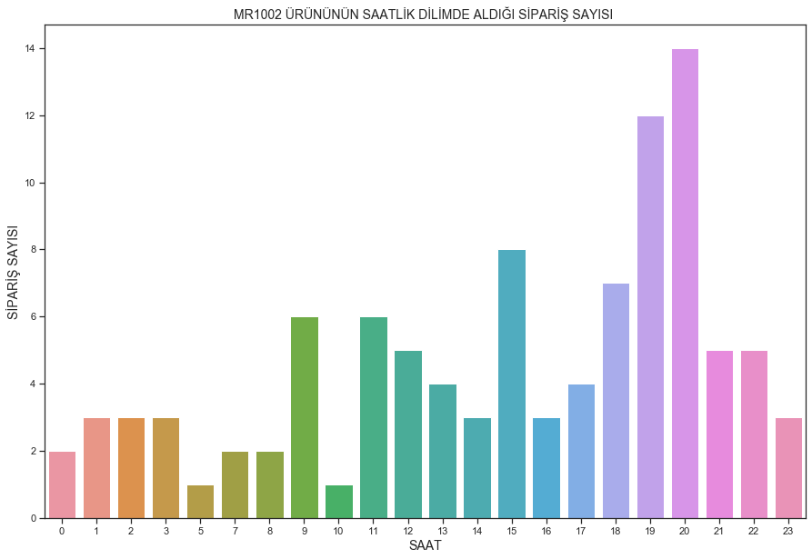


<a id='hyperlink17'></a>
**ÜRÜNLERİN SATILDIĞI GÜNLERİN DAĞILIMI**


```python
dspd1=ds[ds['productName']== 'MR1002  925 فضة استرليني عقيق أبيض حجر خاتم']
dspd1=dspd1[['dateHour','country','productDetailViews','productCheckouts','quantityCheckedOut']]
dspd1=dspd1.loc[dspd1.country=='Saudi Arabia']
```


```python
dspd1['dateHour'].head()

```


    38    2019-02-01 20:00:00
    57    2019-02-02 08:00:00
    85    2019-02-03 12:00:00
    86    2019-02-03 15:00:00
    117   2019-02-04 20:00:00
    Name: dateHour, dtype: datetime64[ns]


```python
dspd1['dateHour'] = pd.to_datetime(dspd1['dateHour'].astype('datetime64[D]'), format = '%Y%m%d')
```


```python
dspd1['dayname']=dspd1['dateHour'].dt.weekday_name
```


```python
new_merge=pd.merge(dc,dspd1,on='country',how='left')
nm2=new_merge.loc[new_merge['country']=='Saudi Arabia']
nm2.head()
```


<div>
<style scoped>
    .dataframe tbody tr th:only-of-type {
        vertical-align: middle;
    }

    .dataframe tbody tr th {
        vertical-align: top;
    }

    .dataframe thead th {
        text-align: right;
    }
</style>
<table border="1" class="dataframe">
  <thead>
    <tr style="text-align: right;">
      <th></th>
      <th>dateHour_x</th>
      <th>country</th>
      <th>productCategoryHierarchy</th>
      <th>productName</th>
      <th>itemRevenue</th>
      <th>productCheckouts_x</th>
      <th>quantityCheckedOut_x</th>
      <th>productDetailViews_x</th>
      <th>dateHour_y</th>
      <th>productDetailViews_y</th>
      <th>productCheckouts_y</th>
      <th>quantityCheckedOut_y</th>
      <th>dayname</th>
    </tr>
  </thead>
  <tbody>
    <tr>
      <th>4</th>
      <td>2019012814</td>
      <td>Saudi Arabia</td>
      <td>اكسسوارات/طقم سبحة خاتم</td>
      <td>RCHSET130 طقم سبحة العقيق</td>
      <td>79.721109</td>
      <td>1</td>
      <td>1</td>
      <td>2</td>
      <td>2019-02-01</td>
      <td>12.0</td>
      <td>4.0</td>
      <td>4.0</td>
      <td>Friday</td>
    </tr>
    <tr>
      <th>5</th>
      <td>2019012814</td>
      <td>Saudi Arabia</td>
      <td>اكسسوارات/طقم سبحة خاتم</td>
      <td>RCHSET130 طقم سبحة العقيق</td>
      <td>79.721109</td>
      <td>1</td>
      <td>1</td>
      <td>2</td>
      <td>2019-02-02</td>
      <td>4.0</td>
      <td>1.0</td>
      <td>1.0</td>
      <td>Saturday</td>
    </tr>
    <tr>
      <th>6</th>
      <td>2019012814</td>
      <td>Saudi Arabia</td>
      <td>اكسسوارات/طقم سبحة خاتم</td>
      <td>RCHSET130 طقم سبحة العقيق</td>
      <td>79.721109</td>
      <td>1</td>
      <td>1</td>
      <td>2</td>
      <td>2019-02-03</td>
      <td>6.0</td>
      <td>2.0</td>
      <td>2.0</td>
      <td>Sunday</td>
    </tr>
    <tr>
      <th>7</th>
      <td>2019012814</td>
      <td>Saudi Arabia</td>
      <td>اكسسوارات/طقم سبحة خاتم</td>
      <td>RCHSET130 طقم سبحة العقيق</td>
      <td>79.721109</td>
      <td>1</td>
      <td>1</td>
      <td>2</td>
      <td>2019-02-03</td>
      <td>2.0</td>
      <td>2.0</td>
      <td>2.0</td>
      <td>Sunday</td>
    </tr>
    <tr>
      <th>8</th>
      <td>2019012814</td>
      <td>Saudi Arabia</td>
      <td>اكسسوارات/طقم سبحة خاتم</td>
      <td>RCHSET130 طقم سبحة العقيق</td>
      <td>79.721109</td>
      <td>1</td>
      <td>1</td>
      <td>2</td>
      <td>2019-02-04</td>
      <td>6.0</td>
      <td>1.0</td>
      <td>1.0</td>
      <td>Monday</td>
    </tr>
  </tbody>
</table>
</div>


```python
nm2.columns=['country','productCategoryHierarchy','productName','itemRevenue','date','productDetailViews','productCheckouts','quantityCheckedOut','dayname']
```


```python
dspd1.head()
```


<div>
<style scoped>
    .dataframe tbody tr th:only-of-type {
        vertical-align: middle;
    }

    .dataframe tbody tr th {
        vertical-align: top;
    }

    .dataframe thead th {
        text-align: right;
    }
</style>
<table border="1" class="dataframe">
  <thead>
    <tr style="text-align: right;">
      <th></th>
      <th>dateHour</th>
      <th>country</th>
      <th>productDetailViews</th>
      <th>productCheckouts</th>
      <th>quantityCheckedOut</th>
      <th>dayname</th>
    </tr>
  </thead>
  <tbody>
    <tr>
      <th>38</th>
      <td>2019-02-01</td>
      <td>Saudi Arabia</td>
      <td>12</td>
      <td>4</td>
      <td>4</td>
      <td>Friday</td>
    </tr>
    <tr>
      <th>57</th>
      <td>2019-02-02</td>
      <td>Saudi Arabia</td>
      <td>4</td>
      <td>1</td>
      <td>1</td>
      <td>Saturday</td>
    </tr>
    <tr>
      <th>85</th>
      <td>2019-02-03</td>
      <td>Saudi Arabia</td>
      <td>6</td>
      <td>2</td>
      <td>2</td>
      <td>Sunday</td>
    </tr>
    <tr>
      <th>86</th>
      <td>2019-02-03</td>
      <td>Saudi Arabia</td>
      <td>2</td>
      <td>2</td>
      <td>2</td>
      <td>Sunday</td>
    </tr>
    <tr>
      <th>117</th>
      <td>2019-02-04</td>
      <td>Saudi Arabia</td>
      <td>6</td>
      <td>1</td>
      <td>1</td>
      <td>Monday</td>
    </tr>
  </tbody>
</table>
</div>


```python
dsp1vd=dspd1.groupby('dayname')['productCheckouts'].sum()
```


```python
dsp1vd=dsp1vd.sort_values(ascending=False)
```


```python
plt.figure(figsize=(15,10))
sns.barplot(x=dsp1vd.index, y=dsp1vd.values)
plt.xticks(rotation= 0)
plt.xlabel('GÜN',fontsize=14)
plt.ylabel('SİPARİŞ SAYISI',fontsize=14)
plt.title('MR1002 ÜRÜNÜNÜN GÜN BAZINDA ALDIĞI SİPARİŞ SAYISI ',fontsize=14)
```


    Text(0.5, 1.0, 'MR1002 ÜRÜNÜNÜN GÜN BAZINDA ALDIĞI SİPARİŞ SAYISI ')


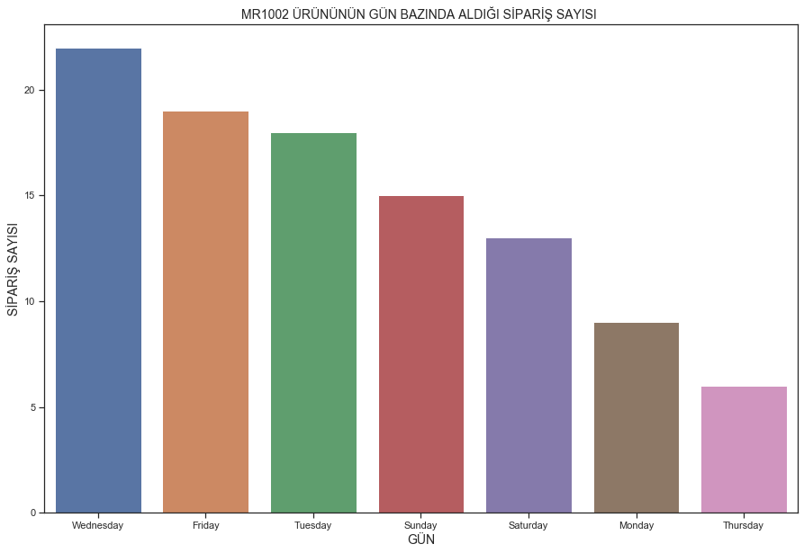


<a id='hyperlink18'></a>
**EN ÇOK SİPARİŞ VERİLEN KATEGORİ İÇİN GÜNLÜK BAZDAKİ SİPARİŞ MİKTARI**


```python
dc=ds.copy()
dc
```


<div>
<style scoped>
    .dataframe tbody tr th:only-of-type {
        vertical-align: middle;
    }

    .dataframe tbody tr th {
        vertical-align: top;
    }

    .dataframe thead th {
        text-align: right;
    }
</style>
<table border="1" class="dataframe">
  <thead>
    <tr style="text-align: right;">
      <th></th>
      <th>dateHour</th>
      <th>country</th>
      <th>productCategoryHierarchy</th>
      <th>productName</th>
      <th>itemRevenue</th>
      <th>productCheckouts</th>
      <th>quantityCheckedOut</th>
      <th>productDetailViews</th>
    </tr>
  </thead>
  <tbody>
    <tr>
      <th>0</th>
      <td>2019012801</td>
      <td>Iraq</td>
      <td>اكسسوارات/طقم سبحة خاتم</td>
      <td>RCHSET114 هندي عقيق سبحة &amp; عقيق خاتم طقم</td>
      <td>81.000000</td>
      <td>1</td>
      <td>1</td>
      <td>3</td>
    </tr>
    <tr>
      <th>1</th>
      <td>2019012802</td>
      <td>Turkey</td>
      <td>اكسسوارات/خواتم</td>
      <td>RCH2073 925 فضة استرليني عقيق حجر خاتم</td>
      <td>58.391046</td>
      <td>2</td>
      <td>2</td>
      <td>0</td>
    </tr>
    <tr>
      <th>2</th>
      <td>2019012802</td>
      <td>Turkey</td>
      <td>اكسسوارات/نظارات شمسية</td>
      <td>BLT1836C بيليتي نظارات شمسية للجنسين</td>
      <td>79.721109</td>
      <td>2</td>
      <td>2</td>
      <td>0</td>
    </tr>
    <tr>
      <th>3</th>
      <td>2019012813</td>
      <td>Jordan</td>
      <td>اكسسوارات/خواتم</td>
      <td>OZR1016 925 فضة استرليني عين النمر حجر خاتم</td>
      <td>58.391046</td>
      <td>1</td>
      <td>1</td>
      <td>3</td>
    </tr>
    <tr>
      <th>4</th>
      <td>2019012814</td>
      <td>Saudi Arabia</td>
      <td>اكسسوارات/طقم سبحة خاتم</td>
      <td>RCHSET130 طقم سبحة العقيق</td>
      <td>79.721109</td>
      <td>1</td>
      <td>1</td>
      <td>2</td>
    </tr>
    <tr>
      <th>5</th>
      <td>2019012818</td>
      <td>Saudi Arabia</td>
      <td>اكسسوارات/طقم سبحة خاتم</td>
      <td>RCHSET108  أكريليك سبحة &amp; خاتم عقيق</td>
      <td>79.721109</td>
      <td>1</td>
      <td>1</td>
      <td>2</td>
    </tr>
    <tr>
      <th>6</th>
      <td>2019012822</td>
      <td>Netherlands</td>
      <td>اكسسوارات/خواتم</td>
      <td>OZR1012 925 فضة استرليني زيركون حجر خاتم</td>
      <td>58.391046</td>
      <td>2</td>
      <td>2</td>
      <td>2</td>
    </tr>
    <tr>
      <th>7</th>
      <td>2019012822</td>
      <td>Netherlands</td>
      <td>اكسسوارات/خواتم</td>
      <td>RCH2219 925 خاتم فضة استرليني بحجر الزيركون</td>
      <td>116.782092</td>
      <td>2</td>
      <td>4</td>
      <td>4</td>
    </tr>
    <tr>
      <th>8</th>
      <td>2019012822</td>
      <td>Netherlands</td>
      <td>اكسسوارات/خواتم</td>
      <td>RCH2235خاتم فضة استرليني 925 بحجر الكهربار</td>
      <td>58.391046</td>
      <td>1</td>
      <td>1</td>
      <td>2</td>
    </tr>
    <tr>
      <th>9</th>
      <td>2019012822</td>
      <td>Netherlands</td>
      <td>اكسسوارات/خواتم</td>
      <td>UKR1021 925 فضة استرليني عقيق حجر خاتم</td>
      <td>61.057304</td>
      <td>1</td>
      <td>1</td>
      <td>2</td>
    </tr>
    <tr>
      <th>10</th>
      <td>2019012902</td>
      <td>Turkey</td>
      <td>ألبسة نسائية/بلوزة</td>
      <td>101A02008 بني بلوزة</td>
      <td>45.059757</td>
      <td>1</td>
      <td>1</td>
      <td>2</td>
    </tr>
    <tr>
      <th>11</th>
      <td>2019012909</td>
      <td>Saudi Arabia</td>
      <td>اكسسوارات/خواتم</td>
      <td>RCH2073 925 فضة استرليني عقيق حجر خاتم</td>
      <td>58.391708</td>
      <td>1</td>
      <td>1</td>
      <td>2</td>
    </tr>
    <tr>
      <th>12</th>
      <td>2019012909</td>
      <td>Saudi Arabia</td>
      <td>اكسسوارات/خواتم</td>
      <td>RCH2074 925 فضة استرليني عقيق حجر خاتم</td>
      <td>58.391708</td>
      <td>1</td>
      <td>1</td>
      <td>4</td>
    </tr>
    <tr>
      <th>13</th>
      <td>2019012919</td>
      <td>Saudi Arabia</td>
      <td>اكسسوارات/خواتم</td>
      <td>RCH2073 925 فضة استرليني عقيق حجر خاتم</td>
      <td>467.133664</td>
      <td>1</td>
      <td>8</td>
      <td>0</td>
    </tr>
    <tr>
      <th>14</th>
      <td>2019012919</td>
      <td>Saudi Arabia</td>
      <td>اكسسوارات/خواتم</td>
      <td>RCH2074 925 فضة استرليني عقيق حجر خاتم</td>
      <td>58.391700</td>
      <td>1</td>
      <td>10</td>
      <td>2</td>
    </tr>
    <tr>
      <th>15</th>
      <td>2019012919</td>
      <td>Saudi Arabia</td>
      <td>اكسسوارات/خواتم</td>
      <td>RCH2224 خاتم فضة استرليني 925 بحجر الفيروز</td>
      <td>583.917080</td>
      <td>1</td>
      <td>10</td>
      <td>2</td>
    </tr>
    <tr>
      <th>16</th>
      <td>2019012922</td>
      <td>Saudi Arabia</td>
      <td>اكسسوارات/طقم سبحة خاتم</td>
      <td>RCHSET158 طقم سبحة وخاتم فضة استرليني عيار 925</td>
      <td>239.166036</td>
      <td>1</td>
      <td>3</td>
      <td>4</td>
    </tr>
    <tr>
      <th>17</th>
      <td>2019012923</td>
      <td>Saudi Arabia</td>
      <td>اكسسوارات/طقم سبحة خاتم</td>
      <td>RCHSET158 طقم سبحة وخاتم فضة استرليني عيار 925</td>
      <td>239.166036</td>
      <td>1</td>
      <td>3</td>
      <td>2</td>
    </tr>
    <tr>
      <th>18</th>
      <td>2019013011</td>
      <td>Saudi Arabia</td>
      <td>اكسسوارات/خواتم</td>
      <td>OZR1005 925 فضة استرليني  حجر خاتم</td>
      <td>58.391552</td>
      <td>2</td>
      <td>2</td>
      <td>3</td>
    </tr>
    <tr>
      <th>19</th>
      <td>2019013012</td>
      <td>Saudi Arabia</td>
      <td>اكسسوارات/خواتم</td>
      <td>İR1001  925 فضة استرليني عقيق حجر خاتم</td>
      <td>58.391552</td>
      <td>1</td>
      <td>1</td>
      <td>2</td>
    </tr>
    <tr>
      <th>20</th>
      <td>2019013015</td>
      <td>Saudi Arabia</td>
      <td>اكسسوارات/خواتم</td>
      <td>İR1010  925 فضة استرليني عقيق حجر خاتم</td>
      <td>58.391552</td>
      <td>1</td>
      <td>1</td>
      <td>2</td>
    </tr>
    <tr>
      <th>21</th>
      <td>2019013023</td>
      <td>Turkey</td>
      <td>اكسسوارات/خواتم</td>
      <td>RCH2223 خاتم فضة استرليني 925 بحجر العقيق</td>
      <td>58.391552</td>
      <td>1</td>
      <td>1</td>
      <td>0</td>
    </tr>
    <tr>
      <th>22</th>
      <td>2019013023</td>
      <td>Turkey</td>
      <td>اكسسوارات/طقم سبحة خاتم</td>
      <td>RCHSET104 اونيكس سبحة &amp; عقيق خاتم طقم</td>
      <td>79.721800</td>
      <td>1</td>
      <td>1</td>
      <td>2</td>
    </tr>
    <tr>
      <th>23</th>
      <td>2019013115</td>
      <td>Turkey</td>
      <td>اكسسوارات/خواتم</td>
      <td>RCH2033 خاتم فضة استرليني 925 بحجر العقيق</td>
      <td>58.391085</td>
      <td>1</td>
      <td>1</td>
      <td>2</td>
    </tr>
    <tr>
      <th>24</th>
      <td>2019013115</td>
      <td>Turkey</td>
      <td>اكسسوارات/خواتم</td>
      <td>RCH2223 خاتم فضة استرليني 925 بحجر العقيق</td>
      <td>58.391085</td>
      <td>1</td>
      <td>1</td>
      <td>0</td>
    </tr>
    <tr>
      <th>25</th>
      <td>2019020112</td>
      <td>Saudi Arabia</td>
      <td>اكسسوارات/خواتم</td>
      <td>OZR1001 925 فضة استرليني عاج حجر خاتم</td>
      <td>58.391630</td>
      <td>1</td>
      <td>1</td>
      <td>2</td>
    </tr>
    <tr>
      <th>26</th>
      <td>2019020112</td>
      <td>Saudi Arabia</td>
      <td>اكسسوارات/خواتم</td>
      <td>خاتم فضة استرليني 925 بحجر العقيق RCH2001</td>
      <td>58.391630</td>
      <td>1</td>
      <td>1</td>
      <td>2</td>
    </tr>
    <tr>
      <th>27</th>
      <td>2019020114</td>
      <td>Saudi Arabia</td>
      <td>اكسسوارات/خواتم</td>
      <td>OZR1004 925 فضة استرليني كهرمان حجر خاتم</td>
      <td>58.391630</td>
      <td>1</td>
      <td>1</td>
      <td>4</td>
    </tr>
    <tr>
      <th>28</th>
      <td>2019020115</td>
      <td>Saudi Arabia</td>
      <td>اكسسوارات/خواتم</td>
      <td>RCH2146خاتم فضة استرليني عيار 925 بحجر العقيق</td>
      <td>58.391630</td>
      <td>1</td>
      <td>1</td>
      <td>2</td>
    </tr>
    <tr>
      <th>29</th>
      <td>2019020117</td>
      <td>Saudi Arabia</td>
      <td>اكسسوارات/خواتم</td>
      <td>RCH2213 925 خاتم فضة استرليني بحجر الزيركون</td>
      <td>58.391630</td>
      <td>1</td>
      <td>1</td>
      <td>2</td>
    </tr>
    <tr>
      <th>...</th>
      <td>...</td>
      <td>...</td>
      <td>...</td>
      <td>...</td>
      <td>...</td>
      <td>...</td>
      <td>...</td>
      <td>...</td>
    </tr>
    <tr>
      <th>1153</th>
      <td>2019030618</td>
      <td>Saudi Arabia</td>
      <td>اكسسوارات/مسابح</td>
      <td>TRCH1067 سبحة من الفضة بحجر الكهرمان</td>
      <td>63.726748</td>
      <td>2</td>
      <td>2</td>
      <td>4</td>
    </tr>
    <tr>
      <th>1154</th>
      <td>2019030621</td>
      <td>Saudi Arabia</td>
      <td>اكسسوارات/خواتم</td>
      <td>خاتم فضة استرليني 925 بحجر الزيركون MR1032</td>
      <td>58.393965</td>
      <td>2</td>
      <td>2</td>
      <td>18</td>
    </tr>
    <tr>
      <th>1155</th>
      <td>2019030621</td>
      <td>Saudi Arabia</td>
      <td>اكسسوارات/طقم سبحة خاتم</td>
      <td>RCHSET188 طقم سبحة وخاتم فضة استرليني عيار 925</td>
      <td>79.725095</td>
      <td>2</td>
      <td>2</td>
      <td>13</td>
    </tr>
    <tr>
      <th>1156</th>
      <td>2019030623</td>
      <td>Saudi Arabia</td>
      <td>اكسسوارات/خواتم</td>
      <td>RCH2159 خاتم فضة استرليني عيار 925</td>
      <td>61.060357</td>
      <td>2</td>
      <td>2</td>
      <td>12</td>
    </tr>
    <tr>
      <th>1157</th>
      <td>2019030700</td>
      <td>Saudi Arabia</td>
      <td>اكسسوارات/طقم سبحة خاتم</td>
      <td>RCHSET102 زجاج كوارتز سبحة &amp; عقيق خاتم طقم</td>
      <td>79.725095</td>
      <td>1</td>
      <td>1</td>
      <td>2</td>
    </tr>
    <tr>
      <th>1158</th>
      <td>2019030701</td>
      <td>Saudi Arabia</td>
      <td>اكسسوارات/خواتم</td>
      <td>RCH2159 خاتم فضة استرليني عيار 925</td>
      <td>61.060357</td>
      <td>2</td>
      <td>2</td>
      <td>7</td>
    </tr>
    <tr>
      <th>1159</th>
      <td>2019030701</td>
      <td>Saudi Arabia</td>
      <td>اكسسوارات/خواتم</td>
      <td>RCH2224 خاتم فضة استرليني 925 بحجر الفيروز</td>
      <td>58.393965</td>
      <td>1</td>
      <td>1</td>
      <td>3</td>
    </tr>
    <tr>
      <th>1160</th>
      <td>2019030701</td>
      <td>Saudi Arabia</td>
      <td>اكسسوارات/طقم سبحة خاتم</td>
      <td>RCHSET104 اونيكس سبحة &amp; عقيق خاتم طقم</td>
      <td>79.725095</td>
      <td>1</td>
      <td>1</td>
      <td>5</td>
    </tr>
    <tr>
      <th>1161</th>
      <td>2019030701</td>
      <td>Saudi Arabia</td>
      <td>اكسسوارات/طقم سبحة خاتم</td>
      <td>طقم سبحة وخاتم فضة استرليني عيار 925 RCHSET153</td>
      <td>79.725095</td>
      <td>2</td>
      <td>2</td>
      <td>4</td>
    </tr>
    <tr>
      <th>1162</th>
      <td>2019030701</td>
      <td>Saudi Arabia</td>
      <td>اكسسوارات/قلادة</td>
      <td>ALK1019 925 فضة استرليني قلادة</td>
      <td>21.064490</td>
      <td>1</td>
      <td>1</td>
      <td>2</td>
    </tr>
    <tr>
      <th>1163</th>
      <td>2019030702</td>
      <td>Saudi Arabia</td>
      <td>اكسسوارات/خواتم</td>
      <td>خاتم فضة استرليني 925 بحجر العقيق RCH2001</td>
      <td>116.787930</td>
      <td>2</td>
      <td>3</td>
      <td>9</td>
    </tr>
    <tr>
      <th>1164</th>
      <td>2019030703</td>
      <td>Saudi Arabia</td>
      <td>اكسسوارات/خواتم</td>
      <td>MR1002  925 فضة استرليني عقيق أبيض حجر خاتم</td>
      <td>122.122992</td>
      <td>1</td>
      <td>2</td>
      <td>4</td>
    </tr>
    <tr>
      <th>1165</th>
      <td>2019030703</td>
      <td>Saudi Arabia</td>
      <td>اكسسوارات/خواتم</td>
      <td>OZR1022 925 فضة استرليني  حجر خاتم</td>
      <td>58.395055</td>
      <td>2</td>
      <td>2</td>
      <td>3</td>
    </tr>
    <tr>
      <th>1166</th>
      <td>2019030703</td>
      <td>Saudi Arabia</td>
      <td>اكسسوارات/طقم سبحة خاتم</td>
      <td>RCHSET130 طقم سبحة العقيق</td>
      <td>79.726583</td>
      <td>2</td>
      <td>2</td>
      <td>2</td>
    </tr>
    <tr>
      <th>1167</th>
      <td>2019030704</td>
      <td>Saudi Arabia</td>
      <td>اكسسوارات/خواتم</td>
      <td>RCH2027 خاتم عقيق رجالي فضة عيار 925 ماركة ريجهون</td>
      <td>61.061496</td>
      <td>1</td>
      <td>1</td>
      <td>4</td>
    </tr>
    <tr>
      <th>1168</th>
      <td>2019030706</td>
      <td>Saudi Arabia</td>
      <td>اكسسوارات/خواتم</td>
      <td>RCH2027 خاتم عقيق رجالي فضة عيار 925 ماركة ريجهون</td>
      <td>122.122992</td>
      <td>4</td>
      <td>4</td>
      <td>12</td>
    </tr>
    <tr>
      <th>1169</th>
      <td>2019030708</td>
      <td>Saudi Arabia</td>
      <td>اكسسوارات/خواتم</td>
      <td>RCH2159 خاتم فضة استرليني عيار 925</td>
      <td>122.122992</td>
      <td>1</td>
      <td>1</td>
      <td>2</td>
    </tr>
    <tr>
      <th>1170</th>
      <td>2019030710</td>
      <td>Saudi Arabia</td>
      <td>اكسسوارات/خواتم</td>
      <td>MR1005  925 فضة استرليني عقيق أبيض حجر خاتم</td>
      <td>58.395055</td>
      <td>2</td>
      <td>2</td>
      <td>3</td>
    </tr>
    <tr>
      <th>1171</th>
      <td>2019030711</td>
      <td>Jordan</td>
      <td>اكسسوارات/طقم سبحة خاتم</td>
      <td>RCHSET110  سبحة &amp; خاتم عقيق</td>
      <td>79.726583</td>
      <td>1</td>
      <td>1</td>
      <td>2</td>
    </tr>
    <tr>
      <th>1172</th>
      <td>2019030711</td>
      <td>Saudi Arabia</td>
      <td>اكسسوارات/خواتم</td>
      <td>RCH2074 925 فضة استرليني عقيق حجر خاتم</td>
      <td>61.061496</td>
      <td>2</td>
      <td>2</td>
      <td>4</td>
    </tr>
    <tr>
      <th>1173</th>
      <td>2019030711</td>
      <td>Saudi Arabia</td>
      <td>اكسسوارات/خواتم</td>
      <td>RCH2224 خاتم فضة استرليني 925 بحجر الفيروز</td>
      <td>58.395055</td>
      <td>1</td>
      <td>1</td>
      <td>5</td>
    </tr>
    <tr>
      <th>1174</th>
      <td>2019030712</td>
      <td>Saudi Arabia</td>
      <td>اكسسوارات/خواتم</td>
      <td>RCH2188 925 خاتم فضة استرليني بحجر العقيق</td>
      <td>58.395055</td>
      <td>2</td>
      <td>2</td>
      <td>6</td>
    </tr>
    <tr>
      <th>1175</th>
      <td>2019030712</td>
      <td>Saudi Arabia</td>
      <td>اكسسوارات/طقم سبحة خاتم</td>
      <td>RCHSET104 اونيكس سبحة &amp; عقيق خاتم طقم</td>
      <td>79.726583</td>
      <td>1</td>
      <td>1</td>
      <td>5</td>
    </tr>
    <tr>
      <th>1176</th>
      <td>2019030713</td>
      <td>Saudi Arabia</td>
      <td>اكسسوارات/خواتم</td>
      <td>RCH2224 خاتم فضة استرليني 925 بحجر الفيروز</td>
      <td>58.395054</td>
      <td>2</td>
      <td>4</td>
      <td>3</td>
    </tr>
    <tr>
      <th>1177</th>
      <td>2019030713</td>
      <td>Saudi Arabia</td>
      <td>اكسسوارات/خواتم</td>
      <td>UKR1018 925 فضة استرليني عقيق حجر خاتم</td>
      <td>61.061496</td>
      <td>2</td>
      <td>2</td>
      <td>4</td>
    </tr>
    <tr>
      <th>1178</th>
      <td>2019030714</td>
      <td>Saudi Arabia</td>
      <td>اكسسوارات/طقم سبحة خاتم</td>
      <td>RCHSET104 اونيكس سبحة &amp; عقيق خاتم طقم</td>
      <td>79.726583</td>
      <td>1</td>
      <td>1</td>
      <td>4</td>
    </tr>
    <tr>
      <th>1179</th>
      <td>2019030716</td>
      <td>Saudi Arabia</td>
      <td>اكسسوارات/طقم سبحة خاتم</td>
      <td>RCHSET104 اونيكس سبحة &amp; عقيق خاتم طقم</td>
      <td>79.726583</td>
      <td>1</td>
      <td>1</td>
      <td>4</td>
    </tr>
    <tr>
      <th>1180</th>
      <td>2019030716</td>
      <td>Saudi Arabia</td>
      <td>اكسسوارات/طقم سبحة خاتم</td>
      <td>RCHSET156 طقم سبحة وخاتم فضة استرليني عيار 925</td>
      <td>79.726583</td>
      <td>1</td>
      <td>1</td>
      <td>3</td>
    </tr>
    <tr>
      <th>1181</th>
      <td>2019031001</td>
      <td>Saudi Arabia</td>
      <td>اكسسوارات/طقم سبحة خاتم</td>
      <td>RCHSET104 اونيكس سبحة &amp; عقيق خاتم طقم</td>
      <td>79.728655</td>
      <td>1</td>
      <td>1</td>
      <td>4</td>
    </tr>
    <tr>
      <th>1182</th>
      <td>2019032213</td>
      <td>Jordan</td>
      <td>اكسسوارات/حلق الاذن</td>
      <td>ALK3042 925 فضة استرليني اسوارة</td>
      <td>34.397752</td>
      <td>1</td>
      <td>1</td>
      <td>2</td>
    </tr>
  </tbody>
</table>
<p>1183 rows × 8 columns</p>
</div>


```python
dc1=dc.groupby('productCategoryHierarchy')['productCheckouts'].sum().sort_values(ascending=False)
```


```python
dc1
```


    productCategoryHierarchy
    اكسسوارات/خواتم                  1238
    اكسسوارات/طقم سبحة خاتم           318
    اكسسوارات/مسابح                    62
    Accesories/Ring                    55
    اكسسوارات/ساعات                    42
    اسوارة/اكسسوارات                   26
    Accesories/Ring Rosary Set         15
    اكسسوارات/نظارات شمسية             13
    Accesories/Watch                   10
    اكسسوارات/ساعات/Uncategorized       3
    اكسسوارات/قلادة                     2
    اكسسوارات/حلق الاذن                 2
    ألبسة نسائية/فستان                  2
    ألبسة نسائية/بلوزة                  1
    Apparel/Pullover                    1
    Name: productCheckouts, dtype: int64


**Oluşturduğumuz tabloya ürün ismi ve kategori ismi sütunları ekleme**


```python
datas = pd.concat([dc['productCategoryHierarchy'],dspd1],axis=1)
datas.head()
```


<div>
<style scoped>
    .dataframe tbody tr th:only-of-type {
        vertical-align: middle;
    }

    .dataframe tbody tr th {
        vertical-align: top;
    }

    .dataframe thead th {
        text-align: right;
    }
</style>
<table border="1" class="dataframe">
  <thead>
    <tr style="text-align: right;">
      <th></th>
      <th>productCategoryHierarchy</th>
      <th>dateHour</th>
      <th>country</th>
      <th>productDetailViews</th>
      <th>productCheckouts</th>
      <th>quantityCheckedOut</th>
      <th>dayname</th>
    </tr>
  </thead>
  <tbody>
    <tr>
      <th>0</th>
      <td>اكسسوارات/طقم سبحة خاتم</td>
      <td>NaT</td>
      <td>NaN</td>
      <td>NaN</td>
      <td>NaN</td>
      <td>NaN</td>
      <td>NaN</td>
    </tr>
    <tr>
      <th>1</th>
      <td>اكسسوارات/خواتم</td>
      <td>NaT</td>
      <td>NaN</td>
      <td>NaN</td>
      <td>NaN</td>
      <td>NaN</td>
      <td>NaN</td>
    </tr>
    <tr>
      <th>2</th>
      <td>اكسسوارات/نظارات شمسية</td>
      <td>NaT</td>
      <td>NaN</td>
      <td>NaN</td>
      <td>NaN</td>
      <td>NaN</td>
      <td>NaN</td>
    </tr>
    <tr>
      <th>3</th>
      <td>اكسسوارات/خواتم</td>
      <td>NaT</td>
      <td>NaN</td>
      <td>NaN</td>
      <td>NaN</td>
      <td>NaN</td>
      <td>NaN</td>
    </tr>
    <tr>
      <th>4</th>
      <td>اكسسوارات/طقم سبحة خاتم</td>
      <td>NaT</td>
      <td>NaN</td>
      <td>NaN</td>
      <td>NaN</td>
      <td>NaN</td>
      <td>NaN</td>
    </tr>
  </tbody>
</table>
</div>


```python
new_merge=pd.merge(dc,dspd1,on='country',how='left')
nm2=new_merge.loc[new_merge['country']=='Saudi Arabia']
nm2.head()
```


<div>
<style scoped>
    .dataframe tbody tr th:only-of-type {
        vertical-align: middle;
    }

    .dataframe tbody tr th {
        vertical-align: top;
    }

    .dataframe thead th {
        text-align: right;
    }
</style>
<table border="1" class="dataframe">
  <thead>
    <tr style="text-align: right;">
      <th></th>
      <th>dateHour_x</th>
      <th>country</th>
      <th>productCategoryHierarchy</th>
      <th>productName</th>
      <th>itemRevenue</th>
      <th>productCheckouts_x</th>
      <th>quantityCheckedOut_x</th>
      <th>productDetailViews_x</th>
      <th>dateHour_y</th>
      <th>productDetailViews_y</th>
      <th>productCheckouts_y</th>
      <th>quantityCheckedOut_y</th>
      <th>dayname</th>
    </tr>
  </thead>
  <tbody>
    <tr>
      <th>4</th>
      <td>2019012814</td>
      <td>Saudi Arabia</td>
      <td>اكسسوارات/طقم سبحة خاتم</td>
      <td>RCHSET130 طقم سبحة العقيق</td>
      <td>79.721109</td>
      <td>1</td>
      <td>1</td>
      <td>2</td>
      <td>2019-02-01</td>
      <td>12.0</td>
      <td>4.0</td>
      <td>4.0</td>
      <td>Friday</td>
    </tr>
    <tr>
      <th>5</th>
      <td>2019012814</td>
      <td>Saudi Arabia</td>
      <td>اكسسوارات/طقم سبحة خاتم</td>
      <td>RCHSET130 طقم سبحة العقيق</td>
      <td>79.721109</td>
      <td>1</td>
      <td>1</td>
      <td>2</td>
      <td>2019-02-02</td>
      <td>4.0</td>
      <td>1.0</td>
      <td>1.0</td>
      <td>Saturday</td>
    </tr>
    <tr>
      <th>6</th>
      <td>2019012814</td>
      <td>Saudi Arabia</td>
      <td>اكسسوارات/طقم سبحة خاتم</td>
      <td>RCHSET130 طقم سبحة العقيق</td>
      <td>79.721109</td>
      <td>1</td>
      <td>1</td>
      <td>2</td>
      <td>2019-02-03</td>
      <td>6.0</td>
      <td>2.0</td>
      <td>2.0</td>
      <td>Sunday</td>
    </tr>
    <tr>
      <th>7</th>
      <td>2019012814</td>
      <td>Saudi Arabia</td>
      <td>اكسسوارات/طقم سبحة خاتم</td>
      <td>RCHSET130 طقم سبحة العقيق</td>
      <td>79.721109</td>
      <td>1</td>
      <td>1</td>
      <td>2</td>
      <td>2019-02-03</td>
      <td>2.0</td>
      <td>2.0</td>
      <td>2.0</td>
      <td>Sunday</td>
    </tr>
    <tr>
      <th>8</th>
      <td>2019012814</td>
      <td>Saudi Arabia</td>
      <td>اكسسوارات/طقم سبحة خاتم</td>
      <td>RCHSET130 طقم سبحة العقيق</td>
      <td>79.721109</td>
      <td>1</td>
      <td>1</td>
      <td>2</td>
      <td>2019-02-04</td>
      <td>6.0</td>
      <td>1.0</td>
      <td>1.0</td>
      <td>Monday</td>
    </tr>
  </tbody>
</table>
</div>


```python
nm2.columns=['country','productCategoryHierarchy','productName','itemRevenue','date','productDetailViews','productCheckouts','quantityCheckedOut','dayname']
nm2.head()
```


<div>
<style scoped>
    .dataframe tbody tr th:only-of-type {
        vertical-align: middle;
    }

    .dataframe tbody tr th {
        vertical-align: top;
    }

    .dataframe thead th {
        text-align: right;
    }
</style>
<table border="1" class="dataframe">
  <thead>
    <tr style="text-align: right;">
      <th></th>
      <th>country</th>
      <th>productCategoryHierarchy</th>
      <th>productName</th>
      <th>itemRevenue</th>
      <th>date</th>
      <th>productDetailViews</th>
      <th>productCheckouts</th>
      <th>quantityCheckedOut</th>
      <th>dayname</th>
    </tr>
  </thead>
  <tbody>
    <tr>
      <th>4</th>
      <td>Saudi Arabia</td>
      <td>اكسسوارات/طقم سبحة خاتم</td>
      <td>RCHSET130 طقم سبحة العقيق</td>
      <td>79.721109</td>
      <td>2019-02-01</td>
      <td>12.0</td>
      <td>4.0</td>
      <td>4.0</td>
      <td>Friday</td>
    </tr>
    <tr>
      <th>5</th>
      <td>Saudi Arabia</td>
      <td>اكسسوارات/طقم سبحة خاتم</td>
      <td>RCHSET130 طقم سبحة العقيق</td>
      <td>79.721109</td>
      <td>2019-02-02</td>
      <td>4.0</td>
      <td>1.0</td>
      <td>1.0</td>
      <td>Saturday</td>
    </tr>
    <tr>
      <th>6</th>
      <td>Saudi Arabia</td>
      <td>اكسسوارات/طقم سبحة خاتم</td>
      <td>RCHSET130 طقم سبحة العقيق</td>
      <td>79.721109</td>
      <td>2019-02-03</td>
      <td>6.0</td>
      <td>2.0</td>
      <td>2.0</td>
      <td>Sunday</td>
    </tr>
    <tr>
      <th>7</th>
      <td>Saudi Arabia</td>
      <td>اكسسوارات/طقم سبحة خاتم</td>
      <td>RCHSET130 طقم سبحة العقيق</td>
      <td>79.721109</td>
      <td>2019-02-03</td>
      <td>2.0</td>
      <td>2.0</td>
      <td>2.0</td>
      <td>Sunday</td>
    </tr>
    <tr>
      <th>8</th>
      <td>Saudi Arabia</td>
      <td>اكسسوارات/طقم سبحة خاتم</td>
      <td>RCHSET130 طقم سبحة العقيق</td>
      <td>79.721109</td>
      <td>2019-02-04</td>
      <td>6.0</td>
      <td>1.0</td>
      <td>1.0</td>
      <td>Monday</td>
    </tr>
  </tbody>
</table>
</div>


```python
dc2=nm2.loc[nm2['productCategoryHierarchy']=='اكسسوارات/خواتم']
```


```python
dc3=dc2.groupby('dayname')['productCheckouts'].sum().sort_values(ascending=False)
```


```python
dc2
```


<div>
<style scoped>
    .dataframe tbody tr th:only-of-type {
        vertical-align: middle;
    }

    .dataframe tbody tr th {
        vertical-align: top;
    }

    .dataframe thead th {
        text-align: right;
    }
</style>
<table border="1" class="dataframe">
  <thead>
    <tr style="text-align: right;">
      <th></th>
      <th>country</th>
      <th>productCategoryHierarchy</th>
      <th>productName</th>
      <th>itemRevenue</th>
      <th>date</th>
      <th>productDetailViews</th>
      <th>productCheckouts</th>
      <th>quantityCheckedOut</th>
      <th>dayname</th>
    </tr>
  </thead>
  <tbody>
    <tr>
      <th>131</th>
      <td>Saudi Arabia</td>
      <td>اكسسوارات/خواتم</td>
      <td>RCH2073 925 فضة استرليني عقيق حجر خاتم</td>
      <td>58.391708</td>
      <td>2019-02-01</td>
      <td>12.0</td>
      <td>4.0</td>
      <td>4.0</td>
      <td>Friday</td>
    </tr>
    <tr>
      <th>132</th>
      <td>Saudi Arabia</td>
      <td>اكسسوارات/خواتم</td>
      <td>RCH2073 925 فضة استرليني عقيق حجر خاتم</td>
      <td>58.391708</td>
      <td>2019-02-02</td>
      <td>4.0</td>
      <td>1.0</td>
      <td>1.0</td>
      <td>Saturday</td>
    </tr>
    <tr>
      <th>133</th>
      <td>Saudi Arabia</td>
      <td>اكسسوارات/خواتم</td>
      <td>RCH2073 925 فضة استرليني عقيق حجر خاتم</td>
      <td>58.391708</td>
      <td>2019-02-03</td>
      <td>6.0</td>
      <td>2.0</td>
      <td>2.0</td>
      <td>Sunday</td>
    </tr>
    <tr>
      <th>134</th>
      <td>Saudi Arabia</td>
      <td>اكسسوارات/خواتم</td>
      <td>RCH2073 925 فضة استرليني عقيق حجر خاتم</td>
      <td>58.391708</td>
      <td>2019-02-03</td>
      <td>2.0</td>
      <td>2.0</td>
      <td>2.0</td>
      <td>Sunday</td>
    </tr>
    <tr>
      <th>135</th>
      <td>Saudi Arabia</td>
      <td>اكسسوارات/خواتم</td>
      <td>RCH2073 925 فضة استرليني عقيق حجر خاتم</td>
      <td>58.391708</td>
      <td>2019-02-04</td>
      <td>6.0</td>
      <td>1.0</td>
      <td>1.0</td>
      <td>Monday</td>
    </tr>
    <tr>
      <th>136</th>
      <td>Saudi Arabia</td>
      <td>اكسسوارات/خواتم</td>
      <td>RCH2073 925 فضة استرليني عقيق حجر خاتم</td>
      <td>58.391708</td>
      <td>2019-02-05</td>
      <td>6.0</td>
      <td>1.0</td>
      <td>1.0</td>
      <td>Tuesday</td>
    </tr>
    <tr>
      <th>137</th>
      <td>Saudi Arabia</td>
      <td>اكسسوارات/خواتم</td>
      <td>RCH2073 925 فضة استرليني عقيق حجر خاتم</td>
      <td>58.391708</td>
      <td>2019-02-06</td>
      <td>7.0</td>
      <td>1.0</td>
      <td>1.0</td>
      <td>Wednesday</td>
    </tr>
    <tr>
      <th>138</th>
      <td>Saudi Arabia</td>
      <td>اكسسوارات/خواتم</td>
      <td>RCH2073 925 فضة استرليني عقيق حجر خاتم</td>
      <td>58.391708</td>
      <td>2019-02-06</td>
      <td>3.0</td>
      <td>1.0</td>
      <td>1.0</td>
      <td>Wednesday</td>
    </tr>
    <tr>
      <th>139</th>
      <td>Saudi Arabia</td>
      <td>اكسسوارات/خواتم</td>
      <td>RCH2073 925 فضة استرليني عقيق حجر خاتم</td>
      <td>58.391708</td>
      <td>2019-02-06</td>
      <td>21.0</td>
      <td>5.0</td>
      <td>5.0</td>
      <td>Wednesday</td>
    </tr>
    <tr>
      <th>140</th>
      <td>Saudi Arabia</td>
      <td>اكسسوارات/خواتم</td>
      <td>RCH2073 925 فضة استرليني عقيق حجر خاتم</td>
      <td>58.391708</td>
      <td>2019-02-06</td>
      <td>8.0</td>
      <td>3.0</td>
      <td>3.0</td>
      <td>Wednesday</td>
    </tr>
    <tr>
      <th>141</th>
      <td>Saudi Arabia</td>
      <td>اكسسوارات/خواتم</td>
      <td>RCH2073 925 فضة استرليني عقيق حجر خاتم</td>
      <td>58.391708</td>
      <td>2019-02-06</td>
      <td>9.0</td>
      <td>2.0</td>
      <td>2.0</td>
      <td>Wednesday</td>
    </tr>
    <tr>
      <th>142</th>
      <td>Saudi Arabia</td>
      <td>اكسسوارات/خواتم</td>
      <td>RCH2073 925 فضة استرليني عقيق حجر خاتم</td>
      <td>58.391708</td>
      <td>2019-02-08</td>
      <td>3.0</td>
      <td>1.0</td>
      <td>1.0</td>
      <td>Friday</td>
    </tr>
    <tr>
      <th>143</th>
      <td>Saudi Arabia</td>
      <td>اكسسوارات/خواتم</td>
      <td>RCH2073 925 فضة استرليني عقيق حجر خاتم</td>
      <td>58.391708</td>
      <td>2019-02-08</td>
      <td>9.0</td>
      <td>1.0</td>
      <td>1.0</td>
      <td>Friday</td>
    </tr>
    <tr>
      <th>144</th>
      <td>Saudi Arabia</td>
      <td>اكسسوارات/خواتم</td>
      <td>RCH2073 925 فضة استرليني عقيق حجر خاتم</td>
      <td>58.391708</td>
      <td>2019-02-08</td>
      <td>9.0</td>
      <td>2.0</td>
      <td>4.0</td>
      <td>Friday</td>
    </tr>
    <tr>
      <th>145</th>
      <td>Saudi Arabia</td>
      <td>اكسسوارات/خواتم</td>
      <td>RCH2073 925 فضة استرليني عقيق حجر خاتم</td>
      <td>58.391708</td>
      <td>2019-02-08</td>
      <td>12.0</td>
      <td>1.0</td>
      <td>1.0</td>
      <td>Friday</td>
    </tr>
    <tr>
      <th>146</th>
      <td>Saudi Arabia</td>
      <td>اكسسوارات/خواتم</td>
      <td>RCH2073 925 فضة استرليني عقيق حجر خاتم</td>
      <td>58.391708</td>
      <td>2019-02-09</td>
      <td>13.0</td>
      <td>1.0</td>
      <td>1.0</td>
      <td>Saturday</td>
    </tr>
    <tr>
      <th>147</th>
      <td>Saudi Arabia</td>
      <td>اكسسوارات/خواتم</td>
      <td>RCH2073 925 فضة استرليني عقيق حجر خاتم</td>
      <td>58.391708</td>
      <td>2019-02-09</td>
      <td>6.0</td>
      <td>1.0</td>
      <td>1.0</td>
      <td>Saturday</td>
    </tr>
    <tr>
      <th>148</th>
      <td>Saudi Arabia</td>
      <td>اكسسوارات/خواتم</td>
      <td>RCH2073 925 فضة استرليني عقيق حجر خاتم</td>
      <td>58.391708</td>
      <td>2019-02-09</td>
      <td>7.0</td>
      <td>1.0</td>
      <td>1.0</td>
      <td>Saturday</td>
    </tr>
    <tr>
      <th>149</th>
      <td>Saudi Arabia</td>
      <td>اكسسوارات/خواتم</td>
      <td>RCH2073 925 فضة استرليني عقيق حجر خاتم</td>
      <td>58.391708</td>
      <td>2019-02-09</td>
      <td>15.0</td>
      <td>4.0</td>
      <td>4.0</td>
      <td>Saturday</td>
    </tr>
    <tr>
      <th>150</th>
      <td>Saudi Arabia</td>
      <td>اكسسوارات/خواتم</td>
      <td>RCH2073 925 فضة استرليني عقيق حجر خاتم</td>
      <td>58.391708</td>
      <td>2019-02-10</td>
      <td>6.0</td>
      <td>1.0</td>
      <td>1.0</td>
      <td>Sunday</td>
    </tr>
    <tr>
      <th>151</th>
      <td>Saudi Arabia</td>
      <td>اكسسوارات/خواتم</td>
      <td>RCH2073 925 فضة استرليني عقيق حجر خاتم</td>
      <td>58.391708</td>
      <td>2019-02-10</td>
      <td>13.0</td>
      <td>1.0</td>
      <td>1.0</td>
      <td>Sunday</td>
    </tr>
    <tr>
      <th>152</th>
      <td>Saudi Arabia</td>
      <td>اكسسوارات/خواتم</td>
      <td>RCH2073 925 فضة استرليني عقيق حجر خاتم</td>
      <td>58.391708</td>
      <td>2019-02-10</td>
      <td>11.0</td>
      <td>1.0</td>
      <td>2.0</td>
      <td>Sunday</td>
    </tr>
    <tr>
      <th>153</th>
      <td>Saudi Arabia</td>
      <td>اكسسوارات/خواتم</td>
      <td>RCH2073 925 فضة استرليني عقيق حجر خاتم</td>
      <td>58.391708</td>
      <td>2019-02-11</td>
      <td>40.0</td>
      <td>2.0</td>
      <td>2.0</td>
      <td>Monday</td>
    </tr>
    <tr>
      <th>154</th>
      <td>Saudi Arabia</td>
      <td>اكسسوارات/خواتم</td>
      <td>RCH2073 925 فضة استرليني عقيق حجر خاتم</td>
      <td>58.391708</td>
      <td>2019-02-12</td>
      <td>4.0</td>
      <td>2.0</td>
      <td>2.0</td>
      <td>Tuesday</td>
    </tr>
    <tr>
      <th>155</th>
      <td>Saudi Arabia</td>
      <td>اكسسوارات/خواتم</td>
      <td>RCH2073 925 فضة استرليني عقيق حجر خاتم</td>
      <td>58.391708</td>
      <td>2019-02-12</td>
      <td>4.0</td>
      <td>2.0</td>
      <td>2.0</td>
      <td>Tuesday</td>
    </tr>
    <tr>
      <th>156</th>
      <td>Saudi Arabia</td>
      <td>اكسسوارات/خواتم</td>
      <td>RCH2073 925 فضة استرليني عقيق حجر خاتم</td>
      <td>58.391708</td>
      <td>2019-02-12</td>
      <td>13.0</td>
      <td>2.0</td>
      <td>2.0</td>
      <td>Tuesday</td>
    </tr>
    <tr>
      <th>157</th>
      <td>Saudi Arabia</td>
      <td>اكسسوارات/خواتم</td>
      <td>RCH2073 925 فضة استرليني عقيق حجر خاتم</td>
      <td>58.391708</td>
      <td>2019-02-13</td>
      <td>3.0</td>
      <td>1.0</td>
      <td>1.0</td>
      <td>Wednesday</td>
    </tr>
    <tr>
      <th>158</th>
      <td>Saudi Arabia</td>
      <td>اكسسوارات/خواتم</td>
      <td>RCH2073 925 فضة استرليني عقيق حجر خاتم</td>
      <td>58.391708</td>
      <td>2019-02-13</td>
      <td>3.0</td>
      <td>2.0</td>
      <td>2.0</td>
      <td>Wednesday</td>
    </tr>
    <tr>
      <th>159</th>
      <td>Saudi Arabia</td>
      <td>اكسسوارات/خواتم</td>
      <td>RCH2073 925 فضة استرليني عقيق حجر خاتم</td>
      <td>58.391708</td>
      <td>2019-02-13</td>
      <td>3.0</td>
      <td>2.0</td>
      <td>2.0</td>
      <td>Wednesday</td>
    </tr>
    <tr>
      <th>160</th>
      <td>Saudi Arabia</td>
      <td>اكسسوارات/خواتم</td>
      <td>RCH2073 925 فضة استرليني عقيق حجر خاتم</td>
      <td>58.391708</td>
      <td>2019-02-13</td>
      <td>6.0</td>
      <td>2.0</td>
      <td>2.0</td>
      <td>Wednesday</td>
    </tr>
    <tr>
      <th>...</th>
      <td>...</td>
      <td>...</td>
      <td>...</td>
      <td>...</td>
      <td>...</td>
      <td>...</td>
      <td>...</td>
      <td>...</td>
      <td>...</td>
    </tr>
    <tr>
      <th>54848</th>
      <td>Saudi Arabia</td>
      <td>اكسسوارات/خواتم</td>
      <td>UKR1018 925 فضة استرليني عقيق حجر خاتم</td>
      <td>61.061496</td>
      <td>2019-02-14</td>
      <td>6.0</td>
      <td>1.0</td>
      <td>2.0</td>
      <td>Thursday</td>
    </tr>
    <tr>
      <th>54849</th>
      <td>Saudi Arabia</td>
      <td>اكسسوارات/خواتم</td>
      <td>UKR1018 925 فضة استرليني عقيق حجر خاتم</td>
      <td>61.061496</td>
      <td>2019-02-16</td>
      <td>2.0</td>
      <td>1.0</td>
      <td>1.0</td>
      <td>Saturday</td>
    </tr>
    <tr>
      <th>54850</th>
      <td>Saudi Arabia</td>
      <td>اكسسوارات/خواتم</td>
      <td>UKR1018 925 فضة استرليني عقيق حجر خاتم</td>
      <td>61.061496</td>
      <td>2019-02-16</td>
      <td>10.0</td>
      <td>1.0</td>
      <td>1.0</td>
      <td>Saturday</td>
    </tr>
    <tr>
      <th>54851</th>
      <td>Saudi Arabia</td>
      <td>اكسسوارات/خواتم</td>
      <td>UKR1018 925 فضة استرليني عقيق حجر خاتم</td>
      <td>61.061496</td>
      <td>2019-02-16</td>
      <td>10.0</td>
      <td>2.0</td>
      <td>4.0</td>
      <td>Saturday</td>
    </tr>
    <tr>
      <th>54852</th>
      <td>Saudi Arabia</td>
      <td>اكسسوارات/خواتم</td>
      <td>UKR1018 925 فضة استرليني عقيق حجر خاتم</td>
      <td>61.061496</td>
      <td>2019-02-17</td>
      <td>5.0</td>
      <td>1.0</td>
      <td>2.0</td>
      <td>Sunday</td>
    </tr>
    <tr>
      <th>54853</th>
      <td>Saudi Arabia</td>
      <td>اكسسوارات/خواتم</td>
      <td>UKR1018 925 فضة استرليني عقيق حجر خاتم</td>
      <td>61.061496</td>
      <td>2019-02-17</td>
      <td>4.0</td>
      <td>3.0</td>
      <td>3.0</td>
      <td>Sunday</td>
    </tr>
    <tr>
      <th>54854</th>
      <td>Saudi Arabia</td>
      <td>اكسسوارات/خواتم</td>
      <td>UKR1018 925 فضة استرليني عقيق حجر خاتم</td>
      <td>61.061496</td>
      <td>2019-02-18</td>
      <td>4.0</td>
      <td>1.0</td>
      <td>1.0</td>
      <td>Monday</td>
    </tr>
    <tr>
      <th>54855</th>
      <td>Saudi Arabia</td>
      <td>اكسسوارات/خواتم</td>
      <td>UKR1018 925 فضة استرليني عقيق حجر خاتم</td>
      <td>61.061496</td>
      <td>2019-02-18</td>
      <td>7.0</td>
      <td>2.0</td>
      <td>2.0</td>
      <td>Monday</td>
    </tr>
    <tr>
      <th>54856</th>
      <td>Saudi Arabia</td>
      <td>اكسسوارات/خواتم</td>
      <td>UKR1018 925 فضة استرليني عقيق حجر خاتم</td>
      <td>61.061496</td>
      <td>2019-02-19</td>
      <td>8.0</td>
      <td>2.0</td>
      <td>2.0</td>
      <td>Tuesday</td>
    </tr>
    <tr>
      <th>54857</th>
      <td>Saudi Arabia</td>
      <td>اكسسوارات/خواتم</td>
      <td>UKR1018 925 فضة استرليني عقيق حجر خاتم</td>
      <td>61.061496</td>
      <td>2019-02-20</td>
      <td>2.0</td>
      <td>2.0</td>
      <td>2.0</td>
      <td>Wednesday</td>
    </tr>
    <tr>
      <th>54858</th>
      <td>Saudi Arabia</td>
      <td>اكسسوارات/خواتم</td>
      <td>UKR1018 925 فضة استرليني عقيق حجر خاتم</td>
      <td>61.061496</td>
      <td>2019-02-21</td>
      <td>3.0</td>
      <td>1.0</td>
      <td>1.0</td>
      <td>Thursday</td>
    </tr>
    <tr>
      <th>54859</th>
      <td>Saudi Arabia</td>
      <td>اكسسوارات/خواتم</td>
      <td>UKR1018 925 فضة استرليني عقيق حجر خاتم</td>
      <td>61.061496</td>
      <td>2019-02-21</td>
      <td>8.0</td>
      <td>2.0</td>
      <td>2.0</td>
      <td>Thursday</td>
    </tr>
    <tr>
      <th>54860</th>
      <td>Saudi Arabia</td>
      <td>اكسسوارات/خواتم</td>
      <td>UKR1018 925 فضة استرليني عقيق حجر خاتم</td>
      <td>61.061496</td>
      <td>2019-02-22</td>
      <td>2.0</td>
      <td>1.0</td>
      <td>1.0</td>
      <td>Friday</td>
    </tr>
    <tr>
      <th>54861</th>
      <td>Saudi Arabia</td>
      <td>اكسسوارات/خواتم</td>
      <td>UKR1018 925 فضة استرليني عقيق حجر خاتم</td>
      <td>61.061496</td>
      <td>2019-02-22</td>
      <td>8.0</td>
      <td>1.0</td>
      <td>1.0</td>
      <td>Friday</td>
    </tr>
    <tr>
      <th>54862</th>
      <td>Saudi Arabia</td>
      <td>اكسسوارات/خواتم</td>
      <td>UKR1018 925 فضة استرليني عقيق حجر خاتم</td>
      <td>61.061496</td>
      <td>2019-02-26</td>
      <td>13.0</td>
      <td>3.0</td>
      <td>3.0</td>
      <td>Tuesday</td>
    </tr>
    <tr>
      <th>54863</th>
      <td>Saudi Arabia</td>
      <td>اكسسوارات/خواتم</td>
      <td>UKR1018 925 فضة استرليني عقيق حجر خاتم</td>
      <td>61.061496</td>
      <td>2019-02-26</td>
      <td>10.0</td>
      <td>2.0</td>
      <td>2.0</td>
      <td>Tuesday</td>
    </tr>
    <tr>
      <th>54864</th>
      <td>Saudi Arabia</td>
      <td>اكسسوارات/خواتم</td>
      <td>UKR1018 925 فضة استرليني عقيق حجر خاتم</td>
      <td>61.061496</td>
      <td>2019-02-26</td>
      <td>12.0</td>
      <td>2.0</td>
      <td>2.0</td>
      <td>Tuesday</td>
    </tr>
    <tr>
      <th>54865</th>
      <td>Saudi Arabia</td>
      <td>اكسسوارات/خواتم</td>
      <td>UKR1018 925 فضة استرليني عقيق حجر خاتم</td>
      <td>61.061496</td>
      <td>2019-02-26</td>
      <td>9.0</td>
      <td>2.0</td>
      <td>2.0</td>
      <td>Tuesday</td>
    </tr>
    <tr>
      <th>54866</th>
      <td>Saudi Arabia</td>
      <td>اكسسوارات/خواتم</td>
      <td>UKR1018 925 فضة استرليني عقيق حجر خاتم</td>
      <td>61.061496</td>
      <td>2019-02-27</td>
      <td>6.0</td>
      <td>1.0</td>
      <td>1.0</td>
      <td>Wednesday</td>
    </tr>
    <tr>
      <th>54867</th>
      <td>Saudi Arabia</td>
      <td>اكسسوارات/خواتم</td>
      <td>UKR1018 925 فضة استرليني عقيق حجر خاتم</td>
      <td>61.061496</td>
      <td>2019-03-01</td>
      <td>9.0</td>
      <td>1.0</td>
      <td>1.0</td>
      <td>Friday</td>
    </tr>
    <tr>
      <th>54868</th>
      <td>Saudi Arabia</td>
      <td>اكسسوارات/خواتم</td>
      <td>UKR1018 925 فضة استرليني عقيق حجر خاتم</td>
      <td>61.061496</td>
      <td>2019-03-01</td>
      <td>6.0</td>
      <td>1.0</td>
      <td>1.0</td>
      <td>Friday</td>
    </tr>
    <tr>
      <th>54869</th>
      <td>Saudi Arabia</td>
      <td>اكسسوارات/خواتم</td>
      <td>UKR1018 925 فضة استرليني عقيق حجر خاتم</td>
      <td>61.061496</td>
      <td>2019-03-01</td>
      <td>11.0</td>
      <td>1.0</td>
      <td>1.0</td>
      <td>Friday</td>
    </tr>
    <tr>
      <th>54870</th>
      <td>Saudi Arabia</td>
      <td>اكسسوارات/خواتم</td>
      <td>UKR1018 925 فضة استرليني عقيق حجر خاتم</td>
      <td>61.061496</td>
      <td>2019-03-01</td>
      <td>12.0</td>
      <td>1.0</td>
      <td>1.0</td>
      <td>Friday</td>
    </tr>
    <tr>
      <th>54871</th>
      <td>Saudi Arabia</td>
      <td>اكسسوارات/خواتم</td>
      <td>UKR1018 925 فضة استرليني عقيق حجر خاتم</td>
      <td>61.061496</td>
      <td>2019-03-01</td>
      <td>18.0</td>
      <td>4.0</td>
      <td>4.0</td>
      <td>Friday</td>
    </tr>
    <tr>
      <th>54872</th>
      <td>Saudi Arabia</td>
      <td>اكسسوارات/خواتم</td>
      <td>UKR1018 925 فضة استرليني عقيق حجر خاتم</td>
      <td>61.061496</td>
      <td>2019-03-02</td>
      <td>6.0</td>
      <td>1.0</td>
      <td>1.0</td>
      <td>Saturday</td>
    </tr>
    <tr>
      <th>54873</th>
      <td>Saudi Arabia</td>
      <td>اكسسوارات/خواتم</td>
      <td>UKR1018 925 فضة استرليني عقيق حجر خاتم</td>
      <td>61.061496</td>
      <td>2019-03-03</td>
      <td>8.0</td>
      <td>3.0</td>
      <td>4.0</td>
      <td>Sunday</td>
    </tr>
    <tr>
      <th>54874</th>
      <td>Saudi Arabia</td>
      <td>اكسسوارات/خواتم</td>
      <td>UKR1018 925 فضة استرليني عقيق حجر خاتم</td>
      <td>61.061496</td>
      <td>2019-03-03</td>
      <td>5.0</td>
      <td>1.0</td>
      <td>1.0</td>
      <td>Sunday</td>
    </tr>
    <tr>
      <th>54875</th>
      <td>Saudi Arabia</td>
      <td>اكسسوارات/خواتم</td>
      <td>UKR1018 925 فضة استرليني عقيق حجر خاتم</td>
      <td>61.061496</td>
      <td>2019-03-04</td>
      <td>7.0</td>
      <td>1.0</td>
      <td>1.0</td>
      <td>Monday</td>
    </tr>
    <tr>
      <th>54876</th>
      <td>Saudi Arabia</td>
      <td>اكسسوارات/خواتم</td>
      <td>UKR1018 925 فضة استرليني عقيق حجر خاتم</td>
      <td>61.061496</td>
      <td>2019-03-04</td>
      <td>8.0</td>
      <td>2.0</td>
      <td>2.0</td>
      <td>Monday</td>
    </tr>
    <tr>
      <th>54877</th>
      <td>Saudi Arabia</td>
      <td>اكسسوارات/خواتم</td>
      <td>UKR1018 925 فضة استرليني عقيق حجر خاتم</td>
      <td>61.061496</td>
      <td>2019-03-07</td>
      <td>4.0</td>
      <td>1.0</td>
      <td>2.0</td>
      <td>Thursday</td>
    </tr>
  </tbody>
</table>
<p>38491 rows × 9 columns</p>
</div>


```python
plt.figure(figsize=(15,10))
sns.barplot(x=dc3.index, y=dc3.values)
plt.xticks(rotation= 0)
plt.xlabel('GÜNLER',fontsize=14)
plt.ylabel('SİPARİŞ SAYISI',fontsize=14)
plt.title('EN ÇOK SİPARİŞ VERİLEN KATEGORİ İÇİN GÜNLÜK BAZDAKİ SATIŞ MİKTARI',fontsize=14)
```


    Text(0.5, 1.0, 'EN ÇOK SİPARİŞ VERİLEN KATEGORİ İÇİN GÜNLÜK BAZDAKİ SATIŞ MİKTARI')


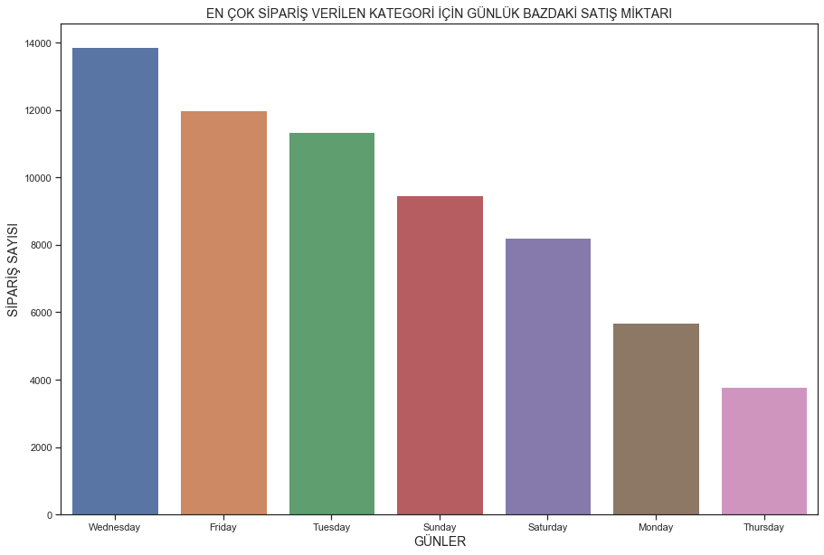


<a id='hyperlink19'></a>
**EN ÇOK SİPARİŞ VERİLEN KATEGORİ İÇİN GÜNLÜK BAZDAKİ ÜRÜN GÖRÜNTÜLEME SAYISININ SİPARİŞ MİKTARINA ETKİSİ**


```python
dc4=dc2[['dayname','productDetailViews','productCheckouts']]
dc4.head()
```


<div>
<style scoped>
    .dataframe tbody tr th:only-of-type {
        vertical-align: middle;
    }

    .dataframe tbody tr th {
        vertical-align: top;
    }

    .dataframe thead th {
        text-align: right;
    }
</style>
<table border="1" class="dataframe">
  <thead>
    <tr style="text-align: right;">
      <th></th>
      <th>dayname</th>
      <th>productDetailViews</th>
      <th>productCheckouts</th>
    </tr>
  </thead>
  <tbody>
    <tr>
      <th>131</th>
      <td>Friday</td>
      <td>12.0</td>
      <td>4.0</td>
    </tr>
    <tr>
      <th>132</th>
      <td>Saturday</td>
      <td>4.0</td>
      <td>1.0</td>
    </tr>
    <tr>
      <th>133</th>
      <td>Sunday</td>
      <td>6.0</td>
      <td>2.0</td>
    </tr>
    <tr>
      <th>134</th>
      <td>Sunday</td>
      <td>2.0</td>
      <td>2.0</td>
    </tr>
    <tr>
      <th>135</th>
      <td>Monday</td>
      <td>6.0</td>
      <td>1.0</td>
    </tr>
  </tbody>
</table>
</div>


```python
dc5=dc4.groupby('dayname',as_index=False)[['productDetailViews','productCheckouts']].sum().sort_values('productCheckouts',ascending=True)
```


```python
f,ax1 = plt.subplots(figsize =(20,10))
sns.pointplot(x='dayname',y='productDetailViews',data=dc5,color='lime',alpha=0.8)
sns.pointplot(x='dayname',y='productCheckouts',data=dc5,color='red',alpha=0.8)
plt.text(5,5000,'SİPARİŞ MİKTARI',color='red',fontsize = 18,style = 'italic')
plt.text(5,20000,'GÖRÜNTÜLEME MİKTARI',color='lime',fontsize = 18,style = 'italic')
plt.xticks(fontsize=16)
plt.yticks(fontsize=16)
plt.xlabel('GÜNLER',fontsize = 15,color='blue')
plt.ylabel('DEĞERLER',fontsize = 15,color='blue')
plt.title('SİPARİŞ MİKTARI  VS  GÖRÜNTÜLEME MİKTARI',fontsize = 20,color='blue')
plt.grid()
```


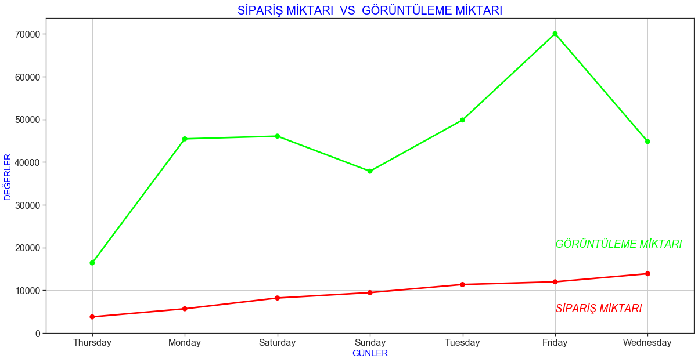


---------


```python
neww=dc2[dc2['productName']== 'MR1002  925 فضة استرليني عقيق أبيض حجر خاتم']
neww=neww[['date','country','productDetailViews','productCheckouts','quantityCheckedOut','dayname']]
neww.head()
```


<div>
<style scoped>
    .dataframe tbody tr th:only-of-type {
        vertical-align: middle;
    }

    .dataframe tbody tr th {
        vertical-align: top;
    }

    .dataframe thead th {
        text-align: right;
    }
</style>
<table border="1" class="dataframe">
  <thead>
    <tr style="text-align: right;">
      <th></th>
      <th>date</th>
      <th>country</th>
      <th>productDetailViews</th>
      <th>productCheckouts</th>
      <th>quantityCheckedOut</th>
      <th>dayname</th>
    </tr>
  </thead>
  <tbody>
    <tr>
      <th>1418</th>
      <td>2019-02-01</td>
      <td>Saudi Arabia</td>
      <td>12.0</td>
      <td>4.0</td>
      <td>4.0</td>
      <td>Friday</td>
    </tr>
    <tr>
      <th>1419</th>
      <td>2019-02-02</td>
      <td>Saudi Arabia</td>
      <td>4.0</td>
      <td>1.0</td>
      <td>1.0</td>
      <td>Saturday</td>
    </tr>
    <tr>
      <th>1420</th>
      <td>2019-02-03</td>
      <td>Saudi Arabia</td>
      <td>6.0</td>
      <td>2.0</td>
      <td>2.0</td>
      <td>Sunday</td>
    </tr>
    <tr>
      <th>1421</th>
      <td>2019-02-03</td>
      <td>Saudi Arabia</td>
      <td>2.0</td>
      <td>2.0</td>
      <td>2.0</td>
      <td>Sunday</td>
    </tr>
    <tr>
      <th>1422</th>
      <td>2019-02-04</td>
      <td>Saudi Arabia</td>
      <td>6.0</td>
      <td>1.0</td>
      <td>1.0</td>
      <td>Monday</td>
    </tr>
  </tbody>
</table>
</div>


```python
neww.drop(columns=('date'),inplace=True)
```


```python
new1=neww.copy()
new1.head()
```


<div>
<style scoped>
    .dataframe tbody tr th:only-of-type {
        vertical-align: middle;
    }

    .dataframe tbody tr th {
        vertical-align: top;
    }

    .dataframe thead th {
        text-align: right;
    }
</style>
<table border="1" class="dataframe">
  <thead>
    <tr style="text-align: right;">
      <th></th>
      <th>productDetailViews</th>
      <th>productCheckouts</th>
      <th>quantityCheckedOut</th>
      <th>dayname</th>
    </tr>
  </thead>
  <tbody>
    <tr>
      <th>1418</th>
      <td>12.0</td>
      <td>4.0</td>
      <td>4.0</td>
      <td>Friday</td>
    </tr>
    <tr>
      <th>1419</th>
      <td>4.0</td>
      <td>1.0</td>
      <td>1.0</td>
      <td>Saturday</td>
    </tr>
    <tr>
      <th>1420</th>
      <td>6.0</td>
      <td>2.0</td>
      <td>2.0</td>
      <td>Sunday</td>
    </tr>
    <tr>
      <th>1421</th>
      <td>2.0</td>
      <td>2.0</td>
      <td>2.0</td>
      <td>Sunday</td>
    </tr>
    <tr>
      <th>1422</th>
      <td>6.0</td>
      <td>1.0</td>
      <td>1.0</td>
      <td>Monday</td>
    </tr>
  </tbody>
</table>
</div>


```python
new2=pd.get_dummies(new1,columns=['dayname'])
new2.head()
```


<div>
<style scoped>
    .dataframe tbody tr th:only-of-type {
        vertical-align: middle;
    }

    .dataframe tbody tr th {
        vertical-align: top;
    }

    .dataframe thead th {
        text-align: right;
    }
</style>
<table border="1" class="dataframe">
  <thead>
    <tr style="text-align: right;">
      <th></th>
      <th>productDetailViews</th>
      <th>productCheckouts</th>
      <th>quantityCheckedOut</th>
      <th>dayname_Friday</th>
      <th>dayname_Monday</th>
      <th>dayname_Saturday</th>
      <th>dayname_Sunday</th>
      <th>dayname_Thursday</th>
      <th>dayname_Tuesday</th>
      <th>dayname_Wednesday</th>
    </tr>
  </thead>
  <tbody>
    <tr>
      <th>1418</th>
      <td>12.0</td>
      <td>4.0</td>
      <td>4.0</td>
      <td>1</td>
      <td>0</td>
      <td>0</td>
      <td>0</td>
      <td>0</td>
      <td>0</td>
      <td>0</td>
    </tr>
    <tr>
      <th>1419</th>
      <td>4.0</td>
      <td>1.0</td>
      <td>1.0</td>
      <td>0</td>
      <td>0</td>
      <td>1</td>
      <td>0</td>
      <td>0</td>
      <td>0</td>
      <td>0</td>
    </tr>
    <tr>
      <th>1420</th>
      <td>6.0</td>
      <td>2.0</td>
      <td>2.0</td>
      <td>0</td>
      <td>0</td>
      <td>0</td>
      <td>1</td>
      <td>0</td>
      <td>0</td>
      <td>0</td>
    </tr>
    <tr>
      <th>1421</th>
      <td>2.0</td>
      <td>2.0</td>
      <td>2.0</td>
      <td>0</td>
      <td>0</td>
      <td>0</td>
      <td>1</td>
      <td>0</td>
      <td>0</td>
      <td>0</td>
    </tr>
    <tr>
      <th>1422</th>
      <td>6.0</td>
      <td>1.0</td>
      <td>1.0</td>
      <td>0</td>
      <td>1</td>
      <td>0</td>
      <td>0</td>
      <td>0</td>
      <td>0</td>
      <td>0</td>
    </tr>
  </tbody>
</table>
</div>


**Bizim datasetimiz ml algoritmasına girmek için hazır**

**Decision Tree Regresyonu**


```python
x=new2.iloc[:,[0,1,3,4,5,6]].values
y=new2.quantityCheckedOut.values.reshape(-1,1)
```


```python
tree_reg=DecisionTreeRegressor()
tree_reg.fit(x,y)
```


    DecisionTreeRegressor(criterion='mse', max_depth=None, max_features=None,
                          max_leaf_nodes=None, min_impurity_decrease=0.0,
                          min_impurity_split=None, min_samples_leaf=1,
                          min_samples_split=2, min_weight_fraction_leaf=0.0,
                          presort=False, random_state=None, splitter='best')


```python
tree_reg.predict(np.array([[4,1,0,0,1,0],[10,3,1,0,0,0]]))
```


    array([1., 3.])


```python
y_head=tree_reg.predict(x)
print('r_score: ',r2_score(y,y_head))
print('mean squared error: ',mean_squared_error(y,y_head))
```

    r_score:  0.9814862989941033
    mean squared error:  0.019125683060109287


**Random Forest Regresyonu** 


```python
from sklearn.ensemble import RandomForestRegressor
```


```python
x2=new2.iloc[:,[0,1,3,4,5,6]].values
y2=new2.quantityCheckedOut.values.reshape(-1,1)
```


```python
rf=RandomForestRegressor(n_estimators=100,random_state=42)
rf.fit(x2,y2)
```


    RandomForestRegressor(bootstrap=True, criterion='mse', max_depth=None,
                          max_features='auto', max_leaf_nodes=None,
                          min_impurity_decrease=0.0, min_impurity_split=None,
                          min_samples_leaf=1, min_samples_split=2,
                          min_weight_fraction_leaf=0.0, n_estimators=100,
                          n_jobs=None, oob_score=False, random_state=42, verbose=0,
                          warm_start=False)


```python
rf.predict(np.array([[4,1,0,0,1,0],[10,3,1,0,0,0]]))
```


    array([1., 3.])


```python
y2_head=rf.predict(x2)
```


```python
print('r_score: ',r2_score(y2,y2_head))
print('mean squared error: ',mean_squared_error(y2,y2_head))
```

    r_score:  0.9814856407363992
    mean squared error:  0.019126363076936746


<a id='hyperlink20'></a>
**SUPER STORE TİME SERİSİ ANALİZİ**


```python
import warnings
import itertools
import numpy as np
import matplotlib.pyplot as plt
warnings.filterwarnings("ignore")
plt.style.use('fivethirtyeight')
import pandas as pd
import statsmodels.api as sm
import matplotlib
matplotlib.rcParams['axes.labelsize'] = 14
matplotlib.rcParams['xtick.labelsize'] = 12
matplotlib.rcParams['ytick.labelsize'] = 12
matplotlib.rcParams['text.color'] = 'k'
```


```python
pd.set_option('display.max_rows', 500)
pd.set_option('display.max_columns', 500)
pd.set_option('display.width', 1000)
```


```python
dt=pd.read_csv('/Users/infoletsbecoolcom/Downloads/Sample - Superstore.csv',parse_dates=['Order Date'])
```


```python
dt
```


<div>
<style scoped>
    .dataframe tbody tr th:only-of-type {
        vertical-align: middle;
    }

    .dataframe tbody tr th {
        vertical-align: top;
    }

    .dataframe thead th {
        text-align: right;
    }
</style>
<table border="1" class="dataframe">
  <thead>
    <tr style="text-align: right;">
      <th></th>
      <th>Row ID</th>
      <th>Order ID</th>
      <th>Order Date</th>
      <th>Ship Date</th>
      <th>Ship Mode</th>
      <th>Customer ID</th>
      <th>Customer Name</th>
      <th>Segment</th>
      <th>Country</th>
      <th>City</th>
      <th>State</th>
      <th>Postal Code</th>
      <th>Region</th>
      <th>Product ID</th>
      <th>Category</th>
      <th>Sub-Category</th>
      <th>Product Name</th>
      <th>Sales</th>
      <th>Quantity</th>
      <th>Discount</th>
      <th>Profit</th>
    </tr>
  </thead>
  <tbody>
    <tr>
      <th>0</th>
      <td>1</td>
      <td>CA-2016-152156</td>
      <td>2016-11-08</td>
      <td>11/11/2016</td>
      <td>Second Class</td>
      <td>CG-12520</td>
      <td>Claire Gute</td>
      <td>Consumer</td>
      <td>United States</td>
      <td>Henderson</td>
      <td>Kentucky</td>
      <td>42420.0</td>
      <td>South</td>
      <td>FUR-BO-10001798</td>
      <td>Furniture</td>
      <td>Bookcases</td>
      <td>Bush Somerset Collection Bookcase</td>
      <td>261.9600</td>
      <td>2.0</td>
      <td>0.00</td>
      <td>41.9136</td>
    </tr>
    <tr>
      <th>1</th>
      <td>2</td>
      <td>CA-2016-152156</td>
      <td>2016-11-08</td>
      <td>11/11/2016</td>
      <td>Second Class</td>
      <td>CG-12520</td>
      <td>Claire Gute</td>
      <td>Consumer</td>
      <td>United States</td>
      <td>Henderson</td>
      <td>Kentucky</td>
      <td>42420.0</td>
      <td>South</td>
      <td>FUR-CH-10000454</td>
      <td>Furniture</td>
      <td>Chairs</td>
      <td>Hon Deluxe Fabric Upholstered Stacking Chairs,...</td>
      <td>731.9400</td>
      <td>3.0</td>
      <td>0.00</td>
      <td>219.5820</td>
    </tr>
    <tr>
      <th>2</th>
      <td>3</td>
      <td>CA-2016-138688</td>
      <td>2016-06-12</td>
      <td>6/16/2016</td>
      <td>Second Class</td>
      <td>DV-13045</td>
      <td>Darrin Van Huff</td>
      <td>Corporate</td>
      <td>United States</td>
      <td>Los Angeles</td>
      <td>California</td>
      <td>90036.0</td>
      <td>West</td>
      <td>OFF-LA-10000240</td>
      <td>Office Supplies</td>
      <td>Labels</td>
      <td>Self-Adhesive Address Labels for Typewriters b...</td>
      <td>14.6200</td>
      <td>2.0</td>
      <td>0.00</td>
      <td>6.8714</td>
    </tr>
    <tr>
      <th>3</th>
      <td>4</td>
      <td>US-2015-108966</td>
      <td>2015-10-11</td>
      <td>10/18/2015</td>
      <td>Standard Class</td>
      <td>SO-20335</td>
      <td>Sean O'Donnell</td>
      <td>Consumer</td>
      <td>United States</td>
      <td>Fort Lauderdale</td>
      <td>Florida</td>
      <td>33311.0</td>
      <td>South</td>
      <td>FUR-TA-10000577</td>
      <td>Furniture</td>
      <td>Tables</td>
      <td>Bretford CR4500 Series Slim Rectangular Table</td>
      <td>957.5775</td>
      <td>5.0</td>
      <td>0.45</td>
      <td>-383.0310</td>
    </tr>
    <tr>
      <th>4</th>
      <td>5</td>
      <td>US-2015-108966</td>
      <td>2015-10-11</td>
      <td>10/18/2015</td>
      <td>Standard Class</td>
      <td>SO-20335</td>
      <td>Sean O'Donnell</td>
      <td>Consumer</td>
      <td>United States</td>
      <td>Fort Lauderdale</td>
      <td>Florida</td>
      <td>33311.0</td>
      <td>South</td>
      <td>OFF-ST-10000760</td>
      <td>Office Supplies</td>
      <td>Storage</td>
      <td>Eldon Fold 'N Roll Cart System</td>
      <td>22.3680</td>
      <td>2.0</td>
      <td>0.20</td>
      <td>2.5164</td>
    </tr>
    <tr>
      <th>5</th>
      <td>6</td>
      <td>CA-2014-115812</td>
      <td>2014-06-09</td>
      <td>6/14/2014</td>
      <td>Standard Class</td>
      <td>BH-11710</td>
      <td>Brosina Hoffman</td>
      <td>Consumer</td>
      <td>United States</td>
      <td>Los Angeles</td>
      <td>California</td>
      <td>90032.0</td>
      <td>West</td>
      <td>FUR-FU-10001487</td>
      <td>Furniture</td>
      <td>Furnishings</td>
      <td>Eldon Expressions Wood and Plastic Desk Access...</td>
      <td>48.8600</td>
      <td>7.0</td>
      <td>0.00</td>
      <td>14.1694</td>
    </tr>
    <tr>
      <th>6</th>
      <td>7</td>
      <td>CA-2014-115812</td>
      <td>2014-06-09</td>
      <td>6/14/2014</td>
      <td>Standard Class</td>
      <td>BH-11710</td>
      <td>Brosina Hoffman</td>
      <td>Consumer</td>
      <td>United States</td>
      <td>Los Angeles</td>
      <td>California</td>
      <td>90032.0</td>
      <td>West</td>
      <td>OFF-AR-10002833</td>
      <td>Office Supplies</td>
      <td>Art</td>
      <td>Newell 322</td>
      <td>7.2800</td>
      <td>4.0</td>
      <td>0.00</td>
      <td>1.9656</td>
    </tr>
    <tr>
      <th>7</th>
      <td>8</td>
      <td>CA-2014-115812</td>
      <td>2014-06-09</td>
      <td>6/14/2014</td>
      <td>Standard Class</td>
      <td>BH-11710</td>
      <td>Brosina Hoffman</td>
      <td>Consumer</td>
      <td>United States</td>
      <td>Los Angeles</td>
      <td>California</td>
      <td>90032.0</td>
      <td>West</td>
      <td>TEC-PH-10002275</td>
      <td>Technology</td>
      <td>Phones</td>
      <td>Mitel 5320 IP Phone VoIP phone</td>
      <td>907.1520</td>
      <td>6.0</td>
      <td>0.20</td>
      <td>90.7152</td>
    </tr>
    <tr>
      <th>8</th>
      <td>9</td>
      <td>CA-2014-115812</td>
      <td>2014-06-09</td>
      <td>6/14/2014</td>
      <td>Standard Class</td>
      <td>BH-11710</td>
      <td>Brosina Hoffman</td>
      <td>Consumer</td>
      <td>United States</td>
      <td>Los Angeles</td>
      <td>California</td>
      <td>90032.0</td>
      <td>West</td>
      <td>OFF-BI-10003910</td>
      <td>Office Supplies</td>
      <td>Binders</td>
      <td>DXL Angle-View Binders with Locking Rings by S...</td>
      <td>18.5040</td>
      <td>3.0</td>
      <td>0.20</td>
      <td>5.7825</td>
    </tr>
    <tr>
      <th>9</th>
      <td>10</td>
      <td>CA-2014-115812</td>
      <td>2014-06-09</td>
      <td>6/14/2014</td>
      <td>Standard Class</td>
      <td>BH-11710</td>
      <td>Brosina Hoffman</td>
      <td>Consumer</td>
      <td>United States</td>
      <td>Los Angeles</td>
      <td>California</td>
      <td>90032.0</td>
      <td>West</td>
      <td>OFF-AP-10002892</td>
      <td>Office Supplies</td>
      <td>Appliances</td>
      <td>Belkin F5C206VTEL 6 Outlet Surge</td>
      <td>114.9000</td>
      <td>5.0</td>
      <td>0.00</td>
      <td>34.4700</td>
    </tr>
    <tr>
      <th>10</th>
      <td>11</td>
      <td>CA-2014-115812</td>
      <td>2014-06-09</td>
      <td>6/14/2014</td>
      <td>Standard Class</td>
      <td>BH-11710</td>
      <td>Brosina Hoffman</td>
      <td>Consumer</td>
      <td>United States</td>
      <td>Los Angeles</td>
      <td>California</td>
      <td>90032.0</td>
      <td>West</td>
      <td>FUR-TA-10001539</td>
      <td>Furniture</td>
      <td>Tables</td>
      <td>Chromcraft Rectangular Conference Tables</td>
      <td>1706.1840</td>
      <td>9.0</td>
      <td>0.20</td>
      <td>85.3092</td>
    </tr>
    <tr>
      <th>11</th>
      <td>12</td>
      <td>CA-2014-115812</td>
      <td>2014-06-09</td>
      <td>6/14/2014</td>
      <td>Standard Class</td>
      <td>BH-11710</td>
      <td>Brosina Hoffman</td>
      <td>Consumer</td>
      <td>United States</td>
      <td>Los Angeles</td>
      <td>California</td>
      <td>90032.0</td>
      <td>West</td>
      <td>TEC-PH-10002033</td>
      <td>Technology</td>
      <td>Phones</td>
      <td>Konftel 250 Conference phone - Charcoal black</td>
      <td>911.4240</td>
      <td>4.0</td>
      <td>0.20</td>
      <td>68.3568</td>
    </tr>
    <tr>
      <th>12</th>
      <td>13</td>
      <td>CA-2017-114412</td>
      <td>2017-04-15</td>
      <td>4/20/2017</td>
      <td>Standard Class</td>
      <td>AA-10480</td>
      <td>Andrew Allen</td>
      <td>Consumer</td>
      <td>United States</td>
      <td>Concord</td>
      <td>North Carolina</td>
      <td>28027.0</td>
      <td>South</td>
      <td>OFF-PA-10002365</td>
      <td>Office Supplies</td>
      <td>Paper</td>
      <td>Xerox 1967</td>
      <td>15.5520</td>
      <td>3.0</td>
      <td>0.20</td>
      <td>5.4432</td>
    </tr>
    <tr>
      <th>13</th>
      <td>14</td>
      <td>CA-2016-161389</td>
      <td>2016-12-05</td>
      <td>12/10/2016</td>
      <td>Standard Class</td>
      <td>IM-15070</td>
      <td>Irene Maddox</td>
      <td>Consumer</td>
      <td>United States</td>
      <td>Seattle</td>
      <td>Washington</td>
      <td>98103.0</td>
      <td>West</td>
      <td>OFF-BI-10003656</td>
      <td>Office Supplies</td>
      <td>Binders</td>
      <td>Fellowes PB200 Plastic Comb Binding Machine</td>
      <td>407.9760</td>
      <td>3.0</td>
      <td>0.20</td>
      <td>132.5922</td>
    </tr>
    <tr>
      <th>14</th>
      <td>15</td>
      <td>US-2015-118983</td>
      <td>2015-11-22</td>
      <td>11/26/2015</td>
      <td>Standard Class</td>
      <td>HP-14815</td>
      <td>Harold Pawlan</td>
      <td>Home Office</td>
      <td>United States</td>
      <td>Fort Worth</td>
      <td>Texas</td>
      <td>76106.0</td>
      <td>Central</td>
      <td>OFF-AP-10002311</td>
      <td>Office Supplies</td>
      <td>Appliances</td>
      <td>Holmes Replacement Filter for HEPA Air Cleaner...</td>
      <td>68.8100</td>
      <td>5.0</td>
      <td>0.80</td>
      <td>-123.8580</td>
    </tr>
    <tr>
      <th>15</th>
      <td>16</td>
      <td>US-2015-118983</td>
      <td>2015-11-22</td>
      <td>11/26/2015</td>
      <td>Standard Class</td>
      <td>HP-14815</td>
      <td>Harold Pawlan</td>
      <td>Home Office</td>
      <td>United States</td>
      <td>Fort Worth</td>
      <td>Texas</td>
      <td>76106.0</td>
      <td>Central</td>
      <td>OFF-BI-10000756</td>
      <td>Office Supplies</td>
      <td>Binders</td>
      <td>Storex DuraTech Recycled Plastic Frosted Binders</td>
      <td>2.5440</td>
      <td>3.0</td>
      <td>0.80</td>
      <td>-3.8160</td>
    </tr>
    <tr>
      <th>16</th>
      <td>17</td>
      <td>CA-2014-105893</td>
      <td>2014-11-11</td>
      <td>11/18/2014</td>
      <td>Standard Class</td>
      <td>PK-19075</td>
      <td>Pete Kriz</td>
      <td>Consumer</td>
      <td>United States</td>
      <td>Madison</td>
      <td>Wisconsin</td>
      <td>53711.0</td>
      <td>Central</td>
      <td>OFF-ST-10004186</td>
      <td>Office Supplies</td>
      <td>Storage</td>
      <td>Stur-D-Stor Shelving, Vertical 5-Shelf: 72"H x...</td>
      <td>665.8800</td>
      <td>6.0</td>
      <td>0.00</td>
      <td>13.3176</td>
    </tr>
    <tr>
      <th>17</th>
      <td>18</td>
      <td>CA-2014-167164</td>
      <td>2014-05-13</td>
      <td>5/15/2014</td>
      <td>Second Class</td>
      <td>AG-10270</td>
      <td>Alejandro Grove</td>
      <td>Consumer</td>
      <td>United States</td>
      <td>West Jordan</td>
      <td>Utah</td>
      <td>84084.0</td>
      <td>West</td>
      <td>OFF-ST-10000107</td>
      <td>Office Supplies</td>
      <td>Storage</td>
      <td>Fellowes Super Stor/Drawer</td>
      <td>55.5000</td>
      <td>2.0</td>
      <td>0.00</td>
      <td>9.9900</td>
    </tr>
    <tr>
      <th>18</th>
      <td>19</td>
      <td>CA-2014-143336</td>
      <td>2014-08-27</td>
      <td>9/1/2014</td>
      <td>Second Class</td>
      <td>ZD-21925</td>
      <td>Zuschuss Donatelli</td>
      <td>Consumer</td>
      <td>United States</td>
      <td>San Francisco</td>
      <td>California</td>
      <td>94109.0</td>
      <td>West</td>
      <td>OFF-AR-10003056</td>
      <td>Office Supplies</td>
      <td>Art</td>
      <td>Newell 341</td>
      <td>8.5600</td>
      <td>2.0</td>
      <td>0.00</td>
      <td>2.4824</td>
    </tr>
    <tr>
      <th>19</th>
      <td>20</td>
      <td>CA-2014-143336</td>
      <td>2014-08-27</td>
      <td>9/1/2014</td>
      <td>Second Class</td>
      <td>ZD-21925</td>
      <td>Zuschuss Donatelli</td>
      <td>Consumer</td>
      <td>United States</td>
      <td>San Francisco</td>
      <td>California</td>
      <td>94109.0</td>
      <td>West</td>
      <td>TEC-PH-10001949</td>
      <td>Technology</td>
      <td>Phones</td>
      <td>Cisco SPA 501G IP Phone</td>
      <td>213.4800</td>
      <td>3.0</td>
      <td>0.20</td>
      <td>16.0110</td>
    </tr>
    <tr>
      <th>20</th>
      <td>21</td>
      <td>CA-2014-143336</td>
      <td>2014-08-27</td>
      <td>9/1/2014</td>
      <td>Second Class</td>
      <td>ZD-21925</td>
      <td>Zuschuss Donatelli</td>
      <td>Consumer</td>
      <td>United States</td>
      <td>San Francisco</td>
      <td>California</td>
      <td>94109.0</td>
      <td>West</td>
      <td>OFF-BI-10002215</td>
      <td>Office Supplies</td>
      <td>Binders</td>
      <td>Wilson Jones Hanging View Binder, White, 1"</td>
      <td>22.7200</td>
      <td>4.0</td>
      <td>0.20</td>
      <td>7.3840</td>
    </tr>
    <tr>
      <th>21</th>
      <td>22</td>
      <td>CA-2016-137330</td>
      <td>2016-12-09</td>
      <td>12/13/2016</td>
      <td>Standard Class</td>
      <td>KB-16585</td>
      <td>Ken Black</td>
      <td>Corporate</td>
      <td>United States</td>
      <td>Fremont</td>
      <td>Nebraska</td>
      <td>68025.0</td>
      <td>Central</td>
      <td>OFF-AR-10000246</td>
      <td>Office Supplies</td>
      <td>Art</td>
      <td>Newell 318</td>
      <td>19.4600</td>
      <td>7.0</td>
      <td>0.00</td>
      <td>5.0596</td>
    </tr>
    <tr>
      <th>22</th>
      <td>23</td>
      <td>CA-2016-137330</td>
      <td>2016-12-09</td>
      <td>12/13/2016</td>
      <td>Standard Class</td>
      <td>KB-16585</td>
      <td>Ken Black</td>
      <td>Corporate</td>
      <td>United States</td>
      <td>Fremont</td>
      <td>Nebraska</td>
      <td>68025.0</td>
      <td>Central</td>
      <td>OFF-AP-10001492</td>
      <td>Office Supplies</td>
      <td>Appliances</td>
      <td>Acco Six-Outlet Power Strip, 4' Cord Length</td>
      <td>60.3400</td>
      <td>7.0</td>
      <td>0.00</td>
      <td>15.6884</td>
    </tr>
    <tr>
      <th>23</th>
      <td>24</td>
      <td>US-2017-156909</td>
      <td>2017-07-16</td>
      <td>7/18/2017</td>
      <td>Second Class</td>
      <td>SF-20065</td>
      <td>Sandra Flanagan</td>
      <td>Consumer</td>
      <td>United States</td>
      <td>Philadelphia</td>
      <td>Pennsylvania</td>
      <td>19140.0</td>
      <td>East</td>
      <td>FUR-CH-10002774</td>
      <td>Furniture</td>
      <td>Chairs</td>
      <td>Global Deluxe Stacking Chair, Gray</td>
      <td>71.3720</td>
      <td>2.0</td>
      <td>0.30</td>
      <td>-1.0196</td>
    </tr>
    <tr>
      <th>24</th>
      <td>25</td>
      <td>CA-2015-106320</td>
      <td>2015-09-25</td>
      <td>9/30/2015</td>
      <td>Standard Class</td>
      <td>EB-13870</td>
      <td>Emily Burns</td>
      <td>Consumer</td>
      <td>United States</td>
      <td>Orem</td>
      <td>Utah</td>
      <td>84057.0</td>
      <td>West</td>
      <td>FUR-TA-10000577</td>
      <td>Furniture</td>
      <td>Tables</td>
      <td>Bretford CR4500 Series Slim Rectangular Table</td>
      <td>1044.6300</td>
      <td>3.0</td>
      <td>0.00</td>
      <td>240.2649</td>
    </tr>
    <tr>
      <th>25</th>
      <td>26</td>
      <td>CA-2016-121755</td>
      <td>2016-01-16</td>
      <td>1/20/2016</td>
      <td>Second Class</td>
      <td>EH-13945</td>
      <td>Eric Hoffmann</td>
      <td>Consumer</td>
      <td>United States</td>
      <td>Los Angeles</td>
      <td>California</td>
      <td>90049.0</td>
      <td>West</td>
      <td>OFF-BI-10001634</td>
      <td>Office Supplies</td>
      <td>Binders</td>
      <td>Wilson Jones Active Use Binders</td>
      <td>11.6480</td>
      <td>2.0</td>
      <td>0.20</td>
      <td>4.2224</td>
    </tr>
    <tr>
      <th>26</th>
      <td>27</td>
      <td>CA-2016-121755</td>
      <td>2016-01-16</td>
      <td>1/20/2016</td>
      <td>Second Class</td>
      <td>EH-13945</td>
      <td>Eric Hoffmann</td>
      <td>Consumer</td>
      <td>United States</td>
      <td>Los Angeles</td>
      <td>California</td>
      <td>90049.0</td>
      <td>West</td>
      <td>TEC-AC-10003027</td>
      <td>Technology</td>
      <td>Accessories</td>
      <td>Imation 8GB Mini TravelDrive USB 2.0 Flash Drive</td>
      <td>90.5700</td>
      <td>3.0</td>
      <td>0.00</td>
      <td>11.7741</td>
    </tr>
    <tr>
      <th>27</th>
      <td>28</td>
      <td>US-2015-150630</td>
      <td>2015-09-17</td>
      <td>9/21/2015</td>
      <td>Standard Class</td>
      <td>TB-21520</td>
      <td>Tracy Blumstein</td>
      <td>Consumer</td>
      <td>United States</td>
      <td>Philadelphia</td>
      <td>Pennsylvania</td>
      <td>19140.0</td>
      <td>East</td>
      <td>FUR-BO-10004834</td>
      <td>Furniture</td>
      <td>Bookcases</td>
      <td>Riverside Palais Royal Lawyers Bookcase, Royal...</td>
      <td>3083.4300</td>
      <td>7.0</td>
      <td>0.50</td>
      <td>-1665.0522</td>
    </tr>
    <tr>
      <th>28</th>
      <td>29</td>
      <td>US-2015-150630</td>
      <td>2015-09-17</td>
      <td>9/21/2015</td>
      <td>Standard Class</td>
      <td>TB-21520</td>
      <td>Tracy Blumstein</td>
      <td>Consumer</td>
      <td>United States</td>
      <td>Philadelphia</td>
      <td>Pennsylvania</td>
      <td>19140.0</td>
      <td>East</td>
      <td>OFF-BI-10000474</td>
      <td>Office Supplies</td>
      <td>Binders</td>
      <td>Avery Recycled Flexi-View Covers for Binding S...</td>
      <td>9.6180</td>
      <td>2.0</td>
      <td>0.70</td>
      <td>-7.0532</td>
    </tr>
    <tr>
      <th>29</th>
      <td>30</td>
      <td>US-2015-150630</td>
      <td>2015-09-17</td>
      <td>9/21/2015</td>
      <td>Standard Class</td>
      <td>TB-21520</td>
      <td>Tracy Blumstein</td>
      <td>Consumer</td>
      <td>United States</td>
      <td>Philadelphia</td>
      <td>Pennsylvania</td>
      <td>19140.0</td>
      <td>East</td>
      <td>FUR-FU-10004848</td>
      <td>Furniture</td>
      <td>Furnishings</td>
      <td>Howard Miller 13-3/4" Diameter Brushed Chrome ...</td>
      <td>124.2000</td>
      <td>3.0</td>
      <td>0.20</td>
      <td>15.5250</td>
    </tr>
    <tr>
      <th>30</th>
      <td>31</td>
      <td>US-2015-150630</td>
      <td>2015-09-17</td>
      <td>9/21/2015</td>
      <td>Standard Class</td>
      <td>TB-21520</td>
      <td>Tracy Blumstein</td>
      <td>Consumer</td>
      <td>United States</td>
      <td>Philadelphia</td>
      <td>Pennsylvania</td>
      <td>19140.0</td>
      <td>East</td>
      <td>OFF-EN-10001509</td>
      <td>Office Supplies</td>
      <td>Envelopes</td>
      <td>Poly String Tie Envelopes</td>
      <td>3.2640</td>
      <td>2.0</td>
      <td>0.20</td>
      <td>1.1016</td>
    </tr>
    <tr>
      <th>31</th>
      <td>32</td>
      <td>US-2015-150630</td>
      <td>2015-09-17</td>
      <td>9/21/2015</td>
      <td>Standard Class</td>
      <td>TB-21520</td>
      <td>Tracy Blumstein</td>
      <td>Consumer</td>
      <td>United States</td>
      <td>Philadelphia</td>
      <td>Pennsylvania</td>
      <td>19140.0</td>
      <td>East</td>
      <td>OFF-AR-10004042</td>
      <td>Office Supplies</td>
      <td>Art</td>
      <td>BOSTON Model 1800 Electric Pencil Sharpeners, ...</td>
      <td>86.3040</td>
      <td>6.0</td>
      <td>0.20</td>
      <td>9.7092</td>
    </tr>
    <tr>
      <th>32</th>
      <td>33</td>
      <td>US-2015-150630</td>
      <td>2015-09-17</td>
      <td>9/21/2015</td>
      <td>Standard Class</td>
      <td>TB-21520</td>
      <td>Tracy Blumstein</td>
      <td>Consumer</td>
      <td>United States</td>
      <td>Philadelphia</td>
      <td>Pennsylvania</td>
      <td>19140.0</td>
      <td>East</td>
      <td>OFF-BI-10001525</td>
      <td>Office Supplies</td>
      <td>Binders</td>
      <td>Acco Pressboard Covers with Storage Hooks, 14 ...</td>
      <td>6.8580</td>
      <td>6.0</td>
      <td>0.70</td>
      <td>-5.7150</td>
    </tr>
    <tr>
      <th>33</th>
      <td>34</td>
      <td>US-2015-150630</td>
      <td>2015-09-17</td>
      <td>9/21/2015</td>
      <td>Standard Class</td>
      <td>TB-21520</td>
      <td>Tracy Blumstein</td>
      <td>Consumer</td>
      <td>United States</td>
      <td>Philadelphia</td>
      <td>Pennsylvania</td>
      <td>19140.0</td>
      <td>East</td>
      <td>OFF-AR-10001683</td>
      <td>Office Supplies</td>
      <td>Art</td>
      <td>Lumber Crayons</td>
      <td>15.7600</td>
      <td>2.0</td>
      <td>0.20</td>
      <td>3.5460</td>
    </tr>
    <tr>
      <th>34</th>
      <td>35</td>
      <td>CA-2017-107727</td>
      <td>2017-10-19</td>
      <td>10/23/2017</td>
      <td>Second Class</td>
      <td>MA-17560</td>
      <td>Matt Abelman</td>
      <td>Home Office</td>
      <td>United States</td>
      <td>Houston</td>
      <td>Texas</td>
      <td>77095.0</td>
      <td>Central</td>
      <td>OFF-PA-10000249</td>
      <td>Office Supplies</td>
      <td>Paper</td>
      <td>Easy-staple paper</td>
      <td>29.4720</td>
      <td>3.0</td>
      <td>0.20</td>
      <td>9.9468</td>
    </tr>
    <tr>
      <th>35</th>
      <td>36</td>
      <td>CA-2016-117590</td>
      <td>2016-12-08</td>
      <td>12/10/2016</td>
      <td>First Class</td>
      <td>GH-14485</td>
      <td>Gene Hale</td>
      <td>Corporate</td>
      <td>United States</td>
      <td>Richardson</td>
      <td>Texas</td>
      <td>75080.0</td>
      <td>Central</td>
      <td>TEC-PH-10004977</td>
      <td>Technology</td>
      <td>Phones</td>
      <td>GE 30524EE4</td>
      <td>1097.5440</td>
      <td>7.0</td>
      <td>0.20</td>
      <td>123.4737</td>
    </tr>
    <tr>
      <th>36</th>
      <td>37</td>
      <td>CA-2016-117590</td>
      <td>2016-12-08</td>
      <td>12/10/2016</td>
      <td>First Class</td>
      <td>GH-14485</td>
      <td>Gene Hale</td>
      <td>Corporate</td>
      <td>United States</td>
      <td>Richardson</td>
      <td>Texas</td>
      <td>75080.0</td>
      <td>Central</td>
      <td>FUR-FU-10003664</td>
      <td>Furniture</td>
      <td>Furnishings</td>
      <td>Electrix Architect's Clamp-On Swing Arm Lamp, ...</td>
      <td>190.9200</td>
      <td>5.0</td>
      <td>0.60</td>
      <td>-147.9630</td>
    </tr>
    <tr>
      <th>37</th>
      <td>38</td>
      <td>CA-2015-117415</td>
      <td>2015-12-27</td>
      <td>12/31/2015</td>
      <td>Standard Class</td>
      <td>SN-20710</td>
      <td>Steve Nguyen</td>
      <td>Home Office</td>
      <td>United States</td>
      <td>Houston</td>
      <td>Texas</td>
      <td>77041.0</td>
      <td>Central</td>
      <td>OFF-EN-10002986</td>
      <td>Office Supplies</td>
      <td>Envelopes</td>
      <td>#10-4 1/8" x 9 1/2" Premium Diagonal Seam Enve...</td>
      <td>113.3280</td>
      <td>9.0</td>
      <td>0.20</td>
      <td>35.4150</td>
    </tr>
    <tr>
      <th>38</th>
      <td>39</td>
      <td>CA-2015-117415</td>
      <td>2015-12-27</td>
      <td>12/31/2015</td>
      <td>Standard Class</td>
      <td>SN-20710</td>
      <td>Steve Nguyen</td>
      <td>Home Office</td>
      <td>United States</td>
      <td>Houston</td>
      <td>Texas</td>
      <td>77041.0</td>
      <td>Central</td>
      <td>FUR-BO-10002545</td>
      <td>Furniture</td>
      <td>Bookcases</td>
      <td>Atlantic Metals Mobile 3-Shelf Bookcases, Cust...</td>
      <td>532.3992</td>
      <td>3.0</td>
      <td>0.32</td>
      <td>-46.9764</td>
    </tr>
    <tr>
      <th>39</th>
      <td>40</td>
      <td>CA-2015-117415</td>
      <td>2015-12-27</td>
      <td>12/31/2015</td>
      <td>Standard Class</td>
      <td>SN-20710</td>
      <td>Steve Nguyen</td>
      <td>Home Office</td>
      <td>United States</td>
      <td>Houston</td>
      <td>Texas</td>
      <td>77041.0</td>
      <td>Central</td>
      <td>FUR-CH-10004218</td>
      <td>Furniture</td>
      <td>Chairs</td>
      <td>Global Fabric Manager's Chair, Dark Gray</td>
      <td>212.0580</td>
      <td>3.0</td>
      <td>0.30</td>
      <td>-15.1470</td>
    </tr>
    <tr>
      <th>40</th>
      <td>41</td>
      <td>CA-2015-117415</td>
      <td>2015-12-27</td>
      <td>12/31/2015</td>
      <td>Standard Class</td>
      <td>SN-20710</td>
      <td>Steve Nguyen</td>
      <td>Home Office</td>
      <td>United States</td>
      <td>Houston</td>
      <td>Texas</td>
      <td>77041.0</td>
      <td>Central</td>
      <td>TEC-PH-10000486</td>
      <td>Technology</td>
      <td>Phones</td>
      <td>Plantronics HL10 Handset Lifter</td>
      <td>371.1680</td>
      <td>4.0</td>
      <td>0.20</td>
      <td>41.7564</td>
    </tr>
    <tr>
      <th>41</th>
      <td>42</td>
      <td>CA-2017-120999</td>
      <td>2017-09-10</td>
      <td>9/15/2017</td>
      <td>Standard Class</td>
      <td>LC-16930</td>
      <td>Linda Cazamias</td>
      <td>Corporate</td>
      <td>United States</td>
      <td>Naperville</td>
      <td>Illinois</td>
      <td>60540.0</td>
      <td>Central</td>
      <td>TEC-PH-10004093</td>
      <td>Technology</td>
      <td>Phones</td>
      <td>Panasonic Kx-TS550</td>
      <td>147.1680</td>
      <td>4.0</td>
      <td>0.20</td>
      <td>16.5564</td>
    </tr>
    <tr>
      <th>42</th>
      <td>43</td>
      <td>CA-2016-101343</td>
      <td>2016-07-17</td>
      <td>7/22/2016</td>
      <td>Standard Class</td>
      <td>RA-19885</td>
      <td>Ruben Ausman</td>
      <td>Corporate</td>
      <td>United States</td>
      <td>Los Angeles</td>
      <td>California</td>
      <td>90049.0</td>
      <td>West</td>
      <td>OFF-ST-10003479</td>
      <td>Office Supplies</td>
      <td>Storage</td>
      <td>Eldon Base for stackable storage shelf, platinum</td>
      <td>77.8800</td>
      <td>2.0</td>
      <td>0.00</td>
      <td>3.8940</td>
    </tr>
    <tr>
      <th>43</th>
      <td>44</td>
      <td>CA-2017-139619</td>
      <td>2017-09-19</td>
      <td>9/23/2017</td>
      <td>Standard Class</td>
      <td>ES-14080</td>
      <td>Erin Smith</td>
      <td>Corporate</td>
      <td>United States</td>
      <td>Melbourne</td>
      <td>Florida</td>
      <td>32935.0</td>
      <td>South</td>
      <td>OFF-ST-10003282</td>
      <td>Office Supplies</td>
      <td>Storage</td>
      <td>Advantus 10-Drawer Portable Organizer, Chrome ...</td>
      <td>95.6160</td>
      <td>2.0</td>
      <td>0.20</td>
      <td>9.5616</td>
    </tr>
    <tr>
      <th>44</th>
      <td>45</td>
      <td>CA-2016-118255</td>
      <td>2016-03-11</td>
      <td>3/13/2016</td>
      <td>First Class</td>
      <td>ON-18715</td>
      <td>Odella Nelson</td>
      <td>Corporate</td>
      <td>United States</td>
      <td>Eagan</td>
      <td>Minnesota</td>
      <td>55122.0</td>
      <td>Central</td>
      <td>TEC-AC-10000171</td>
      <td>Technology</td>
      <td>Accessories</td>
      <td>Verbatim 25 GB 6x Blu-ray Single Layer Recorda...</td>
      <td>45.9800</td>
      <td>2.0</td>
      <td>0.00</td>
      <td>19.7714</td>
    </tr>
    <tr>
      <th>45</th>
      <td>46</td>
      <td>CA-2016-118255</td>
      <td>2016-03-11</td>
      <td>3/13/2016</td>
      <td>First Class</td>
      <td>ON-18715</td>
      <td>Odella Nelson</td>
      <td>Corporate</td>
      <td>United States</td>
      <td>Eagan</td>
      <td>Minnesota</td>
      <td>55122.0</td>
      <td>Central</td>
      <td>OFF-BI-10003291</td>
      <td>Office Supplies</td>
      <td>Binders</td>
      <td>Wilson Jones Leather-Like Binders with DublLoc...</td>
      <td>17.4600</td>
      <td>2.0</td>
      <td>0.00</td>
      <td>8.2062</td>
    </tr>
    <tr>
      <th>46</th>
      <td>47</td>
      <td>CA-2014-146703</td>
      <td>2014-10-20</td>
      <td>10/25/2014</td>
      <td>Second Class</td>
      <td>PO-18865</td>
      <td>Patrick O'Donnell</td>
      <td>Consumer</td>
      <td>United States</td>
      <td>Westland</td>
      <td>Michigan</td>
      <td>48185.0</td>
      <td>Central</td>
      <td>OFF-ST-10001713</td>
      <td>Office Supplies</td>
      <td>Storage</td>
      <td>Gould Plastics 9-Pocket Panel Bin, 18-3/8w x 5...</td>
      <td>211.9600</td>
      <td>4.0</td>
      <td>0.00</td>
      <td>8.4784</td>
    </tr>
    <tr>
      <th>47</th>
      <td>48</td>
      <td>CA-2016-169194</td>
      <td>2016-06-20</td>
      <td>6/25/2016</td>
      <td>Standard Class</td>
      <td>LH-16900</td>
      <td>Lena Hernandez</td>
      <td>Consumer</td>
      <td>United States</td>
      <td>Dover</td>
      <td>Delaware</td>
      <td>19901.0</td>
      <td>East</td>
      <td>TEC-AC-10002167</td>
      <td>Technology</td>
      <td>Accessories</td>
      <td>Imation 8gb Micro Traveldrive Usb 2.0 Flash Drive</td>
      <td>45.0000</td>
      <td>3.0</td>
      <td>0.00</td>
      <td>4.9500</td>
    </tr>
    <tr>
      <th>48</th>
      <td>49</td>
      <td>CA-2016-169194</td>
      <td>2016-06-20</td>
      <td>6/25/2016</td>
      <td>Standard Class</td>
      <td>LH-16900</td>
      <td>Lena Hernandez</td>
      <td>Consumer</td>
      <td>United States</td>
      <td>Dover</td>
      <td>Delaware</td>
      <td>19901.0</td>
      <td>East</td>
      <td>TEC-PH-10003988</td>
      <td>Technology</td>
      <td>Phones</td>
      <td>LF Elite 3D Dazzle Designer Hard Case Cover, L...</td>
      <td>21.8000</td>
      <td>2.0</td>
      <td>0.00</td>
      <td>6.1040</td>
    </tr>
    <tr>
      <th>49</th>
      <td>50</td>
      <td>CA-2015-115742</td>
      <td>2015-04-18</td>
      <td>4/22/2015</td>
      <td>Standard Class</td>
      <td>DP-13000</td>
      <td>Darren Powers</td>
      <td>Consumer</td>
      <td>United States</td>
      <td>New Albany</td>
      <td>Indiana</td>
      <td>47150.0</td>
      <td>Central</td>
      <td>OFF-BI-10004410</td>
      <td>Office Supplies</td>
      <td>Binders</td>
      <td>C-Line Peel &amp; Stick Add-On Filing Pockets, 8-3...</td>
      <td>38.2200</td>
      <td>6.0</td>
      <td>0.00</td>
      <td>17.9634</td>
    </tr>
    <tr>
      <th>50</th>
      <td>51</td>
      <td>CA-2015-115742</td>
      <td>2015-04-18</td>
      <td>4/22/2015</td>
      <td>Standard Class</td>
      <td>DP-13000</td>
      <td>Darren Powers</td>
      <td>Consumer</td>
      <td>United States</td>
      <td>New Albany</td>
      <td>Indiana</td>
      <td>47150.0</td>
      <td>Central</td>
      <td>OFF-LA-10002762</td>
      <td>Office Supplies</td>
      <td>Labels</td>
      <td>Avery 485</td>
      <td>75.1800</td>
      <td>6.0</td>
      <td>0.00</td>
      <td>35.3346</td>
    </tr>
    <tr>
      <th>51</th>
      <td>52</td>
      <td>CA-2015-115742</td>
      <td>2015-04-18</td>
      <td>4/22/2015</td>
      <td>Standard Class</td>
      <td>DP-13000</td>
      <td>Darren Powers</td>
      <td>Consumer</td>
      <td>United States</td>
      <td>New Albany</td>
      <td>Indiana</td>
      <td>47150.0</td>
      <td>Central</td>
      <td>FUR-FU-10001706</td>
      <td>Furniture</td>
      <td>Furnishings</td>
      <td>Longer-Life Soft White Bulbs</td>
      <td>6.1600</td>
      <td>2.0</td>
      <td>0.00</td>
      <td>2.9568</td>
    </tr>
    <tr>
      <th>52</th>
      <td>53</td>
      <td>CA-2015-115742</td>
      <td>2015-04-18</td>
      <td>4/22/2015</td>
      <td>Standard Class</td>
      <td>DP-13000</td>
      <td>Darren Powers</td>
      <td>Consumer</td>
      <td>United States</td>
      <td>New Albany</td>
      <td>Indiana</td>
      <td>47150.0</td>
      <td>Central</td>
      <td>FUR-CH-10003061</td>
      <td>Furniture</td>
      <td>Chairs</td>
      <td>Global Leather Task Chair, Black</td>
      <td>89.9900</td>
      <td>1.0</td>
      <td>0.00</td>
      <td>17.0981</td>
    </tr>
    <tr>
      <th>53</th>
      <td>54</td>
      <td>CA-2016-105816</td>
      <td>2016-12-11</td>
      <td>12/17/2016</td>
      <td>Standard Class</td>
      <td>JM-15265</td>
      <td>Janet Molinari</td>
      <td>Corporate</td>
      <td>United States</td>
      <td>New York City</td>
      <td>New York</td>
      <td>10024.0</td>
      <td>East</td>
      <td>OFF-FA-10000304</td>
      <td>Office Supplies</td>
      <td>Fasteners</td>
      <td>Advantus Push Pins</td>
      <td>15.2600</td>
      <td>7.0</td>
      <td>0.00</td>
      <td>6.2566</td>
    </tr>
    <tr>
      <th>54</th>
      <td>55</td>
      <td>CA-2016-105816</td>
      <td>2016-12-11</td>
      <td>12/17/2016</td>
      <td>Standard Class</td>
      <td>JM-15265</td>
      <td>Janet Molinari</td>
      <td>Corporate</td>
      <td>United States</td>
      <td>New York City</td>
      <td>New York</td>
      <td>10024.0</td>
      <td>East</td>
      <td>TEC-PH-10002447</td>
      <td>Technology</td>
      <td>Phones</td>
      <td>AT&amp;T CL83451 4-Handset Telephone</td>
      <td>1029.9500</td>
      <td>5.0</td>
      <td>0.00</td>
      <td>298.6855</td>
    </tr>
    <tr>
      <th>55</th>
      <td>56</td>
      <td>CA-2016-111682</td>
      <td>2016-06-17</td>
      <td>6/18/2016</td>
      <td>First Class</td>
      <td>TB-21055</td>
      <td>Ted Butterfield</td>
      <td>Consumer</td>
      <td>United States</td>
      <td>Troy</td>
      <td>New York</td>
      <td>12180.0</td>
      <td>East</td>
      <td>OFF-ST-10000604</td>
      <td>Office Supplies</td>
      <td>Storage</td>
      <td>Home/Office Personal File Carts</td>
      <td>208.5600</td>
      <td>6.0</td>
      <td>0.00</td>
      <td>52.1400</td>
    </tr>
    <tr>
      <th>56</th>
      <td>57</td>
      <td>CA-2016-111682</td>
      <td>2016-06-17</td>
      <td>6/18/2016</td>
      <td>First Class</td>
      <td>TB-21055</td>
      <td>Ted Butterfield</td>
      <td>Consumer</td>
      <td>United States</td>
      <td>Troy</td>
      <td>New York</td>
      <td>12180.0</td>
      <td>East</td>
      <td>OFF-PA-10001569</td>
      <td>Office Supplies</td>
      <td>Paper</td>
      <td>Xerox 232</td>
      <td>32.4000</td>
      <td>5.0</td>
      <td>0.00</td>
      <td>15.5520</td>
    </tr>
    <tr>
      <th>57</th>
      <td>58</td>
      <td>CA-2016-111682</td>
      <td>2016-06-17</td>
      <td>6/18/2016</td>
      <td>First Class</td>
      <td>TB-21055</td>
      <td>Ted Butterfield</td>
      <td>Consumer</td>
      <td>United States</td>
      <td>Troy</td>
      <td>New York</td>
      <td>12180.0</td>
      <td>East</td>
      <td>FUR-CH-10003968</td>
      <td>Furniture</td>
      <td>Chairs</td>
      <td>Novimex Turbo Task Chair</td>
      <td>319.4100</td>
      <td>5.0</td>
      <td>0.10</td>
      <td>7.0980</td>
    </tr>
    <tr>
      <th>58</th>
      <td>59</td>
      <td>CA-2016-111682</td>
      <td>2016-06-17</td>
      <td>6/18/2016</td>
      <td>First Class</td>
      <td>TB-21055</td>
      <td>Ted Butterfield</td>
      <td>Consumer</td>
      <td>United States</td>
      <td>Troy</td>
      <td>New York</td>
      <td>12180.0</td>
      <td>East</td>
      <td>OFF-PA-10000587</td>
      <td>Office Supplies</td>
      <td>Paper</td>
      <td>Array Parchment Paper, Assorted Colors</td>
      <td>14.5600</td>
      <td>2.0</td>
      <td>0.00</td>
      <td>6.9888</td>
    </tr>
    <tr>
      <th>59</th>
      <td>60</td>
      <td>CA-2016-111682</td>
      <td>2016-06-17</td>
      <td>6/18/2016</td>
      <td>First Class</td>
      <td>TB-21055</td>
      <td>Ted Butterfield</td>
      <td>Consumer</td>
      <td>United States</td>
      <td>Troy</td>
      <td>New York</td>
      <td>12180.0</td>
      <td>East</td>
      <td>TEC-AC-10002167</td>
      <td>Technology</td>
      <td>Accessories</td>
      <td>Imation 8gb Micro Traveldrive Usb 2.0 Flash Drive</td>
      <td>30.0000</td>
      <td>2.0</td>
      <td>0.00</td>
      <td>3.3000</td>
    </tr>
    <tr>
      <th>60</th>
      <td>61</td>
      <td>CA-2016-111682</td>
      <td>2016-06-17</td>
      <td>6/18/2016</td>
      <td>First Class</td>
      <td>TB-21055</td>
      <td>Ted Butterfield</td>
      <td>Consumer</td>
      <td>United States</td>
      <td>Troy</td>
      <td>New York</td>
      <td>12180.0</td>
      <td>East</td>
      <td>OFF-BI-10001460</td>
      <td>Office Supplies</td>
      <td>Binders</td>
      <td>Plastic Binding Combs</td>
      <td>48.4800</td>
      <td>4.0</td>
      <td>0.20</td>
      <td>16.3620</td>
    </tr>
    <tr>
      <th>61</th>
      <td>62</td>
      <td>CA-2016-111682</td>
      <td>2016-06-17</td>
      <td>6/18/2016</td>
      <td>First Class</td>
      <td>TB-21055</td>
      <td>Ted Butterfield</td>
      <td>Consumer</td>
      <td>United States</td>
      <td>Troy</td>
      <td>New York</td>
      <td>12180.0</td>
      <td>East</td>
      <td>OFF-AR-10001868</td>
      <td>Office Supplies</td>
      <td>Art</td>
      <td>Prang Dustless Chalk Sticks</td>
      <td>1.6800</td>
      <td>1.0</td>
      <td>0.00</td>
      <td>0.8400</td>
    </tr>
    <tr>
      <th>62</th>
      <td>63</td>
      <td>CA-2015-135545</td>
      <td>2015-11-24</td>
      <td>11/30/2015</td>
      <td>Standard Class</td>
      <td>KM-16720</td>
      <td>Kunst Miller</td>
      <td>Consumer</td>
      <td>United States</td>
      <td>Los Angeles</td>
      <td>California</td>
      <td>90004.0</td>
      <td>West</td>
      <td>TEC-AC-10004633</td>
      <td>Technology</td>
      <td>Accessories</td>
      <td>Verbatim 25 GB 6x Blu-ray Single Layer Recorda...</td>
      <td>13.9800</td>
      <td>2.0</td>
      <td>0.00</td>
      <td>6.1512</td>
    </tr>
    <tr>
      <th>63</th>
      <td>64</td>
      <td>CA-2015-135545</td>
      <td>2015-11-24</td>
      <td>11/30/2015</td>
      <td>Standard Class</td>
      <td>KM-16720</td>
      <td>Kunst Miller</td>
      <td>Consumer</td>
      <td>United States</td>
      <td>Los Angeles</td>
      <td>California</td>
      <td>90004.0</td>
      <td>West</td>
      <td>OFF-BI-10001078</td>
      <td>Office Supplies</td>
      <td>Binders</td>
      <td>Acco PRESSTEX Data Binder with Storage Hooks, ...</td>
      <td>25.8240</td>
      <td>6.0</td>
      <td>0.20</td>
      <td>9.3612</td>
    </tr>
    <tr>
      <th>64</th>
      <td>65</td>
      <td>CA-2015-135545</td>
      <td>2015-11-24</td>
      <td>11/30/2015</td>
      <td>Standard Class</td>
      <td>KM-16720</td>
      <td>Kunst Miller</td>
      <td>Consumer</td>
      <td>United States</td>
      <td>Los Angeles</td>
      <td>California</td>
      <td>90004.0</td>
      <td>West</td>
      <td>OFF-PA-10003892</td>
      <td>Office Supplies</td>
      <td>Paper</td>
      <td>Xerox 1943</td>
      <td>146.7300</td>
      <td>3.0</td>
      <td>0.00</td>
      <td>68.9631</td>
    </tr>
    <tr>
      <th>65</th>
      <td>66</td>
      <td>CA-2015-135545</td>
      <td>2015-11-24</td>
      <td>11/30/2015</td>
      <td>Standard Class</td>
      <td>KM-16720</td>
      <td>Kunst Miller</td>
      <td>Consumer</td>
      <td>United States</td>
      <td>Los Angeles</td>
      <td>California</td>
      <td>90004.0</td>
      <td>West</td>
      <td>FUR-FU-10000397</td>
      <td>Furniture</td>
      <td>Furnishings</td>
      <td>Luxo Economy Swing Arm Lamp</td>
      <td>79.7600</td>
      <td>4.0</td>
      <td>0.00</td>
      <td>22.3328</td>
    </tr>
    <tr>
      <th>66</th>
      <td>67</td>
      <td>US-2015-164175</td>
      <td>2015-04-30</td>
      <td>5/5/2015</td>
      <td>Standard Class</td>
      <td>PS-18970</td>
      <td>Paul Stevenson</td>
      <td>Home Office</td>
      <td>United States</td>
      <td>Chicago</td>
      <td>Illinois</td>
      <td>60610.0</td>
      <td>Central</td>
      <td>FUR-CH-10001146</td>
      <td>Furniture</td>
      <td>Chairs</td>
      <td>Global Value Mid-Back Manager's Chair, Gray</td>
      <td>213.1150</td>
      <td>5.0</td>
      <td>0.30</td>
      <td>-15.2225</td>
    </tr>
    <tr>
      <th>67</th>
      <td>68</td>
      <td>CA-2014-106376</td>
      <td>2014-12-05</td>
      <td>12/10/2014</td>
      <td>Standard Class</td>
      <td>BS-11590</td>
      <td>Brendan Sweed</td>
      <td>Corporate</td>
      <td>United States</td>
      <td>Gilbert</td>
      <td>Arizona</td>
      <td>85234.0</td>
      <td>West</td>
      <td>OFF-AR-10002671</td>
      <td>Office Supplies</td>
      <td>Art</td>
      <td>Hunt BOSTON Model 1606 High-Volume Electric Pe...</td>
      <td>1113.0240</td>
      <td>8.0</td>
      <td>0.20</td>
      <td>111.3024</td>
    </tr>
    <tr>
      <th>68</th>
      <td>69</td>
      <td>CA-2014-106376</td>
      <td>2014-12-05</td>
      <td>12/10/2014</td>
      <td>Standard Class</td>
      <td>BS-11590</td>
      <td>Brendan Sweed</td>
      <td>Corporate</td>
      <td>United States</td>
      <td>Gilbert</td>
      <td>Arizona</td>
      <td>85234.0</td>
      <td>West</td>
      <td>TEC-PH-10002726</td>
      <td>Technology</td>
      <td>Phones</td>
      <td>netTALK DUO VoIP Telephone Service</td>
      <td>167.9680</td>
      <td>4.0</td>
      <td>0.20</td>
      <td>62.9880</td>
    </tr>
    <tr>
      <th>69</th>
      <td>70</td>
      <td>CA-2016-119823</td>
      <td>2016-06-04</td>
      <td>6/6/2016</td>
      <td>First Class</td>
      <td>KD-16270</td>
      <td>Karen Daniels</td>
      <td>Consumer</td>
      <td>United States</td>
      <td>Springfield</td>
      <td>Virginia</td>
      <td>22153.0</td>
      <td>South</td>
      <td>OFF-PA-10000482</td>
      <td>Office Supplies</td>
      <td>Paper</td>
      <td>Snap-A-Way Black Print Carbonless Ruled Speed ...</td>
      <td>75.8800</td>
      <td>2.0</td>
      <td>0.00</td>
      <td>35.6636</td>
    </tr>
    <tr>
      <th>70</th>
      <td>71</td>
      <td>CA-2016-106075</td>
      <td>2016-09-18</td>
      <td>9/23/2016</td>
      <td>Standard Class</td>
      <td>HM-14980</td>
      <td>Henry MacAllister</td>
      <td>Consumer</td>
      <td>United States</td>
      <td>New York City</td>
      <td>New York</td>
      <td>10009.0</td>
      <td>East</td>
      <td>OFF-BI-10004654</td>
      <td>Office Supplies</td>
      <td>Binders</td>
      <td>Avery Binding System Hidden Tab Executive Styl...</td>
      <td>4.6160</td>
      <td>1.0</td>
      <td>0.20</td>
      <td>1.7310</td>
    </tr>
    <tr>
      <th>71</th>
      <td>72</td>
      <td>CA-2017-114440</td>
      <td>2017-09-14</td>
      <td>9/17/2017</td>
      <td>Second Class</td>
      <td>TB-21520</td>
      <td>Tracy Blumstein</td>
      <td>Consumer</td>
      <td>United States</td>
      <td>Jackson</td>
      <td>Michigan</td>
      <td>49201.0</td>
      <td>Central</td>
      <td>OFF-PA-10004675</td>
      <td>Office Supplies</td>
      <td>Paper</td>
      <td>Telephone Message Books with Fax/Mobile Sectio...</td>
      <td>19.0500</td>
      <td>3.0</td>
      <td>0.00</td>
      <td>8.7630</td>
    </tr>
    <tr>
      <th>72</th>
      <td>73</td>
      <td>US-2015-134026</td>
      <td>2015-04-26</td>
      <td>5/2/2015</td>
      <td>Standard Class</td>
      <td>JE-15745</td>
      <td>Joel Eaton</td>
      <td>Consumer</td>
      <td>United States</td>
      <td>Memphis</td>
      <td>Tennessee</td>
      <td>38109.0</td>
      <td>South</td>
      <td>FUR-CH-10000513</td>
      <td>Furniture</td>
      <td>Chairs</td>
      <td>High-Back Leather Manager's Chair</td>
      <td>831.9360</td>
      <td>8.0</td>
      <td>0.20</td>
      <td>-114.3912</td>
    </tr>
    <tr>
      <th>73</th>
      <td>74</td>
      <td>US-2015-134026</td>
      <td>2015-04-26</td>
      <td>5/2/2015</td>
      <td>Standard Class</td>
      <td>JE-15745</td>
      <td>Joel Eaton</td>
      <td>Consumer</td>
      <td>United States</td>
      <td>Memphis</td>
      <td>Tennessee</td>
      <td>38109.0</td>
      <td>South</td>
      <td>FUR-FU-10003708</td>
      <td>Furniture</td>
      <td>Furnishings</td>
      <td>Tenex Traditional Chairmats for Medium Pile Ca...</td>
      <td>97.0400</td>
      <td>2.0</td>
      <td>0.20</td>
      <td>1.2130</td>
    </tr>
    <tr>
      <th>74</th>
      <td>75</td>
      <td>US-2015-134026</td>
      <td>2015-04-26</td>
      <td>5/2/2015</td>
      <td>Standard Class</td>
      <td>JE-15745</td>
      <td>Joel Eaton</td>
      <td>Consumer</td>
      <td>United States</td>
      <td>Memphis</td>
      <td>Tennessee</td>
      <td>38109.0</td>
      <td>South</td>
      <td>OFF-ST-10004123</td>
      <td>Office Supplies</td>
      <td>Storage</td>
      <td>Safco Industrial Wire Shelving System</td>
      <td>72.7840</td>
      <td>1.0</td>
      <td>0.20</td>
      <td>-18.1960</td>
    </tr>
    <tr>
      <th>75</th>
      <td>76</td>
      <td>US-2017-118038</td>
      <td>2017-12-09</td>
      <td>12/11/2017</td>
      <td>First Class</td>
      <td>KB-16600</td>
      <td>Ken Brennan</td>
      <td>Corporate</td>
      <td>United States</td>
      <td>Houston</td>
      <td>Texas</td>
      <td>77041.0</td>
      <td>Central</td>
      <td>OFF-BI-10004182</td>
      <td>Office Supplies</td>
      <td>Binders</td>
      <td>Economy Binders</td>
      <td>1.2480</td>
      <td>3.0</td>
      <td>0.80</td>
      <td>-1.9344</td>
    </tr>
    <tr>
      <th>76</th>
      <td>77</td>
      <td>US-2017-118038</td>
      <td>2017-12-09</td>
      <td>12/11/2017</td>
      <td>First Class</td>
      <td>KB-16600</td>
      <td>Ken Brennan</td>
      <td>Corporate</td>
      <td>United States</td>
      <td>Houston</td>
      <td>Texas</td>
      <td>77041.0</td>
      <td>Central</td>
      <td>FUR-FU-10000260</td>
      <td>Furniture</td>
      <td>Furnishings</td>
      <td>6" Cubicle Wall Clock, Black</td>
      <td>9.7080</td>
      <td>3.0</td>
      <td>0.60</td>
      <td>-5.8248</td>
    </tr>
    <tr>
      <th>77</th>
      <td>78</td>
      <td>US-2017-118038</td>
      <td>2017-12-09</td>
      <td>12/11/2017</td>
      <td>First Class</td>
      <td>KB-16600</td>
      <td>Ken Brennan</td>
      <td>Corporate</td>
      <td>United States</td>
      <td>Houston</td>
      <td>Texas</td>
      <td>77041.0</td>
      <td>Central</td>
      <td>OFF-ST-10000615</td>
      <td>Office Supplies</td>
      <td>Storage</td>
      <td>SimpliFile Personal File, Black Granite, 15w x...</td>
      <td>27.2400</td>
      <td>3.0</td>
      <td>0.20</td>
      <td>2.7240</td>
    </tr>
    <tr>
      <th>78</th>
      <td>79</td>
      <td>US-2014-147606</td>
      <td>2014-11-26</td>
      <td>12/1/2014</td>
      <td>Second Class</td>
      <td>JE-15745</td>
      <td>Joel Eaton</td>
      <td>Consumer</td>
      <td>United States</td>
      <td>Houston</td>
      <td>Texas</td>
      <td>77070.0</td>
      <td>Central</td>
      <td>FUR-FU-10003194</td>
      <td>Furniture</td>
      <td>Furnishings</td>
      <td>Eldon Expressions Desk Accessory, Wood Pencil ...</td>
      <td>19.3000</td>
      <td>5.0</td>
      <td>0.60</td>
      <td>-14.4750</td>
    </tr>
    <tr>
      <th>79</th>
      <td>80</td>
      <td>CA-2016-127208</td>
      <td>2016-06-12</td>
      <td>6/15/2016</td>
      <td>First Class</td>
      <td>SC-20770</td>
      <td>Stewart Carmichael</td>
      <td>Corporate</td>
      <td>United States</td>
      <td>Decatur</td>
      <td>Alabama</td>
      <td>35601.0</td>
      <td>South</td>
      <td>OFF-AP-10002118</td>
      <td>Office Supplies</td>
      <td>Appliances</td>
      <td>1.7 Cubic Foot Compact "Cube" Office Refrigera...</td>
      <td>208.1600</td>
      <td>1.0</td>
      <td>0.00</td>
      <td>56.2032</td>
    </tr>
    <tr>
      <th>80</th>
      <td>81</td>
      <td>CA-2016-127208</td>
      <td>2016-06-12</td>
      <td>6/15/2016</td>
      <td>First Class</td>
      <td>SC-20770</td>
      <td>Stewart Carmichael</td>
      <td>Corporate</td>
      <td>United States</td>
      <td>Decatur</td>
      <td>Alabama</td>
      <td>35601.0</td>
      <td>South</td>
      <td>OFF-BI-10002309</td>
      <td>Office Supplies</td>
      <td>Binders</td>
      <td>Avery Heavy-Duty EZD  Binder With Locking Rings</td>
      <td>16.7400</td>
      <td>3.0</td>
      <td>0.00</td>
      <td>8.0352</td>
    </tr>
    <tr>
      <th>81</th>
      <td>82</td>
      <td>CA-2014-139451</td>
      <td>2014-10-12</td>
      <td>10/16/2014</td>
      <td>Standard Class</td>
      <td>DN-13690</td>
      <td>Duane Noonan</td>
      <td>Consumer</td>
      <td>United States</td>
      <td>San Francisco</td>
      <td>California</td>
      <td>94122.0</td>
      <td>West</td>
      <td>OFF-AR-10002053</td>
      <td>Office Supplies</td>
      <td>Art</td>
      <td>Premium Writing Pencils, Soft, #2 by Central A...</td>
      <td>14.9000</td>
      <td>5.0</td>
      <td>0.00</td>
      <td>4.1720</td>
    </tr>
    <tr>
      <th>82</th>
      <td>83</td>
      <td>CA-2014-139451</td>
      <td>2014-10-12</td>
      <td>10/16/2014</td>
      <td>Standard Class</td>
      <td>DN-13690</td>
      <td>Duane Noonan</td>
      <td>Consumer</td>
      <td>United States</td>
      <td>San Francisco</td>
      <td>California</td>
      <td>94122.0</td>
      <td>West</td>
      <td>OFF-ST-10002370</td>
      <td>Office Supplies</td>
      <td>Storage</td>
      <td>Sortfiler Multipurpose Personal File Organizer...</td>
      <td>21.3900</td>
      <td>1.0</td>
      <td>0.00</td>
      <td>6.2031</td>
    </tr>
    <tr>
      <th>83</th>
      <td>84</td>
      <td>CA-2015-149734</td>
      <td>2015-09-03</td>
      <td>9/8/2015</td>
      <td>Standard Class</td>
      <td>JC-16105</td>
      <td>Julie Creighton</td>
      <td>Corporate</td>
      <td>United States</td>
      <td>Durham</td>
      <td>North Carolina</td>
      <td>27707.0</td>
      <td>South</td>
      <td>OFF-EN-10000927</td>
      <td>Office Supplies</td>
      <td>Envelopes</td>
      <td>Jet-Pak Recycled Peel 'N' Seal Padded Mailers</td>
      <td>200.9840</td>
      <td>7.0</td>
      <td>0.20</td>
      <td>62.8075</td>
    </tr>
    <tr>
      <th>84</th>
      <td>85</td>
      <td>US-2017-119662</td>
      <td>2017-11-13</td>
      <td>11/16/2017</td>
      <td>First Class</td>
      <td>CS-12400</td>
      <td>Christopher Schild</td>
      <td>Home Office</td>
      <td>United States</td>
      <td>Chicago</td>
      <td>Illinois</td>
      <td>60623.0</td>
      <td>Central</td>
      <td>OFF-ST-10003656</td>
      <td>Office Supplies</td>
      <td>Storage</td>
      <td>Safco Industrial Wire Shelving</td>
      <td>230.3760</td>
      <td>3.0</td>
      <td>0.20</td>
      <td>-48.9549</td>
    </tr>
    <tr>
      <th>85</th>
      <td>86</td>
      <td>CA-2017-140088</td>
      <td>2017-05-28</td>
      <td>5/30/2017</td>
      <td>Second Class</td>
      <td>PO-18865</td>
      <td>Patrick O'Donnell</td>
      <td>Consumer</td>
      <td>United States</td>
      <td>Columbia</td>
      <td>South Carolina</td>
      <td>29203.0</td>
      <td>South</td>
      <td>FUR-CH-10000863</td>
      <td>Furniture</td>
      <td>Chairs</td>
      <td>Novimex Swivel Fabric Task Chair</td>
      <td>301.9600</td>
      <td>2.0</td>
      <td>0.00</td>
      <td>33.2156</td>
    </tr>
    <tr>
      <th>86</th>
      <td>87</td>
      <td>CA-2017-155558</td>
      <td>2017-10-26</td>
      <td>11/2/2017</td>
      <td>Standard Class</td>
      <td>PG-18895</td>
      <td>Paul Gonzalez</td>
      <td>Consumer</td>
      <td>United States</td>
      <td>Rochester</td>
      <td>Minnesota</td>
      <td>55901.0</td>
      <td>Central</td>
      <td>TEC-AC-10001998</td>
      <td>Technology</td>
      <td>Accessories</td>
      <td>Logitech LS21 Speaker System - PC Multimedia -...</td>
      <td>19.9900</td>
      <td>1.0</td>
      <td>0.00</td>
      <td>6.7966</td>
    </tr>
    <tr>
      <th>87</th>
      <td>88</td>
      <td>CA-2017-155558</td>
      <td>2017-10-26</td>
      <td>11/2/2017</td>
      <td>Standard Class</td>
      <td>PG-18895</td>
      <td>Paul Gonzalez</td>
      <td>Consumer</td>
      <td>United States</td>
      <td>Rochester</td>
      <td>Minnesota</td>
      <td>55901.0</td>
      <td>Central</td>
      <td>OFF-LA-10000134</td>
      <td>Office Supplies</td>
      <td>Labels</td>
      <td>Avery 511</td>
      <td>6.1600</td>
      <td>2.0</td>
      <td>0.00</td>
      <td>2.9568</td>
    </tr>
    <tr>
      <th>88</th>
      <td>89</td>
      <td>CA-2016-159695</td>
      <td>2016-04-05</td>
      <td>4/10/2016</td>
      <td>Second Class</td>
      <td>GM-14455</td>
      <td>Gary Mitchum</td>
      <td>Home Office</td>
      <td>United States</td>
      <td>Houston</td>
      <td>Texas</td>
      <td>77095.0</td>
      <td>Central</td>
      <td>OFF-ST-10003442</td>
      <td>Office Supplies</td>
      <td>Storage</td>
      <td>Eldon Portable Mobile Manager</td>
      <td>158.3680</td>
      <td>7.0</td>
      <td>0.20</td>
      <td>13.8572</td>
    </tr>
    <tr>
      <th>89</th>
      <td>90</td>
      <td>CA-2016-109806</td>
      <td>2016-09-17</td>
      <td>9/22/2016</td>
      <td>Standard Class</td>
      <td>JS-15685</td>
      <td>Jim Sink</td>
      <td>Corporate</td>
      <td>United States</td>
      <td>Los Angeles</td>
      <td>California</td>
      <td>90036.0</td>
      <td>West</td>
      <td>OFF-AR-10004930</td>
      <td>Office Supplies</td>
      <td>Art</td>
      <td>Turquoise Lead Holder with Pocket Clip</td>
      <td>20.1000</td>
      <td>3.0</td>
      <td>0.00</td>
      <td>6.6330</td>
    </tr>
    <tr>
      <th>90</th>
      <td>91</td>
      <td>CA-2016-109806</td>
      <td>2016-09-17</td>
      <td>9/22/2016</td>
      <td>Standard Class</td>
      <td>JS-15685</td>
      <td>Jim Sink</td>
      <td>Corporate</td>
      <td>United States</td>
      <td>Los Angeles</td>
      <td>California</td>
      <td>90036.0</td>
      <td>West</td>
      <td>TEC-PH-10004093</td>
      <td>Technology</td>
      <td>Phones</td>
      <td>Panasonic Kx-TS550</td>
      <td>73.5840</td>
      <td>2.0</td>
      <td>0.20</td>
      <td>8.2782</td>
    </tr>
    <tr>
      <th>91</th>
      <td>92</td>
      <td>CA-2016-109806</td>
      <td>2016-09-17</td>
      <td>9/22/2016</td>
      <td>Standard Class</td>
      <td>JS-15685</td>
      <td>Jim Sink</td>
      <td>Corporate</td>
      <td>United States</td>
      <td>Los Angeles</td>
      <td>California</td>
      <td>90036.0</td>
      <td>West</td>
      <td>OFF-PA-10000304</td>
      <td>Office Supplies</td>
      <td>Paper</td>
      <td>Xerox 1995</td>
      <td>6.4800</td>
      <td>1.0</td>
      <td>0.00</td>
      <td>3.1104</td>
    </tr>
    <tr>
      <th>92</th>
      <td>93</td>
      <td>CA-2015-149587</td>
      <td>2015-01-31</td>
      <td>2/5/2015</td>
      <td>Second Class</td>
      <td>KB-16315</td>
      <td>Karl Braun</td>
      <td>Consumer</td>
      <td>United States</td>
      <td>Minneapolis</td>
      <td>Minnesota</td>
      <td>55407.0</td>
      <td>Central</td>
      <td>OFF-PA-10003177</td>
      <td>Office Supplies</td>
      <td>Paper</td>
      <td>Xerox 1999</td>
      <td>12.9600</td>
      <td>2.0</td>
      <td>0.00</td>
      <td>6.2208</td>
    </tr>
    <tr>
      <th>93</th>
      <td>94</td>
      <td>CA-2015-149587</td>
      <td>2015-01-31</td>
      <td>2/5/2015</td>
      <td>Second Class</td>
      <td>KB-16315</td>
      <td>Karl Braun</td>
      <td>Consumer</td>
      <td>United States</td>
      <td>Minneapolis</td>
      <td>Minnesota</td>
      <td>55407.0</td>
      <td>Central</td>
      <td>FUR-FU-10003799</td>
      <td>Furniture</td>
      <td>Furnishings</td>
      <td>Seth Thomas 13 1/2" Wall Clock</td>
      <td>53.3400</td>
      <td>3.0</td>
      <td>0.00</td>
      <td>16.5354</td>
    </tr>
    <tr>
      <th>94</th>
      <td>95</td>
      <td>CA-2015-149587</td>
      <td>2015-01-31</td>
      <td>2/5/2015</td>
      <td>Second Class</td>
      <td>KB-16315</td>
      <td>Karl Braun</td>
      <td>Consumer</td>
      <td>United States</td>
      <td>Minneapolis</td>
      <td>Minnesota</td>
      <td>55407.0</td>
      <td>Central</td>
      <td>OFF-BI-10002852</td>
      <td>Office Supplies</td>
      <td>Binders</td>
      <td>Ibico Standard Transparent Covers</td>
      <td>32.9600</td>
      <td>2.0</td>
      <td>0.00</td>
      <td>16.1504</td>
    </tr>
    <tr>
      <th>95</th>
      <td>96</td>
      <td>US-2017-109484</td>
      <td>2017-11-06</td>
      <td>11/12/2017</td>
      <td>Standard Class</td>
      <td>RB-19705</td>
      <td>Roger Barcio</td>
      <td>Home Office</td>
      <td>United States</td>
      <td>Portland</td>
      <td>Oregon</td>
      <td>97206.0</td>
      <td>West</td>
      <td>OFF-BI-10004738</td>
      <td>Office Supplies</td>
      <td>Binders</td>
      <td>Flexible Leather- Look Classic Collection Ring...</td>
      <td>5.6820</td>
      <td>1.0</td>
      <td>0.70</td>
      <td>-3.7880</td>
    </tr>
    <tr>
      <th>96</th>
      <td>97</td>
      <td>CA-2017-161018</td>
      <td>2017-11-09</td>
      <td>11/11/2017</td>
      <td>Second Class</td>
      <td>PN-18775</td>
      <td>Parhena Norris</td>
      <td>Home Office</td>
      <td>United States</td>
      <td>New York City</td>
      <td>New York</td>
      <td>10009.0</td>
      <td>East</td>
      <td>FUR-FU-10000629</td>
      <td>Furniture</td>
      <td>Furnishings</td>
      <td>9-3/4 Diameter Round Wall Clock</td>
      <td>96.5300</td>
      <td>7.0</td>
      <td>0.00</td>
      <td>40.5426</td>
    </tr>
    <tr>
      <th>97</th>
      <td>98</td>
      <td>CA-2017-157833</td>
      <td>2017-06-17</td>
      <td>6/20/2017</td>
      <td>First Class</td>
      <td>KD-16345</td>
      <td>Katherine Ducich</td>
      <td>Consumer</td>
      <td>United States</td>
      <td>San Francisco</td>
      <td>California</td>
      <td>94122.0</td>
      <td>West</td>
      <td>OFF-BI-10001721</td>
      <td>Office Supplies</td>
      <td>Binders</td>
      <td>Trimflex Flexible Post Binders</td>
      <td>51.3120</td>
      <td>3.0</td>
      <td>0.20</td>
      <td>17.9592</td>
    </tr>
    <tr>
      <th>98</th>
      <td>99</td>
      <td>CA-2016-149223</td>
      <td>2016-09-06</td>
      <td>9/11/2016</td>
      <td>Standard Class</td>
      <td>ER-13855</td>
      <td>Elpida Rittenbach</td>
      <td>Corporate</td>
      <td>United States</td>
      <td>Saint Paul</td>
      <td>Minnesota</td>
      <td>55106.0</td>
      <td>Central</td>
      <td>OFF-AP-10000358</td>
      <td>Office Supplies</td>
      <td>Appliances</td>
      <td>Fellowes Basic Home/Office Series Surge Protec...</td>
      <td>77.8800</td>
      <td>6.0</td>
      <td>0.00</td>
      <td>22.5852</td>
    </tr>
    <tr>
      <th>99</th>
      <td>100</td>
      <td>CA-2016-158568</td>
      <td>2016-08-29</td>
      <td>9/2/2016</td>
      <td>Standard Class</td>
      <td>RB-19465</td>
      <td>Rick Bensley</td>
      <td>Home Office</td>
      <td>United States</td>
      <td>Chicago</td>
      <td>Illinois</td>
      <td>60610.0</td>
      <td>Central</td>
      <td>OFF-PA-10003256</td>
      <td>Office Supplies</td>
      <td>Paper</td>
      <td>Avery Personal Creations Heavyweight Cards</td>
      <td>64.6240</td>
      <td>7.0</td>
      <td>0.20</td>
      <td>22.6184</td>
    </tr>
    <tr>
      <th>100</th>
      <td>101</td>
      <td>CA-2016-158568</td>
      <td>2016-08-29</td>
      <td>9/2/2016</td>
      <td>Standard Class</td>
      <td>RB-19465</td>
      <td>Rick Bensley</td>
      <td>Home Office</td>
      <td>United States</td>
      <td>Chicago</td>
      <td>Illinois</td>
      <td>60610.0</td>
      <td>Central</td>
      <td>TEC-AC-10001767</td>
      <td>Technology</td>
      <td>Accessories</td>
      <td>SanDisk Ultra 64 GB MicroSDHC Class 10 Memory ...</td>
      <td>95.9760</td>
      <td>3.0</td>
      <td>0.20</td>
      <td>-10.7973</td>
    </tr>
    <tr>
      <th>101</th>
      <td>102</td>
      <td>CA-2016-158568</td>
      <td>2016-08-29</td>
      <td>9/2/2016</td>
      <td>Standard Class</td>
      <td>RB-19465</td>
      <td>Rick Bensley</td>
      <td>Home Office</td>
      <td>United States</td>
      <td>Chicago</td>
      <td>Illinois</td>
      <td>60610.0</td>
      <td>Central</td>
      <td>OFF-BI-10002609</td>
      <td>Office Supplies</td>
      <td>Binders</td>
      <td>Avery Hidden Tab Dividers for Binding Systems</td>
      <td>1.7880</td>
      <td>3.0</td>
      <td>0.80</td>
      <td>-3.0396</td>
    </tr>
    <tr>
      <th>102</th>
      <td>103</td>
      <td>CA-2016-129903</td>
      <td>2016-12-01</td>
      <td>12/4/2016</td>
      <td>Second Class</td>
      <td>GZ-14470</td>
      <td>Gary Zandusky</td>
      <td>Consumer</td>
      <td>United States</td>
      <td>Rochester</td>
      <td>Minnesota</td>
      <td>55901.0</td>
      <td>Central</td>
      <td>OFF-PA-10004040</td>
      <td>Office Supplies</td>
      <td>Paper</td>
      <td>Universal Premium White Copier/Laser Paper (20...</td>
      <td>23.9200</td>
      <td>4.0</td>
      <td>0.00</td>
      <td>11.7208</td>
    </tr>
    <tr>
      <th>103</th>
      <td>104</td>
      <td>US-2015-156867</td>
      <td>2015-11-13</td>
      <td>11/17/2015</td>
      <td>Standard Class</td>
      <td>LC-16870</td>
      <td>Lena Cacioppo</td>
      <td>Consumer</td>
      <td>United States</td>
      <td>Aurora</td>
      <td>Colorado</td>
      <td>80013.0</td>
      <td>West</td>
      <td>TEC-AC-10001552</td>
      <td>Technology</td>
      <td>Accessories</td>
      <td>Logitech K350 2.4Ghz Wireless Keyboard</td>
      <td>238.8960</td>
      <td>6.0</td>
      <td>0.20</td>
      <td>-26.8758</td>
    </tr>
    <tr>
      <th>104</th>
      <td>105</td>
      <td>US-2015-156867</td>
      <td>2015-11-13</td>
      <td>11/17/2015</td>
      <td>Standard Class</td>
      <td>LC-16870</td>
      <td>Lena Cacioppo</td>
      <td>Consumer</td>
      <td>United States</td>
      <td>Aurora</td>
      <td>Colorado</td>
      <td>80013.0</td>
      <td>West</td>
      <td>FUR-FU-10004006</td>
      <td>Furniture</td>
      <td>Furnishings</td>
      <td>Deflect-o DuraMat Lighweight, Studded, Beveled...</td>
      <td>102.3600</td>
      <td>3.0</td>
      <td>0.20</td>
      <td>-3.8385</td>
    </tr>
    <tr>
      <th>105</th>
      <td>106</td>
      <td>US-2015-156867</td>
      <td>2015-11-13</td>
      <td>11/17/2015</td>
      <td>Standard Class</td>
      <td>LC-16870</td>
      <td>Lena Cacioppo</td>
      <td>Consumer</td>
      <td>United States</td>
      <td>Aurora</td>
      <td>Colorado</td>
      <td>80013.0</td>
      <td>West</td>
      <td>OFF-BI-10002794</td>
      <td>Office Supplies</td>
      <td>Binders</td>
      <td>Avery Trapezoid Ring Binder, 3" Capacity, Blac...</td>
      <td>36.8820</td>
      <td>3.0</td>
      <td>0.70</td>
      <td>-25.8174</td>
    </tr>
    <tr>
      <th>106</th>
      <td>107</td>
      <td>CA-2017-119004</td>
      <td>2017-11-23</td>
      <td>11/28/2017</td>
      <td>Standard Class</td>
      <td>JM-15250</td>
      <td>Janet Martin</td>
      <td>Consumer</td>
      <td>United States</td>
      <td>Charlotte</td>
      <td>North Carolina</td>
      <td>28205.0</td>
      <td>South</td>
      <td>TEC-AC-10003499</td>
      <td>Technology</td>
      <td>Accessories</td>
      <td>Memorex Mini Travel Drive 8 GB USB 2.0 Flash D...</td>
      <td>74.1120</td>
      <td>8.0</td>
      <td>0.20</td>
      <td>17.6016</td>
    </tr>
    <tr>
      <th>107</th>
      <td>108</td>
      <td>CA-2017-119004</td>
      <td>2017-11-23</td>
      <td>11/28/2017</td>
      <td>Standard Class</td>
      <td>JM-15250</td>
      <td>Janet Martin</td>
      <td>Consumer</td>
      <td>United States</td>
      <td>Charlotte</td>
      <td>North Carolina</td>
      <td>28205.0</td>
      <td>South</td>
      <td>TEC-PH-10002844</td>
      <td>Technology</td>
      <td>Phones</td>
      <td>Speck Products Candyshell Flip Case</td>
      <td>27.9920</td>
      <td>1.0</td>
      <td>0.20</td>
      <td>2.0994</td>
    </tr>
    <tr>
      <th>108</th>
      <td>109</td>
      <td>CA-2017-119004</td>
      <td>2017-11-23</td>
      <td>11/28/2017</td>
      <td>Standard Class</td>
      <td>JM-15250</td>
      <td>Janet Martin</td>
      <td>Consumer</td>
      <td>United States</td>
      <td>Charlotte</td>
      <td>North Carolina</td>
      <td>28205.0</td>
      <td>South</td>
      <td>OFF-AR-10000390</td>
      <td>Office Supplies</td>
      <td>Art</td>
      <td>Newell Chalk Holder</td>
      <td>3.3040</td>
      <td>1.0</td>
      <td>0.20</td>
      <td>1.0738</td>
    </tr>
    <tr>
      <th>109</th>
      <td>110</td>
      <td>CA-2015-129476</td>
      <td>2015-10-15</td>
      <td>10/20/2015</td>
      <td>Standard Class</td>
      <td>PA-19060</td>
      <td>Pete Armstrong</td>
      <td>Home Office</td>
      <td>United States</td>
      <td>Orland Park</td>
      <td>Illinois</td>
      <td>60462.0</td>
      <td>Central</td>
      <td>TEC-AC-10000844</td>
      <td>Technology</td>
      <td>Accessories</td>
      <td>Logitech Gaming G510s - Keyboard</td>
      <td>339.9600</td>
      <td>5.0</td>
      <td>0.20</td>
      <td>67.9920</td>
    </tr>
    <tr>
      <th>110</th>
      <td>111</td>
      <td>CA-2017-146780</td>
      <td>2017-12-25</td>
      <td>12/30/2017</td>
      <td>Standard Class</td>
      <td>CV-12805</td>
      <td>Cynthia Voltz</td>
      <td>Corporate</td>
      <td>United States</td>
      <td>New York City</td>
      <td>New York</td>
      <td>10035.0</td>
      <td>East</td>
      <td>FUR-FU-10001934</td>
      <td>Furniture</td>
      <td>Furnishings</td>
      <td>Magnifier Swing Arm Lamp</td>
      <td>41.9600</td>
      <td>2.0</td>
      <td>0.00</td>
      <td>10.9096</td>
    </tr>
    <tr>
      <th>111</th>
      <td>112</td>
      <td>CA-2016-128867</td>
      <td>2016-11-03</td>
      <td>11/10/2016</td>
      <td>Standard Class</td>
      <td>CL-12565</td>
      <td>Clay Ludtke</td>
      <td>Consumer</td>
      <td>United States</td>
      <td>Urbandale</td>
      <td>Iowa</td>
      <td>50322.0</td>
      <td>Central</td>
      <td>OFF-AR-10000380</td>
      <td>Office Supplies</td>
      <td>Art</td>
      <td>Hunt PowerHouse Electric Pencil Sharpener, Blue</td>
      <td>75.9600</td>
      <td>2.0</td>
      <td>0.00</td>
      <td>22.7880</td>
    </tr>
    <tr>
      <th>112</th>
      <td>113</td>
      <td>CA-2016-128867</td>
      <td>2016-11-03</td>
      <td>11/10/2016</td>
      <td>Standard Class</td>
      <td>CL-12565</td>
      <td>Clay Ludtke</td>
      <td>Consumer</td>
      <td>United States</td>
      <td>Urbandale</td>
      <td>Iowa</td>
      <td>50322.0</td>
      <td>Central</td>
      <td>OFF-BI-10003981</td>
      <td>Office Supplies</td>
      <td>Binders</td>
      <td>Avery Durable Plastic 1" Binders</td>
      <td>27.2400</td>
      <td>6.0</td>
      <td>0.00</td>
      <td>13.3476</td>
    </tr>
    <tr>
      <th>113</th>
      <td>114</td>
      <td>CA-2014-115259</td>
      <td>2014-08-25</td>
      <td>8/27/2014</td>
      <td>Second Class</td>
      <td>RC-19960</td>
      <td>Ryan Crowe</td>
      <td>Consumer</td>
      <td>United States</td>
      <td>Columbus</td>
      <td>Ohio</td>
      <td>43229.0</td>
      <td>East</td>
      <td>OFF-FA-10000621</td>
      <td>Office Supplies</td>
      <td>Fasteners</td>
      <td>OIC Colored Binder Clips, Assorted Sizes</td>
      <td>40.0960</td>
      <td>14.0</td>
      <td>0.20</td>
      <td>14.5348</td>
    </tr>
    <tr>
      <th>114</th>
      <td>115</td>
      <td>CA-2014-115259</td>
      <td>2014-08-25</td>
      <td>8/27/2014</td>
      <td>Second Class</td>
      <td>RC-19960</td>
      <td>Ryan Crowe</td>
      <td>Consumer</td>
      <td>United States</td>
      <td>Columbus</td>
      <td>Ohio</td>
      <td>43229.0</td>
      <td>East</td>
      <td>OFF-EN-10002600</td>
      <td>Office Supplies</td>
      <td>Envelopes</td>
      <td>Redi-Strip #10 Envelopes, 4 1/8 x 9 1/2</td>
      <td>4.7200</td>
      <td>2.0</td>
      <td>0.20</td>
      <td>1.6520</td>
    </tr>
    <tr>
      <th>115</th>
      <td>116</td>
      <td>CA-2014-115259</td>
      <td>2014-08-25</td>
      <td>8/27/2014</td>
      <td>Second Class</td>
      <td>RC-19960</td>
      <td>Ryan Crowe</td>
      <td>Consumer</td>
      <td>United States</td>
      <td>Columbus</td>
      <td>Ohio</td>
      <td>43229.0</td>
      <td>East</td>
      <td>OFF-PA-10004965</td>
      <td>Office Supplies</td>
      <td>Paper</td>
      <td>Xerox 1921</td>
      <td>23.9760</td>
      <td>3.0</td>
      <td>0.20</td>
      <td>7.4925</td>
    </tr>
    <tr>
      <th>116</th>
      <td>117</td>
      <td>CA-2014-115259</td>
      <td>2014-08-25</td>
      <td>8/27/2014</td>
      <td>Second Class</td>
      <td>RC-19960</td>
      <td>Ryan Crowe</td>
      <td>Consumer</td>
      <td>United States</td>
      <td>Columbus</td>
      <td>Ohio</td>
      <td>43229.0</td>
      <td>East</td>
      <td>OFF-EN-10002504</td>
      <td>Office Supplies</td>
      <td>Envelopes</td>
      <td>Tyvek  Top-Opening Peel &amp; Seel Envelopes, Plai...</td>
      <td>130.4640</td>
      <td>6.0</td>
      <td>0.20</td>
      <td>44.0316</td>
    </tr>
    <tr>
      <th>117</th>
      <td>118</td>
      <td>CA-2015-110457</td>
      <td>2015-03-02</td>
      <td>3/6/2015</td>
      <td>Standard Class</td>
      <td>DK-13090</td>
      <td>Dave Kipp</td>
      <td>Consumer</td>
      <td>United States</td>
      <td>Seattle</td>
      <td>Washington</td>
      <td>98103.0</td>
      <td>West</td>
      <td>FUR-TA-10001768</td>
      <td>Furniture</td>
      <td>Tables</td>
      <td>Hon Racetrack Conference Tables</td>
      <td>787.5300</td>
      <td>3.0</td>
      <td>0.00</td>
      <td>165.3813</td>
    </tr>
    <tr>
      <th>118</th>
      <td>119</td>
      <td>US-2015-136476</td>
      <td>2015-04-05</td>
      <td>4/10/2015</td>
      <td>Standard Class</td>
      <td>GG-14650</td>
      <td>Greg Guthrie</td>
      <td>Corporate</td>
      <td>United States</td>
      <td>Bristol</td>
      <td>Tennessee</td>
      <td>37620.0</td>
      <td>South</td>
      <td>OFF-BI-10003650</td>
      <td>Office Supplies</td>
      <td>Binders</td>
      <td>GBC DocuBind 300 Electric Binding Machine</td>
      <td>157.7940</td>
      <td>1.0</td>
      <td>0.70</td>
      <td>-115.7156</td>
    </tr>
    <tr>
      <th>119</th>
      <td>120</td>
      <td>CA-2016-103730</td>
      <td>2016-06-12</td>
      <td>6/15/2016</td>
      <td>First Class</td>
      <td>SC-20725</td>
      <td>Steven Cartwright</td>
      <td>Consumer</td>
      <td>United States</td>
      <td>Wilmington</td>
      <td>Delaware</td>
      <td>19805.0</td>
      <td>East</td>
      <td>FUR-FU-10002157</td>
      <td>Furniture</td>
      <td>Furnishings</td>
      <td>Artistic Insta-Plaque</td>
      <td>47.0400</td>
      <td>3.0</td>
      <td>0.00</td>
      <td>18.3456</td>
    </tr>
    <tr>
      <th>120</th>
      <td>121</td>
      <td>CA-2016-103730</td>
      <td>2016-06-12</td>
      <td>6/15/2016</td>
      <td>First Class</td>
      <td>SC-20725</td>
      <td>Steven Cartwright</td>
      <td>Consumer</td>
      <td>United States</td>
      <td>Wilmington</td>
      <td>Delaware</td>
      <td>19805.0</td>
      <td>East</td>
      <td>OFF-BI-10003910</td>
      <td>Office Supplies</td>
      <td>Binders</td>
      <td>DXL Angle-View Binders with Locking Rings by S...</td>
      <td>30.8400</td>
      <td>4.0</td>
      <td>0.00</td>
      <td>13.8780</td>
    </tr>
    <tr>
      <th>121</th>
      <td>122</td>
      <td>CA-2016-103730</td>
      <td>2016-06-12</td>
      <td>6/15/2016</td>
      <td>First Class</td>
      <td>SC-20725</td>
      <td>Steven Cartwright</td>
      <td>Consumer</td>
      <td>United States</td>
      <td>Wilmington</td>
      <td>Delaware</td>
      <td>19805.0</td>
      <td>East</td>
      <td>OFF-ST-10000777</td>
      <td>Office Supplies</td>
      <td>Storage</td>
      <td>Companion Letter/Legal File, Black</td>
      <td>226.5600</td>
      <td>6.0</td>
      <td>0.00</td>
      <td>63.4368</td>
    </tr>
    <tr>
      <th>122</th>
      <td>123</td>
      <td>CA-2016-103730</td>
      <td>2016-06-12</td>
      <td>6/15/2016</td>
      <td>First Class</td>
      <td>SC-20725</td>
      <td>Steven Cartwright</td>
      <td>Consumer</td>
      <td>United States</td>
      <td>Wilmington</td>
      <td>Delaware</td>
      <td>19805.0</td>
      <td>East</td>
      <td>OFF-EN-10002500</td>
      <td>Office Supplies</td>
      <td>Envelopes</td>
      <td>Globe Weis Peel &amp; Seel First Class Envelopes</td>
      <td>115.0200</td>
      <td>9.0</td>
      <td>0.00</td>
      <td>51.7590</td>
    </tr>
    <tr>
      <th>123</th>
      <td>124</td>
      <td>CA-2016-103730</td>
      <td>2016-06-12</td>
      <td>6/15/2016</td>
      <td>First Class</td>
      <td>SC-20725</td>
      <td>Steven Cartwright</td>
      <td>Consumer</td>
      <td>United States</td>
      <td>Wilmington</td>
      <td>Delaware</td>
      <td>19805.0</td>
      <td>East</td>
      <td>TEC-PH-10003875</td>
      <td>Technology</td>
      <td>Phones</td>
      <td>KLD Oscar II Style Snap-on Ultra Thin Side Fli...</td>
      <td>68.0400</td>
      <td>7.0</td>
      <td>0.00</td>
      <td>19.7316</td>
    </tr>
    <tr>
      <th>124</th>
      <td>125</td>
      <td>US-2014-152030</td>
      <td>2014-12-26</td>
      <td>12/28/2014</td>
      <td>Second Class</td>
      <td>AD-10180</td>
      <td>Alan Dominguez</td>
      <td>Home Office</td>
      <td>United States</td>
      <td>Houston</td>
      <td>Texas</td>
      <td>77041.0</td>
      <td>Central</td>
      <td>FUR-CH-10004063</td>
      <td>Furniture</td>
      <td>Chairs</td>
      <td>Global Deluxe High-Back Manager's Chair</td>
      <td>600.5580</td>
      <td>3.0</td>
      <td>0.30</td>
      <td>-8.5794</td>
    </tr>
    <tr>
      <th>125</th>
      <td>126</td>
      <td>US-2014-134614</td>
      <td>2014-09-20</td>
      <td>9/25/2014</td>
      <td>Standard Class</td>
      <td>PF-19165</td>
      <td>Philip Fox</td>
      <td>Consumer</td>
      <td>United States</td>
      <td>Bloomington</td>
      <td>Illinois</td>
      <td>61701.0</td>
      <td>Central</td>
      <td>FUR-TA-10004534</td>
      <td>Furniture</td>
      <td>Tables</td>
      <td>Bevis 44 x 96 Conference Tables</td>
      <td>617.7000</td>
      <td>6.0</td>
      <td>0.50</td>
      <td>-407.6820</td>
    </tr>
    <tr>
      <th>126</th>
      <td>127</td>
      <td>US-2017-107272</td>
      <td>2017-11-05</td>
      <td>11/12/2017</td>
      <td>Standard Class</td>
      <td>TS-21610</td>
      <td>Troy Staebel</td>
      <td>Consumer</td>
      <td>United States</td>
      <td>Phoenix</td>
      <td>Arizona</td>
      <td>85023.0</td>
      <td>West</td>
      <td>OFF-BI-10003274</td>
      <td>Office Supplies</td>
      <td>Binders</td>
      <td>Avery Durable Slant Ring Binders, No Labels</td>
      <td>2.3880</td>
      <td>2.0</td>
      <td>0.70</td>
      <td>-1.8308</td>
    </tr>
    <tr>
      <th>127</th>
      <td>128</td>
      <td>US-2017-107272</td>
      <td>2017-11-05</td>
      <td>11/12/2017</td>
      <td>Standard Class</td>
      <td>TS-21610</td>
      <td>Troy Staebel</td>
      <td>Consumer</td>
      <td>United States</td>
      <td>Phoenix</td>
      <td>Arizona</td>
      <td>85023.0</td>
      <td>West</td>
      <td>OFF-ST-10002974</td>
      <td>Office Supplies</td>
      <td>Storage</td>
      <td>Trav-L-File Heavy-Duty Shuttle II, Black</td>
      <td>243.9920</td>
      <td>7.0</td>
      <td>0.20</td>
      <td>30.4990</td>
    </tr>
    <tr>
      <th>128</th>
      <td>129</td>
      <td>US-2016-125969</td>
      <td>2016-11-06</td>
      <td>11/10/2016</td>
      <td>Second Class</td>
      <td>LS-16975</td>
      <td>Lindsay Shagiari</td>
      <td>Home Office</td>
      <td>United States</td>
      <td>Los Angeles</td>
      <td>California</td>
      <td>90004.0</td>
      <td>West</td>
      <td>FUR-CH-10001146</td>
      <td>Furniture</td>
      <td>Chairs</td>
      <td>Global Task Chair, Black</td>
      <td>81.4240</td>
      <td>2.0</td>
      <td>0.20</td>
      <td>-9.1602</td>
    </tr>
    <tr>
      <th>129</th>
      <td>130</td>
      <td>US-2016-125969</td>
      <td>2016-11-06</td>
      <td>11/10/2016</td>
      <td>Second Class</td>
      <td>LS-16975</td>
      <td>Lindsay Shagiari</td>
      <td>Home Office</td>
      <td>United States</td>
      <td>Los Angeles</td>
      <td>California</td>
      <td>90004.0</td>
      <td>West</td>
      <td>FUR-FU-10003773</td>
      <td>Furniture</td>
      <td>Furnishings</td>
      <td>Eldon Cleatmat Plus Chair Mats for High Pile C...</td>
      <td>238.5600</td>
      <td>3.0</td>
      <td>0.00</td>
      <td>26.2416</td>
    </tr>
    <tr>
      <th>130</th>
      <td>131</td>
      <td>US-2017-164147</td>
      <td>2017-02-02</td>
      <td>2/5/2017</td>
      <td>First Class</td>
      <td>DW-13585</td>
      <td>Dorothy Wardle</td>
      <td>Corporate</td>
      <td>United States</td>
      <td>Columbus</td>
      <td>Ohio</td>
      <td>43229.0</td>
      <td>East</td>
      <td>TEC-PH-10002293</td>
      <td>Technology</td>
      <td>Phones</td>
      <td>Anker 36W 4-Port USB Wall Charger Travel Power...</td>
      <td>59.9700</td>
      <td>5.0</td>
      <td>0.40</td>
      <td>-11.9940</td>
    </tr>
    <tr>
      <th>131</th>
      <td>132</td>
      <td>US-2017-164147</td>
      <td>2017-02-02</td>
      <td>2/5/2017</td>
      <td>First Class</td>
      <td>DW-13585</td>
      <td>Dorothy Wardle</td>
      <td>Corporate</td>
      <td>United States</td>
      <td>Columbus</td>
      <td>Ohio</td>
      <td>43229.0</td>
      <td>East</td>
      <td>OFF-PA-10002377</td>
      <td>Office Supplies</td>
      <td>Paper</td>
      <td>Xerox 1916</td>
      <td>78.3040</td>
      <td>2.0</td>
      <td>0.20</td>
      <td>29.3640</td>
    </tr>
    <tr>
      <th>132</th>
      <td>133</td>
      <td>US-2017-164147</td>
      <td>2017-02-02</td>
      <td>2/5/2017</td>
      <td>First Class</td>
      <td>DW-13585</td>
      <td>Dorothy Wardle</td>
      <td>Corporate</td>
      <td>United States</td>
      <td>Columbus</td>
      <td>Ohio</td>
      <td>43229.0</td>
      <td>East</td>
      <td>OFF-FA-10002780</td>
      <td>Office Supplies</td>
      <td>Fasteners</td>
      <td>Staples</td>
      <td>21.4560</td>
      <td>9.0</td>
      <td>0.20</td>
      <td>6.9732</td>
    </tr>
    <tr>
      <th>133</th>
      <td>134</td>
      <td>CA-2016-145583</td>
      <td>2016-10-13</td>
      <td>10/19/2016</td>
      <td>Standard Class</td>
      <td>LC-16885</td>
      <td>Lena Creighton</td>
      <td>Consumer</td>
      <td>United States</td>
      <td>Roseville</td>
      <td>California</td>
      <td>95661.0</td>
      <td>West</td>
      <td>OFF-PA-10001804</td>
      <td>Office Supplies</td>
      <td>Paper</td>
      <td>Xerox 195</td>
      <td>20.0400</td>
      <td>3.0</td>
      <td>0.00</td>
      <td>9.6192</td>
    </tr>
    <tr>
      <th>134</th>
      <td>135</td>
      <td>CA-2016-145583</td>
      <td>2016-10-13</td>
      <td>10/19/2016</td>
      <td>Standard Class</td>
      <td>LC-16885</td>
      <td>Lena Creighton</td>
      <td>Consumer</td>
      <td>United States</td>
      <td>Roseville</td>
      <td>California</td>
      <td>95661.0</td>
      <td>West</td>
      <td>OFF-PA-10001736</td>
      <td>Office Supplies</td>
      <td>Paper</td>
      <td>Xerox 1880</td>
      <td>35.4400</td>
      <td>1.0</td>
      <td>0.00</td>
      <td>16.6568</td>
    </tr>
    <tr>
      <th>135</th>
      <td>136</td>
      <td>CA-2016-145583</td>
      <td>2016-10-13</td>
      <td>10/19/2016</td>
      <td>Standard Class</td>
      <td>LC-16885</td>
      <td>Lena Creighton</td>
      <td>Consumer</td>
      <td>United States</td>
      <td>Roseville</td>
      <td>California</td>
      <td>95661.0</td>
      <td>West</td>
      <td>OFF-AR-10001149</td>
      <td>Office Supplies</td>
      <td>Art</td>
      <td>Sanford Colorific Colored Pencils, 12/Box</td>
      <td>11.5200</td>
      <td>4.0</td>
      <td>0.00</td>
      <td>3.4560</td>
    </tr>
    <tr>
      <th>136</th>
      <td>137</td>
      <td>CA-2016-145583</td>
      <td>2016-10-13</td>
      <td>10/19/2016</td>
      <td>Standard Class</td>
      <td>LC-16885</td>
      <td>Lena Creighton</td>
      <td>Consumer</td>
      <td>United States</td>
      <td>Roseville</td>
      <td>California</td>
      <td>95661.0</td>
      <td>West</td>
      <td>OFF-FA-10002988</td>
      <td>Office Supplies</td>
      <td>Fasteners</td>
      <td>Ideal Clamps</td>
      <td>4.0200</td>
      <td>2.0</td>
      <td>0.00</td>
      <td>1.9698</td>
    </tr>
    <tr>
      <th>137</th>
      <td>138</td>
      <td>CA-2016-145583</td>
      <td>2016-10-13</td>
      <td>10/19/2016</td>
      <td>Standard Class</td>
      <td>LC-16885</td>
      <td>Lena Creighton</td>
      <td>Consumer</td>
      <td>United States</td>
      <td>Roseville</td>
      <td>California</td>
      <td>95661.0</td>
      <td>West</td>
      <td>OFF-BI-10004781</td>
      <td>Office Supplies</td>
      <td>Binders</td>
      <td>GBC Wire Binding Strips</td>
      <td>76.1760</td>
      <td>3.0</td>
      <td>0.20</td>
      <td>26.6616</td>
    </tr>
    <tr>
      <th>138</th>
      <td>139</td>
      <td>CA-2016-145583</td>
      <td>2016-10-13</td>
      <td>10/19/2016</td>
      <td>Standard Class</td>
      <td>LC-16885</td>
      <td>Lena Creighton</td>
      <td>Consumer</td>
      <td>United States</td>
      <td>Roseville</td>
      <td>California</td>
      <td>95661.0</td>
      <td>West</td>
      <td>OFF-SU-10001218</td>
      <td>Office Supplies</td>
      <td>Supplies</td>
      <td>Fiskars Softgrip Scissors</td>
      <td>65.8800</td>
      <td>6.0</td>
      <td>0.00</td>
      <td>18.4464</td>
    </tr>
    <tr>
      <th>139</th>
      <td>140</td>
      <td>CA-2016-145583</td>
      <td>2016-10-13</td>
      <td>10/19/2016</td>
      <td>Standard Class</td>
      <td>LC-16885</td>
      <td>Lena Creighton</td>
      <td>Consumer</td>
      <td>United States</td>
      <td>Roseville</td>
      <td>California</td>
      <td>95661.0</td>
      <td>West</td>
      <td>FUR-FU-10001706</td>
      <td>Furniture</td>
      <td>Furnishings</td>
      <td>Longer-Life Soft White Bulbs</td>
      <td>43.1200</td>
      <td>14.0</td>
      <td>0.00</td>
      <td>20.6976</td>
    </tr>
    <tr>
      <th>140</th>
      <td>141</td>
      <td>CA-2016-110366</td>
      <td>2016-09-05</td>
      <td>9/7/2016</td>
      <td>Second Class</td>
      <td>JD-15895</td>
      <td>Jonathan Doherty</td>
      <td>Corporate</td>
      <td>United States</td>
      <td>Philadelphia</td>
      <td>Pennsylvania</td>
      <td>19140.0</td>
      <td>East</td>
      <td>FUR-FU-10004848</td>
      <td>Furniture</td>
      <td>Furnishings</td>
      <td>Howard Miller 13-3/4" Diameter Brushed Chrome ...</td>
      <td>82.8000</td>
      <td>2.0</td>
      <td>0.20</td>
      <td>10.3500</td>
    </tr>
    <tr>
      <th>141</th>
      <td>142</td>
      <td>CA-2017-106180</td>
      <td>2017-09-18</td>
      <td>9/23/2017</td>
      <td>Standard Class</td>
      <td>SH-19975</td>
      <td>Sally Hughsby</td>
      <td>Corporate</td>
      <td>United States</td>
      <td>San Francisco</td>
      <td>California</td>
      <td>94122.0</td>
      <td>West</td>
      <td>OFF-AR-10000940</td>
      <td>Office Supplies</td>
      <td>Art</td>
      <td>Newell 343</td>
      <td>8.8200</td>
      <td>3.0</td>
      <td>0.00</td>
      <td>2.3814</td>
    </tr>
    <tr>
      <th>142</th>
      <td>143</td>
      <td>CA-2017-106180</td>
      <td>2017-09-18</td>
      <td>9/23/2017</td>
      <td>Standard Class</td>
      <td>SH-19975</td>
      <td>Sally Hughsby</td>
      <td>Corporate</td>
      <td>United States</td>
      <td>San Francisco</td>
      <td>California</td>
      <td>94122.0</td>
      <td>West</td>
      <td>OFF-EN-10004030</td>
      <td>Office Supplies</td>
      <td>Envelopes</td>
      <td>Convenience Packs of Business Envelopes</td>
      <td>10.8600</td>
      <td>3.0</td>
      <td>0.00</td>
      <td>5.1042</td>
    </tr>
    <tr>
      <th>143</th>
      <td>144</td>
      <td>CA-2017-106180</td>
      <td>2017-09-18</td>
      <td>9/23/2017</td>
      <td>Standard Class</td>
      <td>SH-19975</td>
      <td>Sally Hughsby</td>
      <td>Corporate</td>
      <td>United States</td>
      <td>San Francisco</td>
      <td>California</td>
      <td>94122.0</td>
      <td>West</td>
      <td>OFF-PA-10004327</td>
      <td>Office Supplies</td>
      <td>Paper</td>
      <td>Xerox 1911</td>
      <td>143.7000</td>
      <td>3.0</td>
      <td>0.00</td>
      <td>68.9760</td>
    </tr>
    <tr>
      <th>144</th>
      <td>145</td>
      <td>CA-2017-155376</td>
      <td>2017-12-22</td>
      <td>12/27/2017</td>
      <td>Standard Class</td>
      <td>SG-20080</td>
      <td>Sandra Glassco</td>
      <td>Consumer</td>
      <td>United States</td>
      <td>Independence</td>
      <td>Missouri</td>
      <td>64055.0</td>
      <td>Central</td>
      <td>OFF-AP-10001058</td>
      <td>Office Supplies</td>
      <td>Appliances</td>
      <td>Sanyo 2.5 Cubic Foot Mid-Size Office Refrigera...</td>
      <td>839.4300</td>
      <td>3.0</td>
      <td>0.00</td>
      <td>218.2518</td>
    </tr>
    <tr>
      <th>145</th>
      <td>146</td>
      <td>CA-2015-110744</td>
      <td>2015-09-07</td>
      <td>9/12/2015</td>
      <td>Standard Class</td>
      <td>HA-14920</td>
      <td>Helen Andreada</td>
      <td>Consumer</td>
      <td>United States</td>
      <td>Pasadena</td>
      <td>California</td>
      <td>91104.0</td>
      <td>West</td>
      <td>OFF-ST-10003656</td>
      <td>Office Supplies</td>
      <td>Storage</td>
      <td>Safco Industrial Wire Shelving</td>
      <td>671.9300</td>
      <td>7.0</td>
      <td>0.00</td>
      <td>20.1579</td>
    </tr>
    <tr>
      <th>146</th>
      <td>147</td>
      <td>CA-2014-110072</td>
      <td>2014-10-22</td>
      <td>10/28/2014</td>
      <td>Standard Class</td>
      <td>MG-17680</td>
      <td>Maureen Gastineau</td>
      <td>Home Office</td>
      <td>United States</td>
      <td>Newark</td>
      <td>Ohio</td>
      <td>43055.0</td>
      <td>East</td>
      <td>FUR-FU-10000521</td>
      <td>Furniture</td>
      <td>Furnishings</td>
      <td>Seth Thomas 14" Putty-Colored Wall Clock</td>
      <td>93.8880</td>
      <td>4.0</td>
      <td>0.20</td>
      <td>12.9096</td>
    </tr>
    <tr>
      <th>147</th>
      <td>148</td>
      <td>CA-2016-114489</td>
      <td>2016-12-05</td>
      <td>12/9/2016</td>
      <td>Standard Class</td>
      <td>JE-16165</td>
      <td>Justin Ellison</td>
      <td>Corporate</td>
      <td>United States</td>
      <td>Franklin</td>
      <td>Wisconsin</td>
      <td>53132.0</td>
      <td>Central</td>
      <td>TEC-PH-10000215</td>
      <td>Technology</td>
      <td>Phones</td>
      <td>Plantronics Cordless Phone Headset with In-lin...</td>
      <td>384.4500</td>
      <td>11.0</td>
      <td>0.00</td>
      <td>103.8015</td>
    </tr>
    <tr>
      <th>148</th>
      <td>149</td>
      <td>CA-2016-114489</td>
      <td>2016-12-05</td>
      <td>12/9/2016</td>
      <td>Standard Class</td>
      <td>JE-16165</td>
      <td>Justin Ellison</td>
      <td>Corporate</td>
      <td>United States</td>
      <td>Franklin</td>
      <td>Wisconsin</td>
      <td>53132.0</td>
      <td>Central</td>
      <td>TEC-PH-10001448</td>
      <td>Technology</td>
      <td>Phones</td>
      <td>Anker Astro 15000mAh USB Portable Charger</td>
      <td>149.9700</td>
      <td>3.0</td>
      <td>0.00</td>
      <td>5.9988</td>
    </tr>
    <tr>
      <th>149</th>
      <td>150</td>
      <td>CA-2016-114489</td>
      <td>2016-12-05</td>
      <td>12/9/2016</td>
      <td>Standard Class</td>
      <td>JE-16165</td>
      <td>Justin Ellison</td>
      <td>Corporate</td>
      <td>United States</td>
      <td>Franklin</td>
      <td>Wisconsin</td>
      <td>53132.0</td>
      <td>Central</td>
      <td>FUR-CH-10000454</td>
      <td>Furniture</td>
      <td>Chairs</td>
      <td>Hon Deluxe Fabric Upholstered Stacking Chairs,...</td>
      <td>1951.8400</td>
      <td>8.0</td>
      <td>0.00</td>
      <td>585.5520</td>
    </tr>
    <tr>
      <th>150</th>
      <td>151</td>
      <td>CA-2016-114489</td>
      <td>2016-12-05</td>
      <td>12/9/2016</td>
      <td>Standard Class</td>
      <td>JE-16165</td>
      <td>Justin Ellison</td>
      <td>Corporate</td>
      <td>United States</td>
      <td>Franklin</td>
      <td>Wisconsin</td>
      <td>53132.0</td>
      <td>Central</td>
      <td>OFF-BI-10002735</td>
      <td>Office Supplies</td>
      <td>Binders</td>
      <td>GBC Prestige Therm-A-Bind Covers</td>
      <td>171.5500</td>
      <td>5.0</td>
      <td>0.00</td>
      <td>80.6285</td>
    </tr>
    <tr>
      <th>151</th>
      <td>152</td>
      <td>CA-2016-158834</td>
      <td>2016-03-13</td>
      <td>3/16/2016</td>
      <td>First Class</td>
      <td>TW-21025</td>
      <td>Tamara Willingham</td>
      <td>Home Office</td>
      <td>United States</td>
      <td>Scottsdale</td>
      <td>Arizona</td>
      <td>85254.0</td>
      <td>West</td>
      <td>OFF-AP-10000326</td>
      <td>Office Supplies</td>
      <td>Appliances</td>
      <td>Belkin 7 Outlet SurgeMaster Surge Protector wi...</td>
      <td>157.9200</td>
      <td>5.0</td>
      <td>0.20</td>
      <td>17.7660</td>
    </tr>
    <tr>
      <th>152</th>
      <td>153</td>
      <td>CA-2016-158834</td>
      <td>2016-03-13</td>
      <td>3/16/2016</td>
      <td>First Class</td>
      <td>TW-21025</td>
      <td>Tamara Willingham</td>
      <td>Home Office</td>
      <td>United States</td>
      <td>Scottsdale</td>
      <td>Arizona</td>
      <td>85254.0</td>
      <td>West</td>
      <td>TEC-PH-10001254</td>
      <td>Technology</td>
      <td>Phones</td>
      <td>Jabra BIZ 2300 Duo QD Duo Corded Headset</td>
      <td>203.1840</td>
      <td>2.0</td>
      <td>0.20</td>
      <td>15.2388</td>
    </tr>
    <tr>
      <th>153</th>
      <td>154</td>
      <td>CA-2015-124919</td>
      <td>2015-05-31</td>
      <td>6/2/2015</td>
      <td>First Class</td>
      <td>SP-20650</td>
      <td>Stephanie Phelps</td>
      <td>Corporate</td>
      <td>United States</td>
      <td>San Jose</td>
      <td>California</td>
      <td>95123.0</td>
      <td>West</td>
      <td>OFF-PA-10001950</td>
      <td>Office Supplies</td>
      <td>Paper</td>
      <td>Southworth 25% Cotton Antique Laid Paper &amp; Env...</td>
      <td>58.3800</td>
      <td>7.0</td>
      <td>0.00</td>
      <td>26.2710</td>
    </tr>
    <tr>
      <th>154</th>
      <td>155</td>
      <td>CA-2015-124919</td>
      <td>2015-05-31</td>
      <td>6/2/2015</td>
      <td>First Class</td>
      <td>SP-20650</td>
      <td>Stephanie Phelps</td>
      <td>Corporate</td>
      <td>United States</td>
      <td>San Jose</td>
      <td>California</td>
      <td>95123.0</td>
      <td>West</td>
      <td>OFF-PA-10002254</td>
      <td>Office Supplies</td>
      <td>Paper</td>
      <td>Xerox 1883</td>
      <td>105.5200</td>
      <td>4.0</td>
      <td>0.00</td>
      <td>48.5392</td>
    </tr>
    <tr>
      <th>155</th>
      <td>156</td>
      <td>CA-2015-124919</td>
      <td>2015-05-31</td>
      <td>6/2/2015</td>
      <td>First Class</td>
      <td>SP-20650</td>
      <td>Stephanie Phelps</td>
      <td>Corporate</td>
      <td>United States</td>
      <td>San Jose</td>
      <td>California</td>
      <td>95123.0</td>
      <td>West</td>
      <td>OFF-ST-10001590</td>
      <td>Office Supplies</td>
      <td>Storage</td>
      <td>Tenex Personal Project File with Scoop Front D...</td>
      <td>80.8800</td>
      <td>6.0</td>
      <td>0.00</td>
      <td>21.0288</td>
    </tr>
    <tr>
      <th>156</th>
      <td>157</td>
      <td>CA-2015-118948</td>
      <td>2015-05-28</td>
      <td>6/3/2015</td>
      <td>Standard Class</td>
      <td>NK-18490</td>
      <td>Neil Knudson</td>
      <td>Home Office</td>
      <td>United States</td>
      <td>Seattle</td>
      <td>Washington</td>
      <td>98105.0</td>
      <td>West</td>
      <td>OFF-AR-10001547</td>
      <td>Office Supplies</td>
      <td>Art</td>
      <td>Newell 311</td>
      <td>6.6300</td>
      <td>3.0</td>
      <td>0.00</td>
      <td>1.7901</td>
    </tr>
    <tr>
      <th>157</th>
      <td>158</td>
      <td>CA-2014-104269</td>
      <td>2014-03-01</td>
      <td>3/6/2014</td>
      <td>Second Class</td>
      <td>DB-13060</td>
      <td>Dave Brooks</td>
      <td>Consumer</td>
      <td>United States</td>
      <td>Seattle</td>
      <td>Washington</td>
      <td>98115.0</td>
      <td>West</td>
      <td>FUR-CH-10004063</td>
      <td>Furniture</td>
      <td>Chairs</td>
      <td>Global Deluxe High-Back Manager's Chair</td>
      <td>457.5680</td>
      <td>2.0</td>
      <td>0.20</td>
      <td>51.4764</td>
    </tr>
    <tr>
      <th>158</th>
      <td>159</td>
      <td>CA-2016-114104</td>
      <td>2016-11-20</td>
      <td>11/24/2016</td>
      <td>Standard Class</td>
      <td>NP-18670</td>
      <td>Nora Paige</td>
      <td>Consumer</td>
      <td>United States</td>
      <td>Edmond</td>
      <td>Oklahoma</td>
      <td>73034.0</td>
      <td>Central</td>
      <td>OFF-LA-10002475</td>
      <td>Office Supplies</td>
      <td>Labels</td>
      <td>Avery 519</td>
      <td>14.6200</td>
      <td>2.0</td>
      <td>0.00</td>
      <td>6.8714</td>
    </tr>
    <tr>
      <th>159</th>
      <td>160</td>
      <td>CA-2016-114104</td>
      <td>2016-11-20</td>
      <td>11/24/2016</td>
      <td>Standard Class</td>
      <td>NP-18670</td>
      <td>Nora Paige</td>
      <td>Consumer</td>
      <td>United States</td>
      <td>Edmond</td>
      <td>Oklahoma</td>
      <td>73034.0</td>
      <td>Central</td>
      <td>TEC-PH-10004536</td>
      <td>Technology</td>
      <td>Phones</td>
      <td>Avaya 5420 Digital phone</td>
      <td>944.9300</td>
      <td>7.0</td>
      <td>0.00</td>
      <td>236.2325</td>
    </tr>
    <tr>
      <th>160</th>
      <td>161</td>
      <td>CA-2016-162733</td>
      <td>2016-05-11</td>
      <td>5/12/2016</td>
      <td>First Class</td>
      <td>TT-21070</td>
      <td>Ted Trevino</td>
      <td>Consumer</td>
      <td>United States</td>
      <td>Los Angeles</td>
      <td>California</td>
      <td>90045.0</td>
      <td>West</td>
      <td>OFF-PA-10002751</td>
      <td>Office Supplies</td>
      <td>Paper</td>
      <td>Xerox 1920</td>
      <td>5.9800</td>
      <td>1.0</td>
      <td>0.00</td>
      <td>2.6910</td>
    </tr>
    <tr>
      <th>161</th>
      <td>162</td>
      <td>CA-2015-119697</td>
      <td>2015-12-28</td>
      <td>12/31/2015</td>
      <td>Second Class</td>
      <td>EM-13960</td>
      <td>Eric Murdock</td>
      <td>Consumer</td>
      <td>United States</td>
      <td>Philadelphia</td>
      <td>Pennsylvania</td>
      <td>19134.0</td>
      <td>East</td>
      <td>TEC-AC-10003657</td>
      <td>Technology</td>
      <td>Accessories</td>
      <td>Lenovo 17-Key USB Numeric Keypad</td>
      <td>54.3840</td>
      <td>2.0</td>
      <td>0.20</td>
      <td>1.3596</td>
    </tr>
    <tr>
      <th>162</th>
      <td>163</td>
      <td>CA-2016-154508</td>
      <td>2016-11-16</td>
      <td>11/20/2016</td>
      <td>Standard Class</td>
      <td>RD-19900</td>
      <td>Ruben Dartt</td>
      <td>Consumer</td>
      <td>United States</td>
      <td>Carlsbad</td>
      <td>New Mexico</td>
      <td>88220.0</td>
      <td>West</td>
      <td>OFF-EN-10001990</td>
      <td>Office Supplies</td>
      <td>Envelopes</td>
      <td>Staple envelope</td>
      <td>28.4000</td>
      <td>5.0</td>
      <td>0.00</td>
      <td>13.3480</td>
    </tr>
    <tr>
      <th>163</th>
      <td>164</td>
      <td>CA-2016-113817</td>
      <td>2016-11-07</td>
      <td>11/11/2016</td>
      <td>Standard Class</td>
      <td>MJ-17740</td>
      <td>Max Jones</td>
      <td>Consumer</td>
      <td>United States</td>
      <td>Seattle</td>
      <td>Washington</td>
      <td>98115.0</td>
      <td>West</td>
      <td>OFF-BI-10004002</td>
      <td>Office Supplies</td>
      <td>Binders</td>
      <td>Wilson Jones International Size A4 Ring Binders</td>
      <td>27.6800</td>
      <td>2.0</td>
      <td>0.20</td>
      <td>9.6880</td>
    </tr>
    <tr>
      <th>164</th>
      <td>165</td>
      <td>CA-2014-139892</td>
      <td>2014-09-08</td>
      <td>9/12/2014</td>
      <td>Standard Class</td>
      <td>BM-11140</td>
      <td>Becky Martin</td>
      <td>Consumer</td>
      <td>United States</td>
      <td>San Antonio</td>
      <td>Texas</td>
      <td>78207.0</td>
      <td>Central</td>
      <td>OFF-AR-10004441</td>
      <td>Office Supplies</td>
      <td>Art</td>
      <td>BIC Brite Liner Highlighters</td>
      <td>9.9360</td>
      <td>3.0</td>
      <td>0.20</td>
      <td>2.7324</td>
    </tr>
    <tr>
      <th>165</th>
      <td>166</td>
      <td>CA-2014-139892</td>
      <td>2014-09-08</td>
      <td>9/12/2014</td>
      <td>Standard Class</td>
      <td>BM-11140</td>
      <td>Becky Martin</td>
      <td>Consumer</td>
      <td>United States</td>
      <td>San Antonio</td>
      <td>Texas</td>
      <td>78207.0</td>
      <td>Central</td>
      <td>TEC-MA-10000822</td>
      <td>Technology</td>
      <td>Machines</td>
      <td>Lexmark MX611dhe Monochrome Laser Printer</td>
      <td>8159.9520</td>
      <td>8.0</td>
      <td>0.40</td>
      <td>-1359.9920</td>
    </tr>
    <tr>
      <th>166</th>
      <td>167</td>
      <td>CA-2014-139892</td>
      <td>2014-09-08</td>
      <td>9/12/2014</td>
      <td>Standard Class</td>
      <td>BM-11140</td>
      <td>Becky Martin</td>
      <td>Consumer</td>
      <td>United States</td>
      <td>San Antonio</td>
      <td>Texas</td>
      <td>78207.0</td>
      <td>Central</td>
      <td>OFF-ST-10000991</td>
      <td>Office Supplies</td>
      <td>Storage</td>
      <td>Space Solutions HD Industrial Steel Shelving.</td>
      <td>275.9280</td>
      <td>3.0</td>
      <td>0.20</td>
      <td>-58.6347</td>
    </tr>
    <tr>
      <th>167</th>
      <td>168</td>
      <td>CA-2014-139892</td>
      <td>2014-09-08</td>
      <td>9/12/2014</td>
      <td>Standard Class</td>
      <td>BM-11140</td>
      <td>Becky Martin</td>
      <td>Consumer</td>
      <td>United States</td>
      <td>San Antonio</td>
      <td>Texas</td>
      <td>78207.0</td>
      <td>Central</td>
      <td>FUR-CH-10004287</td>
      <td>Furniture</td>
      <td>Chairs</td>
      <td>SAFCO Arco Folding Chair</td>
      <td>1740.0600</td>
      <td>9.0</td>
      <td>0.30</td>
      <td>-24.8580</td>
    </tr>
    <tr>
      <th>168</th>
      <td>169</td>
      <td>CA-2014-139892</td>
      <td>2014-09-08</td>
      <td>9/12/2014</td>
      <td>Standard Class</td>
      <td>BM-11140</td>
      <td>Becky Martin</td>
      <td>Consumer</td>
      <td>United States</td>
      <td>San Antonio</td>
      <td>Texas</td>
      <td>78207.0</td>
      <td>Central</td>
      <td>OFF-AR-10002656</td>
      <td>Office Supplies</td>
      <td>Art</td>
      <td>Sanford Liquid Accent Highlighters</td>
      <td>32.0640</td>
      <td>6.0</td>
      <td>0.20</td>
      <td>6.8136</td>
    </tr>
    <tr>
      <th>169</th>
      <td>170</td>
      <td>CA-2014-139892</td>
      <td>2014-09-08</td>
      <td>9/12/2014</td>
      <td>Standard Class</td>
      <td>BM-11140</td>
      <td>Becky Martin</td>
      <td>Consumer</td>
      <td>United States</td>
      <td>San Antonio</td>
      <td>Texas</td>
      <td>78207.0</td>
      <td>Central</td>
      <td>OFF-AP-10002518</td>
      <td>Office Supplies</td>
      <td>Appliances</td>
      <td>Kensington 7 Outlet MasterPiece Power Center</td>
      <td>177.9800</td>
      <td>5.0</td>
      <td>0.80</td>
      <td>-453.8490</td>
    </tr>
    <tr>
      <th>170</th>
      <td>171</td>
      <td>CA-2014-139892</td>
      <td>2014-09-08</td>
      <td>9/12/2014</td>
      <td>Standard Class</td>
      <td>BM-11140</td>
      <td>Becky Martin</td>
      <td>Consumer</td>
      <td>United States</td>
      <td>San Antonio</td>
      <td>Texas</td>
      <td>78207.0</td>
      <td>Central</td>
      <td>TEC-PH-10003931</td>
      <td>Technology</td>
      <td>Phones</td>
      <td>JBL Micro Wireless Portable Bluetooth Speaker</td>
      <td>143.9760</td>
      <td>3.0</td>
      <td>0.20</td>
      <td>8.9985</td>
    </tr>
    <tr>
      <th>171</th>
      <td>172</td>
      <td>CA-2014-118962</td>
      <td>2014-08-05</td>
      <td>8/9/2014</td>
      <td>Standard Class</td>
      <td>CS-12130</td>
      <td>Chad Sievert</td>
      <td>Consumer</td>
      <td>United States</td>
      <td>Los Angeles</td>
      <td>California</td>
      <td>90004.0</td>
      <td>West</td>
      <td>OFF-PA-10000659</td>
      <td>Office Supplies</td>
      <td>Paper</td>
      <td>Adams Phone Message Book, Professional, 400 Me...</td>
      <td>20.9400</td>
      <td>3.0</td>
      <td>0.00</td>
      <td>9.8418</td>
    </tr>
    <tr>
      <th>172</th>
      <td>173</td>
      <td>CA-2014-118962</td>
      <td>2014-08-05</td>
      <td>8/9/2014</td>
      <td>Standard Class</td>
      <td>CS-12130</td>
      <td>Chad Sievert</td>
      <td>Consumer</td>
      <td>United States</td>
      <td>Los Angeles</td>
      <td>California</td>
      <td>90004.0</td>
      <td>West</td>
      <td>OFF-PA-10001144</td>
      <td>Office Supplies</td>
      <td>Paper</td>
      <td>Xerox 1913</td>
      <td>110.9600</td>
      <td>2.0</td>
      <td>0.00</td>
      <td>53.2608</td>
    </tr>
    <tr>
      <th>173</th>
      <td>174</td>
      <td>CA-2014-118962</td>
      <td>2014-08-05</td>
      <td>8/9/2014</td>
      <td>Standard Class</td>
      <td>CS-12130</td>
      <td>Chad Sievert</td>
      <td>Consumer</td>
      <td>United States</td>
      <td>Los Angeles</td>
      <td>California</td>
      <td>90004.0</td>
      <td>West</td>
      <td>FUR-CH-10003817</td>
      <td>Furniture</td>
      <td>Chairs</td>
      <td>Global Value Steno Chair, Gray</td>
      <td>340.1440</td>
      <td>7.0</td>
      <td>0.20</td>
      <td>21.2590</td>
    </tr>
    <tr>
      <th>174</th>
      <td>175</td>
      <td>US-2014-100853</td>
      <td>2014-09-14</td>
      <td>9/19/2014</td>
      <td>Standard Class</td>
      <td>JB-15400</td>
      <td>Jennifer Braxton</td>
      <td>Corporate</td>
      <td>United States</td>
      <td>Chicago</td>
      <td>Illinois</td>
      <td>60623.0</td>
      <td>Central</td>
      <td>OFF-AP-10000891</td>
      <td>Office Supplies</td>
      <td>Appliances</td>
      <td>Kensington 7 Outlet MasterPiece HOMEOFFICE Pow...</td>
      <td>52.4480</td>
      <td>2.0</td>
      <td>0.80</td>
      <td>-131.1200</td>
    </tr>
    <tr>
      <th>175</th>
      <td>176</td>
      <td>US-2014-100853</td>
      <td>2014-09-14</td>
      <td>9/19/2014</td>
      <td>Standard Class</td>
      <td>JB-15400</td>
      <td>Jennifer Braxton</td>
      <td>Corporate</td>
      <td>United States</td>
      <td>Chicago</td>
      <td>Illinois</td>
      <td>60623.0</td>
      <td>Central</td>
      <td>OFF-LA-10003148</td>
      <td>Office Supplies</td>
      <td>Labels</td>
      <td>Avery 51</td>
      <td>20.1600</td>
      <td>4.0</td>
      <td>0.20</td>
      <td>6.5520</td>
    </tr>
    <tr>
      <th>176</th>
      <td>177</td>
      <td>US-2017-152366</td>
      <td>2017-04-21</td>
      <td>4/25/2017</td>
      <td>Second Class</td>
      <td>SJ-20500</td>
      <td>Shirley Jackson</td>
      <td>Consumer</td>
      <td>United States</td>
      <td>Houston</td>
      <td>Texas</td>
      <td>77036.0</td>
      <td>Central</td>
      <td>OFF-AP-10002684</td>
      <td>Office Supplies</td>
      <td>Appliances</td>
      <td>Acco 7-Outlet Masterpiece Power Center, Wihtou...</td>
      <td>97.2640</td>
      <td>4.0</td>
      <td>0.80</td>
      <td>-243.1600</td>
    </tr>
    <tr>
      <th>177</th>
      <td>178</td>
      <td>US-2015-101511</td>
      <td>2015-11-21</td>
      <td>11/23/2015</td>
      <td>Second Class</td>
      <td>JE-15745</td>
      <td>Joel Eaton</td>
      <td>Consumer</td>
      <td>United States</td>
      <td>Newark</td>
      <td>Ohio</td>
      <td>43055.0</td>
      <td>East</td>
      <td>FUR-CH-10004698</td>
      <td>Furniture</td>
      <td>Chairs</td>
      <td>Padded Folding Chairs, Black, 4/Carton</td>
      <td>396.8020</td>
      <td>7.0</td>
      <td>0.30</td>
      <td>-11.3372</td>
    </tr>
    <tr>
      <th>178</th>
      <td>179</td>
      <td>US-2015-101511</td>
      <td>2015-11-21</td>
      <td>11/23/2015</td>
      <td>Second Class</td>
      <td>JE-15745</td>
      <td>Joel Eaton</td>
      <td>Consumer</td>
      <td>United States</td>
      <td>Newark</td>
      <td>Ohio</td>
      <td>43055.0</td>
      <td>East</td>
      <td>OFF-SU-10002189</td>
      <td>Office Supplies</td>
      <td>Supplies</td>
      <td>Acme Rosewood Handle Letter Opener</td>
      <td>15.8800</td>
      <td>5.0</td>
      <td>0.20</td>
      <td>-3.7715</td>
    </tr>
    <tr>
      <th>179</th>
      <td>180</td>
      <td>CA-2015-137225</td>
      <td>2015-12-15</td>
      <td>12/19/2015</td>
      <td>Standard Class</td>
      <td>JK-15640</td>
      <td>Jim Kriz</td>
      <td>Home Office</td>
      <td>United States</td>
      <td>New York City</td>
      <td>New York</td>
      <td>10009.0</td>
      <td>East</td>
      <td>OFF-AR-10001940</td>
      <td>Office Supplies</td>
      <td>Art</td>
      <td>Sanford Colorific Eraseable Coloring Pencils, ...</td>
      <td>3.2800</td>
      <td>1.0</td>
      <td>0.00</td>
      <td>1.4104</td>
    </tr>
    <tr>
      <th>180</th>
      <td>181</td>
      <td>CA-2014-166191</td>
      <td>2014-12-05</td>
      <td>12/9/2014</td>
      <td>Second Class</td>
      <td>DK-13150</td>
      <td>David Kendrick</td>
      <td>Corporate</td>
      <td>United States</td>
      <td>Decatur</td>
      <td>Illinois</td>
      <td>62521.0</td>
      <td>Central</td>
      <td>OFF-ST-10003455</td>
      <td>Office Supplies</td>
      <td>Storage</td>
      <td>Tenex File Box, Personal Filing Tote with Lid,...</td>
      <td>24.8160</td>
      <td>2.0</td>
      <td>0.20</td>
      <td>1.8612</td>
    </tr>
    <tr>
      <th>181</th>
      <td>182</td>
      <td>CA-2014-166191</td>
      <td>2014-12-05</td>
      <td>12/9/2014</td>
      <td>Second Class</td>
      <td>DK-13150</td>
      <td>David Kendrick</td>
      <td>Corporate</td>
      <td>United States</td>
      <td>Decatur</td>
      <td>Illinois</td>
      <td>62521.0</td>
      <td>Central</td>
      <td>TEC-AC-10004659</td>
      <td>Technology</td>
      <td>Accessories</td>
      <td>Imation Secure+ Hardware Encrypted USB 2.0 Fla...</td>
      <td>408.7440</td>
      <td>7.0</td>
      <td>0.20</td>
      <td>76.6395</td>
    </tr>
    <tr>
      <th>182</th>
      <td>183</td>
      <td>CA-2014-158274</td>
      <td>2014-11-19</td>
      <td>11/24/2014</td>
      <td>Second Class</td>
      <td>RM-19675</td>
      <td>Robert Marley</td>
      <td>Home Office</td>
      <td>United States</td>
      <td>Monroe</td>
      <td>Louisiana</td>
      <td>71203.0</td>
      <td>South</td>
      <td>TEC-PH-10003273</td>
      <td>Technology</td>
      <td>Phones</td>
      <td>AT&amp;T TR1909W</td>
      <td>503.9600</td>
      <td>4.0</td>
      <td>0.00</td>
      <td>131.0296</td>
    </tr>
    <tr>
      <th>183</th>
      <td>184</td>
      <td>CA-2014-158274</td>
      <td>2014-11-19</td>
      <td>11/24/2014</td>
      <td>Second Class</td>
      <td>RM-19675</td>
      <td>Robert Marley</td>
      <td>Home Office</td>
      <td>United States</td>
      <td>Monroe</td>
      <td>Louisiana</td>
      <td>71203.0</td>
      <td>South</td>
      <td>TEC-PH-10004896</td>
      <td>Technology</td>
      <td>Phones</td>
      <td>Nokia Lumia 521 (T-Mobile)</td>
      <td>149.9500</td>
      <td>5.0</td>
      <td>0.00</td>
      <td>41.9860</td>
    </tr>
    <tr>
      <th>184</th>
      <td>185</td>
      <td>CA-2014-158274</td>
      <td>2014-11-19</td>
      <td>11/24/2014</td>
      <td>Second Class</td>
      <td>RM-19675</td>
      <td>Robert Marley</td>
      <td>Home Office</td>
      <td>United States</td>
      <td>Monroe</td>
      <td>Louisiana</td>
      <td>71203.0</td>
      <td>South</td>
      <td>TEC-AC-10002345</td>
      <td>Technology</td>
      <td>Accessories</td>
      <td>HP Standard 104 key PS/2 Keyboard</td>
      <td>29.0000</td>
      <td>2.0</td>
      <td>0.00</td>
      <td>7.2500</td>
    </tr>
    <tr>
      <th>185</th>
      <td>186</td>
      <td>CA-2016-105018</td>
      <td>2016-11-28</td>
      <td>12/2/2016</td>
      <td>Standard Class</td>
      <td>SK-19990</td>
      <td>Sally Knutson</td>
      <td>Consumer</td>
      <td>United States</td>
      <td>Fairfield</td>
      <td>Connecticut</td>
      <td>6824.0</td>
      <td>East</td>
      <td>OFF-BI-10001890</td>
      <td>Office Supplies</td>
      <td>Binders</td>
      <td>Avery Poly Binder Pockets</td>
      <td>7.1600</td>
      <td>2.0</td>
      <td>0.00</td>
      <td>3.4368</td>
    </tr>
    <tr>
      <th>186</th>
      <td>187</td>
      <td>CA-2014-123260</td>
      <td>2014-08-26</td>
      <td>8/30/2014</td>
      <td>Standard Class</td>
      <td>FM-14290</td>
      <td>Frank Merwin</td>
      <td>Home Office</td>
      <td>United States</td>
      <td>Los Angeles</td>
      <td>California</td>
      <td>90032.0</td>
      <td>West</td>
      <td>TEC-AC-10002323</td>
      <td>Technology</td>
      <td>Accessories</td>
      <td>SanDisk Ultra 32 GB MicroSDHC Class 10 Memory ...</td>
      <td>176.8000</td>
      <td>8.0</td>
      <td>0.00</td>
      <td>22.9840</td>
    </tr>
    <tr>
      <th>187</th>
      <td>188</td>
      <td>CA-2016-157000</td>
      <td>2016-07-16</td>
      <td>7/22/2016</td>
      <td>Standard Class</td>
      <td>AM-10360</td>
      <td>Alice McCarthy</td>
      <td>Corporate</td>
      <td>United States</td>
      <td>Grand Prairie</td>
      <td>Texas</td>
      <td>75051.0</td>
      <td>Central</td>
      <td>OFF-ST-10001328</td>
      <td>Office Supplies</td>
      <td>Storage</td>
      <td>Personal Filing Tote with Lid, Black/Gray</td>
      <td>37.2240</td>
      <td>3.0</td>
      <td>0.20</td>
      <td>3.7224</td>
    </tr>
    <tr>
      <th>188</th>
      <td>189</td>
      <td>CA-2016-157000</td>
      <td>2016-07-16</td>
      <td>7/22/2016</td>
      <td>Standard Class</td>
      <td>AM-10360</td>
      <td>Alice McCarthy</td>
      <td>Corporate</td>
      <td>United States</td>
      <td>Grand Prairie</td>
      <td>Texas</td>
      <td>75051.0</td>
      <td>Central</td>
      <td>OFF-PA-10001950</td>
      <td>Office Supplies</td>
      <td>Paper</td>
      <td>Southworth 25% Cotton Antique Laid Paper &amp; Env...</td>
      <td>20.0160</td>
      <td>3.0</td>
      <td>0.20</td>
      <td>6.2550</td>
    </tr>
    <tr>
      <th>189</th>
      <td>190</td>
      <td>CA-2015-102281</td>
      <td>2015-10-12</td>
      <td>10/14/2015</td>
      <td>First Class</td>
      <td>MP-17470</td>
      <td>Mark Packer</td>
      <td>Home Office</td>
      <td>United States</td>
      <td>New York City</td>
      <td>New York</td>
      <td>10035.0</td>
      <td>East</td>
      <td>FUR-BO-10002613</td>
      <td>Furniture</td>
      <td>Bookcases</td>
      <td>Atlantic Metals Mobile 4-Shelf Bookcases, Cust...</td>
      <td>899.1360</td>
      <td>4.0</td>
      <td>0.20</td>
      <td>112.3920</td>
    </tr>
    <tr>
      <th>190</th>
      <td>191</td>
      <td>CA-2015-102281</td>
      <td>2015-10-12</td>
      <td>10/14/2015</td>
      <td>First Class</td>
      <td>MP-17470</td>
      <td>Mark Packer</td>
      <td>Home Office</td>
      <td>United States</td>
      <td>New York City</td>
      <td>New York</td>
      <td>10035.0</td>
      <td>East</td>
      <td>TEC-PH-10001552</td>
      <td>Technology</td>
      <td>Phones</td>
      <td>I Need's 3d Hello Kitty Hybrid Silicone Case C...</td>
      <td>71.7600</td>
      <td>6.0</td>
      <td>0.00</td>
      <td>20.0928</td>
    </tr>
    <tr>
      <th>191</th>
      <td>192</td>
      <td>CA-2015-102281</td>
      <td>2015-10-12</td>
      <td>10/14/2015</td>
      <td>First Class</td>
      <td>MP-17470</td>
      <td>Mark Packer</td>
      <td>Home Office</td>
      <td>United States</td>
      <td>New York City</td>
      <td>New York</td>
      <td>10035.0</td>
      <td>East</td>
      <td>OFF-PA-10000061</td>
      <td>Office Supplies</td>
      <td>Paper</td>
      <td>Xerox 205</td>
      <td>51.8400</td>
      <td>8.0</td>
      <td>0.00</td>
      <td>24.8832</td>
    </tr>
    <tr>
      <th>192</th>
      <td>193</td>
      <td>CA-2015-102281</td>
      <td>2015-10-12</td>
      <td>10/14/2015</td>
      <td>First Class</td>
      <td>MP-17470</td>
      <td>Mark Packer</td>
      <td>Home Office</td>
      <td>United States</td>
      <td>New York City</td>
      <td>New York</td>
      <td>10035.0</td>
      <td>East</td>
      <td>FUR-BO-10002545</td>
      <td>Furniture</td>
      <td>Bookcases</td>
      <td>Atlantic Metals Mobile 3-Shelf Bookcases, Cust...</td>
      <td>626.3520</td>
      <td>3.0</td>
      <td>0.20</td>
      <td>46.9764</td>
    </tr>
    <tr>
      <th>193</th>
      <td>194</td>
      <td>CA-2015-102281</td>
      <td>2015-10-12</td>
      <td>10/14/2015</td>
      <td>First Class</td>
      <td>MP-17470</td>
      <td>Mark Packer</td>
      <td>Home Office</td>
      <td>United States</td>
      <td>New York City</td>
      <td>New York</td>
      <td>10035.0</td>
      <td>East</td>
      <td>OFF-AR-10003514</td>
      <td>Office Supplies</td>
      <td>Art</td>
      <td>4009 Highlighters by Sanford</td>
      <td>19.9000</td>
      <td>5.0</td>
      <td>0.00</td>
      <td>6.5670</td>
    </tr>
    <tr>
      <th>194</th>
      <td>195</td>
      <td>CA-2015-131457</td>
      <td>2015-10-31</td>
      <td>11/6/2015</td>
      <td>Standard Class</td>
      <td>MZ-17515</td>
      <td>Mary Zewe</td>
      <td>Corporate</td>
      <td>United States</td>
      <td>Redlands</td>
      <td>California</td>
      <td>92374.0</td>
      <td>West</td>
      <td>OFF-EN-10001509</td>
      <td>Office Supplies</td>
      <td>Envelopes</td>
      <td>Poly String Tie Envelopes</td>
      <td>14.2800</td>
      <td>7.0</td>
      <td>0.00</td>
      <td>6.7116</td>
    </tr>
    <tr>
      <th>195</th>
      <td>196</td>
      <td>CA-2014-140004</td>
      <td>2014-03-21</td>
      <td>3/25/2014</td>
      <td>Standard Class</td>
      <td>CB-12025</td>
      <td>Cassandra Brandow</td>
      <td>Consumer</td>
      <td>United States</td>
      <td>Hamilton</td>
      <td>Ohio</td>
      <td>45011.0</td>
      <td>East</td>
      <td>OFF-AR-10004685</td>
      <td>Office Supplies</td>
      <td>Art</td>
      <td>Binney &amp; Smith Crayola Metallic Colored Pencil...</td>
      <td>7.4080</td>
      <td>2.0</td>
      <td>0.20</td>
      <td>1.2038</td>
    </tr>
    <tr>
      <th>196</th>
      <td>197</td>
      <td>CA-2014-140004</td>
      <td>2014-03-21</td>
      <td>3/25/2014</td>
      <td>Standard Class</td>
      <td>CB-12025</td>
      <td>Cassandra Brandow</td>
      <td>Consumer</td>
      <td>United States</td>
      <td>Hamilton</td>
      <td>Ohio</td>
      <td>45011.0</td>
      <td>East</td>
      <td>OFF-AR-10004027</td>
      <td>Office Supplies</td>
      <td>Art</td>
      <td>Binney &amp; Smith inkTank Erasable Desk Highlight...</td>
      <td>6.0480</td>
      <td>3.0</td>
      <td>0.20</td>
      <td>1.5876</td>
    </tr>
    <tr>
      <th>197</th>
      <td>198</td>
      <td>CA-2017-107720</td>
      <td>2017-11-06</td>
      <td>11/13/2017</td>
      <td>Standard Class</td>
      <td>VM-21685</td>
      <td>Valerie Mitchum</td>
      <td>Home Office</td>
      <td>United States</td>
      <td>Westfield</td>
      <td>New Jersey</td>
      <td>7090.0</td>
      <td>East</td>
      <td>OFF-ST-10001414</td>
      <td>Office Supplies</td>
      <td>Storage</td>
      <td>Decoflex Hanging Personal Folder File</td>
      <td>46.2600</td>
      <td>3.0</td>
      <td>0.00</td>
      <td>12.0276</td>
    </tr>
    <tr>
      <th>198</th>
      <td>199</td>
      <td>US-2017-124303</td>
      <td>2017-07-06</td>
      <td>7/13/2017</td>
      <td>Standard Class</td>
      <td>FH-14365</td>
      <td>Fred Hopkins</td>
      <td>Corporate</td>
      <td>United States</td>
      <td>Philadelphia</td>
      <td>Pennsylvania</td>
      <td>19120.0</td>
      <td>East</td>
      <td>OFF-BI-10000343</td>
      <td>Office Supplies</td>
      <td>Binders</td>
      <td>Pressboard Covers with Storage Hooks, 9 1/2" x...</td>
      <td>2.9460</td>
      <td>2.0</td>
      <td>0.70</td>
      <td>-2.2586</td>
    </tr>
    <tr>
      <th>199</th>
      <td>200</td>
      <td>US-2017-124303</td>
      <td>2017-07-06</td>
      <td>7/13/2017</td>
      <td>Standard Class</td>
      <td>FH-14365</td>
      <td>Fred Hopkins</td>
      <td>Corporate</td>
      <td>United States</td>
      <td>Philadelphia</td>
      <td>Pennsylvania</td>
      <td>19120.0</td>
      <td>East</td>
      <td>OFF-PA-10002749</td>
      <td>Office Supplies</td>
      <td>Paper</td>
      <td>Wirebound Message Books, 5-1/2 x 4 Forms, 2 or...</td>
      <td>16.0560</td>
      <td>3.0</td>
      <td>0.20</td>
      <td>5.8203</td>
    </tr>
    <tr>
      <th>200</th>
      <td>201</td>
      <td>CA-2017-105074</td>
      <td>2017-06-24</td>
      <td>6/29/2017</td>
      <td>Standard Class</td>
      <td>MB-17305</td>
      <td>Maria Bertelson</td>
      <td>Consumer</td>
      <td>United States</td>
      <td>Akron</td>
      <td>Ohio</td>
      <td>44312.0</td>
      <td>East</td>
      <td>OFF-PA-10002666</td>
      <td>Office Supplies</td>
      <td>Paper</td>
      <td>Southworth 25% Cotton Linen-Finish Paper &amp; Env...</td>
      <td>21.7440</td>
      <td>3.0</td>
      <td>0.20</td>
      <td>6.7950</td>
    </tr>
    <tr>
      <th>201</th>
      <td>202</td>
      <td>CA-2014-133690</td>
      <td>2014-08-03</td>
      <td>8/5/2014</td>
      <td>First Class</td>
      <td>BS-11755</td>
      <td>Bruce Stewart</td>
      <td>Consumer</td>
      <td>United States</td>
      <td>Denver</td>
      <td>Colorado</td>
      <td>80219.0</td>
      <td>West</td>
      <td>FUR-TA-10004289</td>
      <td>Furniture</td>
      <td>Tables</td>
      <td>BoxOffice By Design Rectangular and Half-Moon ...</td>
      <td>218.7500</td>
      <td>2.0</td>
      <td>0.50</td>
      <td>-161.8750</td>
    </tr>
    <tr>
      <th>202</th>
      <td>203</td>
      <td>CA-2014-133690</td>
      <td>2014-08-03</td>
      <td>8/5/2014</td>
      <td>First Class</td>
      <td>BS-11755</td>
      <td>Bruce Stewart</td>
      <td>Consumer</td>
      <td>United States</td>
      <td>Denver</td>
      <td>Colorado</td>
      <td>80219.0</td>
      <td>West</td>
      <td>OFF-AP-10003622</td>
      <td>Office Supplies</td>
      <td>Appliances</td>
      <td>Bravo II Megaboss 12-Amp Hard Body Upright, Re...</td>
      <td>2.6000</td>
      <td>1.0</td>
      <td>0.20</td>
      <td>0.2925</td>
    </tr>
    <tr>
      <th>203</th>
      <td>204</td>
      <td>US-2017-116701</td>
      <td>2017-12-17</td>
      <td>12/21/2017</td>
      <td>Second Class</td>
      <td>LC-17140</td>
      <td>Logan Currie</td>
      <td>Consumer</td>
      <td>United States</td>
      <td>Dallas</td>
      <td>Texas</td>
      <td>75220.0</td>
      <td>Central</td>
      <td>OFF-AP-10003217</td>
      <td>Office Supplies</td>
      <td>Appliances</td>
      <td>Eureka Sanitaire  Commercial Upright</td>
      <td>66.2840</td>
      <td>2.0</td>
      <td>0.80</td>
      <td>-178.9668</td>
    </tr>
    <tr>
      <th>204</th>
      <td>205</td>
      <td>CA-2017-126382</td>
      <td>2017-06-03</td>
      <td>6/7/2017</td>
      <td>Standard Class</td>
      <td>HK-14890</td>
      <td>Heather Kirkland</td>
      <td>Corporate</td>
      <td>United States</td>
      <td>Franklin</td>
      <td>Tennessee</td>
      <td>37064.0</td>
      <td>South</td>
      <td>FUR-FU-10002960</td>
      <td>Furniture</td>
      <td>Furnishings</td>
      <td>Eldon 200 Class Desk Accessories, Burgundy</td>
      <td>35.1680</td>
      <td>7.0</td>
      <td>0.20</td>
      <td>9.6712</td>
    </tr>
    <tr>
      <th>205</th>
      <td>206</td>
      <td>CA-2017-108329</td>
      <td>2017-12-09</td>
      <td>12/14/2017</td>
      <td>Standard Class</td>
      <td>LE-16810</td>
      <td>Laurel Elliston</td>
      <td>Consumer</td>
      <td>United States</td>
      <td>Whittier</td>
      <td>California</td>
      <td>90604.0</td>
      <td>West</td>
      <td>TEC-PH-10001918</td>
      <td>Technology</td>
      <td>Phones</td>
      <td>Nortel Business Series Terminal T7208 Digital ...</td>
      <td>444.7680</td>
      <td>4.0</td>
      <td>0.20</td>
      <td>44.4768</td>
    </tr>
    <tr>
      <th>206</th>
      <td>207</td>
      <td>CA-2017-135860</td>
      <td>2017-12-01</td>
      <td>12/7/2017</td>
      <td>Standard Class</td>
      <td>JH-15985</td>
      <td>Joseph Holt</td>
      <td>Consumer</td>
      <td>United States</td>
      <td>Saginaw</td>
      <td>Michigan</td>
      <td>48601.0</td>
      <td>Central</td>
      <td>OFF-ST-10000642</td>
      <td>Office Supplies</td>
      <td>Storage</td>
      <td>Tennsco Lockers, Gray</td>
      <td>83.9200</td>
      <td>4.0</td>
      <td>0.00</td>
      <td>5.8744</td>
    </tr>
    <tr>
      <th>207</th>
      <td>208</td>
      <td>CA-2017-135860</td>
      <td>2017-12-01</td>
      <td>12/7/2017</td>
      <td>Standard Class</td>
      <td>JH-15985</td>
      <td>Joseph Holt</td>
      <td>Consumer</td>
      <td>United States</td>
      <td>Saginaw</td>
      <td>Michigan</td>
      <td>48601.0</td>
      <td>Central</td>
      <td>TEC-PH-10001700</td>
      <td>Technology</td>
      <td>Phones</td>
      <td>Panasonic KX-TG6844B Expandable Digital Cordle...</td>
      <td>131.9800</td>
      <td>2.0</td>
      <td>0.00</td>
      <td>35.6346</td>
    </tr>
    <tr>
      <th>208</th>
      <td>209</td>
      <td>CA-2017-135860</td>
      <td>2017-12-01</td>
      <td>12/7/2017</td>
      <td>Standard Class</td>
      <td>JH-15985</td>
      <td>Joseph Holt</td>
      <td>Consumer</td>
      <td>United States</td>
      <td>Saginaw</td>
      <td>Michigan</td>
      <td>48601.0</td>
      <td>Central</td>
      <td>OFF-BI-10003274</td>
      <td>Office Supplies</td>
      <td>Binders</td>
      <td>Avery Durable Slant Ring Binders, No Labels</td>
      <td>15.9200</td>
      <td>4.0</td>
      <td>0.00</td>
      <td>7.4824</td>
    </tr>
    <tr>
      <th>209</th>
      <td>210</td>
      <td>CA-2017-135860</td>
      <td>2017-12-01</td>
      <td>12/7/2017</td>
      <td>Standard Class</td>
      <td>JH-15985</td>
      <td>Joseph Holt</td>
      <td>Consumer</td>
      <td>United States</td>
      <td>Saginaw</td>
      <td>Michigan</td>
      <td>48601.0</td>
      <td>Central</td>
      <td>OFF-FA-10000134</td>
      <td>Office Supplies</td>
      <td>Fasteners</td>
      <td>Advantus Push Pins, Aluminum Head</td>
      <td>52.2900</td>
      <td>9.0</td>
      <td>0.00</td>
      <td>16.2099</td>
    </tr>
    <tr>
      <th>210</th>
      <td>211</td>
      <td>CA-2017-135860</td>
      <td>2017-12-01</td>
      <td>12/7/2017</td>
      <td>Standard Class</td>
      <td>JH-15985</td>
      <td>Joseph Holt</td>
      <td>Consumer</td>
      <td>United States</td>
      <td>Saginaw</td>
      <td>Michigan</td>
      <td>48601.0</td>
      <td>Central</td>
      <td>OFF-ST-10001522</td>
      <td>Office Supplies</td>
      <td>Storage</td>
      <td>Gould Plastics 18-Pocket Panel Bin, 34w x 5-1/...</td>
      <td>91.9900</td>
      <td>1.0</td>
      <td>0.00</td>
      <td>3.6796</td>
    </tr>
    <tr>
      <th>211</th>
      <td>212</td>
      <td>CA-2015-101007</td>
      <td>2015-02-09</td>
      <td>2/13/2015</td>
      <td>Second Class</td>
      <td>MS-17980</td>
      <td>Michael Stewart</td>
      <td>Corporate</td>
      <td>United States</td>
      <td>Dallas</td>
      <td>Texas</td>
      <td>75220.0</td>
      <td>Central</td>
      <td>TEC-AC-10001266</td>
      <td>Technology</td>
      <td>Accessories</td>
      <td>Memorex Micro Travel Drive 8 GB</td>
      <td>20.8000</td>
      <td>2.0</td>
      <td>0.20</td>
      <td>6.5000</td>
    </tr>
    <tr>
      <th>212</th>
      <td>213</td>
      <td>CA-2015-146262</td>
      <td>2015-01-02</td>
      <td>1/9/2015</td>
      <td>Standard Class</td>
      <td>VW-21775</td>
      <td>Victoria Wilson</td>
      <td>Corporate</td>
      <td>United States</td>
      <td>Medina</td>
      <td>Ohio</td>
      <td>44256.0</td>
      <td>East</td>
      <td>OFF-LA-10004544</td>
      <td>Office Supplies</td>
      <td>Labels</td>
      <td>Avery 505</td>
      <td>23.6800</td>
      <td>2.0</td>
      <td>0.20</td>
      <td>8.8800</td>
    </tr>
    <tr>
      <th>213</th>
      <td>214</td>
      <td>CA-2015-146262</td>
      <td>2015-01-02</td>
      <td>1/9/2015</td>
      <td>Standard Class</td>
      <td>VW-21775</td>
      <td>Victoria Wilson</td>
      <td>Corporate</td>
      <td>United States</td>
      <td>Medina</td>
      <td>Ohio</td>
      <td>44256.0</td>
      <td>East</td>
      <td>FUR-BO-10004695</td>
      <td>Furniture</td>
      <td>Bookcases</td>
      <td>O'Sullivan 2-Door Barrister Bookcase in Odessa...</td>
      <td>452.4500</td>
      <td>5.0</td>
      <td>0.50</td>
      <td>-244.3230</td>
    </tr>
    <tr>
      <th>214</th>
      <td>215</td>
      <td>CA-2015-146262</td>
      <td>2015-01-02</td>
      <td>1/9/2015</td>
      <td>Standard Class</td>
      <td>VW-21775</td>
      <td>Victoria Wilson</td>
      <td>Corporate</td>
      <td>United States</td>
      <td>Medina</td>
      <td>Ohio</td>
      <td>44256.0</td>
      <td>East</td>
      <td>TEC-PH-10002844</td>
      <td>Technology</td>
      <td>Phones</td>
      <td>Speck Products Candyshell Flip Case</td>
      <td>62.9820</td>
      <td>3.0</td>
      <td>0.40</td>
      <td>-14.6958</td>
    </tr>
    <tr>
      <th>215</th>
      <td>216</td>
      <td>CA-2015-146262</td>
      <td>2015-01-02</td>
      <td>1/9/2015</td>
      <td>Standard Class</td>
      <td>VW-21775</td>
      <td>Victoria Wilson</td>
      <td>Corporate</td>
      <td>United States</td>
      <td>Medina</td>
      <td>Ohio</td>
      <td>44256.0</td>
      <td>East</td>
      <td>TEC-MA-10000864</td>
      <td>Technology</td>
      <td>Machines</td>
      <td>Cisco 9971 IP Video Phone Charcoal</td>
      <td>1188.0000</td>
      <td>9.0</td>
      <td>0.70</td>
      <td>-950.4000</td>
    </tr>
    <tr>
      <th>216</th>
      <td>217</td>
      <td>CA-2015-146262</td>
      <td>2015-01-02</td>
      <td>1/9/2015</td>
      <td>Standard Class</td>
      <td>VW-21775</td>
      <td>Victoria Wilson</td>
      <td>Corporate</td>
      <td>United States</td>
      <td>Medina</td>
      <td>Ohio</td>
      <td>44256.0</td>
      <td>East</td>
      <td>TEC-AC-10000109</td>
      <td>Technology</td>
      <td>Accessories</td>
      <td>Sony Micro Vault Click 16 GB USB 2.0 Flash Drive</td>
      <td>89.5840</td>
      <td>2.0</td>
      <td>0.20</td>
      <td>4.4792</td>
    </tr>
    <tr>
      <th>217</th>
      <td>218</td>
      <td>CA-2016-130162</td>
      <td>2016-10-28</td>
      <td>11/1/2016</td>
      <td>Standard Class</td>
      <td>JH-15910</td>
      <td>Jonathan Howell</td>
      <td>Consumer</td>
      <td>United States</td>
      <td>Los Angeles</td>
      <td>California</td>
      <td>90032.0</td>
      <td>West</td>
      <td>OFF-ST-10001328</td>
      <td>Office Supplies</td>
      <td>Storage</td>
      <td>Personal Filing Tote with Lid, Black/Gray</td>
      <td>93.0600</td>
      <td>6.0</td>
      <td>0.00</td>
      <td>26.0568</td>
    </tr>
    <tr>
      <th>218</th>
      <td>219</td>
      <td>CA-2016-130162</td>
      <td>2016-10-28</td>
      <td>11/1/2016</td>
      <td>Standard Class</td>
      <td>JH-15910</td>
      <td>Jonathan Howell</td>
      <td>Consumer</td>
      <td>United States</td>
      <td>Los Angeles</td>
      <td>California</td>
      <td>90032.0</td>
      <td>West</td>
      <td>TEC-PH-10002563</td>
      <td>Technology</td>
      <td>Phones</td>
      <td>Adtran 1202752G1</td>
      <td>302.3760</td>
      <td>3.0</td>
      <td>0.20</td>
      <td>22.6782</td>
    </tr>
    <tr>
      <th>219</th>
      <td>220</td>
      <td>CA-2015-169397</td>
      <td>2015-12-24</td>
      <td>12/27/2015</td>
      <td>First Class</td>
      <td>JB-15925</td>
      <td>Joni Blumstein</td>
      <td>Consumer</td>
      <td>United States</td>
      <td>Dublin</td>
      <td>Ohio</td>
      <td>43017.0</td>
      <td>East</td>
      <td>OFF-FA-10000585</td>
      <td>Office Supplies</td>
      <td>Fasteners</td>
      <td>OIC Bulk Pack Metal Binder Clips</td>
      <td>5.5840</td>
      <td>2.0</td>
      <td>0.20</td>
      <td>1.8148</td>
    </tr>
    <tr>
      <th>220</th>
      <td>221</td>
      <td>CA-2015-169397</td>
      <td>2015-12-24</td>
      <td>12/27/2015</td>
      <td>First Class</td>
      <td>JB-15925</td>
      <td>Joni Blumstein</td>
      <td>Consumer</td>
      <td>United States</td>
      <td>Dublin</td>
      <td>Ohio</td>
      <td>43017.0</td>
      <td>East</td>
      <td>OFF-PA-10004000</td>
      <td>Office Supplies</td>
      <td>Paper</td>
      <td>While You Were Out Pads, 50 per Pad, 4 x 5 1/4...</td>
      <td>22.7040</td>
      <td>6.0</td>
      <td>0.20</td>
      <td>8.2302</td>
    </tr>
    <tr>
      <th>221</th>
      <td>222</td>
      <td>CA-2015-169397</td>
      <td>2015-12-24</td>
      <td>12/27/2015</td>
      <td>First Class</td>
      <td>JB-15925</td>
      <td>Joni Blumstein</td>
      <td>Consumer</td>
      <td>United States</td>
      <td>Dublin</td>
      <td>Ohio</td>
      <td>43017.0</td>
      <td>East</td>
      <td>OFF-BI-10002852</td>
      <td>Office Supplies</td>
      <td>Binders</td>
      <td>Ibico Standard Transparent Covers</td>
      <td>19.7760</td>
      <td>4.0</td>
      <td>0.70</td>
      <td>-13.8432</td>
    </tr>
    <tr>
      <th>222</th>
      <td>223</td>
      <td>CA-2015-169397</td>
      <td>2015-12-24</td>
      <td>12/27/2015</td>
      <td>First Class</td>
      <td>JB-15925</td>
      <td>Joni Blumstein</td>
      <td>Consumer</td>
      <td>United States</td>
      <td>Dublin</td>
      <td>Ohio</td>
      <td>43017.0</td>
      <td>East</td>
      <td>FUR-FU-10000087</td>
      <td>Furniture</td>
      <td>Furnishings</td>
      <td>Executive Impressions 14" Two-Color Numerals W...</td>
      <td>72.7040</td>
      <td>4.0</td>
      <td>0.20</td>
      <td>19.0848</td>
    </tr>
    <tr>
      <th>223</th>
      <td>224</td>
      <td>CA-2015-169397</td>
      <td>2015-12-24</td>
      <td>12/27/2015</td>
      <td>First Class</td>
      <td>JB-15925</td>
      <td>Joni Blumstein</td>
      <td>Consumer</td>
      <td>United States</td>
      <td>Dublin</td>
      <td>Ohio</td>
      <td>43017.0</td>
      <td>East</td>
      <td>TEC-MA-10001148</td>
      <td>Technology</td>
      <td>Machines</td>
      <td>Swingline SM12-08 MicroCut Jam Free Shredder</td>
      <td>479.9880</td>
      <td>4.0</td>
      <td>0.70</td>
      <td>-383.9904</td>
    </tr>
    <tr>
      <th>224</th>
      <td>225</td>
      <td>CA-2015-169397</td>
      <td>2015-12-24</td>
      <td>12/27/2015</td>
      <td>First Class</td>
      <td>JB-15925</td>
      <td>Joni Blumstein</td>
      <td>Consumer</td>
      <td>United States</td>
      <td>Dublin</td>
      <td>Ohio</td>
      <td>43017.0</td>
      <td>East</td>
      <td>OFF-AR-10001958</td>
      <td>Office Supplies</td>
      <td>Art</td>
      <td>Stanley Bostitch Contemporary Electric Pencil ...</td>
      <td>27.1680</td>
      <td>2.0</td>
      <td>0.20</td>
      <td>2.7168</td>
    </tr>
    <tr>
      <th>225</th>
      <td>226</td>
      <td>CA-2015-163055</td>
      <td>2015-08-09</td>
      <td>8/16/2015</td>
      <td>Standard Class</td>
      <td>DS-13180</td>
      <td>David Smith</td>
      <td>Corporate</td>
      <td>United States</td>
      <td>Detroit</td>
      <td>Michigan</td>
      <td>48227.0</td>
      <td>Central</td>
      <td>OFF-AR-10001026</td>
      <td>Office Supplies</td>
      <td>Art</td>
      <td>Sanford Uni-Blazer View Highlighters, Chisel T...</td>
      <td>2.2000</td>
      <td>1.0</td>
      <td>0.00</td>
      <td>0.9680</td>
    </tr>
    <tr>
      <th>226</th>
      <td>227</td>
      <td>CA-2015-163055</td>
      <td>2015-08-09</td>
      <td>8/16/2015</td>
      <td>Standard Class</td>
      <td>DS-13180</td>
      <td>David Smith</td>
      <td>Corporate</td>
      <td>United States</td>
      <td>Detroit</td>
      <td>Michigan</td>
      <td>48227.0</td>
      <td>Central</td>
      <td>FUR-TA-10003748</td>
      <td>Furniture</td>
      <td>Tables</td>
      <td>Bevis 36 x 72 Conference Tables</td>
      <td>622.4500</td>
      <td>5.0</td>
      <td>0.00</td>
      <td>136.9390</td>
    </tr>
    <tr>
      <th>227</th>
      <td>228</td>
      <td>CA-2015-163055</td>
      <td>2015-08-09</td>
      <td>8/16/2015</td>
      <td>Standard Class</td>
      <td>DS-13180</td>
      <td>David Smith</td>
      <td>Corporate</td>
      <td>United States</td>
      <td>Detroit</td>
      <td>Michigan</td>
      <td>48227.0</td>
      <td>Central</td>
      <td>OFF-ST-10002485</td>
      <td>Office Supplies</td>
      <td>Storage</td>
      <td>Rogers Deluxe File Chest</td>
      <td>21.9800</td>
      <td>1.0</td>
      <td>0.00</td>
      <td>0.2198</td>
    </tr>
    <tr>
      <th>228</th>
      <td>229</td>
      <td>US-2015-145436</td>
      <td>2015-02-28</td>
      <td>3/4/2015</td>
      <td>Standard Class</td>
      <td>VD-21670</td>
      <td>Valerie Dominguez</td>
      <td>Consumer</td>
      <td>United States</td>
      <td>Columbia</td>
      <td>Tennessee</td>
      <td>38401.0</td>
      <td>South</td>
      <td>FUR-CH-10004860</td>
      <td>Furniture</td>
      <td>Chairs</td>
      <td>Global Low Back Tilter Chair</td>
      <td>161.5680</td>
      <td>2.0</td>
      <td>0.20</td>
      <td>-28.2744</td>
    </tr>
    <tr>
      <th>229</th>
      <td>230</td>
      <td>US-2015-145436</td>
      <td>2015-02-28</td>
      <td>3/4/2015</td>
      <td>Standard Class</td>
      <td>VD-21670</td>
      <td>Valerie Dominguez</td>
      <td>Consumer</td>
      <td>United States</td>
      <td>Columbia</td>
      <td>Tennessee</td>
      <td>38401.0</td>
      <td>South</td>
      <td>FUR-CH-10004477</td>
      <td>Furniture</td>
      <td>Chairs</td>
      <td>Global Push Button Manager's Chair, Indigo</td>
      <td>389.6960</td>
      <td>8.0</td>
      <td>0.20</td>
      <td>43.8408</td>
    </tr>
    <tr>
      <th>230</th>
      <td>231</td>
      <td>US-2014-156216</td>
      <td>2014-09-13</td>
      <td>9/17/2014</td>
      <td>Standard Class</td>
      <td>EA-14035</td>
      <td>Erin Ashbrook</td>
      <td>Corporate</td>
      <td>United States</td>
      <td>Charlotte</td>
      <td>North Carolina</td>
      <td>28205.0</td>
      <td>South</td>
      <td>OFF-BI-10001679</td>
      <td>Office Supplies</td>
      <td>Binders</td>
      <td>GBC Instant Index System for Binding Systems</td>
      <td>18.6480</td>
      <td>7.0</td>
      <td>0.70</td>
      <td>-12.4320</td>
    </tr>
    <tr>
      <th>231</th>
      <td>232</td>
      <td>US-2017-100930</td>
      <td>2017-04-07</td>
      <td>4/12/2017</td>
      <td>Standard Class</td>
      <td>CS-12400</td>
      <td>Christopher Schild</td>
      <td>Home Office</td>
      <td>United States</td>
      <td>Tampa</td>
      <td>Florida</td>
      <td>33614.0</td>
      <td>South</td>
      <td>FUR-TA-10001705</td>
      <td>Furniture</td>
      <td>Tables</td>
      <td>Bush Advantage Collection Round Conference Table</td>
      <td>233.8600</td>
      <td>2.0</td>
      <td>0.45</td>
      <td>-102.0480</td>
    </tr>
    <tr>
      <th>232</th>
      <td>233</td>
      <td>US-2017-100930</td>
      <td>2017-04-07</td>
      <td>4/12/2017</td>
      <td>Standard Class</td>
      <td>CS-12400</td>
      <td>Christopher Schild</td>
      <td>Home Office</td>
      <td>United States</td>
      <td>Tampa</td>
      <td>Florida</td>
      <td>33614.0</td>
      <td>South</td>
      <td>FUR-TA-10003473</td>
      <td>Furniture</td>
      <td>Tables</td>
      <td>Bretford Rectangular Conference Table Tops</td>
      <td>620.6145</td>
      <td>3.0</td>
      <td>0.45</td>
      <td>-248.2458</td>
    </tr>
    <tr>
      <th>233</th>
      <td>234</td>
      <td>US-2017-100930</td>
      <td>2017-04-07</td>
      <td>4/12/2017</td>
      <td>Standard Class</td>
      <td>CS-12400</td>
      <td>Christopher Schild</td>
      <td>Home Office</td>
      <td>United States</td>
      <td>Tampa</td>
      <td>Florida</td>
      <td>33614.0</td>
      <td>South</td>
      <td>OFF-BI-10001679</td>
      <td>Office Supplies</td>
      <td>Binders</td>
      <td>GBC Instant Index System for Binding Systems</td>
      <td>5.3280</td>
      <td>2.0</td>
      <td>0.70</td>
      <td>-3.5520</td>
    </tr>
    <tr>
      <th>234</th>
      <td>235</td>
      <td>US-2017-100930</td>
      <td>2017-04-07</td>
      <td>4/12/2017</td>
      <td>Standard Class</td>
      <td>CS-12400</td>
      <td>Christopher Schild</td>
      <td>Home Office</td>
      <td>United States</td>
      <td>Tampa</td>
      <td>Florida</td>
      <td>33614.0</td>
      <td>South</td>
      <td>FUR-FU-10004017</td>
      <td>Furniture</td>
      <td>Furnishings</td>
      <td>Tenex Contemporary Contur Chairmats for Low an...</td>
      <td>258.0720</td>
      <td>3.0</td>
      <td>0.20</td>
      <td>0.0000</td>
    </tr>
    <tr>
      <th>235</th>
      <td>236</td>
      <td>US-2017-100930</td>
      <td>2017-04-07</td>
      <td>4/12/2017</td>
      <td>Standard Class</td>
      <td>CS-12400</td>
      <td>Christopher Schild</td>
      <td>Home Office</td>
      <td>United States</td>
      <td>Tampa</td>
      <td>Florida</td>
      <td>33614.0</td>
      <td>South</td>
      <td>TEC-AC-10003832</td>
      <td>Technology</td>
      <td>Accessories</td>
      <td>Logitech P710e Mobile Speakerphone</td>
      <td>617.9760</td>
      <td>3.0</td>
      <td>0.20</td>
      <td>-7.7247</td>
    </tr>
    <tr>
      <th>236</th>
      <td>237</td>
      <td>CA-2017-160514</td>
      <td>2017-11-12</td>
      <td>11/16/2017</td>
      <td>Standard Class</td>
      <td>DB-13120</td>
      <td>David Bremer</td>
      <td>Corporate</td>
      <td>United States</td>
      <td>Santa Clara</td>
      <td>California</td>
      <td>95051.0</td>
      <td>West</td>
      <td>OFF-PA-10002479</td>
      <td>Office Supplies</td>
      <td>Paper</td>
      <td>Xerox 4200 Series MultiUse Premium Copy Paper ...</td>
      <td>10.5600</td>
      <td>2.0</td>
      <td>0.00</td>
      <td>4.7520</td>
    </tr>
    <tr>
      <th>237</th>
      <td>238</td>
      <td>CA-2016-157749</td>
      <td>2016-06-04</td>
      <td>6/9/2016</td>
      <td>Second Class</td>
      <td>KL-16645</td>
      <td>Ken Lonsdale</td>
      <td>Consumer</td>
      <td>United States</td>
      <td>Chicago</td>
      <td>Illinois</td>
      <td>60610.0</td>
      <td>Central</td>
      <td>OFF-PA-10003349</td>
      <td>Office Supplies</td>
      <td>Paper</td>
      <td>Xerox 1957</td>
      <td>25.9200</td>
      <td>5.0</td>
      <td>0.20</td>
      <td>9.3960</td>
    </tr>
    <tr>
      <th>238</th>
      <td>239</td>
      <td>CA-2016-157749</td>
      <td>2016-06-04</td>
      <td>6/9/2016</td>
      <td>Second Class</td>
      <td>KL-16645</td>
      <td>Ken Lonsdale</td>
      <td>Consumer</td>
      <td>United States</td>
      <td>Chicago</td>
      <td>Illinois</td>
      <td>60610.0</td>
      <td>Central</td>
      <td>FUR-FU-10000576</td>
      <td>Furniture</td>
      <td>Furnishings</td>
      <td>Luxo Professional Fluorescent Magnifier Lamp w...</td>
      <td>419.6800</td>
      <td>5.0</td>
      <td>0.60</td>
      <td>-356.7280</td>
    </tr>
    <tr>
      <th>239</th>
      <td>240</td>
      <td>CA-2016-157749</td>
      <td>2016-06-04</td>
      <td>6/9/2016</td>
      <td>Second Class</td>
      <td>KL-16645</td>
      <td>Ken Lonsdale</td>
      <td>Consumer</td>
      <td>United States</td>
      <td>Chicago</td>
      <td>Illinois</td>
      <td>60610.0</td>
      <td>Central</td>
      <td>FUR-FU-10004351</td>
      <td>Furniture</td>
      <td>Furnishings</td>
      <td>Staple-based wall hangings</td>
      <td>11.6880</td>
      <td>3.0</td>
      <td>0.60</td>
      <td>-4.6752</td>
    </tr>
    <tr>
      <th>240</th>
      <td>241</td>
      <td>CA-2016-157749</td>
      <td>2016-06-04</td>
      <td>6/9/2016</td>
      <td>Second Class</td>
      <td>KL-16645</td>
      <td>Ken Lonsdale</td>
      <td>Consumer</td>
      <td>United States</td>
      <td>Chicago</td>
      <td>Illinois</td>
      <td>60610.0</td>
      <td>Central</td>
      <td>TEC-PH-10000011</td>
      <td>Technology</td>
      <td>Phones</td>
      <td>PureGear Roll-On Screen Protector</td>
      <td>31.9840</td>
      <td>2.0</td>
      <td>0.20</td>
      <td>11.1944</td>
    </tr>
    <tr>
      <th>241</th>
      <td>242</td>
      <td>CA-2016-157749</td>
      <td>2016-06-04</td>
      <td>6/9/2016</td>
      <td>Second Class</td>
      <td>KL-16645</td>
      <td>Ken Lonsdale</td>
      <td>Consumer</td>
      <td>United States</td>
      <td>Chicago</td>
      <td>Illinois</td>
      <td>60610.0</td>
      <td>Central</td>
      <td>FUR-TA-10002607</td>
      <td>Furniture</td>
      <td>Tables</td>
      <td>KI Conference Tables</td>
      <td>177.2250</td>
      <td>5.0</td>
      <td>0.50</td>
      <td>-120.5130</td>
    </tr>
    <tr>
      <th>242</th>
      <td>243</td>
      <td>CA-2016-157749</td>
      <td>2016-06-04</td>
      <td>6/9/2016</td>
      <td>Second Class</td>
      <td>KL-16645</td>
      <td>Ken Lonsdale</td>
      <td>Consumer</td>
      <td>United States</td>
      <td>Chicago</td>
      <td>Illinois</td>
      <td>60610.0</td>
      <td>Central</td>
      <td>FUR-FU-10002505</td>
      <td>Furniture</td>
      <td>Furnishings</td>
      <td>Eldon 100 Class Desk Accessories</td>
      <td>4.0440</td>
      <td>3.0</td>
      <td>0.60</td>
      <td>-2.8308</td>
    </tr>
    <tr>
      <th>243</th>
      <td>244</td>
      <td>CA-2016-157749</td>
      <td>2016-06-04</td>
      <td>6/9/2016</td>
      <td>Second Class</td>
      <td>KL-16645</td>
      <td>Ken Lonsdale</td>
      <td>Consumer</td>
      <td>United States</td>
      <td>Chicago</td>
      <td>Illinois</td>
      <td>60610.0</td>
      <td>Central</td>
      <td>OFF-AR-10004685</td>
      <td>Office Supplies</td>
      <td>Art</td>
      <td>Binney &amp; Smith Crayola Metallic Colored Pencil...</td>
      <td>7.4080</td>
      <td>2.0</td>
      <td>0.20</td>
      <td>1.2038</td>
    </tr>
    <tr>
      <th>244</th>
      <td>245</td>
      <td>CA-2014-131926</td>
      <td>2014-06-01</td>
      <td>6/6/2014</td>
      <td>Second Class</td>
      <td>DW-13480</td>
      <td>Dianna Wilson</td>
      <td>Home Office</td>
      <td>United States</td>
      <td>Lakeville</td>
      <td>Minnesota</td>
      <td>55044.0</td>
      <td>Central</td>
      <td>FUR-CH-10004063</td>
      <td>Furniture</td>
      <td>Chairs</td>
      <td>Global Deluxe High-Back Manager's Chair</td>
      <td>2001.8600</td>
      <td>7.0</td>
      <td>0.00</td>
      <td>580.5394</td>
    </tr>
    <tr>
      <th>245</th>
      <td>246</td>
      <td>CA-2014-131926</td>
      <td>2014-06-01</td>
      <td>6/6/2014</td>
      <td>Second Class</td>
      <td>DW-13480</td>
      <td>Dianna Wilson</td>
      <td>Home Office</td>
      <td>United States</td>
      <td>Lakeville</td>
      <td>Minnesota</td>
      <td>55044.0</td>
      <td>Central</td>
      <td>OFF-ST-10002276</td>
      <td>Office Supplies</td>
      <td>Storage</td>
      <td>Safco Steel Mobile File Cart</td>
      <td>166.7200</td>
      <td>2.0</td>
      <td>0.00</td>
      <td>41.6800</td>
    </tr>
    <tr>
      <th>246</th>
      <td>247</td>
      <td>CA-2014-131926</td>
      <td>2014-06-01</td>
      <td>6/6/2014</td>
      <td>Second Class</td>
      <td>DW-13480</td>
      <td>Dianna Wilson</td>
      <td>Home Office</td>
      <td>United States</td>
      <td>Lakeville</td>
      <td>Minnesota</td>
      <td>55044.0</td>
      <td>Central</td>
      <td>OFF-PA-10004082</td>
      <td>Office Supplies</td>
      <td>Paper</td>
      <td>Adams Telephone Message Book w/Frequently-Call...</td>
      <td>47.8800</td>
      <td>6.0</td>
      <td>0.00</td>
      <td>23.9400</td>
    </tr>
    <tr>
      <th>247</th>
      <td>248</td>
      <td>CA-2014-131926</td>
      <td>2014-06-01</td>
      <td>6/6/2014</td>
      <td>Second Class</td>
      <td>DW-13480</td>
      <td>Dianna Wilson</td>
      <td>Home Office</td>
      <td>United States</td>
      <td>Lakeville</td>
      <td>Minnesota</td>
      <td>55044.0</td>
      <td>Central</td>
      <td>OFF-AP-10002945</td>
      <td>Office Supplies</td>
      <td>Appliances</td>
      <td>Honeywell Enviracaire Portable HEPA Air Cleane...</td>
      <td>1503.2500</td>
      <td>5.0</td>
      <td>0.00</td>
      <td>496.0725</td>
    </tr>
    <tr>
      <th>248</th>
      <td>249</td>
      <td>CA-2014-131926</td>
      <td>2014-06-01</td>
      <td>6/6/2014</td>
      <td>Second Class</td>
      <td>DW-13480</td>
      <td>Dianna Wilson</td>
      <td>Home Office</td>
      <td>United States</td>
      <td>Lakeville</td>
      <td>Minnesota</td>
      <td>55044.0</td>
      <td>Central</td>
      <td>OFF-PA-10000061</td>
      <td>Office Supplies</td>
      <td>Paper</td>
      <td>Xerox 205</td>
      <td>25.9200</td>
      <td>4.0</td>
      <td>0.00</td>
      <td>12.4416</td>
    </tr>
    <tr>
      <th>249</th>
      <td>250</td>
      <td>CA-2016-154739</td>
      <td>2016-12-10</td>
      <td>12/15/2016</td>
      <td>Second Class</td>
      <td>LH-17155</td>
      <td>Logan Haushalter</td>
      <td>Consumer</td>
      <td>United States</td>
      <td>San Francisco</td>
      <td>California</td>
      <td>94109.0</td>
      <td>West</td>
      <td>FUR-CH-10002965</td>
      <td>Furniture</td>
      <td>Chairs</td>
      <td>Global Leather Highback Executive Chair with P...</td>
      <td>321.5680</td>
      <td>2.0</td>
      <td>0.20</td>
      <td>28.1372</td>
    </tr>
    <tr>
      <th>...</th>
      <td>...</td>
      <td>...</td>
      <td>...</td>
      <td>...</td>
      <td>...</td>
      <td>...</td>
      <td>...</td>
      <td>...</td>
      <td>...</td>
      <td>...</td>
      <td>...</td>
      <td>...</td>
      <td>...</td>
      <td>...</td>
      <td>...</td>
      <td>...</td>
      <td>...</td>
      <td>...</td>
      <td>...</td>
      <td>...</td>
      <td>...</td>
    </tr>
    <tr>
      <th>10046</th>
      <td>Yes</td>
      <td>CA-2017-161956</td>
      <td>NaT</td>
      <td>NaN</td>
      <td>NaN</td>
      <td>NaN</td>
      <td>NaN</td>
      <td>NaN</td>
      <td>NaN</td>
      <td>NaN</td>
      <td>NaN</td>
      <td>NaN</td>
      <td>NaN</td>
      <td>NaN</td>
      <td>NaN</td>
      <td>NaN</td>
      <td>NaN</td>
      <td>NaN</td>
      <td>NaN</td>
      <td>NaN</td>
      <td>NaN</td>
    </tr>
    <tr>
      <th>10047</th>
      <td>Yes</td>
      <td>CA-2017-134194</td>
      <td>NaT</td>
      <td>NaN</td>
      <td>NaN</td>
      <td>NaN</td>
      <td>NaN</td>
      <td>NaN</td>
      <td>NaN</td>
      <td>NaN</td>
      <td>NaN</td>
      <td>NaN</td>
      <td>NaN</td>
      <td>NaN</td>
      <td>NaN</td>
      <td>NaN</td>
      <td>NaN</td>
      <td>NaN</td>
      <td>NaN</td>
      <td>NaN</td>
      <td>NaN</td>
    </tr>
    <tr>
      <th>10048</th>
      <td>Yes</td>
      <td>CA-2015-134075</td>
      <td>NaT</td>
      <td>NaN</td>
      <td>NaN</td>
      <td>NaN</td>
      <td>NaN</td>
      <td>NaN</td>
      <td>NaN</td>
      <td>NaN</td>
      <td>NaN</td>
      <td>NaN</td>
      <td>NaN</td>
      <td>NaN</td>
      <td>NaN</td>
      <td>NaN</td>
      <td>NaN</td>
      <td>NaN</td>
      <td>NaN</td>
      <td>NaN</td>
      <td>NaN</td>
    </tr>
    <tr>
      <th>10049</th>
      <td>Yes</td>
      <td>US-2016-156986</td>
      <td>NaT</td>
      <td>NaN</td>
      <td>NaN</td>
      <td>NaN</td>
      <td>NaN</td>
      <td>NaN</td>
      <td>NaN</td>
      <td>NaN</td>
      <td>NaN</td>
      <td>NaN</td>
      <td>NaN</td>
      <td>NaN</td>
      <td>NaN</td>
      <td>NaN</td>
      <td>NaN</td>
      <td>NaN</td>
      <td>NaN</td>
      <td>NaN</td>
      <td>NaN</td>
    </tr>
    <tr>
      <th>10050</th>
      <td>Yes</td>
      <td>US-2016-105578</td>
      <td>NaT</td>
      <td>NaN</td>
      <td>NaN</td>
      <td>NaN</td>
      <td>NaN</td>
      <td>NaN</td>
      <td>NaN</td>
      <td>NaN</td>
      <td>NaN</td>
      <td>NaN</td>
      <td>NaN</td>
      <td>NaN</td>
      <td>NaN</td>
      <td>NaN</td>
      <td>NaN</td>
      <td>NaN</td>
      <td>NaN</td>
      <td>NaN</td>
      <td>NaN</td>
    </tr>
    <tr>
      <th>10051</th>
      <td>Yes</td>
      <td>US-2016-131149</td>
      <td>NaT</td>
      <td>NaN</td>
      <td>NaN</td>
      <td>NaN</td>
      <td>NaN</td>
      <td>NaN</td>
      <td>NaN</td>
      <td>NaN</td>
      <td>NaN</td>
      <td>NaN</td>
      <td>NaN</td>
      <td>NaN</td>
      <td>NaN</td>
      <td>NaN</td>
      <td>NaN</td>
      <td>NaN</td>
      <td>NaN</td>
      <td>NaN</td>
      <td>NaN</td>
    </tr>
    <tr>
      <th>10052</th>
      <td>Yes</td>
      <td>US-2017-147886</td>
      <td>NaT</td>
      <td>NaN</td>
      <td>NaN</td>
      <td>NaN</td>
      <td>NaN</td>
      <td>NaN</td>
      <td>NaN</td>
      <td>NaN</td>
      <td>NaN</td>
      <td>NaN</td>
      <td>NaN</td>
      <td>NaN</td>
      <td>NaN</td>
      <td>NaN</td>
      <td>NaN</td>
      <td>NaN</td>
      <td>NaN</td>
      <td>NaN</td>
      <td>NaN</td>
    </tr>
    <tr>
      <th>10053</th>
      <td>Yes</td>
      <td>CA-2014-126361</td>
      <td>NaT</td>
      <td>NaN</td>
      <td>NaN</td>
      <td>NaN</td>
      <td>NaN</td>
      <td>NaN</td>
      <td>NaN</td>
      <td>NaN</td>
      <td>NaN</td>
      <td>NaN</td>
      <td>NaN</td>
      <td>NaN</td>
      <td>NaN</td>
      <td>NaN</td>
      <td>NaN</td>
      <td>NaN</td>
      <td>NaN</td>
      <td>NaN</td>
      <td>NaN</td>
    </tr>
    <tr>
      <th>10054</th>
      <td>Yes</td>
      <td>CA-2017-141929</td>
      <td>NaT</td>
      <td>NaN</td>
      <td>NaN</td>
      <td>NaN</td>
      <td>NaN</td>
      <td>NaN</td>
      <td>NaN</td>
      <td>NaN</td>
      <td>NaN</td>
      <td>NaN</td>
      <td>NaN</td>
      <td>NaN</td>
      <td>NaN</td>
      <td>NaN</td>
      <td>NaN</td>
      <td>NaN</td>
      <td>NaN</td>
      <td>NaN</td>
      <td>NaN</td>
    </tr>
    <tr>
      <th>10055</th>
      <td>Yes</td>
      <td>CA-2016-145583</td>
      <td>NaT</td>
      <td>NaN</td>
      <td>NaN</td>
      <td>NaN</td>
      <td>NaN</td>
      <td>NaN</td>
      <td>NaN</td>
      <td>NaN</td>
      <td>NaN</td>
      <td>NaN</td>
      <td>NaN</td>
      <td>NaN</td>
      <td>NaN</td>
      <td>NaN</td>
      <td>NaN</td>
      <td>NaN</td>
      <td>NaN</td>
      <td>NaN</td>
      <td>NaN</td>
    </tr>
    <tr>
      <th>10056</th>
      <td>Yes</td>
      <td>CA-2015-154970</td>
      <td>NaT</td>
      <td>NaN</td>
      <td>NaN</td>
      <td>NaN</td>
      <td>NaN</td>
      <td>NaN</td>
      <td>NaN</td>
      <td>NaN</td>
      <td>NaN</td>
      <td>NaN</td>
      <td>NaN</td>
      <td>NaN</td>
      <td>NaN</td>
      <td>NaN</td>
      <td>NaN</td>
      <td>NaN</td>
      <td>NaN</td>
      <td>NaN</td>
      <td>NaN</td>
    </tr>
    <tr>
      <th>10057</th>
      <td>Yes</td>
      <td>CA-2016-167759</td>
      <td>NaT</td>
      <td>NaN</td>
      <td>NaN</td>
      <td>NaN</td>
      <td>NaN</td>
      <td>NaN</td>
      <td>NaN</td>
      <td>NaN</td>
      <td>NaN</td>
      <td>NaN</td>
      <td>NaN</td>
      <td>NaN</td>
      <td>NaN</td>
      <td>NaN</td>
      <td>NaN</td>
      <td>NaN</td>
      <td>NaN</td>
      <td>NaN</td>
      <td>NaN</td>
    </tr>
    <tr>
      <th>10058</th>
      <td>Yes</td>
      <td>CA-2017-109085</td>
      <td>NaT</td>
      <td>NaN</td>
      <td>NaN</td>
      <td>NaN</td>
      <td>NaN</td>
      <td>NaN</td>
      <td>NaN</td>
      <td>NaN</td>
      <td>NaN</td>
      <td>NaN</td>
      <td>NaN</td>
      <td>NaN</td>
      <td>NaN</td>
      <td>NaN</td>
      <td>NaN</td>
      <td>NaN</td>
      <td>NaN</td>
      <td>NaN</td>
      <td>NaN</td>
    </tr>
    <tr>
      <th>10059</th>
      <td>Yes</td>
      <td>CA-2014-142769</td>
      <td>NaT</td>
      <td>NaN</td>
      <td>NaN</td>
      <td>NaN</td>
      <td>NaN</td>
      <td>NaN</td>
      <td>NaN</td>
      <td>NaN</td>
      <td>NaN</td>
      <td>NaN</td>
      <td>NaN</td>
      <td>NaN</td>
      <td>NaN</td>
      <td>NaN</td>
      <td>NaN</td>
      <td>NaN</td>
      <td>NaN</td>
      <td>NaN</td>
      <td>NaN</td>
    </tr>
    <tr>
      <th>10060</th>
      <td>Yes</td>
      <td>US-2017-107888</td>
      <td>NaT</td>
      <td>NaN</td>
      <td>NaN</td>
      <td>NaN</td>
      <td>NaN</td>
      <td>NaN</td>
      <td>NaN</td>
      <td>NaN</td>
      <td>NaN</td>
      <td>NaN</td>
      <td>NaN</td>
      <td>NaN</td>
      <td>NaN</td>
      <td>NaN</td>
      <td>NaN</td>
      <td>NaN</td>
      <td>NaN</td>
      <td>NaN</td>
      <td>NaN</td>
    </tr>
    <tr>
      <th>10061</th>
      <td>Yes</td>
      <td>CA-2014-109918</td>
      <td>NaT</td>
      <td>NaN</td>
      <td>NaN</td>
      <td>NaN</td>
      <td>NaN</td>
      <td>NaN</td>
      <td>NaN</td>
      <td>NaN</td>
      <td>NaN</td>
      <td>NaN</td>
      <td>NaN</td>
      <td>NaN</td>
      <td>NaN</td>
      <td>NaN</td>
      <td>NaN</td>
      <td>NaN</td>
      <td>NaN</td>
      <td>NaN</td>
      <td>NaN</td>
    </tr>
    <tr>
      <th>10062</th>
      <td>Yes</td>
      <td>CA-2017-131618</td>
      <td>NaT</td>
      <td>NaN</td>
      <td>NaN</td>
      <td>NaN</td>
      <td>NaN</td>
      <td>NaN</td>
      <td>NaN</td>
      <td>NaN</td>
      <td>NaN</td>
      <td>NaN</td>
      <td>NaN</td>
      <td>NaN</td>
      <td>NaN</td>
      <td>NaN</td>
      <td>NaN</td>
      <td>NaN</td>
      <td>NaN</td>
      <td>NaN</td>
      <td>NaN</td>
    </tr>
    <tr>
      <th>10063</th>
      <td>Yes</td>
      <td>US-2017-109253</td>
      <td>NaT</td>
      <td>NaN</td>
      <td>NaN</td>
      <td>NaN</td>
      <td>NaN</td>
      <td>NaN</td>
      <td>NaN</td>
      <td>NaN</td>
      <td>NaN</td>
      <td>NaN</td>
      <td>NaN</td>
      <td>NaN</td>
      <td>NaN</td>
      <td>NaN</td>
      <td>NaN</td>
      <td>NaN</td>
      <td>NaN</td>
      <td>NaN</td>
      <td>NaN</td>
    </tr>
    <tr>
      <th>10064</th>
      <td>Yes</td>
      <td>CA-2017-130631</td>
      <td>NaT</td>
      <td>NaN</td>
      <td>NaN</td>
      <td>NaN</td>
      <td>NaN</td>
      <td>NaN</td>
      <td>NaN</td>
      <td>NaN</td>
      <td>NaN</td>
      <td>NaN</td>
      <td>NaN</td>
      <td>NaN</td>
      <td>NaN</td>
      <td>NaN</td>
      <td>NaN</td>
      <td>NaN</td>
      <td>NaN</td>
      <td>NaN</td>
      <td>NaN</td>
    </tr>
    <tr>
      <th>10065</th>
      <td>Yes</td>
      <td>US-2017-118087</td>
      <td>NaT</td>
      <td>NaN</td>
      <td>NaN</td>
      <td>NaN</td>
      <td>NaN</td>
      <td>NaN</td>
      <td>NaN</td>
      <td>NaN</td>
      <td>NaN</td>
      <td>NaN</td>
      <td>NaN</td>
      <td>NaN</td>
      <td>NaN</td>
      <td>NaN</td>
      <td>NaN</td>
      <td>NaN</td>
      <td>NaN</td>
      <td>NaN</td>
      <td>NaN</td>
    </tr>
    <tr>
      <th>10066</th>
      <td>Yes</td>
      <td>CA-2016-126732</td>
      <td>NaT</td>
      <td>NaN</td>
      <td>NaN</td>
      <td>NaN</td>
      <td>NaN</td>
      <td>NaN</td>
      <td>NaN</td>
      <td>NaN</td>
      <td>NaN</td>
      <td>NaN</td>
      <td>NaN</td>
      <td>NaN</td>
      <td>NaN</td>
      <td>NaN</td>
      <td>NaN</td>
      <td>NaN</td>
      <td>NaN</td>
      <td>NaN</td>
      <td>NaN</td>
    </tr>
    <tr>
      <th>10067</th>
      <td>Yes</td>
      <td>US-2016-144057</td>
      <td>NaT</td>
      <td>NaN</td>
      <td>NaN</td>
      <td>NaN</td>
      <td>NaN</td>
      <td>NaN</td>
      <td>NaN</td>
      <td>NaN</td>
      <td>NaN</td>
      <td>NaN</td>
      <td>NaN</td>
      <td>NaN</td>
      <td>NaN</td>
      <td>NaN</td>
      <td>NaN</td>
      <td>NaN</td>
      <td>NaN</td>
      <td>NaN</td>
      <td>NaN</td>
    </tr>
    <tr>
      <th>10068</th>
      <td>Yes</td>
      <td>CA-2016-168921</td>
      <td>NaT</td>
      <td>NaN</td>
      <td>NaN</td>
      <td>NaN</td>
      <td>NaN</td>
      <td>NaN</td>
      <td>NaN</td>
      <td>NaN</td>
      <td>NaN</td>
      <td>NaN</td>
      <td>NaN</td>
      <td>NaN</td>
      <td>NaN</td>
      <td>NaN</td>
      <td>NaN</td>
      <td>NaN</td>
      <td>NaN</td>
      <td>NaN</td>
      <td>NaN</td>
    </tr>
    <tr>
      <th>10069</th>
      <td>Yes</td>
      <td>CA-2016-109806</td>
      <td>NaT</td>
      <td>NaN</td>
      <td>NaN</td>
      <td>NaN</td>
      <td>NaN</td>
      <td>NaN</td>
      <td>NaN</td>
      <td>NaN</td>
      <td>NaN</td>
      <td>NaN</td>
      <td>NaN</td>
      <td>NaN</td>
      <td>NaN</td>
      <td>NaN</td>
      <td>NaN</td>
      <td>NaN</td>
      <td>NaN</td>
      <td>NaN</td>
      <td>NaN</td>
    </tr>
    <tr>
      <th>10070</th>
      <td>Yes</td>
      <td>CA-2014-104829</td>
      <td>NaT</td>
      <td>NaN</td>
      <td>NaN</td>
      <td>NaN</td>
      <td>NaN</td>
      <td>NaN</td>
      <td>NaN</td>
      <td>NaN</td>
      <td>NaN</td>
      <td>NaN</td>
      <td>NaN</td>
      <td>NaN</td>
      <td>NaN</td>
      <td>NaN</td>
      <td>NaN</td>
      <td>NaN</td>
      <td>NaN</td>
      <td>NaN</td>
      <td>NaN</td>
    </tr>
    <tr>
      <th>10071</th>
      <td>Yes</td>
      <td>CA-2016-147375</td>
      <td>NaT</td>
      <td>NaN</td>
      <td>NaN</td>
      <td>NaN</td>
      <td>NaN</td>
      <td>NaN</td>
      <td>NaN</td>
      <td>NaN</td>
      <td>NaN</td>
      <td>NaN</td>
      <td>NaN</td>
      <td>NaN</td>
      <td>NaN</td>
      <td>NaN</td>
      <td>NaN</td>
      <td>NaN</td>
      <td>NaN</td>
      <td>NaN</td>
      <td>NaN</td>
    </tr>
    <tr>
      <th>10072</th>
      <td>Yes</td>
      <td>CA-2014-134726</td>
      <td>NaT</td>
      <td>NaN</td>
      <td>NaN</td>
      <td>NaN</td>
      <td>NaN</td>
      <td>NaN</td>
      <td>NaN</td>
      <td>NaN</td>
      <td>NaN</td>
      <td>NaN</td>
      <td>NaN</td>
      <td>NaN</td>
      <td>NaN</td>
      <td>NaN</td>
      <td>NaN</td>
      <td>NaN</td>
      <td>NaN</td>
      <td>NaN</td>
      <td>NaN</td>
    </tr>
    <tr>
      <th>10073</th>
      <td>Yes</td>
      <td>CA-2017-117513</td>
      <td>NaT</td>
      <td>NaN</td>
      <td>NaN</td>
      <td>NaN</td>
      <td>NaN</td>
      <td>NaN</td>
      <td>NaN</td>
      <td>NaN</td>
      <td>NaN</td>
      <td>NaN</td>
      <td>NaN</td>
      <td>NaN</td>
      <td>NaN</td>
      <td>NaN</td>
      <td>NaN</td>
      <td>NaN</td>
      <td>NaN</td>
      <td>NaN</td>
      <td>NaN</td>
    </tr>
    <tr>
      <th>10074</th>
      <td>Yes</td>
      <td>US-2014-138758</td>
      <td>NaT</td>
      <td>NaN</td>
      <td>NaN</td>
      <td>NaN</td>
      <td>NaN</td>
      <td>NaN</td>
      <td>NaN</td>
      <td>NaN</td>
      <td>NaN</td>
      <td>NaN</td>
      <td>NaN</td>
      <td>NaN</td>
      <td>NaN</td>
      <td>NaN</td>
      <td>NaN</td>
      <td>NaN</td>
      <td>NaN</td>
      <td>NaN</td>
      <td>NaN</td>
    </tr>
    <tr>
      <th>10075</th>
      <td>Yes</td>
      <td>CA-2014-126522</td>
      <td>NaT</td>
      <td>NaN</td>
      <td>NaN</td>
      <td>NaN</td>
      <td>NaN</td>
      <td>NaN</td>
      <td>NaN</td>
      <td>NaN</td>
      <td>NaN</td>
      <td>NaN</td>
      <td>NaN</td>
      <td>NaN</td>
      <td>NaN</td>
      <td>NaN</td>
      <td>NaN</td>
      <td>NaN</td>
      <td>NaN</td>
      <td>NaN</td>
      <td>NaN</td>
    </tr>
    <tr>
      <th>10076</th>
      <td>Yes</td>
      <td>CA-2017-115994</td>
      <td>NaT</td>
      <td>NaN</td>
      <td>NaN</td>
      <td>NaN</td>
      <td>NaN</td>
      <td>NaN</td>
      <td>NaN</td>
      <td>NaN</td>
      <td>NaN</td>
      <td>NaN</td>
      <td>NaN</td>
      <td>NaN</td>
      <td>NaN</td>
      <td>NaN</td>
      <td>NaN</td>
      <td>NaN</td>
      <td>NaN</td>
      <td>NaN</td>
      <td>NaN</td>
    </tr>
    <tr>
      <th>10077</th>
      <td>Yes</td>
      <td>CA-2016-138282</td>
      <td>NaT</td>
      <td>NaN</td>
      <td>NaN</td>
      <td>NaN</td>
      <td>NaN</td>
      <td>NaN</td>
      <td>NaN</td>
      <td>NaN</td>
      <td>NaN</td>
      <td>NaN</td>
      <td>NaN</td>
      <td>NaN</td>
      <td>NaN</td>
      <td>NaN</td>
      <td>NaN</td>
      <td>NaN</td>
      <td>NaN</td>
      <td>NaN</td>
      <td>NaN</td>
    </tr>
    <tr>
      <th>10078</th>
      <td>Yes</td>
      <td>CA-2017-161459</td>
      <td>NaT</td>
      <td>NaN</td>
      <td>NaN</td>
      <td>NaN</td>
      <td>NaN</td>
      <td>NaN</td>
      <td>NaN</td>
      <td>NaN</td>
      <td>NaN</td>
      <td>NaN</td>
      <td>NaN</td>
      <td>NaN</td>
      <td>NaN</td>
      <td>NaN</td>
      <td>NaN</td>
      <td>NaN</td>
      <td>NaN</td>
      <td>NaN</td>
      <td>NaN</td>
    </tr>
    <tr>
      <th>10079</th>
      <td>Yes</td>
      <td>CA-2016-136483</td>
      <td>NaT</td>
      <td>NaN</td>
      <td>NaN</td>
      <td>NaN</td>
      <td>NaN</td>
      <td>NaN</td>
      <td>NaN</td>
      <td>NaN</td>
      <td>NaN</td>
      <td>NaN</td>
      <td>NaN</td>
      <td>NaN</td>
      <td>NaN</td>
      <td>NaN</td>
      <td>NaN</td>
      <td>NaN</td>
      <td>NaN</td>
      <td>NaN</td>
      <td>NaN</td>
    </tr>
    <tr>
      <th>10080</th>
      <td>Yes</td>
      <td>CA-2016-116547</td>
      <td>NaT</td>
      <td>NaN</td>
      <td>NaN</td>
      <td>NaN</td>
      <td>NaN</td>
      <td>NaN</td>
      <td>NaN</td>
      <td>NaN</td>
      <td>NaN</td>
      <td>NaN</td>
      <td>NaN</td>
      <td>NaN</td>
      <td>NaN</td>
      <td>NaN</td>
      <td>NaN</td>
      <td>NaN</td>
      <td>NaN</td>
      <td>NaN</td>
      <td>NaN</td>
    </tr>
    <tr>
      <th>10081</th>
      <td>Yes</td>
      <td>CA-2015-130785</td>
      <td>NaT</td>
      <td>NaN</td>
      <td>NaN</td>
      <td>NaN</td>
      <td>NaN</td>
      <td>NaN</td>
      <td>NaN</td>
      <td>NaN</td>
      <td>NaN</td>
      <td>NaN</td>
      <td>NaN</td>
      <td>NaN</td>
      <td>NaN</td>
      <td>NaN</td>
      <td>NaN</td>
      <td>NaN</td>
      <td>NaN</td>
      <td>NaN</td>
      <td>NaN</td>
    </tr>
    <tr>
      <th>10082</th>
      <td>Yes</td>
      <td>CA-2017-165008</td>
      <td>NaT</td>
      <td>NaN</td>
      <td>NaN</td>
      <td>NaN</td>
      <td>NaN</td>
      <td>NaN</td>
      <td>NaN</td>
      <td>NaN</td>
      <td>NaN</td>
      <td>NaN</td>
      <td>NaN</td>
      <td>NaN</td>
      <td>NaN</td>
      <td>NaN</td>
      <td>NaN</td>
      <td>NaN</td>
      <td>NaN</td>
      <td>NaN</td>
      <td>NaN</td>
    </tr>
    <tr>
      <th>10083</th>
      <td>Yes</td>
      <td>US-2015-137008</td>
      <td>NaT</td>
      <td>NaN</td>
      <td>NaN</td>
      <td>NaN</td>
      <td>NaN</td>
      <td>NaN</td>
      <td>NaN</td>
      <td>NaN</td>
      <td>NaN</td>
      <td>NaN</td>
      <td>NaN</td>
      <td>NaN</td>
      <td>NaN</td>
      <td>NaN</td>
      <td>NaN</td>
      <td>NaN</td>
      <td>NaN</td>
      <td>NaN</td>
      <td>NaN</td>
    </tr>
    <tr>
      <th>10084</th>
      <td>Yes</td>
      <td>CA-2017-169894</td>
      <td>NaT</td>
      <td>NaN</td>
      <td>NaN</td>
      <td>NaN</td>
      <td>NaN</td>
      <td>NaN</td>
      <td>NaN</td>
      <td>NaN</td>
      <td>NaN</td>
      <td>NaN</td>
      <td>NaN</td>
      <td>NaN</td>
      <td>NaN</td>
      <td>NaN</td>
      <td>NaN</td>
      <td>NaN</td>
      <td>NaN</td>
      <td>NaN</td>
      <td>NaN</td>
    </tr>
    <tr>
      <th>10085</th>
      <td>Yes</td>
      <td>CA-2014-105270</td>
      <td>NaT</td>
      <td>NaN</td>
      <td>NaN</td>
      <td>NaN</td>
      <td>NaN</td>
      <td>NaN</td>
      <td>NaN</td>
      <td>NaN</td>
      <td>NaN</td>
      <td>NaN</td>
      <td>NaN</td>
      <td>NaN</td>
      <td>NaN</td>
      <td>NaN</td>
      <td>NaN</td>
      <td>NaN</td>
      <td>NaN</td>
      <td>NaN</td>
      <td>NaN</td>
    </tr>
    <tr>
      <th>10086</th>
      <td>Yes</td>
      <td>CA-2016-165330</td>
      <td>NaT</td>
      <td>NaN</td>
      <td>NaN</td>
      <td>NaN</td>
      <td>NaN</td>
      <td>NaN</td>
      <td>NaN</td>
      <td>NaN</td>
      <td>NaN</td>
      <td>NaN</td>
      <td>NaN</td>
      <td>NaN</td>
      <td>NaN</td>
      <td>NaN</td>
      <td>NaN</td>
      <td>NaN</td>
      <td>NaN</td>
      <td>NaN</td>
      <td>NaN</td>
    </tr>
    <tr>
      <th>10087</th>
      <td>Yes</td>
      <td>CA-2014-111871</td>
      <td>NaT</td>
      <td>NaN</td>
      <td>NaN</td>
      <td>NaN</td>
      <td>NaN</td>
      <td>NaN</td>
      <td>NaN</td>
      <td>NaN</td>
      <td>NaN</td>
      <td>NaN</td>
      <td>NaN</td>
      <td>NaN</td>
      <td>NaN</td>
      <td>NaN</td>
      <td>NaN</td>
      <td>NaN</td>
      <td>NaN</td>
      <td>NaN</td>
      <td>NaN</td>
    </tr>
    <tr>
      <th>10088</th>
      <td>Yes</td>
      <td>CA-2015-157812</td>
      <td>NaT</td>
      <td>NaN</td>
      <td>NaN</td>
      <td>NaN</td>
      <td>NaN</td>
      <td>NaN</td>
      <td>NaN</td>
      <td>NaN</td>
      <td>NaN</td>
      <td>NaN</td>
      <td>NaN</td>
      <td>NaN</td>
      <td>NaN</td>
      <td>NaN</td>
      <td>NaN</td>
      <td>NaN</td>
      <td>NaN</td>
      <td>NaN</td>
      <td>NaN</td>
    </tr>
    <tr>
      <th>10089</th>
      <td>Yes</td>
      <td>CA-2016-145982</td>
      <td>NaT</td>
      <td>NaN</td>
      <td>NaN</td>
      <td>NaN</td>
      <td>NaN</td>
      <td>NaN</td>
      <td>NaN</td>
      <td>NaN</td>
      <td>NaN</td>
      <td>NaN</td>
      <td>NaN</td>
      <td>NaN</td>
      <td>NaN</td>
      <td>NaN</td>
      <td>NaN</td>
      <td>NaN</td>
      <td>NaN</td>
      <td>NaN</td>
      <td>NaN</td>
    </tr>
    <tr>
      <th>10090</th>
      <td>Yes</td>
      <td>CA-2017-166142</td>
      <td>NaT</td>
      <td>NaN</td>
      <td>NaN</td>
      <td>NaN</td>
      <td>NaN</td>
      <td>NaN</td>
      <td>NaN</td>
      <td>NaN</td>
      <td>NaN</td>
      <td>NaN</td>
      <td>NaN</td>
      <td>NaN</td>
      <td>NaN</td>
      <td>NaN</td>
      <td>NaN</td>
      <td>NaN</td>
      <td>NaN</td>
      <td>NaN</td>
      <td>NaN</td>
    </tr>
    <tr>
      <th>10091</th>
      <td>Yes</td>
      <td>CA-2014-127131</td>
      <td>NaT</td>
      <td>NaN</td>
      <td>NaN</td>
      <td>NaN</td>
      <td>NaN</td>
      <td>NaN</td>
      <td>NaN</td>
      <td>NaN</td>
      <td>NaN</td>
      <td>NaN</td>
      <td>NaN</td>
      <td>NaN</td>
      <td>NaN</td>
      <td>NaN</td>
      <td>NaN</td>
      <td>NaN</td>
      <td>NaN</td>
      <td>NaN</td>
      <td>NaN</td>
    </tr>
    <tr>
      <th>10092</th>
      <td>Yes</td>
      <td>CA-2017-143084</td>
      <td>NaT</td>
      <td>NaN</td>
      <td>NaN</td>
      <td>NaN</td>
      <td>NaN</td>
      <td>NaN</td>
      <td>NaN</td>
      <td>NaN</td>
      <td>NaN</td>
      <td>NaN</td>
      <td>NaN</td>
      <td>NaN</td>
      <td>NaN</td>
      <td>NaN</td>
      <td>NaN</td>
      <td>NaN</td>
      <td>NaN</td>
      <td>NaN</td>
      <td>NaN</td>
    </tr>
    <tr>
      <th>10093</th>
      <td>Yes</td>
      <td>CA-2015-151547</td>
      <td>NaT</td>
      <td>NaN</td>
      <td>NaN</td>
      <td>NaN</td>
      <td>NaN</td>
      <td>NaN</td>
      <td>NaN</td>
      <td>NaN</td>
      <td>NaN</td>
      <td>NaN</td>
      <td>NaN</td>
      <td>NaN</td>
      <td>NaN</td>
      <td>NaN</td>
      <td>NaN</td>
      <td>NaN</td>
      <td>NaN</td>
      <td>NaN</td>
      <td>NaN</td>
    </tr>
    <tr>
      <th>10094</th>
      <td>Yes</td>
      <td>CA-2015-138674</td>
      <td>NaT</td>
      <td>NaN</td>
      <td>NaN</td>
      <td>NaN</td>
      <td>NaN</td>
      <td>NaN</td>
      <td>NaN</td>
      <td>NaN</td>
      <td>NaN</td>
      <td>NaN</td>
      <td>NaN</td>
      <td>NaN</td>
      <td>NaN</td>
      <td>NaN</td>
      <td>NaN</td>
      <td>NaN</td>
      <td>NaN</td>
      <td>NaN</td>
      <td>NaN</td>
    </tr>
    <tr>
      <th>10095</th>
      <td>Yes</td>
      <td>CA-2014-169019</td>
      <td>NaT</td>
      <td>NaN</td>
      <td>NaN</td>
      <td>NaN</td>
      <td>NaN</td>
      <td>NaN</td>
      <td>NaN</td>
      <td>NaN</td>
      <td>NaN</td>
      <td>NaN</td>
      <td>NaN</td>
      <td>NaN</td>
      <td>NaN</td>
      <td>NaN</td>
      <td>NaN</td>
      <td>NaN</td>
      <td>NaN</td>
      <td>NaN</td>
      <td>NaN</td>
    </tr>
    <tr>
      <th>10096</th>
      <td>Yes</td>
      <td>CA-2014-100762</td>
      <td>NaT</td>
      <td>NaN</td>
      <td>NaN</td>
      <td>NaN</td>
      <td>NaN</td>
      <td>NaN</td>
      <td>NaN</td>
      <td>NaN</td>
      <td>NaN</td>
      <td>NaN</td>
      <td>NaN</td>
      <td>NaN</td>
      <td>NaN</td>
      <td>NaN</td>
      <td>NaN</td>
      <td>NaN</td>
      <td>NaN</td>
      <td>NaN</td>
      <td>NaN</td>
    </tr>
    <tr>
      <th>10097</th>
      <td>Yes</td>
      <td>US-2014-164406</td>
      <td>NaT</td>
      <td>NaN</td>
      <td>NaN</td>
      <td>NaN</td>
      <td>NaN</td>
      <td>NaN</td>
      <td>NaN</td>
      <td>NaN</td>
      <td>NaN</td>
      <td>NaN</td>
      <td>NaN</td>
      <td>NaN</td>
      <td>NaN</td>
      <td>NaN</td>
      <td>NaN</td>
      <td>NaN</td>
      <td>NaN</td>
      <td>NaN</td>
      <td>NaN</td>
    </tr>
    <tr>
      <th>10098</th>
      <td>Yes</td>
      <td>CA-2016-118500</td>
      <td>NaT</td>
      <td>NaN</td>
      <td>NaN</td>
      <td>NaN</td>
      <td>NaN</td>
      <td>NaN</td>
      <td>NaN</td>
      <td>NaN</td>
      <td>NaN</td>
      <td>NaN</td>
      <td>NaN</td>
      <td>NaN</td>
      <td>NaN</td>
      <td>NaN</td>
      <td>NaN</td>
      <td>NaN</td>
      <td>NaN</td>
      <td>NaN</td>
      <td>NaN</td>
    </tr>
    <tr>
      <th>10099</th>
      <td>Yes</td>
      <td>CA-2015-143490</td>
      <td>NaT</td>
      <td>NaN</td>
      <td>NaN</td>
      <td>NaN</td>
      <td>NaN</td>
      <td>NaN</td>
      <td>NaN</td>
      <td>NaN</td>
      <td>NaN</td>
      <td>NaN</td>
      <td>NaN</td>
      <td>NaN</td>
      <td>NaN</td>
      <td>NaN</td>
      <td>NaN</td>
      <td>NaN</td>
      <td>NaN</td>
      <td>NaN</td>
      <td>NaN</td>
    </tr>
    <tr>
      <th>10100</th>
      <td>Yes</td>
      <td>CA-2017-115427</td>
      <td>NaT</td>
      <td>NaN</td>
      <td>NaN</td>
      <td>NaN</td>
      <td>NaN</td>
      <td>NaN</td>
      <td>NaN</td>
      <td>NaN</td>
      <td>NaN</td>
      <td>NaN</td>
      <td>NaN</td>
      <td>NaN</td>
      <td>NaN</td>
      <td>NaN</td>
      <td>NaN</td>
      <td>NaN</td>
      <td>NaN</td>
      <td>NaN</td>
      <td>NaN</td>
    </tr>
    <tr>
      <th>10101</th>
      <td>Yes</td>
      <td>CA-2015-124058</td>
      <td>NaT</td>
      <td>NaN</td>
      <td>NaN</td>
      <td>NaN</td>
      <td>NaN</td>
      <td>NaN</td>
      <td>NaN</td>
      <td>NaN</td>
      <td>NaN</td>
      <td>NaN</td>
      <td>NaN</td>
      <td>NaN</td>
      <td>NaN</td>
      <td>NaN</td>
      <td>NaN</td>
      <td>NaN</td>
      <td>NaN</td>
      <td>NaN</td>
      <td>NaN</td>
    </tr>
    <tr>
      <th>10102</th>
      <td>Yes</td>
      <td>CA-2017-132346</td>
      <td>NaT</td>
      <td>NaN</td>
      <td>NaN</td>
      <td>NaN</td>
      <td>NaN</td>
      <td>NaN</td>
      <td>NaN</td>
      <td>NaN</td>
      <td>NaN</td>
      <td>NaN</td>
      <td>NaN</td>
      <td>NaN</td>
      <td>NaN</td>
      <td>NaN</td>
      <td>NaN</td>
      <td>NaN</td>
      <td>NaN</td>
      <td>NaN</td>
      <td>NaN</td>
    </tr>
    <tr>
      <th>10103</th>
      <td>Yes</td>
      <td>CA-2016-150077</td>
      <td>NaT</td>
      <td>NaN</td>
      <td>NaN</td>
      <td>NaN</td>
      <td>NaN</td>
      <td>NaN</td>
      <td>NaN</td>
      <td>NaN</td>
      <td>NaN</td>
      <td>NaN</td>
      <td>NaN</td>
      <td>NaN</td>
      <td>NaN</td>
      <td>NaN</td>
      <td>NaN</td>
      <td>NaN</td>
      <td>NaN</td>
      <td>NaN</td>
      <td>NaN</td>
    </tr>
    <tr>
      <th>10104</th>
      <td>Yes</td>
      <td>CA-2017-124401</td>
      <td>NaT</td>
      <td>NaN</td>
      <td>NaN</td>
      <td>NaN</td>
      <td>NaN</td>
      <td>NaN</td>
      <td>NaN</td>
      <td>NaN</td>
      <td>NaN</td>
      <td>NaN</td>
      <td>NaN</td>
      <td>NaN</td>
      <td>NaN</td>
      <td>NaN</td>
      <td>NaN</td>
      <td>NaN</td>
      <td>NaN</td>
      <td>NaN</td>
      <td>NaN</td>
    </tr>
    <tr>
      <th>10105</th>
      <td>Yes</td>
      <td>CA-2017-137414</td>
      <td>NaT</td>
      <td>NaN</td>
      <td>NaN</td>
      <td>NaN</td>
      <td>NaN</td>
      <td>NaN</td>
      <td>NaN</td>
      <td>NaN</td>
      <td>NaN</td>
      <td>NaN</td>
      <td>NaN</td>
      <td>NaN</td>
      <td>NaN</td>
      <td>NaN</td>
      <td>NaN</td>
      <td>NaN</td>
      <td>NaN</td>
      <td>NaN</td>
      <td>NaN</td>
    </tr>
    <tr>
      <th>10106</th>
      <td>Yes</td>
      <td>CA-2017-142867</td>
      <td>NaT</td>
      <td>NaN</td>
      <td>NaN</td>
      <td>NaN</td>
      <td>NaN</td>
      <td>NaN</td>
      <td>NaN</td>
      <td>NaN</td>
      <td>NaN</td>
      <td>NaN</td>
      <td>NaN</td>
      <td>NaN</td>
      <td>NaN</td>
      <td>NaN</td>
      <td>NaN</td>
      <td>NaN</td>
      <td>NaN</td>
      <td>NaN</td>
      <td>NaN</td>
    </tr>
    <tr>
      <th>10107</th>
      <td>Yes</td>
      <td>CA-2017-157196</td>
      <td>NaT</td>
      <td>NaN</td>
      <td>NaN</td>
      <td>NaN</td>
      <td>NaN</td>
      <td>NaN</td>
      <td>NaN</td>
      <td>NaN</td>
      <td>NaN</td>
      <td>NaN</td>
      <td>NaN</td>
      <td>NaN</td>
      <td>NaN</td>
      <td>NaN</td>
      <td>NaN</td>
      <td>NaN</td>
      <td>NaN</td>
      <td>NaN</td>
      <td>NaN</td>
    </tr>
    <tr>
      <th>10108</th>
      <td>Yes</td>
      <td>CA-2015-149342</td>
      <td>NaT</td>
      <td>NaN</td>
      <td>NaN</td>
      <td>NaN</td>
      <td>NaN</td>
      <td>NaN</td>
      <td>NaN</td>
      <td>NaN</td>
      <td>NaN</td>
      <td>NaN</td>
      <td>NaN</td>
      <td>NaN</td>
      <td>NaN</td>
      <td>NaN</td>
      <td>NaN</td>
      <td>NaN</td>
      <td>NaN</td>
      <td>NaN</td>
      <td>NaN</td>
    </tr>
    <tr>
      <th>10109</th>
      <td>Yes</td>
      <td>CA-2016-112123</td>
      <td>NaT</td>
      <td>NaN</td>
      <td>NaN</td>
      <td>NaN</td>
      <td>NaN</td>
      <td>NaN</td>
      <td>NaN</td>
      <td>NaN</td>
      <td>NaN</td>
      <td>NaN</td>
      <td>NaN</td>
      <td>NaN</td>
      <td>NaN</td>
      <td>NaN</td>
      <td>NaN</td>
      <td>NaN</td>
      <td>NaN</td>
      <td>NaN</td>
      <td>NaN</td>
    </tr>
    <tr>
      <th>10110</th>
      <td>Yes</td>
      <td>US-2017-147998</td>
      <td>NaT</td>
      <td>NaN</td>
      <td>NaN</td>
      <td>NaN</td>
      <td>NaN</td>
      <td>NaN</td>
      <td>NaN</td>
      <td>NaN</td>
      <td>NaN</td>
      <td>NaN</td>
      <td>NaN</td>
      <td>NaN</td>
      <td>NaN</td>
      <td>NaN</td>
      <td>NaN</td>
      <td>NaN</td>
      <td>NaN</td>
      <td>NaN</td>
      <td>NaN</td>
    </tr>
    <tr>
      <th>10111</th>
      <td>Yes</td>
      <td>CA-2015-103716</td>
      <td>NaT</td>
      <td>NaN</td>
      <td>NaN</td>
      <td>NaN</td>
      <td>NaN</td>
      <td>NaN</td>
      <td>NaN</td>
      <td>NaN</td>
      <td>NaN</td>
      <td>NaN</td>
      <td>NaN</td>
      <td>NaN</td>
      <td>NaN</td>
      <td>NaN</td>
      <td>NaN</td>
      <td>NaN</td>
      <td>NaN</td>
      <td>NaN</td>
      <td>NaN</td>
    </tr>
    <tr>
      <th>10112</th>
      <td>Yes</td>
      <td>CA-2015-144267</td>
      <td>NaT</td>
      <td>NaN</td>
      <td>NaN</td>
      <td>NaN</td>
      <td>NaN</td>
      <td>NaN</td>
      <td>NaN</td>
      <td>NaN</td>
      <td>NaN</td>
      <td>NaN</td>
      <td>NaN</td>
      <td>NaN</td>
      <td>NaN</td>
      <td>NaN</td>
      <td>NaN</td>
      <td>NaN</td>
      <td>NaN</td>
      <td>NaN</td>
      <td>NaN</td>
    </tr>
    <tr>
      <th>10113</th>
      <td>Yes</td>
      <td>CA-2016-109869</td>
      <td>NaT</td>
      <td>NaN</td>
      <td>NaN</td>
      <td>NaN</td>
      <td>NaN</td>
      <td>NaN</td>
      <td>NaN</td>
      <td>NaN</td>
      <td>NaN</td>
      <td>NaN</td>
      <td>NaN</td>
      <td>NaN</td>
      <td>NaN</td>
      <td>NaN</td>
      <td>NaN</td>
      <td>NaN</td>
      <td>NaN</td>
      <td>NaN</td>
      <td>NaN</td>
    </tr>
    <tr>
      <th>10114</th>
      <td>Yes</td>
      <td>CA-2017-166898</td>
      <td>NaT</td>
      <td>NaN</td>
      <td>NaN</td>
      <td>NaN</td>
      <td>NaN</td>
      <td>NaN</td>
      <td>NaN</td>
      <td>NaN</td>
      <td>NaN</td>
      <td>NaN</td>
      <td>NaN</td>
      <td>NaN</td>
      <td>NaN</td>
      <td>NaN</td>
      <td>NaN</td>
      <td>NaN</td>
      <td>NaN</td>
      <td>NaN</td>
      <td>NaN</td>
    </tr>
    <tr>
      <th>10115</th>
      <td>Yes</td>
      <td>CA-2017-169327</td>
      <td>NaT</td>
      <td>NaN</td>
      <td>NaN</td>
      <td>NaN</td>
      <td>NaN</td>
      <td>NaN</td>
      <td>NaN</td>
      <td>NaN</td>
      <td>NaN</td>
      <td>NaN</td>
      <td>NaN</td>
      <td>NaN</td>
      <td>NaN</td>
      <td>NaN</td>
      <td>NaN</td>
      <td>NaN</td>
      <td>NaN</td>
      <td>NaN</td>
      <td>NaN</td>
    </tr>
    <tr>
      <th>10116</th>
      <td>Yes</td>
      <td>CA-2017-169859</td>
      <td>NaT</td>
      <td>NaN</td>
      <td>NaN</td>
      <td>NaN</td>
      <td>NaN</td>
      <td>NaN</td>
      <td>NaN</td>
      <td>NaN</td>
      <td>NaN</td>
      <td>NaN</td>
      <td>NaN</td>
      <td>NaN</td>
      <td>NaN</td>
      <td>NaN</td>
      <td>NaN</td>
      <td>NaN</td>
      <td>NaN</td>
      <td>NaN</td>
      <td>NaN</td>
    </tr>
    <tr>
      <th>10117</th>
      <td>Yes</td>
      <td>CA-2017-137085</td>
      <td>NaT</td>
      <td>NaN</td>
      <td>NaN</td>
      <td>NaN</td>
      <td>NaN</td>
      <td>NaN</td>
      <td>NaN</td>
      <td>NaN</td>
      <td>NaN</td>
      <td>NaN</td>
      <td>NaN</td>
      <td>NaN</td>
      <td>NaN</td>
      <td>NaN</td>
      <td>NaN</td>
      <td>NaN</td>
      <td>NaN</td>
      <td>NaN</td>
      <td>NaN</td>
    </tr>
    <tr>
      <th>10118</th>
      <td>Yes</td>
      <td>CA-2017-154074</td>
      <td>NaT</td>
      <td>NaN</td>
      <td>NaN</td>
      <td>NaN</td>
      <td>NaN</td>
      <td>NaN</td>
      <td>NaN</td>
      <td>NaN</td>
      <td>NaN</td>
      <td>NaN</td>
      <td>NaN</td>
      <td>NaN</td>
      <td>NaN</td>
      <td>NaN</td>
      <td>NaN</td>
      <td>NaN</td>
      <td>NaN</td>
      <td>NaN</td>
      <td>NaN</td>
    </tr>
    <tr>
      <th>10119</th>
      <td>Yes</td>
      <td>CA-2016-130477</td>
      <td>NaT</td>
      <td>NaN</td>
      <td>NaN</td>
      <td>NaN</td>
      <td>NaN</td>
      <td>NaN</td>
      <td>NaN</td>
      <td>NaN</td>
      <td>NaN</td>
      <td>NaN</td>
      <td>NaN</td>
      <td>NaN</td>
      <td>NaN</td>
      <td>NaN</td>
      <td>NaN</td>
      <td>NaN</td>
      <td>NaN</td>
      <td>NaN</td>
      <td>NaN</td>
    </tr>
    <tr>
      <th>10120</th>
      <td>Yes</td>
      <td>CA-2016-134775</td>
      <td>NaT</td>
      <td>NaN</td>
      <td>NaN</td>
      <td>NaN</td>
      <td>NaN</td>
      <td>NaN</td>
      <td>NaN</td>
      <td>NaN</td>
      <td>NaN</td>
      <td>NaN</td>
      <td>NaN</td>
      <td>NaN</td>
      <td>NaN</td>
      <td>NaN</td>
      <td>NaN</td>
      <td>NaN</td>
      <td>NaN</td>
      <td>NaN</td>
      <td>NaN</td>
    </tr>
    <tr>
      <th>10121</th>
      <td>Yes</td>
      <td>US-2017-105046</td>
      <td>NaT</td>
      <td>NaN</td>
      <td>NaN</td>
      <td>NaN</td>
      <td>NaN</td>
      <td>NaN</td>
      <td>NaN</td>
      <td>NaN</td>
      <td>NaN</td>
      <td>NaN</td>
      <td>NaN</td>
      <td>NaN</td>
      <td>NaN</td>
      <td>NaN</td>
      <td>NaN</td>
      <td>NaN</td>
      <td>NaN</td>
      <td>NaN</td>
      <td>NaN</td>
    </tr>
    <tr>
      <th>10122</th>
      <td>Yes</td>
      <td>CA-2016-136924</td>
      <td>NaT</td>
      <td>NaN</td>
      <td>NaN</td>
      <td>NaN</td>
      <td>NaN</td>
      <td>NaN</td>
      <td>NaN</td>
      <td>NaN</td>
      <td>NaN</td>
      <td>NaN</td>
      <td>NaN</td>
      <td>NaN</td>
      <td>NaN</td>
      <td>NaN</td>
      <td>NaN</td>
      <td>NaN</td>
      <td>NaN</td>
      <td>NaN</td>
      <td>NaN</td>
    </tr>
    <tr>
      <th>10123</th>
      <td>Yes</td>
      <td>CA-2017-166093</td>
      <td>NaT</td>
      <td>NaN</td>
      <td>NaN</td>
      <td>NaN</td>
      <td>NaN</td>
      <td>NaN</td>
      <td>NaN</td>
      <td>NaN</td>
      <td>NaN</td>
      <td>NaN</td>
      <td>NaN</td>
      <td>NaN</td>
      <td>NaN</td>
      <td>NaN</td>
      <td>NaN</td>
      <td>NaN</td>
      <td>NaN</td>
      <td>NaN</td>
      <td>NaN</td>
    </tr>
    <tr>
      <th>10124</th>
      <td>Yes</td>
      <td>CA-2016-106950</td>
      <td>NaT</td>
      <td>NaN</td>
      <td>NaN</td>
      <td>NaN</td>
      <td>NaN</td>
      <td>NaN</td>
      <td>NaN</td>
      <td>NaN</td>
      <td>NaN</td>
      <td>NaN</td>
      <td>NaN</td>
      <td>NaN</td>
      <td>NaN</td>
      <td>NaN</td>
      <td>NaN</td>
      <td>NaN</td>
      <td>NaN</td>
      <td>NaN</td>
      <td>NaN</td>
    </tr>
    <tr>
      <th>10125</th>
      <td>Yes</td>
      <td>CA-2017-145128</td>
      <td>NaT</td>
      <td>NaN</td>
      <td>NaN</td>
      <td>NaN</td>
      <td>NaN</td>
      <td>NaN</td>
      <td>NaN</td>
      <td>NaN</td>
      <td>NaN</td>
      <td>NaN</td>
      <td>NaN</td>
      <td>NaN</td>
      <td>NaN</td>
      <td>NaN</td>
      <td>NaN</td>
      <td>NaN</td>
      <td>NaN</td>
      <td>NaN</td>
      <td>NaN</td>
    </tr>
    <tr>
      <th>10126</th>
      <td>Yes</td>
      <td>US-2016-114293</td>
      <td>NaT</td>
      <td>NaN</td>
      <td>NaN</td>
      <td>NaN</td>
      <td>NaN</td>
      <td>NaN</td>
      <td>NaN</td>
      <td>NaN</td>
      <td>NaN</td>
      <td>NaN</td>
      <td>NaN</td>
      <td>NaN</td>
      <td>NaN</td>
      <td>NaN</td>
      <td>NaN</td>
      <td>NaN</td>
      <td>NaN</td>
      <td>NaN</td>
      <td>NaN</td>
    </tr>
    <tr>
      <th>10127</th>
      <td>Yes</td>
      <td>CA-2017-137099</td>
      <td>NaT</td>
      <td>NaN</td>
      <td>NaN</td>
      <td>NaN</td>
      <td>NaN</td>
      <td>NaN</td>
      <td>NaN</td>
      <td>NaN</td>
      <td>NaN</td>
      <td>NaN</td>
      <td>NaN</td>
      <td>NaN</td>
      <td>NaN</td>
      <td>NaN</td>
      <td>NaN</td>
      <td>NaN</td>
      <td>NaN</td>
      <td>NaN</td>
      <td>NaN</td>
    </tr>
    <tr>
      <th>10128</th>
      <td>Yes</td>
      <td>CA-2016-133319</td>
      <td>NaT</td>
      <td>NaN</td>
      <td>NaN</td>
      <td>NaN</td>
      <td>NaN</td>
      <td>NaN</td>
      <td>NaN</td>
      <td>NaN</td>
      <td>NaN</td>
      <td>NaN</td>
      <td>NaN</td>
      <td>NaN</td>
      <td>NaN</td>
      <td>NaN</td>
      <td>NaN</td>
      <td>NaN</td>
      <td>NaN</td>
      <td>NaN</td>
      <td>NaN</td>
    </tr>
    <tr>
      <th>10129</th>
      <td>Yes</td>
      <td>CA-2014-103744</td>
      <td>NaT</td>
      <td>NaN</td>
      <td>NaN</td>
      <td>NaN</td>
      <td>NaN</td>
      <td>NaN</td>
      <td>NaN</td>
      <td>NaN</td>
      <td>NaN</td>
      <td>NaN</td>
      <td>NaN</td>
      <td>NaN</td>
      <td>NaN</td>
      <td>NaN</td>
      <td>NaN</td>
      <td>NaN</td>
      <td>NaN</td>
      <td>NaN</td>
      <td>NaN</td>
    </tr>
    <tr>
      <th>10130</th>
      <td>Yes</td>
      <td>CA-2015-161627</td>
      <td>NaT</td>
      <td>NaN</td>
      <td>NaN</td>
      <td>NaN</td>
      <td>NaN</td>
      <td>NaN</td>
      <td>NaN</td>
      <td>NaN</td>
      <td>NaN</td>
      <td>NaN</td>
      <td>NaN</td>
      <td>NaN</td>
      <td>NaN</td>
      <td>NaN</td>
      <td>NaN</td>
      <td>NaN</td>
      <td>NaN</td>
      <td>NaN</td>
      <td>NaN</td>
    </tr>
    <tr>
      <th>10131</th>
      <td>Yes</td>
      <td>CA-2015-142601</td>
      <td>NaT</td>
      <td>NaN</td>
      <td>NaN</td>
      <td>NaN</td>
      <td>NaN</td>
      <td>NaN</td>
      <td>NaN</td>
      <td>NaN</td>
      <td>NaN</td>
      <td>NaN</td>
      <td>NaN</td>
      <td>NaN</td>
      <td>NaN</td>
      <td>NaN</td>
      <td>NaN</td>
      <td>NaN</td>
      <td>NaN</td>
      <td>NaN</td>
      <td>NaN</td>
    </tr>
    <tr>
      <th>10132</th>
      <td>Yes</td>
      <td>CA-2015-112144</td>
      <td>NaT</td>
      <td>NaN</td>
      <td>NaN</td>
      <td>NaN</td>
      <td>NaN</td>
      <td>NaN</td>
      <td>NaN</td>
      <td>NaN</td>
      <td>NaN</td>
      <td>NaN</td>
      <td>NaN</td>
      <td>NaN</td>
      <td>NaN</td>
      <td>NaN</td>
      <td>NaN</td>
      <td>NaN</td>
      <td>NaN</td>
      <td>NaN</td>
      <td>NaN</td>
    </tr>
    <tr>
      <th>10133</th>
      <td>Yes</td>
      <td>CA-2014-164861</td>
      <td>NaT</td>
      <td>NaN</td>
      <td>NaN</td>
      <td>NaN</td>
      <td>NaN</td>
      <td>NaN</td>
      <td>NaN</td>
      <td>NaN</td>
      <td>NaN</td>
      <td>NaN</td>
      <td>NaN</td>
      <td>NaN</td>
      <td>NaN</td>
      <td>NaN</td>
      <td>NaN</td>
      <td>NaN</td>
      <td>NaN</td>
      <td>NaN</td>
      <td>NaN</td>
    </tr>
    <tr>
      <th>10134</th>
      <td>Yes</td>
      <td>US-2015-128090</td>
      <td>NaT</td>
      <td>NaN</td>
      <td>NaN</td>
      <td>NaN</td>
      <td>NaN</td>
      <td>NaN</td>
      <td>NaN</td>
      <td>NaN</td>
      <td>NaN</td>
      <td>NaN</td>
      <td>NaN</td>
      <td>NaN</td>
      <td>NaN</td>
      <td>NaN</td>
      <td>NaN</td>
      <td>NaN</td>
      <td>NaN</td>
      <td>NaN</td>
      <td>NaN</td>
    </tr>
    <tr>
      <th>10135</th>
      <td>Yes</td>
      <td>CA-2014-108609</td>
      <td>NaT</td>
      <td>NaN</td>
      <td>NaN</td>
      <td>NaN</td>
      <td>NaN</td>
      <td>NaN</td>
      <td>NaN</td>
      <td>NaN</td>
      <td>NaN</td>
      <td>NaN</td>
      <td>NaN</td>
      <td>NaN</td>
      <td>NaN</td>
      <td>NaN</td>
      <td>NaN</td>
      <td>NaN</td>
      <td>NaN</td>
      <td>NaN</td>
      <td>NaN</td>
    </tr>
    <tr>
      <th>10136</th>
      <td>Yes</td>
      <td>CA-2017-147452</td>
      <td>NaT</td>
      <td>NaN</td>
      <td>NaN</td>
      <td>NaN</td>
      <td>NaN</td>
      <td>NaN</td>
      <td>NaN</td>
      <td>NaN</td>
      <td>NaN</td>
      <td>NaN</td>
      <td>NaN</td>
      <td>NaN</td>
      <td>NaN</td>
      <td>NaN</td>
      <td>NaN</td>
      <td>NaN</td>
      <td>NaN</td>
      <td>NaN</td>
      <td>NaN</td>
    </tr>
    <tr>
      <th>10137</th>
      <td>Yes</td>
      <td>CA-2015-123568</td>
      <td>NaT</td>
      <td>NaN</td>
      <td>NaN</td>
      <td>NaN</td>
      <td>NaN</td>
      <td>NaN</td>
      <td>NaN</td>
      <td>NaN</td>
      <td>NaN</td>
      <td>NaN</td>
      <td>NaN</td>
      <td>NaN</td>
      <td>NaN</td>
      <td>NaN</td>
      <td>NaN</td>
      <td>NaN</td>
      <td>NaN</td>
      <td>NaN</td>
      <td>NaN</td>
    </tr>
    <tr>
      <th>10138</th>
      <td>Yes</td>
      <td>CA-2017-102519</td>
      <td>NaT</td>
      <td>NaN</td>
      <td>NaN</td>
      <td>NaN</td>
      <td>NaN</td>
      <td>NaN</td>
      <td>NaN</td>
      <td>NaN</td>
      <td>NaN</td>
      <td>NaN</td>
      <td>NaN</td>
      <td>NaN</td>
      <td>NaN</td>
      <td>NaN</td>
      <td>NaN</td>
      <td>NaN</td>
      <td>NaN</td>
      <td>NaN</td>
      <td>NaN</td>
    </tr>
    <tr>
      <th>10139</th>
      <td>Yes</td>
      <td>CA-2017-121853</td>
      <td>NaT</td>
      <td>NaN</td>
      <td>NaN</td>
      <td>NaN</td>
      <td>NaN</td>
      <td>NaN</td>
      <td>NaN</td>
      <td>NaN</td>
      <td>NaN</td>
      <td>NaN</td>
      <td>NaN</td>
      <td>NaN</td>
      <td>NaN</td>
      <td>NaN</td>
      <td>NaN</td>
      <td>NaN</td>
      <td>NaN</td>
      <td>NaN</td>
      <td>NaN</td>
    </tr>
    <tr>
      <th>10140</th>
      <td>Yes</td>
      <td>CA-2015-132374</td>
      <td>NaT</td>
      <td>NaN</td>
      <td>NaN</td>
      <td>NaN</td>
      <td>NaN</td>
      <td>NaN</td>
      <td>NaN</td>
      <td>NaN</td>
      <td>NaN</td>
      <td>NaN</td>
      <td>NaN</td>
      <td>NaN</td>
      <td>NaN</td>
      <td>NaN</td>
      <td>NaN</td>
      <td>NaN</td>
      <td>NaN</td>
      <td>NaN</td>
      <td>NaN</td>
    </tr>
    <tr>
      <th>10141</th>
      <td>Yes</td>
      <td>US-2014-150574</td>
      <td>NaT</td>
      <td>NaN</td>
      <td>NaN</td>
      <td>NaN</td>
      <td>NaN</td>
      <td>NaN</td>
      <td>NaN</td>
      <td>NaN</td>
      <td>NaN</td>
      <td>NaN</td>
      <td>NaN</td>
      <td>NaN</td>
      <td>NaN</td>
      <td>NaN</td>
      <td>NaN</td>
      <td>NaN</td>
      <td>NaN</td>
      <td>NaN</td>
      <td>NaN</td>
    </tr>
    <tr>
      <th>10142</th>
      <td>Yes</td>
      <td>CA-2014-148614</td>
      <td>NaT</td>
      <td>NaN</td>
      <td>NaN</td>
      <td>NaN</td>
      <td>NaN</td>
      <td>NaN</td>
      <td>NaN</td>
      <td>NaN</td>
      <td>NaN</td>
      <td>NaN</td>
      <td>NaN</td>
      <td>NaN</td>
      <td>NaN</td>
      <td>NaN</td>
      <td>NaN</td>
      <td>NaN</td>
      <td>NaN</td>
      <td>NaN</td>
      <td>NaN</td>
    </tr>
    <tr>
      <th>10143</th>
      <td>Yes</td>
      <td>CA-2017-165491</td>
      <td>NaT</td>
      <td>NaN</td>
      <td>NaN</td>
      <td>NaN</td>
      <td>NaN</td>
      <td>NaN</td>
      <td>NaN</td>
      <td>NaN</td>
      <td>NaN</td>
      <td>NaN</td>
      <td>NaN</td>
      <td>NaN</td>
      <td>NaN</td>
      <td>NaN</td>
      <td>NaN</td>
      <td>NaN</td>
      <td>NaN</td>
      <td>NaN</td>
      <td>NaN</td>
    </tr>
    <tr>
      <th>10144</th>
      <td>Yes</td>
      <td>CA-2016-133802</td>
      <td>NaT</td>
      <td>NaN</td>
      <td>NaN</td>
      <td>NaN</td>
      <td>NaN</td>
      <td>NaN</td>
      <td>NaN</td>
      <td>NaN</td>
      <td>NaN</td>
      <td>NaN</td>
      <td>NaN</td>
      <td>NaN</td>
      <td>NaN</td>
      <td>NaN</td>
      <td>NaN</td>
      <td>NaN</td>
      <td>NaN</td>
      <td>NaN</td>
      <td>NaN</td>
    </tr>
    <tr>
      <th>10145</th>
      <td>Yes</td>
      <td>CA-2017-112865</td>
      <td>NaT</td>
      <td>NaN</td>
      <td>NaN</td>
      <td>NaN</td>
      <td>NaN</td>
      <td>NaN</td>
      <td>NaN</td>
      <td>NaN</td>
      <td>NaN</td>
      <td>NaN</td>
      <td>NaN</td>
      <td>NaN</td>
      <td>NaN</td>
      <td>NaN</td>
      <td>NaN</td>
      <td>NaN</td>
      <td>NaN</td>
      <td>NaN</td>
      <td>NaN</td>
    </tr>
    <tr>
      <th>10146</th>
      <td>Yes</td>
      <td>CA-2016-130680</td>
      <td>NaT</td>
      <td>NaN</td>
      <td>NaN</td>
      <td>NaN</td>
      <td>NaN</td>
      <td>NaN</td>
      <td>NaN</td>
      <td>NaN</td>
      <td>NaN</td>
      <td>NaN</td>
      <td>NaN</td>
      <td>NaN</td>
      <td>NaN</td>
      <td>NaN</td>
      <td>NaN</td>
      <td>NaN</td>
      <td>NaN</td>
      <td>NaN</td>
      <td>NaN</td>
    </tr>
    <tr>
      <th>10147</th>
      <td>Yes</td>
      <td>CA-2015-114048</td>
      <td>NaT</td>
      <td>NaN</td>
      <td>NaN</td>
      <td>NaN</td>
      <td>NaN</td>
      <td>NaN</td>
      <td>NaN</td>
      <td>NaN</td>
      <td>NaN</td>
      <td>NaN</td>
      <td>NaN</td>
      <td>NaN</td>
      <td>NaN</td>
      <td>NaN</td>
      <td>NaN</td>
      <td>NaN</td>
      <td>NaN</td>
      <td>NaN</td>
      <td>NaN</td>
    </tr>
    <tr>
      <th>10148</th>
      <td>Yes</td>
      <td>CA-2017-108931</td>
      <td>NaT</td>
      <td>NaN</td>
      <td>NaN</td>
      <td>NaN</td>
      <td>NaN</td>
      <td>NaN</td>
      <td>NaN</td>
      <td>NaN</td>
      <td>NaN</td>
      <td>NaN</td>
      <td>NaN</td>
      <td>NaN</td>
      <td>NaN</td>
      <td>NaN</td>
      <td>NaN</td>
      <td>NaN</td>
      <td>NaN</td>
      <td>NaN</td>
      <td>NaN</td>
    </tr>
    <tr>
      <th>10149</th>
      <td>Yes</td>
      <td>CA-2017-136308</td>
      <td>NaT</td>
      <td>NaN</td>
      <td>NaN</td>
      <td>NaN</td>
      <td>NaN</td>
      <td>NaN</td>
      <td>NaN</td>
      <td>NaN</td>
      <td>NaN</td>
      <td>NaN</td>
      <td>NaN</td>
      <td>NaN</td>
      <td>NaN</td>
      <td>NaN</td>
      <td>NaN</td>
      <td>NaN</td>
      <td>NaN</td>
      <td>NaN</td>
      <td>NaN</td>
    </tr>
    <tr>
      <th>10150</th>
      <td>Yes</td>
      <td>CA-2016-126529</td>
      <td>NaT</td>
      <td>NaN</td>
      <td>NaN</td>
      <td>NaN</td>
      <td>NaN</td>
      <td>NaN</td>
      <td>NaN</td>
      <td>NaN</td>
      <td>NaN</td>
      <td>NaN</td>
      <td>NaN</td>
      <td>NaN</td>
      <td>NaN</td>
      <td>NaN</td>
      <td>NaN</td>
      <td>NaN</td>
      <td>NaN</td>
      <td>NaN</td>
      <td>NaN</td>
    </tr>
    <tr>
      <th>10151</th>
      <td>Yes</td>
      <td>CA-2014-135699</td>
      <td>NaT</td>
      <td>NaN</td>
      <td>NaN</td>
      <td>NaN</td>
      <td>NaN</td>
      <td>NaN</td>
      <td>NaN</td>
      <td>NaN</td>
      <td>NaN</td>
      <td>NaN</td>
      <td>NaN</td>
      <td>NaN</td>
      <td>NaN</td>
      <td>NaN</td>
      <td>NaN</td>
      <td>NaN</td>
      <td>NaN</td>
      <td>NaN</td>
      <td>NaN</td>
    </tr>
    <tr>
      <th>10152</th>
      <td>Yes</td>
      <td>CA-2015-146255</td>
      <td>NaT</td>
      <td>NaN</td>
      <td>NaN</td>
      <td>NaN</td>
      <td>NaN</td>
      <td>NaN</td>
      <td>NaN</td>
      <td>NaN</td>
      <td>NaN</td>
      <td>NaN</td>
      <td>NaN</td>
      <td>NaN</td>
      <td>NaN</td>
      <td>NaN</td>
      <td>NaN</td>
      <td>NaN</td>
      <td>NaN</td>
      <td>NaN</td>
      <td>NaN</td>
    </tr>
    <tr>
      <th>10153</th>
      <td>Yes</td>
      <td>CA-2017-140053</td>
      <td>NaT</td>
      <td>NaN</td>
      <td>NaN</td>
      <td>NaN</td>
      <td>NaN</td>
      <td>NaN</td>
      <td>NaN</td>
      <td>NaN</td>
      <td>NaN</td>
      <td>NaN</td>
      <td>NaN</td>
      <td>NaN</td>
      <td>NaN</td>
      <td>NaN</td>
      <td>NaN</td>
      <td>NaN</td>
      <td>NaN</td>
      <td>NaN</td>
      <td>NaN</td>
    </tr>
    <tr>
      <th>10154</th>
      <td>Yes</td>
      <td>CA-2014-143336</td>
      <td>NaT</td>
      <td>NaN</td>
      <td>NaN</td>
      <td>NaN</td>
      <td>NaN</td>
      <td>NaN</td>
      <td>NaN</td>
      <td>NaN</td>
      <td>NaN</td>
      <td>NaN</td>
      <td>NaN</td>
      <td>NaN</td>
      <td>NaN</td>
      <td>NaN</td>
      <td>NaN</td>
      <td>NaN</td>
      <td>NaN</td>
      <td>NaN</td>
      <td>NaN</td>
    </tr>
    <tr>
      <th>10155</th>
      <td>Yes</td>
      <td>CA-2017-159954</td>
      <td>NaT</td>
      <td>NaN</td>
      <td>NaN</td>
      <td>NaN</td>
      <td>NaN</td>
      <td>NaN</td>
      <td>NaN</td>
      <td>NaN</td>
      <td>NaN</td>
      <td>NaN</td>
      <td>NaN</td>
      <td>NaN</td>
      <td>NaN</td>
      <td>NaN</td>
      <td>NaN</td>
      <td>NaN</td>
      <td>NaN</td>
      <td>NaN</td>
      <td>NaN</td>
    </tr>
    <tr>
      <th>10156</th>
      <td>Yes</td>
      <td>CA-2016-105291</td>
      <td>NaT</td>
      <td>NaN</td>
      <td>NaN</td>
      <td>NaN</td>
      <td>NaN</td>
      <td>NaN</td>
      <td>NaN</td>
      <td>NaN</td>
      <td>NaN</td>
      <td>NaN</td>
      <td>NaN</td>
      <td>NaN</td>
      <td>NaN</td>
      <td>NaN</td>
      <td>NaN</td>
      <td>NaN</td>
      <td>NaN</td>
      <td>NaN</td>
      <td>NaN</td>
    </tr>
    <tr>
      <th>10157</th>
      <td>Yes</td>
      <td>CA-2017-158729</td>
      <td>NaT</td>
      <td>NaN</td>
      <td>NaN</td>
      <td>NaN</td>
      <td>NaN</td>
      <td>NaN</td>
      <td>NaN</td>
      <td>NaN</td>
      <td>NaN</td>
      <td>NaN</td>
      <td>NaN</td>
      <td>NaN</td>
      <td>NaN</td>
      <td>NaN</td>
      <td>NaN</td>
      <td>NaN</td>
      <td>NaN</td>
      <td>NaN</td>
      <td>NaN</td>
    </tr>
    <tr>
      <th>10158</th>
      <td>Yes</td>
      <td>CA-2017-101273</td>
      <td>NaT</td>
      <td>NaN</td>
      <td>NaN</td>
      <td>NaN</td>
      <td>NaN</td>
      <td>NaN</td>
      <td>NaN</td>
      <td>NaN</td>
      <td>NaN</td>
      <td>NaN</td>
      <td>NaN</td>
      <td>NaN</td>
      <td>NaN</td>
      <td>NaN</td>
      <td>NaN</td>
      <td>NaN</td>
      <td>NaN</td>
      <td>NaN</td>
      <td>NaN</td>
    </tr>
    <tr>
      <th>10159</th>
      <td>Yes</td>
      <td>CA-2017-123085</td>
      <td>NaT</td>
      <td>NaN</td>
      <td>NaN</td>
      <td>NaN</td>
      <td>NaN</td>
      <td>NaN</td>
      <td>NaN</td>
      <td>NaN</td>
      <td>NaN</td>
      <td>NaN</td>
      <td>NaN</td>
      <td>NaN</td>
      <td>NaN</td>
      <td>NaN</td>
      <td>NaN</td>
      <td>NaN</td>
      <td>NaN</td>
      <td>NaN</td>
      <td>NaN</td>
    </tr>
    <tr>
      <th>10160</th>
      <td>Yes</td>
      <td>CA-2017-131828</td>
      <td>NaT</td>
      <td>NaN</td>
      <td>NaN</td>
      <td>NaN</td>
      <td>NaN</td>
      <td>NaN</td>
      <td>NaN</td>
      <td>NaN</td>
      <td>NaN</td>
      <td>NaN</td>
      <td>NaN</td>
      <td>NaN</td>
      <td>NaN</td>
      <td>NaN</td>
      <td>NaN</td>
      <td>NaN</td>
      <td>NaN</td>
      <td>NaN</td>
      <td>NaN</td>
    </tr>
    <tr>
      <th>10161</th>
      <td>Yes</td>
      <td>CA-2017-113670</td>
      <td>NaT</td>
      <td>NaN</td>
      <td>NaN</td>
      <td>NaN</td>
      <td>NaN</td>
      <td>NaN</td>
      <td>NaN</td>
      <td>NaN</td>
      <td>NaN</td>
      <td>NaN</td>
      <td>NaN</td>
      <td>NaN</td>
      <td>NaN</td>
      <td>NaN</td>
      <td>NaN</td>
      <td>NaN</td>
      <td>NaN</td>
      <td>NaN</td>
      <td>NaN</td>
    </tr>
    <tr>
      <th>10162</th>
      <td>Yes</td>
      <td>CA-2015-135580</td>
      <td>NaT</td>
      <td>NaN</td>
      <td>NaN</td>
      <td>NaN</td>
      <td>NaN</td>
      <td>NaN</td>
      <td>NaN</td>
      <td>NaN</td>
      <td>NaN</td>
      <td>NaN</td>
      <td>NaN</td>
      <td>NaN</td>
      <td>NaN</td>
      <td>NaN</td>
      <td>NaN</td>
      <td>NaN</td>
      <td>NaN</td>
      <td>NaN</td>
      <td>NaN</td>
    </tr>
    <tr>
      <th>10163</th>
      <td>Yes</td>
      <td>US-2016-157490</td>
      <td>NaT</td>
      <td>NaN</td>
      <td>NaN</td>
      <td>NaN</td>
      <td>NaN</td>
      <td>NaN</td>
      <td>NaN</td>
      <td>NaN</td>
      <td>NaN</td>
      <td>NaN</td>
      <td>NaN</td>
      <td>NaN</td>
      <td>NaN</td>
      <td>NaN</td>
      <td>NaN</td>
      <td>NaN</td>
      <td>NaN</td>
      <td>NaN</td>
      <td>NaN</td>
    </tr>
    <tr>
      <th>10164</th>
      <td>Yes</td>
      <td>CA-2017-142888</td>
      <td>NaT</td>
      <td>NaN</td>
      <td>NaN</td>
      <td>NaN</td>
      <td>NaN</td>
      <td>NaN</td>
      <td>NaN</td>
      <td>NaN</td>
      <td>NaN</td>
      <td>NaN</td>
      <td>NaN</td>
      <td>NaN</td>
      <td>NaN</td>
      <td>NaN</td>
      <td>NaN</td>
      <td>NaN</td>
      <td>NaN</td>
      <td>NaN</td>
      <td>NaN</td>
    </tr>
    <tr>
      <th>10165</th>
      <td>Yes</td>
      <td>CA-2014-153150</td>
      <td>NaT</td>
      <td>NaN</td>
      <td>NaN</td>
      <td>NaN</td>
      <td>NaN</td>
      <td>NaN</td>
      <td>NaN</td>
      <td>NaN</td>
      <td>NaN</td>
      <td>NaN</td>
      <td>NaN</td>
      <td>NaN</td>
      <td>NaN</td>
      <td>NaN</td>
      <td>NaN</td>
      <td>NaN</td>
      <td>NaN</td>
      <td>NaN</td>
      <td>NaN</td>
    </tr>
    <tr>
      <th>10166</th>
      <td>Yes</td>
      <td>US-2016-152051</td>
      <td>NaT</td>
      <td>NaN</td>
      <td>NaN</td>
      <td>NaN</td>
      <td>NaN</td>
      <td>NaN</td>
      <td>NaN</td>
      <td>NaN</td>
      <td>NaN</td>
      <td>NaN</td>
      <td>NaN</td>
      <td>NaN</td>
      <td>NaN</td>
      <td>NaN</td>
      <td>NaN</td>
      <td>NaN</td>
      <td>NaN</td>
      <td>NaN</td>
      <td>NaN</td>
    </tr>
    <tr>
      <th>10167</th>
      <td>Yes</td>
      <td>CA-2014-103940</td>
      <td>NaT</td>
      <td>NaN</td>
      <td>NaN</td>
      <td>NaN</td>
      <td>NaN</td>
      <td>NaN</td>
      <td>NaN</td>
      <td>NaN</td>
      <td>NaN</td>
      <td>NaN</td>
      <td>NaN</td>
      <td>NaN</td>
      <td>NaN</td>
      <td>NaN</td>
      <td>NaN</td>
      <td>NaN</td>
      <td>NaN</td>
      <td>NaN</td>
      <td>NaN</td>
    </tr>
    <tr>
      <th>10168</th>
      <td>Yes</td>
      <td>CA-2016-159345</td>
      <td>NaT</td>
      <td>NaN</td>
      <td>NaN</td>
      <td>NaN</td>
      <td>NaN</td>
      <td>NaN</td>
      <td>NaN</td>
      <td>NaN</td>
      <td>NaN</td>
      <td>NaN</td>
      <td>NaN</td>
      <td>NaN</td>
      <td>NaN</td>
      <td>NaN</td>
      <td>NaN</td>
      <td>NaN</td>
      <td>NaN</td>
      <td>NaN</td>
      <td>NaN</td>
    </tr>
    <tr>
      <th>10169</th>
      <td>Yes</td>
      <td>CA-2017-162015</td>
      <td>NaT</td>
      <td>NaN</td>
      <td>NaN</td>
      <td>NaN</td>
      <td>NaN</td>
      <td>NaN</td>
      <td>NaN</td>
      <td>NaN</td>
      <td>NaN</td>
      <td>NaN</td>
      <td>NaN</td>
      <td>NaN</td>
      <td>NaN</td>
      <td>NaN</td>
      <td>NaN</td>
      <td>NaN</td>
      <td>NaN</td>
      <td>NaN</td>
      <td>NaN</td>
    </tr>
    <tr>
      <th>10170</th>
      <td>Yes</td>
      <td>CA-2015-148873</td>
      <td>NaT</td>
      <td>NaN</td>
      <td>NaN</td>
      <td>NaN</td>
      <td>NaN</td>
      <td>NaN</td>
      <td>NaN</td>
      <td>NaN</td>
      <td>NaN</td>
      <td>NaN</td>
      <td>NaN</td>
      <td>NaN</td>
      <td>NaN</td>
      <td>NaN</td>
      <td>NaN</td>
      <td>NaN</td>
      <td>NaN</td>
      <td>NaN</td>
      <td>NaN</td>
    </tr>
    <tr>
      <th>10171</th>
      <td>Yes</td>
      <td>CA-2017-167395</td>
      <td>NaT</td>
      <td>NaN</td>
      <td>NaN</td>
      <td>NaN</td>
      <td>NaN</td>
      <td>NaN</td>
      <td>NaN</td>
      <td>NaN</td>
      <td>NaN</td>
      <td>NaN</td>
      <td>NaN</td>
      <td>NaN</td>
      <td>NaN</td>
      <td>NaN</td>
      <td>NaN</td>
      <td>NaN</td>
      <td>NaN</td>
      <td>NaN</td>
      <td>NaN</td>
    </tr>
    <tr>
      <th>10172</th>
      <td>Yes</td>
      <td>US-2016-127425</td>
      <td>NaT</td>
      <td>NaN</td>
      <td>NaN</td>
      <td>NaN</td>
      <td>NaN</td>
      <td>NaN</td>
      <td>NaN</td>
      <td>NaN</td>
      <td>NaN</td>
      <td>NaN</td>
      <td>NaN</td>
      <td>NaN</td>
      <td>NaN</td>
      <td>NaN</td>
      <td>NaN</td>
      <td>NaN</td>
      <td>NaN</td>
      <td>NaN</td>
      <td>NaN</td>
    </tr>
    <tr>
      <th>10173</th>
      <td>Yes</td>
      <td>CA-2017-142342</td>
      <td>NaT</td>
      <td>NaN</td>
      <td>NaN</td>
      <td>NaN</td>
      <td>NaN</td>
      <td>NaN</td>
      <td>NaN</td>
      <td>NaN</td>
      <td>NaN</td>
      <td>NaN</td>
      <td>NaN</td>
      <td>NaN</td>
      <td>NaN</td>
      <td>NaN</td>
      <td>NaN</td>
      <td>NaN</td>
      <td>NaN</td>
      <td>NaN</td>
      <td>NaN</td>
    </tr>
    <tr>
      <th>10174</th>
      <td>Yes</td>
      <td>CA-2016-159212</td>
      <td>NaT</td>
      <td>NaN</td>
      <td>NaN</td>
      <td>NaN</td>
      <td>NaN</td>
      <td>NaN</td>
      <td>NaN</td>
      <td>NaN</td>
      <td>NaN</td>
      <td>NaN</td>
      <td>NaN</td>
      <td>NaN</td>
      <td>NaN</td>
      <td>NaN</td>
      <td>NaN</td>
      <td>NaN</td>
      <td>NaN</td>
      <td>NaN</td>
      <td>NaN</td>
    </tr>
    <tr>
      <th>10175</th>
      <td>Yes</td>
      <td>CA-2016-116736</td>
      <td>NaT</td>
      <td>NaN</td>
      <td>NaN</td>
      <td>NaN</td>
      <td>NaN</td>
      <td>NaN</td>
      <td>NaN</td>
      <td>NaN</td>
      <td>NaN</td>
      <td>NaN</td>
      <td>NaN</td>
      <td>NaN</td>
      <td>NaN</td>
      <td>NaN</td>
      <td>NaN</td>
      <td>NaN</td>
      <td>NaN</td>
      <td>NaN</td>
      <td>NaN</td>
    </tr>
    <tr>
      <th>10176</th>
      <td>Yes</td>
      <td>CA-2016-128671</td>
      <td>NaT</td>
      <td>NaN</td>
      <td>NaN</td>
      <td>NaN</td>
      <td>NaN</td>
      <td>NaN</td>
      <td>NaN</td>
      <td>NaN</td>
      <td>NaN</td>
      <td>NaN</td>
      <td>NaN</td>
      <td>NaN</td>
      <td>NaN</td>
      <td>NaN</td>
      <td>NaN</td>
      <td>NaN</td>
      <td>NaN</td>
      <td>NaN</td>
      <td>NaN</td>
    </tr>
    <tr>
      <th>10177</th>
      <td>Yes</td>
      <td>CA-2017-112753</td>
      <td>NaT</td>
      <td>NaN</td>
      <td>NaN</td>
      <td>NaN</td>
      <td>NaN</td>
      <td>NaN</td>
      <td>NaN</td>
      <td>NaN</td>
      <td>NaN</td>
      <td>NaN</td>
      <td>NaN</td>
      <td>NaN</td>
      <td>NaN</td>
      <td>NaN</td>
      <td>NaN</td>
      <td>NaN</td>
      <td>NaN</td>
      <td>NaN</td>
      <td>NaN</td>
    </tr>
    <tr>
      <th>10178</th>
      <td>Yes</td>
      <td>US-2016-148957</td>
      <td>NaT</td>
      <td>NaN</td>
      <td>NaN</td>
      <td>NaN</td>
      <td>NaN</td>
      <td>NaN</td>
      <td>NaN</td>
      <td>NaN</td>
      <td>NaN</td>
      <td>NaN</td>
      <td>NaN</td>
      <td>NaN</td>
      <td>NaN</td>
      <td>NaN</td>
      <td>NaN</td>
      <td>NaN</td>
      <td>NaN</td>
      <td>NaN</td>
      <td>NaN</td>
    </tr>
    <tr>
      <th>10179</th>
      <td>Yes</td>
      <td>CA-2015-110814</td>
      <td>NaT</td>
      <td>NaN</td>
      <td>NaN</td>
      <td>NaN</td>
      <td>NaN</td>
      <td>NaN</td>
      <td>NaN</td>
      <td>NaN</td>
      <td>NaN</td>
      <td>NaN</td>
      <td>NaN</td>
      <td>NaN</td>
      <td>NaN</td>
      <td>NaN</td>
      <td>NaN</td>
      <td>NaN</td>
      <td>NaN</td>
      <td>NaN</td>
      <td>NaN</td>
    </tr>
    <tr>
      <th>10180</th>
      <td>Yes</td>
      <td>CA-2014-164721</td>
      <td>NaT</td>
      <td>NaN</td>
      <td>NaN</td>
      <td>NaN</td>
      <td>NaN</td>
      <td>NaN</td>
      <td>NaN</td>
      <td>NaN</td>
      <td>NaN</td>
      <td>NaN</td>
      <td>NaN</td>
      <td>NaN</td>
      <td>NaN</td>
      <td>NaN</td>
      <td>NaN</td>
      <td>NaN</td>
      <td>NaN</td>
      <td>NaN</td>
      <td>NaN</td>
    </tr>
    <tr>
      <th>10181</th>
      <td>Yes</td>
      <td>US-2015-136987</td>
      <td>NaT</td>
      <td>NaN</td>
      <td>NaN</td>
      <td>NaN</td>
      <td>NaN</td>
      <td>NaN</td>
      <td>NaN</td>
      <td>NaN</td>
      <td>NaN</td>
      <td>NaN</td>
      <td>NaN</td>
      <td>NaN</td>
      <td>NaN</td>
      <td>NaN</td>
      <td>NaN</td>
      <td>NaN</td>
      <td>NaN</td>
      <td>NaN</td>
      <td>NaN</td>
    </tr>
    <tr>
      <th>10182</th>
      <td>Yes</td>
      <td>CA-2016-151372</td>
      <td>NaT</td>
      <td>NaN</td>
      <td>NaN</td>
      <td>NaN</td>
      <td>NaN</td>
      <td>NaN</td>
      <td>NaN</td>
      <td>NaN</td>
      <td>NaN</td>
      <td>NaN</td>
      <td>NaN</td>
      <td>NaN</td>
      <td>NaN</td>
      <td>NaN</td>
      <td>NaN</td>
      <td>NaN</td>
      <td>NaN</td>
      <td>NaN</td>
      <td>NaN</td>
    </tr>
    <tr>
      <th>10183</th>
      <td>Yes</td>
      <td>US-2017-151127</td>
      <td>NaT</td>
      <td>NaN</td>
      <td>NaN</td>
      <td>NaN</td>
      <td>NaN</td>
      <td>NaN</td>
      <td>NaN</td>
      <td>NaN</td>
      <td>NaN</td>
      <td>NaN</td>
      <td>NaN</td>
      <td>NaN</td>
      <td>NaN</td>
      <td>NaN</td>
      <td>NaN</td>
      <td>NaN</td>
      <td>NaN</td>
      <td>NaN</td>
      <td>NaN</td>
    </tr>
    <tr>
      <th>10184</th>
      <td>Yes</td>
      <td>US-2015-110569</td>
      <td>NaT</td>
      <td>NaN</td>
      <td>NaN</td>
      <td>NaN</td>
      <td>NaN</td>
      <td>NaN</td>
      <td>NaN</td>
      <td>NaN</td>
      <td>NaN</td>
      <td>NaN</td>
      <td>NaN</td>
      <td>NaN</td>
      <td>NaN</td>
      <td>NaN</td>
      <td>NaN</td>
      <td>NaN</td>
      <td>NaN</td>
      <td>NaN</td>
      <td>NaN</td>
    </tr>
    <tr>
      <th>10185</th>
      <td>Yes</td>
      <td>CA-2015-153220</td>
      <td>NaT</td>
      <td>NaN</td>
      <td>NaN</td>
      <td>NaN</td>
      <td>NaN</td>
      <td>NaN</td>
      <td>NaN</td>
      <td>NaN</td>
      <td>NaN</td>
      <td>NaN</td>
      <td>NaN</td>
      <td>NaN</td>
      <td>NaN</td>
      <td>NaN</td>
      <td>NaN</td>
      <td>NaN</td>
      <td>NaN</td>
      <td>NaN</td>
      <td>NaN</td>
    </tr>
    <tr>
      <th>10186</th>
      <td>Yes</td>
      <td>CA-2017-117212</td>
      <td>NaT</td>
      <td>NaN</td>
      <td>NaN</td>
      <td>NaN</td>
      <td>NaN</td>
      <td>NaN</td>
      <td>NaN</td>
      <td>NaN</td>
      <td>NaN</td>
      <td>NaN</td>
      <td>NaN</td>
      <td>NaN</td>
      <td>NaN</td>
      <td>NaN</td>
      <td>NaN</td>
      <td>NaN</td>
      <td>NaN</td>
      <td>NaN</td>
      <td>NaN</td>
    </tr>
    <tr>
      <th>10187</th>
      <td>Yes</td>
      <td>CA-2017-101574</td>
      <td>NaT</td>
      <td>NaN</td>
      <td>NaN</td>
      <td>NaN</td>
      <td>NaN</td>
      <td>NaN</td>
      <td>NaN</td>
      <td>NaN</td>
      <td>NaN</td>
      <td>NaN</td>
      <td>NaN</td>
      <td>NaN</td>
      <td>NaN</td>
      <td>NaN</td>
      <td>NaN</td>
      <td>NaN</td>
      <td>NaN</td>
      <td>NaN</td>
      <td>NaN</td>
    </tr>
    <tr>
      <th>10188</th>
      <td>Yes</td>
      <td>CA-2016-151323</td>
      <td>NaT</td>
      <td>NaN</td>
      <td>NaN</td>
      <td>NaN</td>
      <td>NaN</td>
      <td>NaN</td>
      <td>NaN</td>
      <td>NaN</td>
      <td>NaN</td>
      <td>NaN</td>
      <td>NaN</td>
      <td>NaN</td>
      <td>NaN</td>
      <td>NaN</td>
      <td>NaN</td>
      <td>NaN</td>
      <td>NaN</td>
      <td>NaN</td>
      <td>NaN</td>
    </tr>
    <tr>
      <th>10189</th>
      <td>Yes</td>
      <td>CA-2014-166744</td>
      <td>NaT</td>
      <td>NaN</td>
      <td>NaN</td>
      <td>NaN</td>
      <td>NaN</td>
      <td>NaN</td>
      <td>NaN</td>
      <td>NaN</td>
      <td>NaN</td>
      <td>NaN</td>
      <td>NaN</td>
      <td>NaN</td>
      <td>NaN</td>
      <td>NaN</td>
      <td>NaN</td>
      <td>NaN</td>
      <td>NaN</td>
      <td>NaN</td>
      <td>NaN</td>
    </tr>
    <tr>
      <th>10190</th>
      <td>Yes</td>
      <td>US-2016-119046</td>
      <td>NaT</td>
      <td>NaN</td>
      <td>NaN</td>
      <td>NaN</td>
      <td>NaN</td>
      <td>NaN</td>
      <td>NaN</td>
      <td>NaN</td>
      <td>NaN</td>
      <td>NaN</td>
      <td>NaN</td>
      <td>NaN</td>
      <td>NaN</td>
      <td>NaN</td>
      <td>NaN</td>
      <td>NaN</td>
      <td>NaN</td>
      <td>NaN</td>
      <td>NaN</td>
    </tr>
    <tr>
      <th>10191</th>
      <td>Yes</td>
      <td>CA-2015-105158</td>
      <td>NaT</td>
      <td>NaN</td>
      <td>NaN</td>
      <td>NaN</td>
      <td>NaN</td>
      <td>NaN</td>
      <td>NaN</td>
      <td>NaN</td>
      <td>NaN</td>
      <td>NaN</td>
      <td>NaN</td>
      <td>NaN</td>
      <td>NaN</td>
      <td>NaN</td>
      <td>NaN</td>
      <td>NaN</td>
      <td>NaN</td>
      <td>NaN</td>
      <td>NaN</td>
    </tr>
    <tr>
      <th>10192</th>
      <td>Yes</td>
      <td>CA-2017-103380</td>
      <td>NaT</td>
      <td>NaN</td>
      <td>NaN</td>
      <td>NaN</td>
      <td>NaN</td>
      <td>NaN</td>
      <td>NaN</td>
      <td>NaN</td>
      <td>NaN</td>
      <td>NaN</td>
      <td>NaN</td>
      <td>NaN</td>
      <td>NaN</td>
      <td>NaN</td>
      <td>NaN</td>
      <td>NaN</td>
      <td>NaN</td>
      <td>NaN</td>
      <td>NaN</td>
    </tr>
    <tr>
      <th>10193</th>
      <td>Yes</td>
      <td>CA-2016-161746</td>
      <td>NaT</td>
      <td>NaN</td>
      <td>NaN</td>
      <td>NaN</td>
      <td>NaN</td>
      <td>NaN</td>
      <td>NaN</td>
      <td>NaN</td>
      <td>NaN</td>
      <td>NaN</td>
      <td>NaN</td>
      <td>NaN</td>
      <td>NaN</td>
      <td>NaN</td>
      <td>NaN</td>
      <td>NaN</td>
      <td>NaN</td>
      <td>NaN</td>
      <td>NaN</td>
    </tr>
    <tr>
      <th>10194</th>
      <td>Yes</td>
      <td>CA-2015-111948</td>
      <td>NaT</td>
      <td>NaN</td>
      <td>NaN</td>
      <td>NaN</td>
      <td>NaN</td>
      <td>NaN</td>
      <td>NaN</td>
      <td>NaN</td>
      <td>NaN</td>
      <td>NaN</td>
      <td>NaN</td>
      <td>NaN</td>
      <td>NaN</td>
      <td>NaN</td>
      <td>NaN</td>
      <td>NaN</td>
      <td>NaN</td>
      <td>NaN</td>
      <td>NaN</td>
    </tr>
    <tr>
      <th>10195</th>
      <td>Yes</td>
      <td>CA-2017-138163</td>
      <td>NaT</td>
      <td>NaN</td>
      <td>NaN</td>
      <td>NaN</td>
      <td>NaN</td>
      <td>NaN</td>
      <td>NaN</td>
      <td>NaN</td>
      <td>NaN</td>
      <td>NaN</td>
      <td>NaN</td>
      <td>NaN</td>
      <td>NaN</td>
      <td>NaN</td>
      <td>NaN</td>
      <td>NaN</td>
      <td>NaN</td>
      <td>NaN</td>
      <td>NaN</td>
    </tr>
    <tr>
      <th>10196</th>
      <td>Yes</td>
      <td>CA-2015-134201</td>
      <td>NaT</td>
      <td>NaN</td>
      <td>NaN</td>
      <td>NaN</td>
      <td>NaN</td>
      <td>NaN</td>
      <td>NaN</td>
      <td>NaN</td>
      <td>NaN</td>
      <td>NaN</td>
      <td>NaN</td>
      <td>NaN</td>
      <td>NaN</td>
      <td>NaN</td>
      <td>NaN</td>
      <td>NaN</td>
      <td>NaN</td>
      <td>NaN</td>
      <td>NaN</td>
    </tr>
    <tr>
      <th>10197</th>
      <td>Yes</td>
      <td>US-2015-126214</td>
      <td>NaT</td>
      <td>NaN</td>
      <td>NaN</td>
      <td>NaN</td>
      <td>NaN</td>
      <td>NaN</td>
      <td>NaN</td>
      <td>NaN</td>
      <td>NaN</td>
      <td>NaN</td>
      <td>NaN</td>
      <td>NaN</td>
      <td>NaN</td>
      <td>NaN</td>
      <td>NaN</td>
      <td>NaN</td>
      <td>NaN</td>
      <td>NaN</td>
      <td>NaN</td>
    </tr>
    <tr>
      <th>10198</th>
      <td>Yes</td>
      <td>CA-2014-140816</td>
      <td>NaT</td>
      <td>NaN</td>
      <td>NaN</td>
      <td>NaN</td>
      <td>NaN</td>
      <td>NaN</td>
      <td>NaN</td>
      <td>NaN</td>
      <td>NaN</td>
      <td>NaN</td>
      <td>NaN</td>
      <td>NaN</td>
      <td>NaN</td>
      <td>NaN</td>
      <td>NaN</td>
      <td>NaN</td>
      <td>NaN</td>
      <td>NaN</td>
      <td>NaN</td>
    </tr>
    <tr>
      <th>10199</th>
      <td>Yes</td>
      <td>CA-2014-133690</td>
      <td>NaT</td>
      <td>NaN</td>
      <td>NaN</td>
      <td>NaN</td>
      <td>NaN</td>
      <td>NaN</td>
      <td>NaN</td>
      <td>NaN</td>
      <td>NaN</td>
      <td>NaN</td>
      <td>NaN</td>
      <td>NaN</td>
      <td>NaN</td>
      <td>NaN</td>
      <td>NaN</td>
      <td>NaN</td>
      <td>NaN</td>
      <td>NaN</td>
      <td>NaN</td>
    </tr>
    <tr>
      <th>10200</th>
      <td>Yes</td>
      <td>CA-2016-120873</td>
      <td>NaT</td>
      <td>NaN</td>
      <td>NaN</td>
      <td>NaN</td>
      <td>NaN</td>
      <td>NaN</td>
      <td>NaN</td>
      <td>NaN</td>
      <td>NaN</td>
      <td>NaN</td>
      <td>NaN</td>
      <td>NaN</td>
      <td>NaN</td>
      <td>NaN</td>
      <td>NaN</td>
      <td>NaN</td>
      <td>NaN</td>
      <td>NaN</td>
      <td>NaN</td>
    </tr>
    <tr>
      <th>10201</th>
      <td>Yes</td>
      <td>US-2017-103247</td>
      <td>NaT</td>
      <td>NaN</td>
      <td>NaN</td>
      <td>NaN</td>
      <td>NaN</td>
      <td>NaN</td>
      <td>NaN</td>
      <td>NaN</td>
      <td>NaN</td>
      <td>NaN</td>
      <td>NaN</td>
      <td>NaN</td>
      <td>NaN</td>
      <td>NaN</td>
      <td>NaN</td>
      <td>NaN</td>
      <td>NaN</td>
      <td>NaN</td>
      <td>NaN</td>
    </tr>
    <tr>
      <th>10202</th>
      <td>Yes</td>
      <td>CA-2017-155712</td>
      <td>NaT</td>
      <td>NaN</td>
      <td>NaN</td>
      <td>NaN</td>
      <td>NaN</td>
      <td>NaN</td>
      <td>NaN</td>
      <td>NaN</td>
      <td>NaN</td>
      <td>NaN</td>
      <td>NaN</td>
      <td>NaN</td>
      <td>NaN</td>
      <td>NaN</td>
      <td>NaN</td>
      <td>NaN</td>
      <td>NaN</td>
      <td>NaN</td>
      <td>NaN</td>
    </tr>
    <tr>
      <th>10203</th>
      <td>Yes</td>
      <td>US-2016-108455</td>
      <td>NaT</td>
      <td>NaN</td>
      <td>NaN</td>
      <td>NaN</td>
      <td>NaN</td>
      <td>NaN</td>
      <td>NaN</td>
      <td>NaN</td>
      <td>NaN</td>
      <td>NaN</td>
      <td>NaN</td>
      <td>NaN</td>
      <td>NaN</td>
      <td>NaN</td>
      <td>NaN</td>
      <td>NaN</td>
      <td>NaN</td>
      <td>NaN</td>
      <td>NaN</td>
    </tr>
    <tr>
      <th>10204</th>
      <td>Yes</td>
      <td>CA-2016-104689</td>
      <td>NaT</td>
      <td>NaN</td>
      <td>NaN</td>
      <td>NaN</td>
      <td>NaN</td>
      <td>NaN</td>
      <td>NaN</td>
      <td>NaN</td>
      <td>NaN</td>
      <td>NaN</td>
      <td>NaN</td>
      <td>NaN</td>
      <td>NaN</td>
      <td>NaN</td>
      <td>NaN</td>
      <td>NaN</td>
      <td>NaN</td>
      <td>NaN</td>
      <td>NaN</td>
    </tr>
    <tr>
      <th>10205</th>
      <td>Yes</td>
      <td>CA-2017-152660</td>
      <td>NaT</td>
      <td>NaN</td>
      <td>NaN</td>
      <td>NaN</td>
      <td>NaN</td>
      <td>NaN</td>
      <td>NaN</td>
      <td>NaN</td>
      <td>NaN</td>
      <td>NaN</td>
      <td>NaN</td>
      <td>NaN</td>
      <td>NaN</td>
      <td>NaN</td>
      <td>NaN</td>
      <td>NaN</td>
      <td>NaN</td>
      <td>NaN</td>
      <td>NaN</td>
    </tr>
    <tr>
      <th>10206</th>
      <td>Yes</td>
      <td>US-2015-136749</td>
      <td>NaT</td>
      <td>NaN</td>
      <td>NaN</td>
      <td>NaN</td>
      <td>NaN</td>
      <td>NaN</td>
      <td>NaN</td>
      <td>NaN</td>
      <td>NaN</td>
      <td>NaN</td>
      <td>NaN</td>
      <td>NaN</td>
      <td>NaN</td>
      <td>NaN</td>
      <td>NaN</td>
      <td>NaN</td>
      <td>NaN</td>
      <td>NaN</td>
      <td>NaN</td>
    </tr>
    <tr>
      <th>10207</th>
      <td>Yes</td>
      <td>CA-2015-143602</td>
      <td>NaT</td>
      <td>NaN</td>
      <td>NaN</td>
      <td>NaN</td>
      <td>NaN</td>
      <td>NaN</td>
      <td>NaN</td>
      <td>NaN</td>
      <td>NaN</td>
      <td>NaN</td>
      <td>NaN</td>
      <td>NaN</td>
      <td>NaN</td>
      <td>NaN</td>
      <td>NaN</td>
      <td>NaN</td>
      <td>NaN</td>
      <td>NaN</td>
      <td>NaN</td>
    </tr>
    <tr>
      <th>10208</th>
      <td>Yes</td>
      <td>CA-2016-134803</td>
      <td>NaT</td>
      <td>NaN</td>
      <td>NaN</td>
      <td>NaN</td>
      <td>NaN</td>
      <td>NaN</td>
      <td>NaN</td>
      <td>NaN</td>
      <td>NaN</td>
      <td>NaN</td>
      <td>NaN</td>
      <td>NaN</td>
      <td>NaN</td>
      <td>NaN</td>
      <td>NaN</td>
      <td>NaN</td>
      <td>NaN</td>
      <td>NaN</td>
      <td>NaN</td>
    </tr>
    <tr>
      <th>10209</th>
      <td>Yes</td>
      <td>CA-2016-139269</td>
      <td>NaT</td>
      <td>NaN</td>
      <td>NaN</td>
      <td>NaN</td>
      <td>NaN</td>
      <td>NaN</td>
      <td>NaN</td>
      <td>NaN</td>
      <td>NaN</td>
      <td>NaN</td>
      <td>NaN</td>
      <td>NaN</td>
      <td>NaN</td>
      <td>NaN</td>
      <td>NaN</td>
      <td>NaN</td>
      <td>NaN</td>
      <td>NaN</td>
      <td>NaN</td>
    </tr>
    <tr>
      <th>10210</th>
      <td>Yes</td>
      <td>CA-2014-123253</td>
      <td>NaT</td>
      <td>NaN</td>
      <td>NaN</td>
      <td>NaN</td>
      <td>NaN</td>
      <td>NaN</td>
      <td>NaN</td>
      <td>NaN</td>
      <td>NaN</td>
      <td>NaN</td>
      <td>NaN</td>
      <td>NaN</td>
      <td>NaN</td>
      <td>NaN</td>
      <td>NaN</td>
      <td>NaN</td>
      <td>NaN</td>
      <td>NaN</td>
      <td>NaN</td>
    </tr>
    <tr>
      <th>10211</th>
      <td>Yes</td>
      <td>CA-2016-162159</td>
      <td>NaT</td>
      <td>NaN</td>
      <td>NaN</td>
      <td>NaN</td>
      <td>NaN</td>
      <td>NaN</td>
      <td>NaN</td>
      <td>NaN</td>
      <td>NaN</td>
      <td>NaN</td>
      <td>NaN</td>
      <td>NaN</td>
      <td>NaN</td>
      <td>NaN</td>
      <td>NaN</td>
      <td>NaN</td>
      <td>NaN</td>
      <td>NaN</td>
      <td>NaN</td>
    </tr>
    <tr>
      <th>10212</th>
      <td>Yes</td>
      <td>US-2016-135720</td>
      <td>NaT</td>
      <td>NaN</td>
      <td>NaN</td>
      <td>NaN</td>
      <td>NaN</td>
      <td>NaN</td>
      <td>NaN</td>
      <td>NaN</td>
      <td>NaN</td>
      <td>NaN</td>
      <td>NaN</td>
      <td>NaN</td>
      <td>NaN</td>
      <td>NaN</td>
      <td>NaN</td>
      <td>NaN</td>
      <td>NaN</td>
      <td>NaN</td>
      <td>NaN</td>
    </tr>
    <tr>
      <th>10213</th>
      <td>Yes</td>
      <td>CA-2014-159338</td>
      <td>NaT</td>
      <td>NaN</td>
      <td>NaN</td>
      <td>NaN</td>
      <td>NaN</td>
      <td>NaN</td>
      <td>NaN</td>
      <td>NaN</td>
      <td>NaN</td>
      <td>NaN</td>
      <td>NaN</td>
      <td>NaN</td>
      <td>NaN</td>
      <td>NaN</td>
      <td>NaN</td>
      <td>NaN</td>
      <td>NaN</td>
      <td>NaN</td>
      <td>NaN</td>
    </tr>
    <tr>
      <th>10214</th>
      <td>Yes</td>
      <td>US-2017-136679</td>
      <td>NaT</td>
      <td>NaN</td>
      <td>NaN</td>
      <td>NaN</td>
      <td>NaN</td>
      <td>NaN</td>
      <td>NaN</td>
      <td>NaN</td>
      <td>NaN</td>
      <td>NaN</td>
      <td>NaN</td>
      <td>NaN</td>
      <td>NaN</td>
      <td>NaN</td>
      <td>NaN</td>
      <td>NaN</td>
      <td>NaN</td>
      <td>NaN</td>
      <td>NaN</td>
    </tr>
    <tr>
      <th>10215</th>
      <td>Yes</td>
      <td>CA-2015-113628</td>
      <td>NaT</td>
      <td>NaN</td>
      <td>NaN</td>
      <td>NaN</td>
      <td>NaN</td>
      <td>NaN</td>
      <td>NaN</td>
      <td>NaN</td>
      <td>NaN</td>
      <td>NaN</td>
      <td>NaN</td>
      <td>NaN</td>
      <td>NaN</td>
      <td>NaN</td>
      <td>NaN</td>
      <td>NaN</td>
      <td>NaN</td>
      <td>NaN</td>
      <td>NaN</td>
    </tr>
    <tr>
      <th>10216</th>
      <td>Yes</td>
      <td>CA-2017-107825</td>
      <td>NaT</td>
      <td>NaN</td>
      <td>NaN</td>
      <td>NaN</td>
      <td>NaN</td>
      <td>NaN</td>
      <td>NaN</td>
      <td>NaN</td>
      <td>NaN</td>
      <td>NaN</td>
      <td>NaN</td>
      <td>NaN</td>
      <td>NaN</td>
      <td>NaN</td>
      <td>NaN</td>
      <td>NaN</td>
      <td>NaN</td>
      <td>NaN</td>
      <td>NaN</td>
    </tr>
    <tr>
      <th>10217</th>
      <td>Yes</td>
      <td>CA-2014-160766</td>
      <td>NaT</td>
      <td>NaN</td>
      <td>NaN</td>
      <td>NaN</td>
      <td>NaN</td>
      <td>NaN</td>
      <td>NaN</td>
      <td>NaN</td>
      <td>NaN</td>
      <td>NaN</td>
      <td>NaN</td>
      <td>NaN</td>
      <td>NaN</td>
      <td>NaN</td>
      <td>NaN</td>
      <td>NaN</td>
      <td>NaN</td>
      <td>NaN</td>
      <td>NaN</td>
    </tr>
    <tr>
      <th>10218</th>
      <td>Yes</td>
      <td>CA-2016-118311</td>
      <td>NaT</td>
      <td>NaN</td>
      <td>NaN</td>
      <td>NaN</td>
      <td>NaN</td>
      <td>NaN</td>
      <td>NaN</td>
      <td>NaN</td>
      <td>NaN</td>
      <td>NaN</td>
      <td>NaN</td>
      <td>NaN</td>
      <td>NaN</td>
      <td>NaN</td>
      <td>NaN</td>
      <td>NaN</td>
      <td>NaN</td>
      <td>NaN</td>
      <td>NaN</td>
    </tr>
    <tr>
      <th>10219</th>
      <td>Yes</td>
      <td>CA-2015-130456</td>
      <td>NaT</td>
      <td>NaN</td>
      <td>NaN</td>
      <td>NaN</td>
      <td>NaN</td>
      <td>NaN</td>
      <td>NaN</td>
      <td>NaN</td>
      <td>NaN</td>
      <td>NaN</td>
      <td>NaN</td>
      <td>NaN</td>
      <td>NaN</td>
      <td>NaN</td>
      <td>NaN</td>
      <td>NaN</td>
      <td>NaN</td>
      <td>NaN</td>
      <td>NaN</td>
    </tr>
    <tr>
      <th>10220</th>
      <td>Yes</td>
      <td>CA-2014-148950</td>
      <td>NaT</td>
      <td>NaN</td>
      <td>NaN</td>
      <td>NaN</td>
      <td>NaN</td>
      <td>NaN</td>
      <td>NaN</td>
      <td>NaN</td>
      <td>NaN</td>
      <td>NaN</td>
      <td>NaN</td>
      <td>NaN</td>
      <td>NaN</td>
      <td>NaN</td>
      <td>NaN</td>
      <td>NaN</td>
      <td>NaN</td>
      <td>NaN</td>
      <td>NaN</td>
    </tr>
    <tr>
      <th>10221</th>
      <td>Yes</td>
      <td>CA-2015-119214</td>
      <td>NaT</td>
      <td>NaN</td>
      <td>NaN</td>
      <td>NaN</td>
      <td>NaN</td>
      <td>NaN</td>
      <td>NaN</td>
      <td>NaN</td>
      <td>NaN</td>
      <td>NaN</td>
      <td>NaN</td>
      <td>NaN</td>
      <td>NaN</td>
      <td>NaN</td>
      <td>NaN</td>
      <td>NaN</td>
      <td>NaN</td>
      <td>NaN</td>
      <td>NaN</td>
    </tr>
    <tr>
      <th>10222</th>
      <td>Yes</td>
      <td>CA-2015-119907</td>
      <td>NaT</td>
      <td>NaN</td>
      <td>NaN</td>
      <td>NaN</td>
      <td>NaN</td>
      <td>NaN</td>
      <td>NaN</td>
      <td>NaN</td>
      <td>NaN</td>
      <td>NaN</td>
      <td>NaN</td>
      <td>NaN</td>
      <td>NaN</td>
      <td>NaN</td>
      <td>NaN</td>
      <td>NaN</td>
      <td>NaN</td>
      <td>NaN</td>
      <td>NaN</td>
    </tr>
    <tr>
      <th>10223</th>
      <td>Yes</td>
      <td>CA-2017-137428</td>
      <td>NaT</td>
      <td>NaN</td>
      <td>NaN</td>
      <td>NaN</td>
      <td>NaN</td>
      <td>NaN</td>
      <td>NaN</td>
      <td>NaN</td>
      <td>NaN</td>
      <td>NaN</td>
      <td>NaN</td>
      <td>NaN</td>
      <td>NaN</td>
      <td>NaN</td>
      <td>NaN</td>
      <td>NaN</td>
      <td>NaN</td>
      <td>NaN</td>
      <td>NaN</td>
    </tr>
    <tr>
      <th>10224</th>
      <td>Yes</td>
      <td>CA-2014-108861</td>
      <td>NaT</td>
      <td>NaN</td>
      <td>NaN</td>
      <td>NaN</td>
      <td>NaN</td>
      <td>NaN</td>
      <td>NaN</td>
      <td>NaN</td>
      <td>NaN</td>
      <td>NaN</td>
      <td>NaN</td>
      <td>NaN</td>
      <td>NaN</td>
      <td>NaN</td>
      <td>NaN</td>
      <td>NaN</td>
      <td>NaN</td>
      <td>NaN</td>
      <td>NaN</td>
    </tr>
    <tr>
      <th>10225</th>
      <td>Yes</td>
      <td>CA-2016-130638</td>
      <td>NaT</td>
      <td>NaN</td>
      <td>NaN</td>
      <td>NaN</td>
      <td>NaN</td>
      <td>NaN</td>
      <td>NaN</td>
      <td>NaN</td>
      <td>NaN</td>
      <td>NaN</td>
      <td>NaN</td>
      <td>NaN</td>
      <td>NaN</td>
      <td>NaN</td>
      <td>NaN</td>
      <td>NaN</td>
      <td>NaN</td>
      <td>NaN</td>
      <td>NaN</td>
    </tr>
    <tr>
      <th>10226</th>
      <td>Yes</td>
      <td>CA-2015-143238</td>
      <td>NaT</td>
      <td>NaN</td>
      <td>NaN</td>
      <td>NaN</td>
      <td>NaN</td>
      <td>NaN</td>
      <td>NaN</td>
      <td>NaN</td>
      <td>NaN</td>
      <td>NaN</td>
      <td>NaN</td>
      <td>NaN</td>
      <td>NaN</td>
      <td>NaN</td>
      <td>NaN</td>
      <td>NaN</td>
      <td>NaN</td>
      <td>NaN</td>
      <td>NaN</td>
    </tr>
    <tr>
      <th>10227</th>
      <td>Yes</td>
      <td>CA-2015-109736</td>
      <td>NaT</td>
      <td>NaN</td>
      <td>NaN</td>
      <td>NaN</td>
      <td>NaN</td>
      <td>NaN</td>
      <td>NaN</td>
      <td>NaN</td>
      <td>NaN</td>
      <td>NaN</td>
      <td>NaN</td>
      <td>NaN</td>
      <td>NaN</td>
      <td>NaN</td>
      <td>NaN</td>
      <td>NaN</td>
      <td>NaN</td>
      <td>NaN</td>
      <td>NaN</td>
    </tr>
    <tr>
      <th>10228</th>
      <td>Yes</td>
      <td>CA-2014-124688</td>
      <td>NaT</td>
      <td>NaN</td>
      <td>NaN</td>
      <td>NaN</td>
      <td>NaN</td>
      <td>NaN</td>
      <td>NaN</td>
      <td>NaN</td>
      <td>NaN</td>
      <td>NaN</td>
      <td>NaN</td>
      <td>NaN</td>
      <td>NaN</td>
      <td>NaN</td>
      <td>NaN</td>
      <td>NaN</td>
      <td>NaN</td>
      <td>NaN</td>
      <td>NaN</td>
    </tr>
    <tr>
      <th>10229</th>
      <td>Yes</td>
      <td>CA-2016-133368</td>
      <td>NaT</td>
      <td>NaN</td>
      <td>NaN</td>
      <td>NaN</td>
      <td>NaN</td>
      <td>NaN</td>
      <td>NaN</td>
      <td>NaN</td>
      <td>NaN</td>
      <td>NaN</td>
      <td>NaN</td>
      <td>NaN</td>
      <td>NaN</td>
      <td>NaN</td>
      <td>NaN</td>
      <td>NaN</td>
      <td>NaN</td>
      <td>NaN</td>
      <td>NaN</td>
    </tr>
    <tr>
      <th>10230</th>
      <td>Yes</td>
      <td>CA-2017-168193</td>
      <td>NaT</td>
      <td>NaN</td>
      <td>NaN</td>
      <td>NaN</td>
      <td>NaN</td>
      <td>NaN</td>
      <td>NaN</td>
      <td>NaN</td>
      <td>NaN</td>
      <td>NaN</td>
      <td>NaN</td>
      <td>NaN</td>
      <td>NaN</td>
      <td>NaN</td>
      <td>NaN</td>
      <td>NaN</td>
      <td>NaN</td>
      <td>NaN</td>
      <td>NaN</td>
    </tr>
    <tr>
      <th>10231</th>
      <td>Yes</td>
      <td>CA-2014-135657</td>
      <td>NaT</td>
      <td>NaN</td>
      <td>NaN</td>
      <td>NaN</td>
      <td>NaN</td>
      <td>NaN</td>
      <td>NaN</td>
      <td>NaN</td>
      <td>NaN</td>
      <td>NaN</td>
      <td>NaN</td>
      <td>NaN</td>
      <td>NaN</td>
      <td>NaN</td>
      <td>NaN</td>
      <td>NaN</td>
      <td>NaN</td>
      <td>NaN</td>
      <td>NaN</td>
    </tr>
    <tr>
      <th>10232</th>
      <td>Yes</td>
      <td>CA-2016-105081</td>
      <td>NaT</td>
      <td>NaN</td>
      <td>NaN</td>
      <td>NaN</td>
      <td>NaN</td>
      <td>NaN</td>
      <td>NaN</td>
      <td>NaN</td>
      <td>NaN</td>
      <td>NaN</td>
      <td>NaN</td>
      <td>NaN</td>
      <td>NaN</td>
      <td>NaN</td>
      <td>NaN</td>
      <td>NaN</td>
      <td>NaN</td>
      <td>NaN</td>
      <td>NaN</td>
    </tr>
    <tr>
      <th>10233</th>
      <td>Yes</td>
      <td>CA-2017-154214</td>
      <td>NaT</td>
      <td>NaN</td>
      <td>NaN</td>
      <td>NaN</td>
      <td>NaN</td>
      <td>NaN</td>
      <td>NaN</td>
      <td>NaN</td>
      <td>NaN</td>
      <td>NaN</td>
      <td>NaN</td>
      <td>NaN</td>
      <td>NaN</td>
      <td>NaN</td>
      <td>NaN</td>
      <td>NaN</td>
      <td>NaN</td>
      <td>NaN</td>
      <td>NaN</td>
    </tr>
    <tr>
      <th>10234</th>
      <td>Yes</td>
      <td>CA-2015-107678</td>
      <td>NaT</td>
      <td>NaN</td>
      <td>NaN</td>
      <td>NaN</td>
      <td>NaN</td>
      <td>NaN</td>
      <td>NaN</td>
      <td>NaN</td>
      <td>NaN</td>
      <td>NaN</td>
      <td>NaN</td>
      <td>NaN</td>
      <td>NaN</td>
      <td>NaN</td>
      <td>NaN</td>
      <td>NaN</td>
      <td>NaN</td>
      <td>NaN</td>
      <td>NaN</td>
    </tr>
    <tr>
      <th>10235</th>
      <td>Yes</td>
      <td>CA-2017-144064</td>
      <td>NaT</td>
      <td>NaN</td>
      <td>NaN</td>
      <td>NaN</td>
      <td>NaN</td>
      <td>NaN</td>
      <td>NaN</td>
      <td>NaN</td>
      <td>NaN</td>
      <td>NaN</td>
      <td>NaN</td>
      <td>NaN</td>
      <td>NaN</td>
      <td>NaN</td>
      <td>NaN</td>
      <td>NaN</td>
      <td>NaN</td>
      <td>NaN</td>
      <td>NaN</td>
    </tr>
    <tr>
      <th>10236</th>
      <td>Yes</td>
      <td>CA-2017-101700</td>
      <td>NaT</td>
      <td>NaN</td>
      <td>NaN</td>
      <td>NaN</td>
      <td>NaN</td>
      <td>NaN</td>
      <td>NaN</td>
      <td>NaN</td>
      <td>NaN</td>
      <td>NaN</td>
      <td>NaN</td>
      <td>NaN</td>
      <td>NaN</td>
      <td>NaN</td>
      <td>NaN</td>
      <td>NaN</td>
      <td>NaN</td>
      <td>NaN</td>
      <td>NaN</td>
    </tr>
    <tr>
      <th>10237</th>
      <td>Yes</td>
      <td>CA-2016-113341</td>
      <td>NaT</td>
      <td>NaN</td>
      <td>NaN</td>
      <td>NaN</td>
      <td>NaN</td>
      <td>NaN</td>
      <td>NaN</td>
      <td>NaN</td>
      <td>NaN</td>
      <td>NaN</td>
      <td>NaN</td>
      <td>NaN</td>
      <td>NaN</td>
      <td>NaN</td>
      <td>NaN</td>
      <td>NaN</td>
      <td>NaN</td>
      <td>NaN</td>
      <td>NaN</td>
    </tr>
    <tr>
      <th>10238</th>
      <td>Yes</td>
      <td>CA-2015-139731</td>
      <td>NaT</td>
      <td>NaN</td>
      <td>NaN</td>
      <td>NaN</td>
      <td>NaN</td>
      <td>NaN</td>
      <td>NaN</td>
      <td>NaN</td>
      <td>NaN</td>
      <td>NaN</td>
      <td>NaN</td>
      <td>NaN</td>
      <td>NaN</td>
      <td>NaN</td>
      <td>NaN</td>
      <td>NaN</td>
      <td>NaN</td>
      <td>NaN</td>
      <td>NaN</td>
    </tr>
    <tr>
      <th>10239</th>
      <td>Yes</td>
      <td>CA-2015-132941</td>
      <td>NaT</td>
      <td>NaN</td>
      <td>NaN</td>
      <td>NaN</td>
      <td>NaN</td>
      <td>NaN</td>
      <td>NaN</td>
      <td>NaN</td>
      <td>NaN</td>
      <td>NaN</td>
      <td>NaN</td>
      <td>NaN</td>
      <td>NaN</td>
      <td>NaN</td>
      <td>NaN</td>
      <td>NaN</td>
      <td>NaN</td>
      <td>NaN</td>
      <td>NaN</td>
    </tr>
    <tr>
      <th>10240</th>
      <td>Yes</td>
      <td>CA-2015-146262</td>
      <td>NaT</td>
      <td>NaN</td>
      <td>NaN</td>
      <td>NaN</td>
      <td>NaN</td>
      <td>NaN</td>
      <td>NaN</td>
      <td>NaN</td>
      <td>NaN</td>
      <td>NaN</td>
      <td>NaN</td>
      <td>NaN</td>
      <td>NaN</td>
      <td>NaN</td>
      <td>NaN</td>
      <td>NaN</td>
      <td>NaN</td>
      <td>NaN</td>
      <td>NaN</td>
    </tr>
    <tr>
      <th>10241</th>
      <td>Yes</td>
      <td>CA-2016-115917</td>
      <td>NaT</td>
      <td>NaN</td>
      <td>NaN</td>
      <td>NaN</td>
      <td>NaN</td>
      <td>NaN</td>
      <td>NaN</td>
      <td>NaN</td>
      <td>NaN</td>
      <td>NaN</td>
      <td>NaN</td>
      <td>NaN</td>
      <td>NaN</td>
      <td>NaN</td>
      <td>NaN</td>
      <td>NaN</td>
      <td>NaN</td>
      <td>NaN</td>
      <td>NaN</td>
    </tr>
    <tr>
      <th>10242</th>
      <td>Yes</td>
      <td>US-2016-111528</td>
      <td>NaT</td>
      <td>NaN</td>
      <td>NaN</td>
      <td>NaN</td>
      <td>NaN</td>
      <td>NaN</td>
      <td>NaN</td>
      <td>NaN</td>
      <td>NaN</td>
      <td>NaN</td>
      <td>NaN</td>
      <td>NaN</td>
      <td>NaN</td>
      <td>NaN</td>
      <td>NaN</td>
      <td>NaN</td>
      <td>NaN</td>
      <td>NaN</td>
      <td>NaN</td>
    </tr>
    <tr>
      <th>10243</th>
      <td>Yes</td>
      <td>CA-2017-142328</td>
      <td>NaT</td>
      <td>NaN</td>
      <td>NaN</td>
      <td>NaN</td>
      <td>NaN</td>
      <td>NaN</td>
      <td>NaN</td>
      <td>NaN</td>
      <td>NaN</td>
      <td>NaN</td>
      <td>NaN</td>
      <td>NaN</td>
      <td>NaN</td>
      <td>NaN</td>
      <td>NaN</td>
      <td>NaN</td>
      <td>NaN</td>
      <td>NaN</td>
      <td>NaN</td>
    </tr>
    <tr>
      <th>10244</th>
      <td>Yes</td>
      <td>CA-2015-141593</td>
      <td>NaT</td>
      <td>NaN</td>
      <td>NaN</td>
      <td>NaN</td>
      <td>NaN</td>
      <td>NaN</td>
      <td>NaN</td>
      <td>NaN</td>
      <td>NaN</td>
      <td>NaN</td>
      <td>NaN</td>
      <td>NaN</td>
      <td>NaN</td>
      <td>NaN</td>
      <td>NaN</td>
      <td>NaN</td>
      <td>NaN</td>
      <td>NaN</td>
      <td>NaN</td>
    </tr>
    <tr>
      <th>10245</th>
      <td>Yes</td>
      <td>CA-2017-121258</td>
      <td>NaT</td>
      <td>NaN</td>
      <td>NaN</td>
      <td>NaN</td>
      <td>NaN</td>
      <td>NaN</td>
      <td>NaN</td>
      <td>NaN</td>
      <td>NaN</td>
      <td>NaN</td>
      <td>NaN</td>
      <td>NaN</td>
      <td>NaN</td>
      <td>NaN</td>
      <td>NaN</td>
      <td>NaN</td>
      <td>NaN</td>
      <td>NaN</td>
      <td>NaN</td>
    </tr>
    <tr>
      <th>10246</th>
      <td>Yes</td>
      <td>CA-2014-141726</td>
      <td>NaT</td>
      <td>NaN</td>
      <td>NaN</td>
      <td>NaN</td>
      <td>NaN</td>
      <td>NaN</td>
      <td>NaN</td>
      <td>NaN</td>
      <td>NaN</td>
      <td>NaN</td>
      <td>NaN</td>
      <td>NaN</td>
      <td>NaN</td>
      <td>NaN</td>
      <td>NaN</td>
      <td>NaN</td>
      <td>NaN</td>
      <td>NaN</td>
      <td>NaN</td>
    </tr>
    <tr>
      <th>10247</th>
      <td>Yes</td>
      <td>CA-2017-167003</td>
      <td>NaT</td>
      <td>NaN</td>
      <td>NaN</td>
      <td>NaN</td>
      <td>NaN</td>
      <td>NaN</td>
      <td>NaN</td>
      <td>NaN</td>
      <td>NaN</td>
      <td>NaN</td>
      <td>NaN</td>
      <td>NaN</td>
      <td>NaN</td>
      <td>NaN</td>
      <td>NaN</td>
      <td>NaN</td>
      <td>NaN</td>
      <td>NaN</td>
      <td>NaN</td>
    </tr>
    <tr>
      <th>10248</th>
      <td>Yes</td>
      <td>US-2015-160857</td>
      <td>NaT</td>
      <td>NaN</td>
      <td>NaN</td>
      <td>NaN</td>
      <td>NaN</td>
      <td>NaN</td>
      <td>NaN</td>
      <td>NaN</td>
      <td>NaN</td>
      <td>NaN</td>
      <td>NaN</td>
      <td>NaN</td>
      <td>NaN</td>
      <td>NaN</td>
      <td>NaN</td>
      <td>NaN</td>
      <td>NaN</td>
      <td>NaN</td>
      <td>NaN</td>
    </tr>
    <tr>
      <th>10249</th>
      <td>Yes</td>
      <td>CA-2016-145261</td>
      <td>NaT</td>
      <td>NaN</td>
      <td>NaN</td>
      <td>NaN</td>
      <td>NaN</td>
      <td>NaN</td>
      <td>NaN</td>
      <td>NaN</td>
      <td>NaN</td>
      <td>NaN</td>
      <td>NaN</td>
      <td>NaN</td>
      <td>NaN</td>
      <td>NaN</td>
      <td>NaN</td>
      <td>NaN</td>
      <td>NaN</td>
      <td>NaN</td>
      <td>NaN</td>
    </tr>
    <tr>
      <th>10250</th>
      <td>Yes</td>
      <td>CA-2017-112725</td>
      <td>NaT</td>
      <td>NaN</td>
      <td>NaN</td>
      <td>NaN</td>
      <td>NaN</td>
      <td>NaN</td>
      <td>NaN</td>
      <td>NaN</td>
      <td>NaN</td>
      <td>NaN</td>
      <td>NaN</td>
      <td>NaN</td>
      <td>NaN</td>
      <td>NaN</td>
      <td>NaN</td>
      <td>NaN</td>
      <td>NaN</td>
      <td>NaN</td>
      <td>NaN</td>
    </tr>
    <tr>
      <th>10251</th>
      <td>Yes</td>
      <td>CA-2016-145919</td>
      <td>NaT</td>
      <td>NaN</td>
      <td>NaN</td>
      <td>NaN</td>
      <td>NaN</td>
      <td>NaN</td>
      <td>NaN</td>
      <td>NaN</td>
      <td>NaN</td>
      <td>NaN</td>
      <td>NaN</td>
      <td>NaN</td>
      <td>NaN</td>
      <td>NaN</td>
      <td>NaN</td>
      <td>NaN</td>
      <td>NaN</td>
      <td>NaN</td>
      <td>NaN</td>
    </tr>
    <tr>
      <th>10252</th>
      <td>Yes</td>
      <td>CA-2017-140151</td>
      <td>NaT</td>
      <td>NaN</td>
      <td>NaN</td>
      <td>NaN</td>
      <td>NaN</td>
      <td>NaN</td>
      <td>NaN</td>
      <td>NaN</td>
      <td>NaN</td>
      <td>NaN</td>
      <td>NaN</td>
      <td>NaN</td>
      <td>NaN</td>
      <td>NaN</td>
      <td>NaN</td>
      <td>NaN</td>
      <td>NaN</td>
      <td>NaN</td>
      <td>NaN</td>
    </tr>
    <tr>
      <th>10253</th>
      <td>Yes</td>
      <td>CA-2015-164882</td>
      <td>NaT</td>
      <td>NaN</td>
      <td>NaN</td>
      <td>NaN</td>
      <td>NaN</td>
      <td>NaN</td>
      <td>NaN</td>
      <td>NaN</td>
      <td>NaN</td>
      <td>NaN</td>
      <td>NaN</td>
      <td>NaN</td>
      <td>NaN</td>
      <td>NaN</td>
      <td>NaN</td>
      <td>NaN</td>
      <td>NaN</td>
      <td>NaN</td>
      <td>NaN</td>
    </tr>
    <tr>
      <th>10254</th>
      <td>Yes</td>
      <td>CA-2017-123491</td>
      <td>NaT</td>
      <td>NaN</td>
      <td>NaN</td>
      <td>NaN</td>
      <td>NaN</td>
      <td>NaN</td>
      <td>NaN</td>
      <td>NaN</td>
      <td>NaN</td>
      <td>NaN</td>
      <td>NaN</td>
      <td>NaN</td>
      <td>NaN</td>
      <td>NaN</td>
      <td>NaN</td>
      <td>NaN</td>
      <td>NaN</td>
      <td>NaN</td>
      <td>NaN</td>
    </tr>
    <tr>
      <th>10255</th>
      <td>Yes</td>
      <td>CA-2014-127012</td>
      <td>NaT</td>
      <td>NaN</td>
      <td>NaN</td>
      <td>NaN</td>
      <td>NaN</td>
      <td>NaN</td>
      <td>NaN</td>
      <td>NaN</td>
      <td>NaN</td>
      <td>NaN</td>
      <td>NaN</td>
      <td>NaN</td>
      <td>NaN</td>
      <td>NaN</td>
      <td>NaN</td>
      <td>NaN</td>
      <td>NaN</td>
      <td>NaN</td>
      <td>NaN</td>
    </tr>
    <tr>
      <th>10256</th>
      <td>Yes</td>
      <td>CA-2016-123526</td>
      <td>NaT</td>
      <td>NaN</td>
      <td>NaN</td>
      <td>NaN</td>
      <td>NaN</td>
      <td>NaN</td>
      <td>NaN</td>
      <td>NaN</td>
      <td>NaN</td>
      <td>NaN</td>
      <td>NaN</td>
      <td>NaN</td>
      <td>NaN</td>
      <td>NaN</td>
      <td>NaN</td>
      <td>NaN</td>
      <td>NaN</td>
      <td>NaN</td>
      <td>NaN</td>
    </tr>
    <tr>
      <th>10257</th>
      <td>Yes</td>
      <td>CA-2017-161557</td>
      <td>NaT</td>
      <td>NaN</td>
      <td>NaN</td>
      <td>NaN</td>
      <td>NaN</td>
      <td>NaN</td>
      <td>NaN</td>
      <td>NaN</td>
      <td>NaN</td>
      <td>NaN</td>
      <td>NaN</td>
      <td>NaN</td>
      <td>NaN</td>
      <td>NaN</td>
      <td>NaN</td>
      <td>NaN</td>
      <td>NaN</td>
      <td>NaN</td>
      <td>NaN</td>
    </tr>
    <tr>
      <th>10258</th>
      <td>Yes</td>
      <td>CA-2015-150875</td>
      <td>NaT</td>
      <td>NaN</td>
      <td>NaN</td>
      <td>NaN</td>
      <td>NaN</td>
      <td>NaN</td>
      <td>NaN</td>
      <td>NaN</td>
      <td>NaN</td>
      <td>NaN</td>
      <td>NaN</td>
      <td>NaN</td>
      <td>NaN</td>
      <td>NaN</td>
      <td>NaN</td>
      <td>NaN</td>
      <td>NaN</td>
      <td>NaN</td>
      <td>NaN</td>
    </tr>
    <tr>
      <th>10259</th>
      <td>Yes</td>
      <td>CA-2015-150770</td>
      <td>NaT</td>
      <td>NaN</td>
      <td>NaN</td>
      <td>NaN</td>
      <td>NaN</td>
      <td>NaN</td>
      <td>NaN</td>
      <td>NaN</td>
      <td>NaN</td>
      <td>NaN</td>
      <td>NaN</td>
      <td>NaN</td>
      <td>NaN</td>
      <td>NaN</td>
      <td>NaN</td>
      <td>NaN</td>
      <td>NaN</td>
      <td>NaN</td>
      <td>NaN</td>
    </tr>
    <tr>
      <th>10260</th>
      <td>Yes</td>
      <td>US-2014-140452</td>
      <td>NaT</td>
      <td>NaN</td>
      <td>NaN</td>
      <td>NaN</td>
      <td>NaN</td>
      <td>NaN</td>
      <td>NaN</td>
      <td>NaN</td>
      <td>NaN</td>
      <td>NaN</td>
      <td>NaN</td>
      <td>NaN</td>
      <td>NaN</td>
      <td>NaN</td>
      <td>NaN</td>
      <td>NaN</td>
      <td>NaN</td>
      <td>NaN</td>
      <td>NaN</td>
    </tr>
    <tr>
      <th>10261</th>
      <td>Yes</td>
      <td>CA-2015-149650</td>
      <td>NaT</td>
      <td>NaN</td>
      <td>NaN</td>
      <td>NaN</td>
      <td>NaN</td>
      <td>NaN</td>
      <td>NaN</td>
      <td>NaN</td>
      <td>NaN</td>
      <td>NaN</td>
      <td>NaN</td>
      <td>NaN</td>
      <td>NaN</td>
      <td>NaN</td>
      <td>NaN</td>
      <td>NaN</td>
      <td>NaN</td>
      <td>NaN</td>
      <td>NaN</td>
    </tr>
    <tr>
      <th>10262</th>
      <td>Yes</td>
      <td>CA-2014-100867</td>
      <td>NaT</td>
      <td>NaN</td>
      <td>NaN</td>
      <td>NaN</td>
      <td>NaN</td>
      <td>NaN</td>
      <td>NaN</td>
      <td>NaN</td>
      <td>NaN</td>
      <td>NaN</td>
      <td>NaN</td>
      <td>NaN</td>
      <td>NaN</td>
      <td>NaN</td>
      <td>NaN</td>
      <td>NaN</td>
      <td>NaN</td>
      <td>NaN</td>
      <td>NaN</td>
    </tr>
    <tr>
      <th>10263</th>
      <td>Yes</td>
      <td>CA-2017-140186</td>
      <td>NaT</td>
      <td>NaN</td>
      <td>NaN</td>
      <td>NaN</td>
      <td>NaN</td>
      <td>NaN</td>
      <td>NaN</td>
      <td>NaN</td>
      <td>NaN</td>
      <td>NaN</td>
      <td>NaN</td>
      <td>NaN</td>
      <td>NaN</td>
      <td>NaN</td>
      <td>NaN</td>
      <td>NaN</td>
      <td>NaN</td>
      <td>NaN</td>
      <td>NaN</td>
    </tr>
    <tr>
      <th>10264</th>
      <td>Yes</td>
      <td>CA-2017-156391</td>
      <td>NaT</td>
      <td>NaN</td>
      <td>NaN</td>
      <td>NaN</td>
      <td>NaN</td>
      <td>NaN</td>
      <td>NaN</td>
      <td>NaN</td>
      <td>NaN</td>
      <td>NaN</td>
      <td>NaN</td>
      <td>NaN</td>
      <td>NaN</td>
      <td>NaN</td>
      <td>NaN</td>
      <td>NaN</td>
      <td>NaN</td>
      <td>NaN</td>
      <td>NaN</td>
    </tr>
    <tr>
      <th>10265</th>
      <td>Yes</td>
      <td>CA-2015-157770</td>
      <td>NaT</td>
      <td>NaN</td>
      <td>NaN</td>
      <td>NaN</td>
      <td>NaN</td>
      <td>NaN</td>
      <td>NaN</td>
      <td>NaN</td>
      <td>NaN</td>
      <td>NaN</td>
      <td>NaN</td>
      <td>NaN</td>
      <td>NaN</td>
      <td>NaN</td>
      <td>NaN</td>
      <td>NaN</td>
      <td>NaN</td>
      <td>NaN</td>
      <td>NaN</td>
    </tr>
    <tr>
      <th>10266</th>
      <td>Yes</td>
      <td>CA-2017-140963</td>
      <td>NaT</td>
      <td>NaN</td>
      <td>NaN</td>
      <td>NaN</td>
      <td>NaN</td>
      <td>NaN</td>
      <td>NaN</td>
      <td>NaN</td>
      <td>NaN</td>
      <td>NaN</td>
      <td>NaN</td>
      <td>NaN</td>
      <td>NaN</td>
      <td>NaN</td>
      <td>NaN</td>
      <td>NaN</td>
      <td>NaN</td>
      <td>NaN</td>
      <td>NaN</td>
    </tr>
    <tr>
      <th>10267</th>
      <td>Yes</td>
      <td>CA-2017-154949</td>
      <td>NaT</td>
      <td>NaN</td>
      <td>NaN</td>
      <td>NaN</td>
      <td>NaN</td>
      <td>NaN</td>
      <td>NaN</td>
      <td>NaN</td>
      <td>NaN</td>
      <td>NaN</td>
      <td>NaN</td>
      <td>NaN</td>
      <td>NaN</td>
      <td>NaN</td>
      <td>NaN</td>
      <td>NaN</td>
      <td>NaN</td>
      <td>NaN</td>
      <td>NaN</td>
    </tr>
    <tr>
      <th>10268</th>
      <td>Yes</td>
      <td>CA-2016-166275</td>
      <td>NaT</td>
      <td>NaN</td>
      <td>NaN</td>
      <td>NaN</td>
      <td>NaN</td>
      <td>NaN</td>
      <td>NaN</td>
      <td>NaN</td>
      <td>NaN</td>
      <td>NaN</td>
      <td>NaN</td>
      <td>NaN</td>
      <td>NaN</td>
      <td>NaN</td>
      <td>NaN</td>
      <td>NaN</td>
      <td>NaN</td>
      <td>NaN</td>
      <td>NaN</td>
    </tr>
    <tr>
      <th>10269</th>
      <td>Yes</td>
      <td>US-2014-143287</td>
      <td>NaT</td>
      <td>NaN</td>
      <td>NaN</td>
      <td>NaN</td>
      <td>NaN</td>
      <td>NaN</td>
      <td>NaN</td>
      <td>NaN</td>
      <td>NaN</td>
      <td>NaN</td>
      <td>NaN</td>
      <td>NaN</td>
      <td>NaN</td>
      <td>NaN</td>
      <td>NaN</td>
      <td>NaN</td>
      <td>NaN</td>
      <td>NaN</td>
      <td>NaN</td>
    </tr>
    <tr>
      <th>10270</th>
      <td>Yes</td>
      <td>CA-2014-151162</td>
      <td>NaT</td>
      <td>NaN</td>
      <td>NaN</td>
      <td>NaN</td>
      <td>NaN</td>
      <td>NaN</td>
      <td>NaN</td>
      <td>NaN</td>
      <td>NaN</td>
      <td>NaN</td>
      <td>NaN</td>
      <td>NaN</td>
      <td>NaN</td>
      <td>NaN</td>
      <td>NaN</td>
      <td>NaN</td>
      <td>NaN</td>
      <td>NaN</td>
      <td>NaN</td>
    </tr>
    <tr>
      <th>10271</th>
      <td>Yes</td>
      <td>US-2017-103828</td>
      <td>NaT</td>
      <td>NaN</td>
      <td>NaN</td>
      <td>NaN</td>
      <td>NaN</td>
      <td>NaN</td>
      <td>NaN</td>
      <td>NaN</td>
      <td>NaN</td>
      <td>NaN</td>
      <td>NaN</td>
      <td>NaN</td>
      <td>NaN</td>
      <td>NaN</td>
      <td>NaN</td>
      <td>NaN</td>
      <td>NaN</td>
      <td>NaN</td>
      <td>NaN</td>
    </tr>
    <tr>
      <th>10272</th>
      <td>Yes</td>
      <td>CA-2014-143840</td>
      <td>NaT</td>
      <td>NaN</td>
      <td>NaN</td>
      <td>NaN</td>
      <td>NaN</td>
      <td>NaN</td>
      <td>NaN</td>
      <td>NaN</td>
      <td>NaN</td>
      <td>NaN</td>
      <td>NaN</td>
      <td>NaN</td>
      <td>NaN</td>
      <td>NaN</td>
      <td>NaN</td>
      <td>NaN</td>
      <td>NaN</td>
      <td>NaN</td>
      <td>NaN</td>
    </tr>
    <tr>
      <th>10273</th>
      <td>Yes</td>
      <td>CA-2014-160773</td>
      <td>NaT</td>
      <td>NaN</td>
      <td>NaN</td>
      <td>NaN</td>
      <td>NaN</td>
      <td>NaN</td>
      <td>NaN</td>
      <td>NaN</td>
      <td>NaN</td>
      <td>NaN</td>
      <td>NaN</td>
      <td>NaN</td>
      <td>NaN</td>
      <td>NaN</td>
      <td>NaN</td>
      <td>NaN</td>
      <td>NaN</td>
      <td>NaN</td>
      <td>NaN</td>
    </tr>
    <tr>
      <th>10274</th>
      <td>Yes</td>
      <td>CA-2017-111556</td>
      <td>NaT</td>
      <td>NaN</td>
      <td>NaN</td>
      <td>NaN</td>
      <td>NaN</td>
      <td>NaN</td>
      <td>NaN</td>
      <td>NaN</td>
      <td>NaN</td>
      <td>NaN</td>
      <td>NaN</td>
      <td>NaN</td>
      <td>NaN</td>
      <td>NaN</td>
      <td>NaN</td>
      <td>NaN</td>
      <td>NaN</td>
      <td>NaN</td>
      <td>NaN</td>
    </tr>
    <tr>
      <th>10275</th>
      <td>Yes</td>
      <td>CA-2017-140585</td>
      <td>NaT</td>
      <td>NaN</td>
      <td>NaN</td>
      <td>NaN</td>
      <td>NaN</td>
      <td>NaN</td>
      <td>NaN</td>
      <td>NaN</td>
      <td>NaN</td>
      <td>NaN</td>
      <td>NaN</td>
      <td>NaN</td>
      <td>NaN</td>
      <td>NaN</td>
      <td>NaN</td>
      <td>NaN</td>
      <td>NaN</td>
      <td>NaN</td>
      <td>NaN</td>
    </tr>
    <tr>
      <th>10276</th>
      <td>Yes</td>
      <td>CA-2014-103373</td>
      <td>NaT</td>
      <td>NaN</td>
      <td>NaN</td>
      <td>NaN</td>
      <td>NaN</td>
      <td>NaN</td>
      <td>NaN</td>
      <td>NaN</td>
      <td>NaN</td>
      <td>NaN</td>
      <td>NaN</td>
      <td>NaN</td>
      <td>NaN</td>
      <td>NaN</td>
      <td>NaN</td>
      <td>NaN</td>
      <td>NaN</td>
      <td>NaN</td>
      <td>NaN</td>
    </tr>
    <tr>
      <th>10277</th>
      <td>Yes</td>
      <td>CA-2016-159023</td>
      <td>NaT</td>
      <td>NaN</td>
      <td>NaN</td>
      <td>NaN</td>
      <td>NaN</td>
      <td>NaN</td>
      <td>NaN</td>
      <td>NaN</td>
      <td>NaN</td>
      <td>NaN</td>
      <td>NaN</td>
      <td>NaN</td>
      <td>NaN</td>
      <td>NaN</td>
      <td>NaN</td>
      <td>NaN</td>
      <td>NaN</td>
      <td>NaN</td>
      <td>NaN</td>
    </tr>
    <tr>
      <th>10278</th>
      <td>Yes</td>
      <td>CA-2016-145492</td>
      <td>NaT</td>
      <td>NaN</td>
      <td>NaN</td>
      <td>NaN</td>
      <td>NaN</td>
      <td>NaN</td>
      <td>NaN</td>
      <td>NaN</td>
      <td>NaN</td>
      <td>NaN</td>
      <td>NaN</td>
      <td>NaN</td>
      <td>NaN</td>
      <td>NaN</td>
      <td>NaN</td>
      <td>NaN</td>
      <td>NaN</td>
      <td>NaN</td>
      <td>NaN</td>
    </tr>
    <tr>
      <th>10279</th>
      <td>Yes</td>
      <td>CA-2017-118122</td>
      <td>NaT</td>
      <td>NaN</td>
      <td>NaN</td>
      <td>NaN</td>
      <td>NaN</td>
      <td>NaN</td>
      <td>NaN</td>
      <td>NaN</td>
      <td>NaN</td>
      <td>NaN</td>
      <td>NaN</td>
      <td>NaN</td>
      <td>NaN</td>
      <td>NaN</td>
      <td>NaN</td>
      <td>NaN</td>
      <td>NaN</td>
      <td>NaN</td>
      <td>NaN</td>
    </tr>
    <tr>
      <th>10280</th>
      <td>Yes</td>
      <td>CA-2014-116785</td>
      <td>NaT</td>
      <td>NaN</td>
      <td>NaN</td>
      <td>NaN</td>
      <td>NaN</td>
      <td>NaN</td>
      <td>NaN</td>
      <td>NaN</td>
      <td>NaN</td>
      <td>NaN</td>
      <td>NaN</td>
      <td>NaN</td>
      <td>NaN</td>
      <td>NaN</td>
      <td>NaN</td>
      <td>NaN</td>
      <td>NaN</td>
      <td>NaN</td>
      <td>NaN</td>
    </tr>
    <tr>
      <th>10281</th>
      <td>Yes</td>
      <td>US-2014-164763</td>
      <td>NaT</td>
      <td>NaN</td>
      <td>NaN</td>
      <td>NaN</td>
      <td>NaN</td>
      <td>NaN</td>
      <td>NaN</td>
      <td>NaN</td>
      <td>NaN</td>
      <td>NaN</td>
      <td>NaN</td>
      <td>NaN</td>
      <td>NaN</td>
      <td>NaN</td>
      <td>NaN</td>
      <td>NaN</td>
      <td>NaN</td>
      <td>NaN</td>
      <td>NaN</td>
    </tr>
    <tr>
      <th>10282</th>
      <td>Yes</td>
      <td>CA-2017-122504</td>
      <td>NaT</td>
      <td>NaN</td>
      <td>NaN</td>
      <td>NaN</td>
      <td>NaN</td>
      <td>NaN</td>
      <td>NaN</td>
      <td>NaN</td>
      <td>NaN</td>
      <td>NaN</td>
      <td>NaN</td>
      <td>NaN</td>
      <td>NaN</td>
      <td>NaN</td>
      <td>NaN</td>
      <td>NaN</td>
      <td>NaN</td>
      <td>NaN</td>
      <td>NaN</td>
    </tr>
    <tr>
      <th>10283</th>
      <td>Yes</td>
      <td>CA-2017-150910</td>
      <td>NaT</td>
      <td>NaN</td>
      <td>NaN</td>
      <td>NaN</td>
      <td>NaN</td>
      <td>NaN</td>
      <td>NaN</td>
      <td>NaN</td>
      <td>NaN</td>
      <td>NaN</td>
      <td>NaN</td>
      <td>NaN</td>
      <td>NaN</td>
      <td>NaN</td>
      <td>NaN</td>
      <td>NaN</td>
      <td>NaN</td>
      <td>NaN</td>
      <td>NaN</td>
    </tr>
    <tr>
      <th>10284</th>
      <td>Yes</td>
      <td>CA-2015-162166</td>
      <td>NaT</td>
      <td>NaN</td>
      <td>NaN</td>
      <td>NaN</td>
      <td>NaN</td>
      <td>NaN</td>
      <td>NaN</td>
      <td>NaN</td>
      <td>NaN</td>
      <td>NaN</td>
      <td>NaN</td>
      <td>NaN</td>
      <td>NaN</td>
      <td>NaN</td>
      <td>NaN</td>
      <td>NaN</td>
      <td>NaN</td>
      <td>NaN</td>
      <td>NaN</td>
    </tr>
    <tr>
      <th>10285</th>
      <td>Yes</td>
      <td>US-2016-140172</td>
      <td>NaT</td>
      <td>NaN</td>
      <td>NaN</td>
      <td>NaN</td>
      <td>NaN</td>
      <td>NaN</td>
      <td>NaN</td>
      <td>NaN</td>
      <td>NaN</td>
      <td>NaN</td>
      <td>NaN</td>
      <td>NaN</td>
      <td>NaN</td>
      <td>NaN</td>
      <td>NaN</td>
      <td>NaN</td>
      <td>NaN</td>
      <td>NaN</td>
      <td>NaN</td>
    </tr>
    <tr>
      <th>10286</th>
      <td>Yes</td>
      <td>CA-2015-101910</td>
      <td>NaT</td>
      <td>NaN</td>
      <td>NaN</td>
      <td>NaN</td>
      <td>NaN</td>
      <td>NaN</td>
      <td>NaN</td>
      <td>NaN</td>
      <td>NaN</td>
      <td>NaN</td>
      <td>NaN</td>
      <td>NaN</td>
      <td>NaN</td>
      <td>NaN</td>
      <td>NaN</td>
      <td>NaN</td>
      <td>NaN</td>
      <td>NaN</td>
      <td>NaN</td>
    </tr>
    <tr>
      <th>10287</th>
      <td>Yes</td>
      <td>CA-2017-156958</td>
      <td>NaT</td>
      <td>NaN</td>
      <td>NaN</td>
      <td>NaN</td>
      <td>NaN</td>
      <td>NaN</td>
      <td>NaN</td>
      <td>NaN</td>
      <td>NaN</td>
      <td>NaN</td>
      <td>NaN</td>
      <td>NaN</td>
      <td>NaN</td>
      <td>NaN</td>
      <td>NaN</td>
      <td>NaN</td>
      <td>NaN</td>
      <td>NaN</td>
      <td>NaN</td>
    </tr>
    <tr>
      <th>10288</th>
      <td>Yes</td>
      <td>CA-2016-105585</td>
      <td>NaT</td>
      <td>NaN</td>
      <td>NaN</td>
      <td>NaN</td>
      <td>NaN</td>
      <td>NaN</td>
      <td>NaN</td>
      <td>NaN</td>
      <td>NaN</td>
      <td>NaN</td>
      <td>NaN</td>
      <td>NaN</td>
      <td>NaN</td>
      <td>NaN</td>
      <td>NaN</td>
      <td>NaN</td>
      <td>NaN</td>
      <td>NaN</td>
      <td>NaN</td>
    </tr>
    <tr>
      <th>10289</th>
      <td>Yes</td>
      <td>CA-2016-148796</td>
      <td>NaT</td>
      <td>NaN</td>
      <td>NaN</td>
      <td>NaN</td>
      <td>NaN</td>
      <td>NaN</td>
      <td>NaN</td>
      <td>NaN</td>
      <td>NaN</td>
      <td>NaN</td>
      <td>NaN</td>
      <td>NaN</td>
      <td>NaN</td>
      <td>NaN</td>
      <td>NaN</td>
      <td>NaN</td>
      <td>NaN</td>
      <td>NaN</td>
      <td>NaN</td>
    </tr>
    <tr>
      <th>10290</th>
      <td>Yes</td>
      <td>CA-2015-149636</td>
      <td>NaT</td>
      <td>NaN</td>
      <td>NaN</td>
      <td>NaN</td>
      <td>NaN</td>
      <td>NaN</td>
      <td>NaN</td>
      <td>NaN</td>
      <td>NaN</td>
      <td>NaN</td>
      <td>NaN</td>
      <td>NaN</td>
      <td>NaN</td>
      <td>NaN</td>
      <td>NaN</td>
      <td>NaN</td>
      <td>NaN</td>
      <td>NaN</td>
      <td>NaN</td>
    </tr>
    <tr>
      <th>10291</th>
      <td>Person</td>
      <td>Region</td>
      <td>NaT</td>
      <td>NaN</td>
      <td>NaN</td>
      <td>NaN</td>
      <td>NaN</td>
      <td>NaN</td>
      <td>NaN</td>
      <td>NaN</td>
      <td>NaN</td>
      <td>NaN</td>
      <td>NaN</td>
      <td>NaN</td>
      <td>NaN</td>
      <td>NaN</td>
      <td>NaN</td>
      <td>NaN</td>
      <td>NaN</td>
      <td>NaN</td>
      <td>NaN</td>
    </tr>
    <tr>
      <th>10292</th>
      <td>Anna Andreadi</td>
      <td>West</td>
      <td>NaT</td>
      <td>NaN</td>
      <td>NaN</td>
      <td>NaN</td>
      <td>NaN</td>
      <td>NaN</td>
      <td>NaN</td>
      <td>NaN</td>
      <td>NaN</td>
      <td>NaN</td>
      <td>NaN</td>
      <td>NaN</td>
      <td>NaN</td>
      <td>NaN</td>
      <td>NaN</td>
      <td>NaN</td>
      <td>NaN</td>
      <td>NaN</td>
      <td>NaN</td>
    </tr>
    <tr>
      <th>10293</th>
      <td>Chuck Magee</td>
      <td>East</td>
      <td>NaT</td>
      <td>NaN</td>
      <td>NaN</td>
      <td>NaN</td>
      <td>NaN</td>
      <td>NaN</td>
      <td>NaN</td>
      <td>NaN</td>
      <td>NaN</td>
      <td>NaN</td>
      <td>NaN</td>
      <td>NaN</td>
      <td>NaN</td>
      <td>NaN</td>
      <td>NaN</td>
      <td>NaN</td>
      <td>NaN</td>
      <td>NaN</td>
      <td>NaN</td>
    </tr>
    <tr>
      <th>10294</th>
      <td>Kelly Williams</td>
      <td>Central</td>
      <td>NaT</td>
      <td>NaN</td>
      <td>NaN</td>
      <td>NaN</td>
      <td>NaN</td>
      <td>NaN</td>
      <td>NaN</td>
      <td>NaN</td>
      <td>NaN</td>
      <td>NaN</td>
      <td>NaN</td>
      <td>NaN</td>
      <td>NaN</td>
      <td>NaN</td>
      <td>NaN</td>
      <td>NaN</td>
      <td>NaN</td>
      <td>NaN</td>
      <td>NaN</td>
    </tr>
    <tr>
      <th>10295</th>
      <td>Cassandra Brandow</td>
      <td>South</td>
      <td>NaT</td>
      <td>NaN</td>
      <td>NaN</td>
      <td>NaN</td>
      <td>NaN</td>
      <td>NaN</td>
      <td>NaN</td>
      <td>NaN</td>
      <td>NaN</td>
      <td>NaN</td>
      <td>NaN</td>
      <td>NaN</td>
      <td>NaN</td>
      <td>NaN</td>
      <td>NaN</td>
      <td>NaN</td>
      <td>NaN</td>
      <td>NaN</td>
      <td>NaN</td>
    </tr>
  </tbody>
</table>
<p>10296 rows × 21 columns</p>
</div>


```python
dt.info()
```

    <class 'pandas.core.frame.DataFrame'>
    RangeIndex: 10296 entries, 0 to 10295
    Data columns (total 21 columns):
    Row ID           10296 non-null object
    Order ID         10296 non-null object
    Order Date       9994 non-null datetime64[ns]
    Ship Date        9994 non-null object
    Ship Mode        9994 non-null object
    Customer ID      9994 non-null object
    Customer Name    9994 non-null object
    Segment          9994 non-null object
    Country          9994 non-null object
    City             9994 non-null object
    State            9994 non-null object
    Postal Code      9994 non-null float64
    Region           9994 non-null object
    Product ID       9994 non-null object
    Category         9994 non-null object
    Sub-Category     9994 non-null object
    Product Name     9994 non-null object
    Sales            9994 non-null float64
    Quantity         9994 non-null float64
    Discount         9994 non-null float64
    Profit           9994 non-null float64
    dtypes: datetime64[ns](1), float64(5), object(15)
    memory usage: 1.6+ MB


```python
furniture = dt.loc[dt['Category'] == 'Furniture']
```


```python
furniture['Order Date'].min()
```


    Timestamp('2014-01-06 00:00:00')


```python
furniture['Order Date'].max()
```


    Timestamp('2017-12-30 00:00:00')


```python
cols = ['Row ID', 'Order ID', 'Ship Date', 'Ship Mode', 'Customer ID', 'Customer Name', 'Segment', 'Country', 'City', 'State', 'Postal Code', 'Region', 'Product ID', 'Category', 'Sub-Category', 'Product Name', 'Quantity', 'Discount', 'Profit']
furniture.drop(cols, axis=1, inplace=True)
```


```python
furniture = furniture.sort_values('Order Date')
furniture.isnull().sum()
```


    Sales    0
    dtype: int64


```python
furniture = furniture.groupby('Order Date')['Sales'].sum().reset_index()
```


```python
furniture = furniture.set_index('Order Date')
furniture.index
```


    DatetimeIndex(['2014-01-06', '2014-01-07', '2014-01-10', '2014-01-11', '2014-01-13', '2014-01-14', '2014-01-16', '2014-01-19', '2014-01-20', '2014-01-21',
                   ...
                   '2017-12-18', '2017-12-19', '2017-12-21', '2017-12-22', '2017-12-23', '2017-12-24', '2017-12-25', '2017-12-28', '2017-12-29', '2017-12-30'], dtype='datetime64[ns]', name='Order Date', length=889, freq=None)


```python
y = furniture['Sales'].resample('MS').mean()

```


```python
y['2017':]
```


    Order Date
    2017-01-01     397.602133
    2017-02-01     528.179800
    2017-03-01     544.672240
    2017-04-01     453.297905
    2017-05-01     678.302328
    2017-06-01     826.460291
    2017-07-01     562.524857
    2017-08-01     857.881889
    2017-09-01    1209.508583
    2017-10-01     875.362728
    2017-11-01    1277.817759
    2017-12-01    1256.298672
    Freq: MS, Name: Sales, dtype: float64


```python
y.plot(figsize=(15, 6))
plt.show()
```


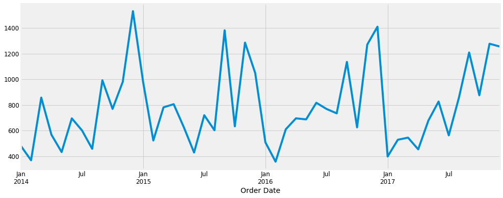


```python
from pylab import rcParams
rcParams['figure.figsize'] = 18, 8
decomposition = sm.tsa.seasonal_decompose(y, model='additive')
fig = decomposition.plot()
plt.show()
```


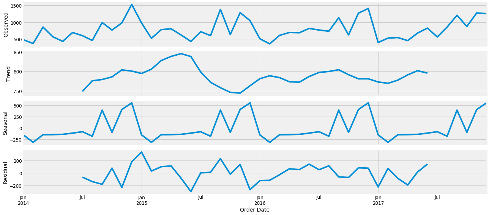


```python
p = d = q = range(0, 2)
pdq = list(itertools.product(p, d, q))
seasonal_pdq = [(x[0], x[1], x[2], 12) for x in list(itertools.product(p, d, q))]
print('Examples of parameter combinations for Seasonal ARIMA...')
print('SARIMAX: {} x {}'.format(pdq[1], seasonal_pdq[1]))
print('SARIMAX: {} x {}'.format(pdq[1], seasonal_pdq[2]))
print('SARIMAX: {} x {}'.format(pdq[2], seasonal_pdq[3]))
print('SARIMAX: {} x {}'.format(pdq[2], seasonal_pdq[4]))
```

    Examples of parameter combinations for Seasonal ARIMA...
    SARIMAX: (0, 0, 1) x (0, 0, 1, 12)
    SARIMAX: (0, 0, 1) x (0, 1, 0, 12)
    SARIMAX: (0, 1, 0) x (0, 1, 1, 12)
    SARIMAX: (0, 1, 0) x (1, 0, 0, 12)


```python
for param in pdq:
    for param_seasonal in seasonal_pdq:
        try:
            mod = sm.tsa.statespace.SARIMAX(y,order=param,seasonal_order=param_seasonal,enforce_stationarity=False,enforce_invertibility=False)
            results = mod.fit()
            
            print('ARIMA{}x{}12 - AIC:{}'.format(param, param_seasonal, results.aic))

        except:continue          
```

    ARIMA(0, 0, 0)x(0, 0, 0, 12)12 - AIC:769.0817523205916
    ARIMA(0, 0, 0)x(0, 0, 1, 12)12 - AIC:1509.7695192870206
    ARIMA(0, 0, 0)x(0, 1, 0, 12)12 - AIC:477.7170130919702
    ARIMA(0, 0, 0)x(1, 0, 0, 12)12 - AIC:497.2314433418338


    /Users/infoletsbecoolcom/anaconda3/lib/python3.7/site-packages/statsmodels/base/model.py:512: ConvergenceWarning: Maximum Likelihood optimization failed to converge. Check mle_retvals
      "Check mle_retvals", ConvergenceWarning)
    /Users/infoletsbecoolcom/anaconda3/lib/python3.7/site-packages/statsmodels/base/model.py:512: ConvergenceWarning: Maximum Likelihood optimization failed to converge. Check mle_retvals
      "Check mle_retvals", ConvergenceWarning)
    /Users/infoletsbecoolcom/anaconda3/lib/python3.7/site-packages/statsmodels/base/model.py:512: ConvergenceWarning: Maximum Likelihood optimization failed to converge. Check mle_retvals
      "Check mle_retvals", ConvergenceWarning)


    ARIMA(0, 0, 0)x(1, 0, 1, 12)12 - AIC:1095.7589337937654
    ARIMA(0, 0, 0)x(1, 1, 0, 12)12 - AIC:318.0047199116341
    ARIMA(0, 0, 1)x(0, 0, 0, 12)12 - AIC:720.9252270758114
    ARIMA(0, 0, 1)x(0, 0, 1, 12)12 - AIC:2755.638482892008
    ARIMA(0, 0, 1)x(0, 1, 0, 12)12 - AIC:466.56074298091266


    /Users/infoletsbecoolcom/anaconda3/lib/python3.7/site-packages/statsmodels/base/model.py:512: ConvergenceWarning: Maximum Likelihood optimization failed to converge. Check mle_retvals
      "Check mle_retvals", ConvergenceWarning)


    ARIMA(0, 0, 1)x(1, 0, 0, 12)12 - AIC:499.5582917541452
    ARIMA(0, 0, 1)x(1, 0, 1, 12)12 - AIC:nan
    ARIMA(0, 0, 1)x(1, 1, 0, 12)12 - AIC:319.98848769468646
    ARIMA(0, 1, 0)x(0, 0, 0, 12)12 - AIC:677.894766843944
    ARIMA(0, 1, 0)x(0, 0, 1, 12)12 - AIC:1379.011649685343
    ARIMA(0, 1, 0)x(0, 1, 0, 12)12 - AIC:486.6378567161609
    ARIMA(0, 1, 0)x(1, 0, 0, 12)12 - AIC:497.7889663004408


    /Users/infoletsbecoolcom/anaconda3/lib/python3.7/site-packages/statsmodels/base/model.py:512: ConvergenceWarning: Maximum Likelihood optimization failed to converge. Check mle_retvals
      "Check mle_retvals", ConvergenceWarning)


    ARIMA(0, 1, 0)x(1, 0, 1, 12)12 - AIC:1518.3192766011857
    ARIMA(0, 1, 0)x(1, 1, 0, 12)12 - AIC:319.7714068109212
    ARIMA(0, 1, 1)x(0, 0, 0, 12)12 - AIC:649.9056176817257
    ARIMA(0, 1, 1)x(0, 0, 1, 12)12 - AIC:2527.903190163831
    ARIMA(0, 1, 1)x(0, 1, 0, 12)12 - AIC:458.8705548482733
    ARIMA(0, 1, 1)x(1, 0, 0, 12)12 - AIC:486.1832977442746
    ARIMA(0, 1, 1)x(1, 0, 1, 12)12 - AIC:3218.8810094105934
    ARIMA(0, 1, 1)x(1, 1, 0, 12)12 - AIC:310.75743684172994
    ARIMA(1, 0, 0)x(0, 0, 0, 12)12 - AIC:692.1645522067713
    ARIMA(1, 0, 0)x(0, 0, 1, 12)12 - AIC:1438.201299034196


    /Users/infoletsbecoolcom/anaconda3/lib/python3.7/site-packages/statsmodels/base/model.py:512: ConvergenceWarning: Maximum Likelihood optimization failed to converge. Check mle_retvals
      "Check mle_retvals", ConvergenceWarning)


    ARIMA(1, 0, 0)x(0, 1, 0, 12)12 - AIC:479.46321478521355
    ARIMA(1, 0, 0)x(1, 0, 0, 12)12 - AIC:480.925936793521


    /Users/infoletsbecoolcom/anaconda3/lib/python3.7/site-packages/statsmodels/base/model.py:512: ConvergenceWarning: Maximum Likelihood optimization failed to converge. Check mle_retvals
      "Check mle_retvals", ConvergenceWarning)


    ARIMA(1, 0, 0)x(1, 0, 1, 12)12 - AIC:1283.2103285909398
    ARIMA(1, 0, 0)x(1, 1, 0, 12)12 - AIC:304.46646750846253
    ARIMA(1, 0, 1)x(0, 0, 0, 12)12 - AIC:665.779444218533
    ARIMA(1, 0, 1)x(0, 0, 1, 12)12 - AIC:nan
    ARIMA(1, 0, 1)x(0, 1, 0, 12)12 - AIC:468.3685195814216
    ARIMA(1, 0, 1)x(1, 0, 0, 12)12 - AIC:482.5763323877046
    ARIMA(1, 0, 1)x(1, 0, 1, 12)12 - AIC:2578.361222202898
    ARIMA(1, 0, 1)x(1, 1, 0, 12)12 - AIC:306.01560021137544
    ARIMA(1, 1, 0)x(0, 0, 0, 12)12 - AIC:671.2513547541903
    ARIMA(1, 1, 0)x(0, 0, 1, 12)12 - AIC:1015.478283391855
    ARIMA(1, 1, 0)x(0, 1, 0, 12)12 - AIC:479.2003422281135


    /Users/infoletsbecoolcom/anaconda3/lib/python3.7/site-packages/statsmodels/base/model.py:512: ConvergenceWarning: Maximum Likelihood optimization failed to converge. Check mle_retvals
      "Check mle_retvals", ConvergenceWarning)


    ARIMA(1, 1, 0)x(1, 0, 0, 12)12 - AIC:475.3403658784239
    ARIMA(1, 1, 0)x(1, 0, 1, 12)12 - AIC:2037.5346002846823
    ARIMA(1, 1, 0)x(1, 1, 0, 12)12 - AIC:300.6270901345443
    ARIMA(1, 1, 1)x(0, 0, 0, 12)12 - AIC:649.0318019835324
    ARIMA(1, 1, 1)x(0, 0, 1, 12)12 - AIC:1615305.5657762697
    ARIMA(1, 1, 1)x(0, 1, 0, 12)12 - AIC:460.47626876107466
    ARIMA(1, 1, 1)x(1, 0, 0, 12)12 - AIC:469.52503546607835


    /Users/infoletsbecoolcom/anaconda3/lib/python3.7/site-packages/statsmodels/base/model.py:512: ConvergenceWarning: Maximum Likelihood optimization failed to converge. Check mle_retvals
      "Check mle_retvals", ConvergenceWarning)


    ARIMA(1, 1, 1)x(1, 0, 1, 12)12 - AIC:2596.3629614576807
    ARIMA(1, 1, 1)x(1, 1, 0, 12)12 - AIC:297.7875439536195


Burada en düşük değer 297 o yüzden son satırdaki parametreler en optimal değerler


```python
mod = sm.tsa.statespace.SARIMAX(y,
                                order=(1, 1, 1),
                                seasonal_order=(1, 1, 0, 12),
                                enforce_stationarity=False,
                                enforce_invertibility=False)
results = mod.fit()
print(results.summary().tables[1])
```

    ==============================================================================
                     coef    std err          z      P>|z|      [0.025      0.975]
    ------------------------------------------------------------------------------
    ar.L1          0.0146      0.342      0.043      0.966      -0.655       0.684
    ma.L1         -1.0000      0.360     -2.781      0.005      -1.705      -0.295
    ar.S.L12      -0.0253      0.042     -0.609      0.543      -0.107       0.056
    sigma2      2.958e+04   1.22e-05   2.43e+09      0.000    2.96e+04    2.96e+04
    ==============================================================================


```python
results.plot_diagnostics(figsize=(16, 8))
plt.show()
```


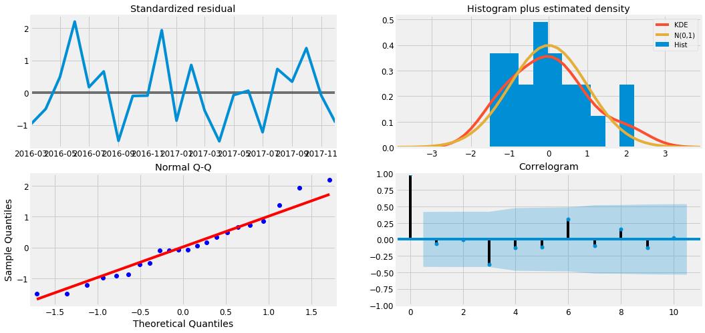


```python
pred = results.get_prediction(start=pd.to_datetime('2017-01-01'), dynamic=False)
pred_ci = pred.conf_int()
ax = y['2014':].plot(label='observed')
pred.predicted_mean.plot(ax=ax, label='One-step ahead Forecast', alpha=.4, figsize=(14, 7))
ax.fill_between(pred_ci.index,
                pred_ci.iloc[:, 0],
                pred_ci.iloc[:, 1], color='k', alpha=.2)
ax.set_xlabel('Date')
ax.set_ylabel('Furniture Sales')
plt.legend()
plt.show()
```


```python
y_forecasted = pred.predicted_mean
y_truth = y['2017-01-01':]
mse = ((y_forecasted - y_truth) ** 2).mean()
print('The Mean Squared Error of our forecasts is {}'.format(round(mse, 2)))
```

    The Mean Squared Error of our forecasts is 22993.57


```python
print('The Root Mean Squared Error of our forecasts is {}'.format(round(np.sqrt(mse), 2)))
```

    The Root Mean Squared Error of our forecasts is 151.64


Our model was able to forecast the average daily furniture sales in the test set within 151.64 of the real sales. Our furniture daily sales range from around 400 to over 1200.

**Time Series of Furniture vs. Office Supplies**


```python
office = dt.loc[dt['Category'] == 'Office Supplies']
```


```python
office.drop(cols, axis=1, inplace=True)
```


```python
office = office.groupby('Order Date')['Sales'].sum().reset_index()
office = office.set_index('Order Date')
y_office = office['Sales'].resample('MS').mean()

```


```python
furniture = pd.DataFrame({'Order Date':y.index, 'Sales':y.values})
office = pd.DataFrame({'Order Date': y_office.index, 'Sales': y_office.values})
```


```python
store = furniture.merge(office, how='inner', on='Order Date')
store.head()
```


<div>
<style scoped>
    .dataframe tbody tr th:only-of-type {
        vertical-align: middle;
    }

    .dataframe tbody tr th {
        vertical-align: top;
    }

    .dataframe thead th {
        text-align: right;
    }
</style>
<table border="1" class="dataframe">
  <thead>
    <tr style="text-align: right;">
      <th></th>
      <th>Order Date</th>
      <th>Sales_x</th>
      <th>Sales_y</th>
    </tr>
  </thead>
  <tbody>
    <tr>
      <th>0</th>
      <td>2014-01-01</td>
      <td>480.194231</td>
      <td>285.357647</td>
    </tr>
    <tr>
      <th>1</th>
      <td>2014-02-01</td>
      <td>367.931600</td>
      <td>63.042588</td>
    </tr>
    <tr>
      <th>2</th>
      <td>2014-03-01</td>
      <td>857.291529</td>
      <td>391.176318</td>
    </tr>
    <tr>
      <th>3</th>
      <td>2014-04-01</td>
      <td>567.488357</td>
      <td>464.794750</td>
    </tr>
    <tr>
      <th>4</th>
      <td>2014-05-01</td>
      <td>432.049187</td>
      <td>324.346545</td>
    </tr>
  </tbody>
</table>
</div>


```python
store.rename(columns={'Sales_x': 'furniture_sales', 'Sales_y': 'office_sales'}, inplace=True)
store.head()
```


<div>
<style scoped>
    .dataframe tbody tr th:only-of-type {
        vertical-align: middle;
    }

    .dataframe tbody tr th {
        vertical-align: top;
    }

    .dataframe thead th {
        text-align: right;
    }
</style>
<table border="1" class="dataframe">
  <thead>
    <tr style="text-align: right;">
      <th></th>
      <th>Order Date</th>
      <th>furniture_sales</th>
      <th>office_sales</th>
    </tr>
  </thead>
  <tbody>
    <tr>
      <th>0</th>
      <td>2014-01-01</td>
      <td>480.194231</td>
      <td>285.357647</td>
    </tr>
    <tr>
      <th>1</th>
      <td>2014-02-01</td>
      <td>367.931600</td>
      <td>63.042588</td>
    </tr>
    <tr>
      <th>2</th>
      <td>2014-03-01</td>
      <td>857.291529</td>
      <td>391.176318</td>
    </tr>
    <tr>
      <th>3</th>
      <td>2014-04-01</td>
      <td>567.488357</td>
      <td>464.794750</td>
    </tr>
    <tr>
      <th>4</th>
      <td>2014-05-01</td>
      <td>432.049187</td>
      <td>324.346545</td>
    </tr>
  </tbody>
</table>
</div>


```python
plt.figure(figsize=(20, 8))
plt.plot(store['Order Date'], store['furniture_sales'], 'b-', label = 'furniture')
plt.plot(store['Order Date'], store['office_sales'], 'r-', label = 'office supplies')
plt.xlabel('Date'); plt.ylabel('Sales'); plt.title('Sales of Furniture and Office Supplies')
plt.legend();
```


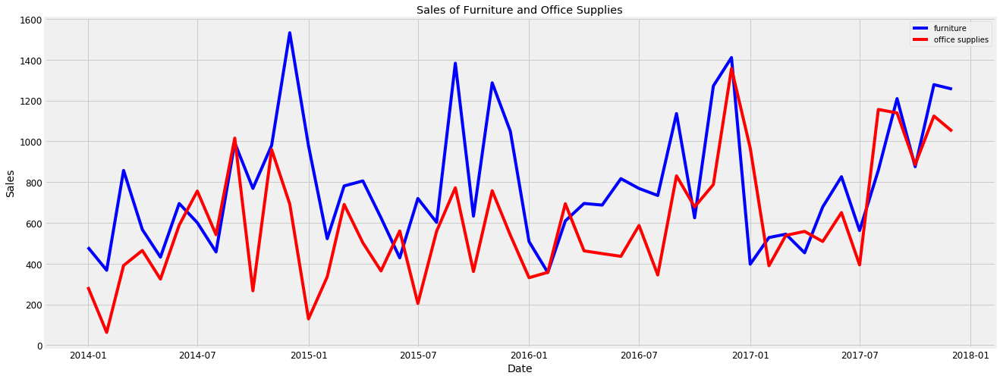


```python
first_date = store.ix[np.min(list(np.where(store['office_sales'] > store['furniture_sales'])[0])), 'Order Date']
print("Office supplies first time produced higher sales than furniture is {}.".format(first_date.date()))
```

    Office supplies first time produced higher sales than furniture is 2014-07-01.


**Time Series Modeling with Prophet**


```python
from fbprophet import Prophet
furniture = furniture.rename(columns={'Order Date': 'ds', 'Sales': 'y'})
furniture_model = Prophet(interval_width=0.95)
furniture_model.fit(furniture)
office = office.rename(columns={'Order Date': 'ds', 'Sales': 'y'})
office_model = Prophet(interval_width=0.95)
office_model.fit(office)
```

    ERROR:fbprophet:Importing plotly failed. Interactive plots will not work.
    INFO:fbprophet:Disabling weekly seasonality. Run prophet with weekly_seasonality=True to override this.
    INFO:fbprophet:Disabling daily seasonality. Run prophet with daily_seasonality=True to override this.
    INFO:fbprophet:Disabling weekly seasonality. Run prophet with weekly_seasonality=True to override this.
    INFO:fbprophet:Disabling daily seasonality. Run prophet with daily_seasonality=True to override this.


    <fbprophet.forecaster.Prophet at 0x1c24e50160>


```python
furniture_forecast = furniture_model.make_future_dataframe(periods=36, freq='MS')
furniture_forecast = furniture_model.predict(furniture_forecast)
office_forecast = office_model.make_future_dataframe(periods=36, freq='MS')
office_forecast = office_model.predict(office_forecast)
plt.figure(figsize=(18, 6))
furniture_model.plot(furniture_forecast, xlabel = 'Date', ylabel = 'Sales')
plt.title('Furniture Sales');
```


    <Figure size 1296x432 with 0 Axes>


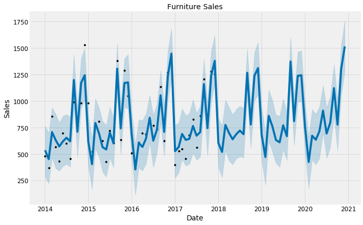


```python
plt.figure(figsize=(18, 6))
office_model.plot(office_forecast, xlabel = 'Date', ylabel = 'Sales')
plt.title('Office Supplies Sales');
```


    <Figure size 1296x432 with 0 Axes>


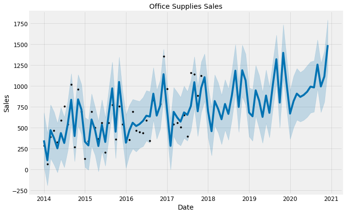


#Compare Forecasts 
#We already have the forecasts for three years for these two categories into the future. We will now join them together to compare their future forecasts.


```python
furniture_names = ['furniture_%s' % column for column in furniture_forecast.columns]
office_names = ['office_%s' % column for column in office_forecast.columns]
```


```python
merge_furniture_forecast = furniture_forecast.copy()
merge_office_forecast = office_forecast.copy()
```


```python
merge_furniture_forecast.columns = furniture_names
merge_office_forecast.columns = office_names
```


```python
forecast = pd.merge(merge_furniture_forecast, merge_office_forecast, how = 'inner', left_on = 'furniture_ds', right_on = 'office_ds')
```


```python
#forecast = forecast.rename(columns={'furniture_ds': 'Date'}).drop('office_ds', axis=1)
forecast.head()
```


<div>
<style scoped>
    .dataframe tbody tr th:only-of-type {
        vertical-align: middle;
    }

    .dataframe tbody tr th {
        vertical-align: top;
    }

    .dataframe thead th {
        text-align: right;
    }
</style>
<table border="1" class="dataframe">
  <thead>
    <tr style="text-align: right;">
      <th></th>
      <th>Date</th>
      <th>furniture_trend</th>
      <th>furniture_yhat_lower</th>
      <th>furniture_yhat_upper</th>
      <th>furniture_trend_lower</th>
      <th>furniture_trend_upper</th>
      <th>furniture_additive_terms</th>
      <th>furniture_additive_terms_lower</th>
      <th>furniture_additive_terms_upper</th>
      <th>furniture_yearly</th>
      <th>furniture_yearly_lower</th>
      <th>furniture_yearly_upper</th>
      <th>furniture_multiplicative_terms</th>
      <th>furniture_multiplicative_terms_lower</th>
      <th>furniture_multiplicative_terms_upper</th>
      <th>furniture_yhat</th>
      <th>office_trend</th>
      <th>office_yhat_lower</th>
      <th>office_yhat_upper</th>
      <th>office_trend_lower</th>
      <th>office_trend_upper</th>
      <th>office_additive_terms</th>
      <th>office_additive_terms_lower</th>
      <th>office_additive_terms_upper</th>
      <th>office_yearly</th>
      <th>office_yearly_lower</th>
      <th>office_yearly_upper</th>
      <th>office_multiplicative_terms</th>
      <th>office_multiplicative_terms_lower</th>
      <th>office_multiplicative_terms_upper</th>
      <th>office_yhat</th>
    </tr>
  </thead>
  <tbody>
    <tr>
      <th>0</th>
      <td>2014-01-01</td>
      <td>726.057713</td>
      <td>281.310289</td>
      <td>765.143971</td>
      <td>726.057713</td>
      <td>726.057713</td>
      <td>-190.685662</td>
      <td>-190.685662</td>
      <td>-190.685662</td>
      <td>-190.685662</td>
      <td>-190.685662</td>
      <td>-190.685662</td>
      <td>0.0</td>
      <td>0.0</td>
      <td>0.0</td>
      <td>535.372051</td>
      <td>487.530759</td>
      <td>34.886726</td>
      <td>679.677977</td>
      <td>487.530759</td>
      <td>487.530759</td>
      <td>-140.040481</td>
      <td>-140.040481</td>
      <td>-140.040481</td>
      <td>-140.040481</td>
      <td>-140.040481</td>
      <td>-140.040481</td>
      <td>0.0</td>
      <td>0.0</td>
      <td>0.0</td>
      <td>347.490278</td>
    </tr>
    <tr>
      <th>1</th>
      <td>2014-02-01</td>
      <td>727.494023</td>
      <td>221.570260</td>
      <td>697.585419</td>
      <td>727.494023</td>
      <td>727.494023</td>
      <td>-276.377703</td>
      <td>-276.377703</td>
      <td>-276.377703</td>
      <td>-276.377703</td>
      <td>-276.377703</td>
      <td>-276.377703</td>
      <td>0.0</td>
      <td>0.0</td>
      <td>0.0</td>
      <td>451.116320</td>
      <td>494.918445</td>
      <td>-192.443272</td>
      <td>431.459051</td>
      <td>494.918445</td>
      <td>494.918445</td>
      <td>-385.678283</td>
      <td>-385.678283</td>
      <td>-385.678283</td>
      <td>-385.678283</td>
      <td>-385.678283</td>
      <td>-385.678283</td>
      <td>0.0</td>
      <td>0.0</td>
      <td>0.0</td>
      <td>109.240162</td>
    </tr>
    <tr>
      <th>2</th>
      <td>2014-03-01</td>
      <td>728.791335</td>
      <td>463.774345</td>
      <td>938.925781</td>
      <td>728.791335</td>
      <td>728.791335</td>
      <td>-22.389755</td>
      <td>-22.389755</td>
      <td>-22.389755</td>
      <td>-22.389755</td>
      <td>-22.389755</td>
      <td>-22.389755</td>
      <td>0.0</td>
      <td>0.0</td>
      <td>0.0</td>
      <td>706.401580</td>
      <td>501.591193</td>
      <td>133.814278</td>
      <td>774.828620</td>
      <td>501.591193</td>
      <td>501.591193</td>
      <td>-31.379844</td>
      <td>-31.379844</td>
      <td>-31.379844</td>
      <td>-31.379844</td>
      <td>-31.379844</td>
      <td>-31.379844</td>
      <td>0.0</td>
      <td>0.0</td>
      <td>0.0</td>
      <td>470.211349</td>
    </tr>
    <tr>
      <th>3</th>
      <td>2014-04-01</td>
      <td>730.227645</td>
      <td>363.154679</td>
      <td>874.695823</td>
      <td>730.227645</td>
      <td>730.227645</td>
      <td>-100.141158</td>
      <td>-100.141158</td>
      <td>-100.141158</td>
      <td>-100.141158</td>
      <td>-100.141158</td>
      <td>-100.141158</td>
      <td>0.0</td>
      <td>0.0</td>
      <td>0.0</td>
      <td>630.086487</td>
      <td>508.978878</td>
      <td>56.675022</td>
      <td>689.628907</td>
      <td>508.978878</td>
      <td>508.978878</td>
      <td>-134.291690</td>
      <td>-134.291690</td>
      <td>-134.291690</td>
      <td>-134.291690</td>
      <td>-134.291690</td>
      <td>-134.291690</td>
      <td>0.0</td>
      <td>0.0</td>
      <td>0.0</td>
      <td>374.687188</td>
    </tr>
    <tr>
      <th>4</th>
      <td>2014-05-01</td>
      <td>731.617622</td>
      <td>339.335029</td>
      <td>795.202095</td>
      <td>731.617622</td>
      <td>731.617622</td>
      <td>-160.815662</td>
      <td>-160.815662</td>
      <td>-160.815662</td>
      <td>-160.815662</td>
      <td>-160.815662</td>
      <td>-160.815662</td>
      <td>0.0</td>
      <td>0.0</td>
      <td>0.0</td>
      <td>570.801960</td>
      <td>516.128251</td>
      <td>-36.917747</td>
      <td>551.911373</td>
      <td>516.128251</td>
      <td>516.128251</td>
      <td>-263.821569</td>
      <td>-263.821569</td>
      <td>-263.821569</td>
      <td>-263.821569</td>
      <td>-263.821569</td>
      <td>-263.821569</td>
      <td>0.0</td>
      <td>0.0</td>
      <td>0.0</td>
      <td>252.306682</td>
    </tr>
  </tbody>
</table>
</div>


**Trend and Forecast Visualization**


```python
plt.figure(figsize=(10, 7))
plt.plot(forecast['Date'], forecast['furniture_trend'], 'b-',label = 'furniture_trend')
plt.plot(forecast['Date'], forecast['office_trend'], 'r-',label = 'office_trend')
plt.legend(); plt.xlabel('Date'); plt.ylabel('Sales')
plt.title('Furniture vs. Office Supplies Sales Trend');
```


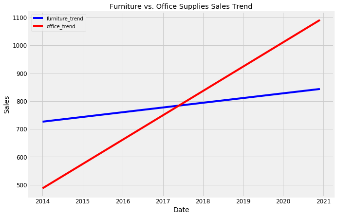


```python
plt.figure(figsize=(10, 7))
plt.plot(forecast['Date'], forecast['furniture_yhat'], 'b-',label='furniture_estimate')
plt.plot(forecast['Date'], forecast['office_yhat'], 'r-',label='office_estimate')
plt.legend(); plt.xlabel('Date'); plt.ylabel('Sales')
plt.title('Furniture vs. Office Supplies Estimate');
```


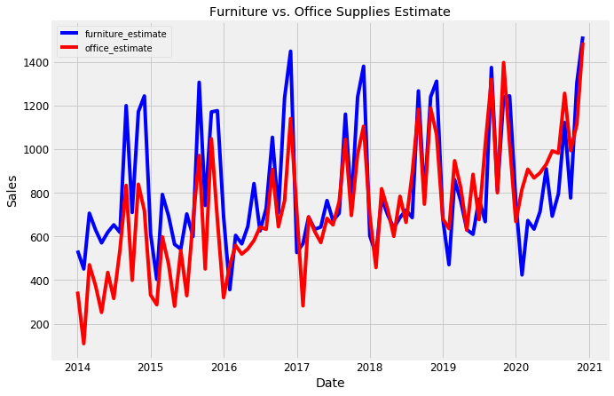


**Trends and Patterns**

Now, we can use the Prophet Models to inspect different trends of these two categories in the data.


```python
furniture_model.plot_components(furniture_forecast);

```


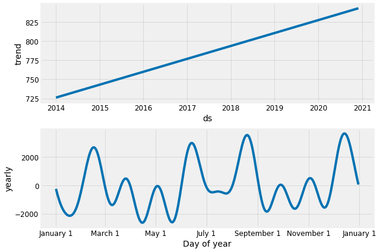


```python
office_model.plot_components(office_forecast);
```


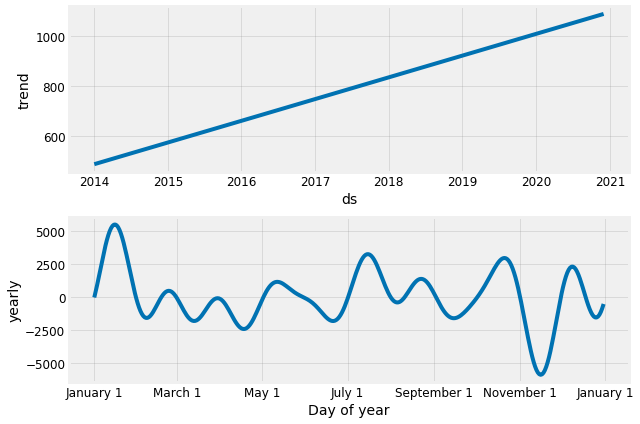


**Conclusion**

Good to see that the sales for both furniture and office supplies have been linearly increasing over time and will be keep growing, although office supplies’ growth seems slightly stronger.
The worst month for furniture is April, the worst month for office supplies is February. The best month for furniture is December, and the best month for office supplies is October.

-----


```python

```


```python

```


```python

```


```python

```


```python

```


```python

```


```python

```


```python

```


```python

```


```python

```


```python

```


```python

```


```python

```


```python

```


```python

```


```python

```


```python

```


```python

```


```python

```


```python

```


```python

```


```python

```


```python

```


```python

```


```python

```


```python

```


```python

```


```python

```


```python

```


```python

```


```python

```


```python

```


```python

```


```python

```


```python

```


```python

```


```python

```


```python

```


```python

```


```python

```


```python

```


```python

```


```python

```


```python

```


```python

```


```python

```


```python

```


```python

```


```python

```


```python

```


```python

```


```python

```


```python

```


```python

```


```python

```


```python

```


```python

```


```python

```


```python

```


```python

```
